# rookie-cookies Architecture

- **Author:** maintainers
- **Date:** 2026-08-19 (class catalog expanded 2026-08-20)
- **Status:** Draft
- **Workspace:** repository root
- **Crate:** `rookie-cookies` at `rookie-rs/` (workspace version `0.6.0-beta.1`)
- **Kind:** descriptive map of the system as it exists today, not a proposal for a new feature
- **Does not amend:** ADR 0001–0005, `rookie-rs/public-api/*.txt`, `schema/report-dto.schema.json`, `rookie-rs/browser_registry.json`

---

## Overview

`rookie-cookies` extracts cookies from local browser profiles on Linux, macOS, and Windows. A Rust core (`rookie-rs`) owns discovery, acquisition, decryption, and projection. Python (PyO3) and Node (napi-rs) bindings plus a CLI wrap that core. The recommended 0.6 job is `read` (Python also `jar`); named helpers such as `chrome()` and `load()` remain a compatibility bridge, not a promise.

Internally, extraction is one pipeline with compiler-enforced stage types. Discovery returns `SourceCandidate`; reading a candidate returns `Source`; `Outcome::finalize` is the last shared result; `ExtractionReport`, `Vec<Cookie>`, and `ReadResult` are projections of that result. There is no engine-plugin trait. Four `match` arms on `RegisteredBrowser.engine` (`"chromium" | "gecko" | "safari" | "internet_explorer"`) are the accepted composition.

This document is the current-state map for a contributor who needs to name a stage correctly and find the owning module for a change. Start at [§0 Key classes](#key-classes-one-sentence-catalog) for one-sentence type definitions (same shape as the Language tables in `docs/design/`).

---

## Background & Motivation

This is a maintained fork of archived [`thewh1teagle/rookie`](https://github.com/thewh1teagle/rookie). Downstream still calls `chrome()`, `firefox()`, `load()`, and the eight-field `Cookie`. Those shapes stay through 0.6 so existing consumers keep working; they are deprecated, and 0.7 will break them.

The tree outgrew a bag of per-browser functions:

- One recommended job (`read` / Python `jar`) instead of “call `chrome()` and hope”.
- Profile queries so session cookies are a deliberate choice (ADR 0003, ADR 0004).
- Structured reports with provenance, timeouts, and cancellation (ADR 0001).
- Chromium formats through **legacy DPAPI**, **`v10` / `v11`**, and **App-Bound `v20`** where the host and browser allow it.
- One hand-maintained discovery source, `rookie-rs/browser_registry.json` (ADR 0002).
- Stage types that make a listing physically unable to hold extract data (ADR 0005).

Pain points the current architecture already answers:

| Pain | Answer |
| --- | --- |
| Dual discovery stacks (`config.json` vs registry) diverged | Registry is the only hand-maintained source; `CONFIG` is a read-only projection |
| Named APIs would change if they flattened all profiles | `LegacyFirstProfile` vs `AllProfiles` / `ProfileId`; named wrappers never flatten every profile |
| Three disagreeing profile selectors | One crate-private resolver (`resolve_profile_query` / `ProfileMatchCandidate`; ADR 0003 “profile query” is vocabulary, not a Rust type) |
| One bag type served as empty candidate and filled result | `SourceCandidate` vs `Source`, fenced by `xtask check-stage-boundary` |
| Four vocabularies for one pipeline (`query`, `populate`, `Draft`, `canonical_*_extraction`) | Internal stages: resolve, discover, select, lookup, acquire, decode, unseal, finalize, project |

---

## Goals & Non-Goals

### Goals (of this document)

- A contributor can navigate the workspace, name the stages correctly, and find the owning module for a change.
- Public vs internal names, decryption tiers, IDs, and the report-vs-snapshot split are stated once, with file paths.
- Class diagrams and call graphs use the types and fields that exist in source today.

### Non-goals

- Changing the public API, `rookie-rs/public-api/*.txt`, the report DTO, or `browser_registry.json`.
- Re-litigating closed ADRs (engine-plugin trait, dual discovery stacks, line-budget carving, unified Chromium inventory).
- A line-budget carve of long files. Some production files remain long; that is accepted (ADR 0005). `common/sqlite.rs` is not split for architecture.
- Proposing new product features, metrics, or schema migrations.
- Inventing implementation work in the PR plan. This landing is documentation.

---

## Current Architecture

The five subsections below are the required outline. Later sections (API, data model, alternatives, security, observability, rollout) expand the same system; they do not introduce a new design.

### 0. Key Terminology, concepts, etc.

Law, same as [After the type program — Language](design/after-the-type-program.md#language): **one word, one meaning, one home.** A senior engineer should be able to lint a PR against this section.

Three axes. Do not mix them:

| Axis | What it names | What it is not |
| --- | --- | --- |
| **Aggregation** | Kind of thing: Catalog → Installation → Profile → Source → Record, under a Request | A pipeline step |
| **Stage** | The rustc splits only: listing vs extract at Profile; candidate vs source at Source; decoded vs finalized at Record | Pipeline verbs. Not `SourceFailureStage` (that is a failure-kind enum) |
| **Pipeline step** | Ordered verbs: resolve, discover, select, lookup, acquire, decode, unseal, finalize, project | A typestate `Catalog<Resolve>`. There is no `Installation<Read>` or `Source<Opened>` |

Selection is a **policy**, not an aggregation noun. Keys are Chromium-only. Empty cells stay empty.

The tables below are the current-state class catalog. Field-level Mermaid is in [§3](#3-class-diagram-for-key-classes). Durable rules are [ADR 0005](adr/0005-stage-boundary-types-and-extraction-vocabulary.md). The program records in `docs/design/` are historical (Progress / “home after PR 4” sentences may be stale); where they disagree with this file or the ADR, this file and the ADR win.

#### Key classes (one-sentence catalog)

**Listing vs effective** (say these in signature comments):

| Phrase | Lives on | Who writes it |
| --- | --- | --- |
| **Listing** `selected` / `acquisition` / `exists` | `SourceCandidate` only | Discover. Frozen per engine. A `Source` cannot name these: `origin` is `SourceIdentity` |
| **Effective** `selected` / `acquisition` | `Source.selected` / `Source.acquisition` | Extract states them as constructor arguments. `source_to_draft` copies these |

##### Aggregation

| Class | One-sentence description | Owner | Must not contain |
| --- | --- | --- | --- |
| **Catalog** | Compiled-in registry for this OS, with no disk I/O. | `registry.rs` | Stat'd paths; cookie records; key material |
| **RegisteredBrowser** | One catalog entry after alias resolution: canonical id, engine tag, declared vs available tiers. | `registry.rs` | Filesystem state |
| **BrowserCapabilityDescriptor** | Registry-internal declared/available formats, roles, and decryption tiers (`Vec<String>`). | `registry.rs` | Wire newtypes |
| **BrowserCapabilitiesDescriptor** | Public DTO of the same four lists, using `CookieSourceFormatId` / `CipherTierId`. One letter different from the registry type. | `report_core.rs` | Registry internals |
| **Installation** | One owned canonical root of one registered browser. | Chromium: `BrowserInstallation` in `registry/chromium.rs`. Gecko/Safari/IE: fields on `EngineProfileIdentity` — **no shared type**. | Cookie records; key material (identity may live here) |
| **Profile (inventory)** | A profile directory discovery found, with cookie-source candidates, before any cookie DB is opened for cookies. | Chromium: `ChromiumProfile`. Gecko/Safari/IE: `DiscoveredProfile` | `Vec<Source>`, records, cookies |
| **Profile (selection)** | Which inventory profiles may be acquired. | `ProfileSelection` in `registry.rs`; matcher in `registry/profile_query.rs` | Opened DBs; keys |
| **Profile (wire)** | DTO identity of a profile in a report or descriptor. | `report_core.rs` | Candidates, records |
| **SourceIdentity** | Join keys of one cookie source: path, role, format, precedence. What `source_digest` hashes (plus ids and raw path bytes). The only part of a candidate an extraction result carries. | `source.rs` | `selected`, `acquisition`, `exists`, records, stats, issues, failure |
| **SourceCandidate** | A cookie source discovery found on disk. Listing reports it; extract consumes it. Identity plus **listing** `selected` / `acquisition` / `exists`. | `source.rs` | records, cookies, stats, issues, failure |
| **Source** | What came back from reading one candidate: `origin: SourceIdentity` + **effective** `selected`/`acquisition` + records + stats + optional failure + issues. | `source.rs` | `profile_id`, `installation_id`, `display_name`, a `cookies` field, any listing field |
| **CookieRecord** | Decode-time row, possibly still encrypted. | `cookie_record.rs` | Report identity |
| **FinalizedCookieRecord** | Tuple wrapper `FinalizedCookieRecord(CookieRecord)` after provenance is assigned. | `cookie_record.rs` | — |
| **Cookie** | Frozen eight-field compatibility cookie (`domain`, `path`, `secure`, `http_only`, `same_site`, `expires`, `name`, `value`). | `common/enums.rs` | Provenance, container, ciphertext |

##### Source leaves and acquire

| Class | One-sentence description | Owner | Must not contain |
| --- | --- | --- | --- |
| **SourceIssue** | A fully-formed pre-report issue the engine attached. The mapper only copies. | `source.rs` | Cookie values; key bytes |
| **SourceStats** | Row accounting for one source, copied into `ExtractionStats` without recompute. | `source.rs` | — |
| **SourceFailure** | Acquisition, parse, or query of this named source did not complete. `failed` is derived from `Option<SourceFailure>`, never stored. | `source.rs` | Row skips (those are issues) |
| **SourceFailureStage** | Failure-kind enum (`open`, `parse`, `query`, …). Not the rustc Stage axis. | `source.rs` | — |
| **SourceAcquisition** | One enum, two **homes**: listing claim on `candidate.acquisition`; effective how-we-opened on `Source.acquisition`. | `source.rs` | Journal-mode policy internals |
| **ReadOnlySource** | Marker trait for an **opened capability** (connection, bytes) that a decoder may read. **Not** `Source`. | `common/boundary.rs` | Cookie records; report identity |
| **MozillaCandidateOutcome** | Gecko acquire result: `Source` or a typed miss. Safari/IE still return `Result<Source>`. | `mozilla.rs` | Report identity |

##### Listing vs extract bags

There is no shared `Installation` / `Profile`. Chromium keeps its own inventory; Gecko/Safari/IE share `DiscoveredProfile` / `ExtractedProfile`. Four `match RegisteredBrowser.engine` arms are accepted. There is no engine-plugin trait.

| Class | One-sentence description | Owner | Must not contain |
| --- | --- | --- | --- |
| **EngineProfileIdentity** | Identity fields shared by Gecko/Safari/IE listing and extract profiles (ids, paths, display name). | `registry.rs` | ADR 0002 first-profile rank inputs; cookie records |
| **LegacyRank** | First-profile policy inputs that used to ride on identity. Sibling of `EngineProfileIdentity`. | `registry.rs` | Paths as identity |
| **DiscoveredProfile** | Gecko/Safari/IE listing profile: identity + rank + `candidates: Vec<SourceCandidate>`. | `registry.rs` | `sources`, cookies, records |
| **ExtractedProfile** | Gecko/Safari/IE extract profile: identity + rank + `sources: Vec<Source>`. Not a listing return type. | `registry.rs` | Candidate-placeholder slots |
| **EngineListing** | Gecko/Safari/IE listing bag. Cannot name `Source`. | `registry.rs` | `Vec<Source>` |
| **EngineExtract** | Gecko/Safari/IE extract bag. Not a listing return. | `registry.rs` | Cookie fields beside the sources |
| **ChromiumProfile** | Chromium inventory profile. Convention-enforced boundary (no `cookies`/`records`/`sources` fields; fenced). | `registry/chromium.rs` | Extract data |
| **ChromiumExtractedProfile** | Chromium extract profile: owns `sources: Vec<Source>`, not their contents. | `registry/chromium.rs` | `records`, `stats`, `issues`, `acquisition` restated beside the profile |
| **ChromiumInstallationDraft** | Chromium extract installation bag. | `registry/chromium.rs` | Decoder scratch |
| **ChromiumRegistryDraft** | Chromium extract return to `report_build`. Optional rename leftover; not a leak. | `registry/chromium.rs` | Records beside the profile |
| **SafariProfile** | Private Safari inventory row. | `registry/safari.rs` | BinaryCookies parse |
| **MozillaProfile** | Public persistent-only Firefox profile projection (`firefox_profiles()`). | `mozilla.rs` | Session-only profiles; registry ids |
| **ProfileSelection** | Policy applied **before** lookup/acquire: `AllProfiles`, `ProfileId`, `LegacyFirstProfile`. | `registry.rs` | Opened DBs |
| **ProfileMatchCandidate** | One row the ADR 0003 matcher compares. There is **no** Rust type named `ProfileQuery`. | `registry/profile_query.rs` | Extraction results |

##### Chromium keys

| Class | One-sentence description | Owner | Must not contain |
| --- | --- | --- | --- |
| **ChromiumKeyIdentity** | Lookup coordinates for Chromium OS credentials. Never material. JSON field `key_credentials` is frozen. | `chromium_platform_keys` | Key bytes |
| **ChromiumKeyOutcomes** | Material: independent v10 / v11 / v20 outcomes. | `chromium_crypto` | Identity; cookie rows |

##### Results and projections

| Class | One-sentence description | Owner | Must not contain |
| --- | --- | --- | --- |
| **Outcome** | Canonical finalized extraction. Last shared result before projection. | `outcome.rs` | Engine bags; discovery |
| **SourceOutcome** | One finalized source inside an `Outcome`. | `outcome.rs` | Listing candidates |
| **ExtractionReport** | Frozen grouped-report DTO: `profiles[] → sources[] → cookies[]` plus issues, stats, `status`, `termination`. | `report_core.rs` | Internal drafts |
| **ProfileExtraction** / **SourceExtraction** | Wire profile / source objects inside the report. | `report_core.rs` | Engine types |
| **CookieSourceDescriptor** / **ProfileDescriptor** | Listing projection: role, format, path, precedence. No read products. | `report_core.rs` | `failed`, acquisition strategy, cookies |
| **SourceDraft** | Private report-adaptation hop inside `report_build.rs`. Not crate-visible. Not a fourth engine target. | `report_build.rs` | Engine construction |
| **ReadResult** | ADR 0004 unfiltered snapshot + structured `ReadWarning`s. | `read.rs` | Report grouping |
| **ReadWarning** | Stable `{ code, count }`. Node widens to `{ code, count: u32, message }`. | `read.rs` | Cookie values |
| **Request** | Public `extract` / `extract_report` job. Distinct from `ReadRequest`. | `lib.rs` | — |
| **ReadRequest** | Public `read` job. Field is `browser_id`; builder is `ReadRequest::browser()`. | `read.rs` | URL filter on the snapshot |
| **FromPathRequest** | Direct-path snapshot. Does not call the profile resolver. Result `browser_id` is empty. | `read.rs` | Registry discovery |
| **ChromiumCredentialSource** | Direct-path Chromium key source: `Automatic` / `BrowserId` on Linux and macOS, `LocalStateFile` on Windows, and portable `PlaintextOnly`. | `direct_path` | ABE host policy |
| **RequestError** | Structured caller-input fault. Bindings map via `FaultKind`. | `request_error.rs` | Engine `Ok(failed report)` |

##### Compatibility and runtime

| Class | One-sentence description | Owner | Must not contain |
| --- | --- | --- | --- |
| **CompatibilityFamily** | Which compatibility source-set rule and fallback string apply to one browser id. | `compatibility.rs` | Extraction `status` |
| **CompatibilityDisposition** / **CompatibilityDecision** | What the legacy `Cookie[]` projector should do. Vocabulary any projection may name. | `outcome.rs` | Report `status`; the *policy* that produces the value |
| **CompatibilityEvidence** | Typed fact a source carries for compatibility only. Chromium-only `AllRowsRejected` today. Never an extraction issue. | `report_build.rs` | Wire issue list |
| **BoundaryRuntime** | Shared deadline + cancellation budget for one request. | `common/deadline.rs` | — |
| **BrowserDatabaseFailure** | Typed SQLite acquire/query/retry context in the `anyhow` chain. | `common/sqlite.rs` | Report issue codes |

#### Collision resolutions

| Word | Meanings | Law |
| --- | --- | --- |
| **Profile** | Inventory (`ChromiumProfile` / `DiscoveredProfile`); selection (`ProfileSelection` / ADR 0003 matcher); wire (`ProfileIdentity`); public Firefox (`MozillaProfile`) | No shared `Profile`. Say “inventory profile” / “selection” / “wire profile” |
| **Source vs SourceCandidate vs SourceDraft vs SourceOutcome vs SourceExtraction vs ReadOnlySource** | Six types, six jobs | Candidate = listing leaf. Source = post-unseal work. SourceDraft = private report hop. SourceOutcome = finalized canonical. SourceExtraction = wire. ReadOnlySource = opened capability |
| **origin** | (1) `Source.origin: SourceIdentity`. (2) `CookieRecord.origin: SourceRef` (pending ordinal until `assign_provenance`) | Two levels. Never write `origin` unqualified where both are in scope |
| **selected / acquisition** | Listing vs effective | Always qualify when both types are in scope |
| **query** | SQL `WHERE`; historical `query_cookies_*`; ADR 0003 profile matcher; frozen wire `ExtractionStageCode::query()` | Internal verb is SQL or `select` / `resolve`. Do not use `query` for acquire |
| **populate** | Historical `populate_*_sources` adapter loops | Verb is the adapter acquire loop. Keep the spellings until a deliberate rename |
| **Draft** | File-private parse scratch; private `SourceDraft` hop; leftover Chromium bag names (`ChromiumRegistryDraft`) | Scratch never crosses a module. `SourceDraft` stays in `report_build` |
| **extract / acquire** | Public job vs internal source work | Public: `extract`. Internal: `acquire` |
| **project** | Last pipeline step only | `Outcome` → `ExtractionReport` / `Cookie[]` / `ReadResult`. Not key-identity mapping |
| **engine** | Catalog discriminant `BrowserEngine`; wire `EngineId`; source files; “engine listing” = Gecko/Safari/IE bags | Catalog: `BrowserEngine`. Wire: `EngineId`. Bags: “Gecko/Safari/IE adapter” vs “Chromium adapter” |
| **Stage** | rustc splits only | Not pipeline steps. Not `SourceFailureStage` |
| **ProfileQuery** | ADR 0003 / ADR 0005 wording for the matcher | **Not a Rust type.** Code: `resolve_profile_query`, `ProfileMatchCandidate`, `ProfileSelection` |

#### Domain vocabulary

| Term | Meaning | Where |
| --- | --- | --- |
| **registered** | A definition exists for the running OS in `browser_registry.json`. No filesystem scan. | ADR 0001 §2, `supported_browsers()` |
| **detected** | A matching installation/profile exists on disk. | Report `browsers_detected` / `browser_not_detected` |
| **readable** | The selected cookie source can be acquired and parsed, including plaintext rows. | ADR 0001 §2 |
| **decryptable** | A cipher tier is both **declared** for that browser/OS and **available** in this build (compiled + feature-gated). | Wire: `report_core::BrowserCapabilitiesDescriptor`. Registry-internal: `registry::BrowserCapabilityDescriptor` (one letter). Same four lists; the public DTO uses `CookieSourceFormatId` / `CipherTierId`, the registry copy uses `Vec<String>`. |
| **installation** | One registry root after template expansion and canonicalization. Opaque `installation_id`. | ADR 0001 §3 |
| **profile** | One cookie-bearing user data directory under an installation. Opaque `profile_id`. | ADR 0001 §3 |
| **source** | One cookie file/database belonging to a profile (persistent or session). | `SourceCandidate` / `Source` / `SourceExtraction` |
| **role** | `persistent` or `session`. Open string newtype `CookieSourceRoleId`. | `report_core.rs` |
| **format** | Engine-native store id, e.g. `chromium_sqlite`, `mozilla_sqlite`, `firefox_session_jsonlz4`, `safari_binary_cookies`. | `CookieSourceFormatId` |
| **selected** | This source is the one the engine committed for its role (first existing persistent; first-valid session). A succeeded-but-unselected source must not be flattened twice. | ADR 0001 §4, `report.rs` module docs |
| **legacy-eligible** | A profile the deleted named-path tables could have admitted. Markerless Gecko recovery is generic-report-only. | `LegacyRank.eligible` |

#### Public names vs internal names

| Public (keep) | Internal (use these) | Do not use internally for |
| --- | --- | --- |
| `extract` / `extract_report` (`lib.rs`) | acquire / decode / unseal / finalize / project | The internal stage that reads a file |
| `Request::profile` / `resolve_profile_query` | **select** (ADR 0003 matcher; not a Rust type named `ProfileQuery`) | Anything but the ADR 0003 matcher |
| `ExtractionStageCode::query()` (wire) | SQL in `common/sqlite.rs` | Engine work or profile matching |
| `extract` (crate root) | — | Internal function names for the pipeline |
| Frozen issue codes, `key_credentials` JSON keys | — | Renames; wire identifiers stay |

Deleted as internal *vocabulary* (ADR 0005 Decision 3): `query` except SQL, `populate`, `canonical_*_extraction`, and `Draft` for anything that is already a result. Engine-private parse scratch may keep a local `Draft` name that never crosses a module boundary (`MozillaSessionDraft`, `ChromiumExtractionDraft`, `SessionCookieParseDraft`).

Historical production identifiers that still spell the deleted words, and **keep those spellings** until a deliberate rename: `populate_gecko_sources`, `populate_safari_sources`, `populate_internet_explorer_sources`, `query_cookies_engine_outcome_with_runtime`, `query_cookies_from_connection`, `query_cookies_with_key_outcomes`. An ADR that `rg` disproves teaches contributors to skip ADRs.

#### Internal stages

```text
resolve → discover → select → lookup → acquire → decode → unseal → finalize → project
```

| Stage | What it does | Owner |
| --- | --- | --- |
| **resolve** | ID/alias → `RegisteredBrowser`. Unknown ID is `RequestError`, never a report issue. | `browser/registry.rs` |
| **discover** | Expand roots, enumerate profiles, plant `SourceCandidate`s. No cookie DB open. | `browser/registry/*.rs` |
| **select** | Apply `ProfileSelection` (`AllProfiles` / `ProfileId` / `LegacyFirstProfile`) or the ADR 0003 matcher (`resolve_profile_query` / `ProfileMatchCandidate`). Happens **before** credential retrieval and acquisition. | `registry.rs`, `registry/profile_query.rs` |
| **lookup** | Map `ChromiumKeyIdentity` (registry JSON) to `ChromiumKeyOutcomes` (material). Not a “projection”. | `chromium_platform_keys/`, `chromium_crypto/` |
| **acquire** | Open the store (SQLite snapshot, stable file image, ESE). | `common/sqlite.rs`, engines, `chromium_database_acquisition/` |
| **decode** | Bytes → `CookieRecord` with `CookieValue::Encrypted` or `Plain`. No keys. | `chromium_decoder.rs`, `mozilla_*.rs`, `safari.rs`, `internet_explorer_model.rs` |
| **unseal** | Combine records with key outcomes; ciphertext → `Plain` or `Unavailable`. Chromium only. | `browser/unseal.rs` |
| **finalize** | `Outcome::finalize`: provenance digests, counters, `ResultStatus`, independent `Termination`. | `browser/outcome.rs` |
| **project** | `Outcome` → `ExtractionReport` / `Vec<Cookie>` / `ReadResult`. Last stage only. | `report_build.rs`, `legacy.rs`, `read.rs` |

#### Decryption tiers

These are registry `declared_decryption_tiers`, not marketing labels (README “Cookie crypto”).

| Tier | Where | What it is |
| --- | --- | --- |
| **legacy DPAPI** | Windows Chromium | Oldest Windows cookies: current-user DPAPI, no App-Bound wrapping. Row-scoped; no key bucket. Declared for every Windows Chromium browser. |
| **`v10`** | Declared Chromium browsers only (`declared_decryption_tiers`) | AES-GCM (Windows) or AES-CBC (Unix), prefix `v10`. Windows unwraps the AES key from `Local State` with DPAPI. macOS Keychain; Linux OS crypt (often paired with `v11`). Every Windows Chromium browser and every Linux Chromium browser in the registry declare `v10`. Most macOS Chromium browsers do too; macOS **Cốc Cốc** and **Yandex** declare `declared_decryption_tiers: []` (no `v10`). |
| **`v11`** | Linux Chromium | Same family as `v10`, prefix `v11`, typically Secret Service / KWallet. Confidential D-Bus session only (`linux/confidential.rs`, security correction C4a). |
| **App-Bound `v20`** | Windows Chrome-family | Chrome 127+ (`APPB` key in `Local State`, values prefixed `v20`). Needs the default `appbound` feature. Unprivileged COM injection targets Chrome 127+; the elevated DPAPI/CNG fallback covers the 127-era formats and the flag-3 form introduced in Chrome 133+. Hosted canaries: Chrome, Edge, Brave. Also declared for Cốc Cốc and Avast. |
| **`(none)`** | Gecko, Safari, IE | Firefox / LibreWolf / Zen / Cachy: plaintext `cookies.sqlite` plus session JSON. Safari: `Cookies.binarycookies` (Full Disk Access). IE: ESE WebCache — functions exist in 0.6 and are deprecated. |

`available_decryption_tiers` is declared ∩ (platform, compiled features). `v20` is available only on Windows with `feature = "appbound"`. `v12` SecretPortal is recognized (`CipherTier::V12SecretPortal`) and routed to `ChromiumKeyRoute::V12SecretPortal` as **unsupported**. A green **legacy DPAPI / `v10`** extraction does **not** mean `v20` works. This project does not implement Device Bound Session Credentials (DBSC) and does not export browser private keys.

Row dispatch: keys are retained independently for v10, v11, and v20; failure of one tier does not discard another; rows dispatch only to their detected prefix (`CipherTier::detect`). Blobs shorter than three bytes are `Malformed` before version detection. Ciphertext is authoritative over a dual-populated plaintext `value` column (security correction `chromium_ciphertext_precedence`).

#### IDs

All public identifiers and codes are **open string newtypes**, not closed enums (`report_core.rs` `string_identifier!`). Compare with `as_str()` / frozen constructors; keep a fallback arm.

Opaque IDs are lowercase 64-character hex SHA-256 (ADR 0001 §3):

```text
installation_id = sha256(
  "rookie-install-v1", canonical_browser_id, root_id, channel,
  normalized_canonical_installation_path
)

profile_id = sha256(
  "rookie-profile-v1", installation_id,
  ("relative", normalized_relative_path)
    or ("absolute", normalized_canonical_profile_path)
)
```

Implemented in `registry.rs` as `installation_id` / `profile_id`, returning `report_core::{InstallationId, ProfileId}` (ADR 0005 Decision 5). They are opaque, case-sensitive, deterministic while registry roots and installed paths remain stable, and **not portable across machines**.

`source_digest` (`outcome.rs`) hashes `"rookie-cookie-source\0v1"` plus length-prefixed browser / installation / profile ids, role, format, precedence, and the **raw path bytes**. Changing the digest inputs is a public behavioural change.

Direct-path synthetic identity is frozen byte-for-byte (ADR 0005 Decision 5): installation id `"0"` × 64, profile id `"1"` × 64, display name `direct`. Constructed once in `report_build::direct_engine_extract`.

A signature must not carry two adjacent same-typed id strings. `source_identity` now takes `&SourceIdentity` rather than four positional `&str`s.

Canonical browser IDs (ADR 0001 §2) include `arc, brave, cachy, chrome, chromium, edge, firefox, internet_explorer, librewolf, octo_browser, opera, opera_gx, safari, vivaldi, zen` plus registry-only ids such as `yandex, duckduckgo, coccoc, avast, …`. Aliases include `ie`, `opera gx`, `opera-gx`, `360`, `qq`, etc. `supported_browsers()` is the live list for the running OS.

#### Report vs snapshot

| | **Report** | **Snapshot** (`read` / `from_path`) |
| --- | --- | --- |
| Type | `ExtractionReport` | `ReadResult` |
| Shape | `profiles[] → sources[] → cookies[]` plus issues, stats, `status`, `termination` | Flat `Vec<Cookie>` plus structured `ReadWarning`s |
| URL filter | Optional `domains` reducer at extract time (host-boundary matcher) | **Never** URL-filtered. `header(url)` is a view over the snapshot |
| Session cookies | Included when the selected sources include session | No-profile: compatibility flatten (persistent / legacy-eligible only). With-profile: report flatten **including session** |
| Failure | `Ok(report)` with `failed` / `partial` / `no_sources` except bad requests | `Err` if no selected source succeeded |
| Bindings | Python dicts / `dto.py`; Node camelCase objects | Python `ReadResult`; Node `ReadResult` |

`status` describes extraction completeness (`complete`, `partial`, `failed`, `no_sources`). `termination` independently describes why work stopped (`completed`, `cancelled`, `timed_out`, `resource_exhausted`). A discovered source whose query succeeds with zero rows is `complete`, not `no_sources`.

#### Compatibility vs recommended 0.6 API

| Recommended 0.6 | Compatibility bridge (deprecated; not a promise) |
| --- | --- |
| `read(ReadRequest)` / Python `jar(...)` = `read().as_jar()` | `chrome()`, `firefox()`, `load()`, two-arg `browser()`, `firefox_profile()`, `*_based`, `any_browser` |
| `from_path(FromPathRequest)` | `chromium_based`, `chromium_based_with_browser_id`, `any_browser` |
| `profiles(id)` alias of `browser_profiles` | `firefox_profiles()` (persistent-only `MozillaProfile`) |
| `extract_report` / `browser_report` / bindings `report(...)` | `chrome_profile()` (deprecated shim onto `extract_report`) |
| `ReadResult.header(url)` / CLI `header` subcommand | No top-level binding `header()`. No crate-root `fn get` or `fn report` |

Source-policy asymmetry (ADR 0004 Decision 7): **no-profile** `read` uses the compatibility flatten (set-equals `chrome()` / `extract` when `include_expired=true`, persistent / legacy-eligible only). **With-profile** `read` uses the report flatten including session cookies. Naming the legacy-first profile can therefore return more cookies than omitting it. Session import must pass `profile=`.

`load()` retains its historical browser set and concatenation order; new browsers do not enter it. `load_report()` covers every registered browser on the running OS.

`*_based` / `any_browser` still exist in 0.6 and are deprecated for 0.7. IE functions exist in 0.6 and are deprecated.

---

### 1. Overall architecture

#### Workspace crates

Root `Cargo.toml` workspace members:

| Member | Package | Role |
| --- | --- | --- |
| `rookie-rs/` | `rookie-cookies` | Core library. Public surface `src/lib.rs`. Default workspace member. |
| `bindings/python/` | `rookie-cookies-python` (`cdylib` `rookie_cookies`) | PyO3 0.29, abi3-py311. Default workspace member. |
| `bindings/node/` | `rookie-cookies-node` (`cdylib`) | napi-rs; async `Task` on the worker pool. Not a default member. |
| `cli/` | `rookie-cookies-cli` binary `rookie-cookies` | clap; JSON / Netscape; job subcommands. |
| `xtask/` | `xtask` (publish = false) | `check-cfg-locations`, `list-cfg-locations`, `check-stage-boundary`. |

`examples/rust/http` is workspace-excluded. Default members are `rookie-rs` and `bindings/python` so `cargo test` from the root does not require Node toolchains.

Features on the core crate (`rookie-rs/Cargo.toml`):

- `default = ["appbound"]` — Windows App-Bound `v20`.
- `appbound` — empty feature flag; gates `available_decryption_tiers` and the Windows injector.
- `dto-schema` — `schemars` derives on report DTO types for `generate-dto-schema` only.

Feature graphs differ:

- **crates.io `rookie-cookies`:** `default = ["appbound"]`.
- **Workspace bindings:** `workspace.dependencies.rookie-cookies` sets `default-features = false`. Python and Node **Windows** target deps re-enable `features = ["appbound"]`. **Unix** bindings use `rookie-cookies.workspace = true` with that workspace default, so they do **not** enable `appbound` (and `v20` is Windows-only anyway).
- **CLI:** its own `default = ["appbound"]` forwards `rookie-cookies/appbound`.

#### How they compose

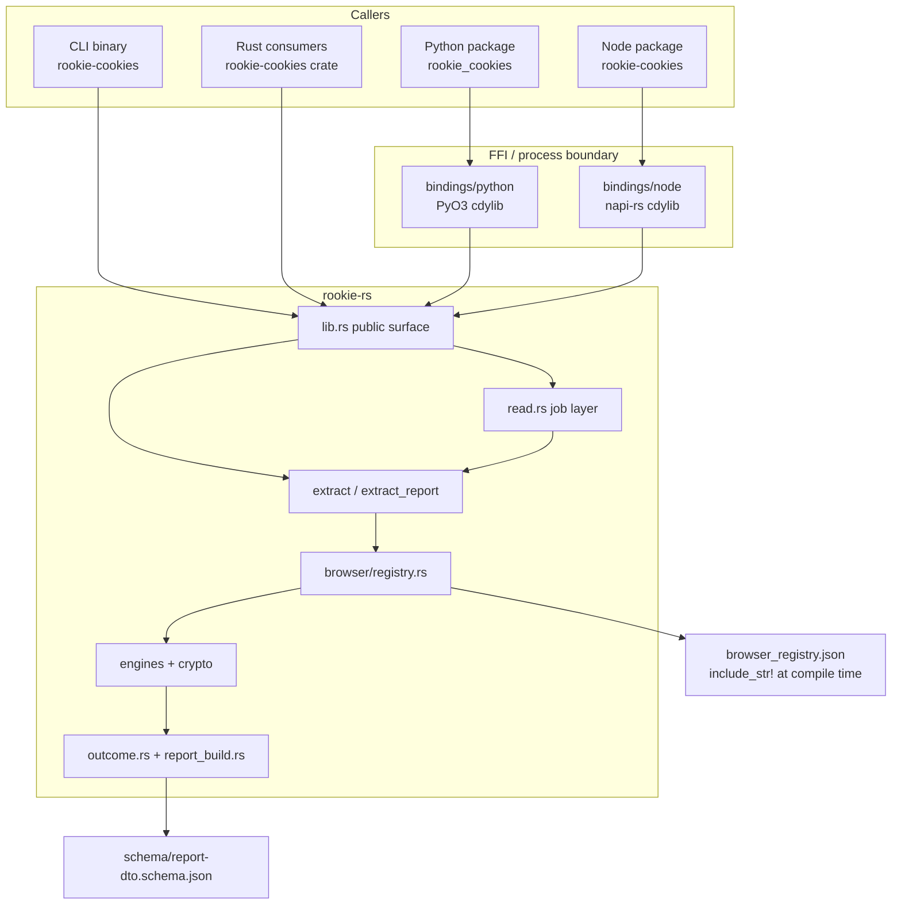

Bindings do not reimplement discovery or crypto. They classify `anyhow::Error` via `fault_kind` (`FaultKind::Request` vs `Engine`) into Python `RookieRequestError` / `RookieEngineError` or napi `InvalidArg` / `GenericFailure`, convert `Cookie` to language-native objects, and (Node) wrap every extraction in `AsyncTask` so the event loop is never blocked. Python `read` / `from_path` / report functions `py.detach(...)` the Rust call.

The CLI is a thin process: it builds `ReadRequest` / `Request` / `DirectPathRequest` / `ChromiumPathRequest` and prints JSON or Netscape. Cooperative Ctrl-C is **only** on the legacy `--browser` / `--path` flag path (`install_cancel_on_signal` in `cli/src/main.rs`). Job subcommands (`read`, `from-path`, `header`) and `--load` / `--report` / `--list-*` keep the process default signal disposition: `run_job_command` never installs a handle, even though `ReadRequest` / `FromPathRequest` accept `cancellation`.

#### Process and FFI boundaries

| Boundary | What crosses it | What must not |
| --- | --- | --- |
| PyO3 / napi | Cookies, reports, descriptors, structured warnings, cancellation handle clones. Rust/Python `ReadWarning` is `{ code, count: u64 }`. Node `ReadWarningObject` is `{ code, count: u32, message }` (`count` saturates at `u32::MAX`; `message` is `Display`) | Key material, `SecretBytes`, cookie values in diagnostics |
| CLI stdout | JSON / Netscape / Cookie header | Warnings go to stderr (`emit_warnings`) |
| COM injection (Windows ABE) | Spawned browser process + native payload (`windows/appbound/native/`) | Exported private keys; the crate returns decrypted **cookie values**, not the master key |
| Keychain / Secret Service / DPAPI | OS credential APIs; Linux uses confidential DH session only | Plain D-Bus secret sessions (C4a) |
| SQLite | Read-only connections; WAL snapshot in a private temp dir | `immutable=1` on live or WAL-bearing DBs; copying `-shm` |

`common/boundary.rs` names the trust-boundary verbs: `ReadOnlySource`, `Decoder`, `KeyProvider`, `RecordSink`. Production acquisition supplies `BoundaryRuntime` directly; the `Acquire` trait is test-only.

#### Platform layers

Platform `cfg` is contained behind capability modules (issue #218), enforced by `xtask check-cfg-locations` against `cfg-location-allowlist.toml`. Pattern: `mod.rs` selects `linux` / `macos` / `windows` / `unsupported` and `use x as platform`.

| Capability | Leaves |
| --- | --- |
| Chromium key providers | `chromium_platform_keys/{linux,macos,windows,unsupported,shared}.rs` |
| Chromium ciphers | `chromium_crypto/{unix,windows,unsupported}.rs` |
| Chromium DB lock recovery | `chromium_database_acquisition/{mod,windows}.rs` |
| Named compatibility | `compatibility_dispatch/{linux,macos,windows,unsupported,named}.rs` |
| Direct path | `direct_path/{linux,macos,windows,unsupported,shared}.rs` |
| Report remaining engines | `report_build/dispatch/{macos,windows,other}.rs` |
| Legacy remaining engines | `legacy/dispatch/{macos,windows,other}.rs` |
| App-Bound | `windows/appbound/` + `browser/appbound_host.rs` |
| Safari / IE native acquisition | `registry/safari.rs`, `registry/internet_explorer.rs`; parsers remain cross-host testable |

`registry.rs` itself stays target-agnostic (#218 ceiling). Safari/IE `acquire_each_candidate` is `#[allow(dead_code)]` on Linux rather than `cfg`-gated in that file.

Default extraction budget: 30 seconds (`common/deadline.rs` `DEFAULT_EXTRACTION_BUDGET`). One absolute monotonic `Deadline` is created at the operation boundary and copied through every fallback; no boundary turns remaining duration into a fresh budget. `load_report` fans out registered browsers on a pool of `DEFAULT_FAN_OUT_WIDTH = 4` (`common/concurrency.rs`) sharing that one runtime, returning results in registry order.

---

### 2. Key subsystems

#### Registry

`rookie-rs/browser_registry.json` is the only hand-maintained discovery source (ADR 0002). Embedded with `include_str!`, deserialized once into a `Lazy` `Registry`, validated at first use (`schema_version == 1`, unique ids/aliases, engine ↔ discovery strategy pairing, Chromium `key_credentials` vs declared tiers).

Per OS, each `BrowserDefinition` has `canonical_id`, `aliases`, `display_name`, `engine`, `roots[]` (`root_id`, `template`, `channel`, `discovery`, `priority`, optional `legacy_priority` / `legacy_profile_layout`), `capabilities`, optional `key_credentials`.

Discovery strategies: `chromium_user_data`, `mozilla_profiles_ini`, `safari_default_profile`, `internet_explorer_web_cache`.

`DiscoveryContext<F: DiscoveryFs>` + `RealDiscoveryFs` expand templates (`{local_app_data}`, `{home}`, XDG, …) and enumerate. Tests inject `TestDiscoveryFs`.

`ProfileSelection`: `AllProfiles` (full reports), `ProfileId` (explicit report/job profile), `LegacyFirstProfile` (named wrappers). Selection is below the engine boundary so a compatibility wrapper does not extract profiles it will discard.

`CONFIG` / `config::Browser` remain source-compatible; `CONFIG` is a read-only projection of the registry and is **not** consulted for discovery. `config.json` and `common/paths.rs` are gone; CI rejects their restoration.

#### Engines

No plugin trait. `report_build::collect_extraction` / `collect_listing` and `legacy::browser_cookies_and_warnings_with_runtime` `match browser.engine`. Chromium and Gecko are portable and stay inline; Safari/IE go through `report_build/dispatch` and `legacy/dispatch` platform leaves.

**Chromium** (`browser/chromium.rs` + `registry/chromium.rs`):

- Inventory: `ChromiumProfile` (candidates only) / `ChromiumExtractedProfile` (sources). `BrowserInstallation`, `ChromiumDiscovery`, `ChromiumListing`, `ChromiumRegistryDraft`.
- Persistent precedence: `Network/Cookies` (10) then `Cookies` (20). Listing stats both, selects the first that `exists`, **omits `!exists` from the extract plan**. Policy `Fixed`. Listing `acquisition` stays `NotAttempted`; the strategy used lands on `Source::acquisition`.
- Chrome-only listing `chrome_profiles()` prefers `Local State.profile.last_used` then `last_active_profiles`; generic `browser_profiles("chrome")` stays default-first.
- Engine boundary: `query_cookies_engine_outcome_with_runtime(...) -> Source` via private `ChromiumExtractionDraft::into_source`.
- Acquire options collapsed to `ChromiumAcquireOptions { encrypted_value_policy, acquisition }` (`DirectRead` vs `WithForceKillRecovery`). `EncryptedValuePolicy::UseKeyOutcomes` vs `RejectMissingIdentity` (plaintext-only / missing identity).

**Gecko** (`mozilla.rs`, `mozilla_persistent.rs`, `mozilla_session.rs`, `mozilla_profiles.rs`, `registry/gecko.rs`):

- Inventory: `DiscoveredProfile` / `ExtractedProfile` with `EngineProfileIdentity` + `LegacyRank`.
- Plan: persistent `AcquisitionPolicy::Probe` (`cookies.sqlite`, format `mozilla_sqlite`) then session `FirstValid` run from frozen `SESSION_CANDIDATES` (ADR 0001 §8):
  1. running: `sessionstore-backups/recovery.jsonlz4`, then `recovery.baklz4`
  2. clean-shutdown: `sessionstore.jsonlz4`, then legacy `sessionstore.js`
  3. stale: `previous.jsonlz4`; upgrade files remain disabled
- Lifecycle tier precedes mtime. First valid wins; sources are not merged across tiers. Missing files are silent. Invalid higher-priority file → bounded warning and fallthrough.
- `acquire_by_policy` executes the plan. `FirstValid` is a **lazy** iterator into `mozilla::select_session_sources` so later candidates are never acquired.
- `firefox_profiles()` remains persistent-database-only `MozillaProfile { name, path, is_default }` even though report discovery can expose session-only profiles.
- `MozillaExtract { sources, boundary_stop }`; `MozillaCandidateOutcome::{Source, Missing, Stop}`.

**Safari** (`safari.rs` parser, `registry/safari.rs` inventory): `Cookies.binarycookies`, `AcquisitionPolicy::Fixed`, `SourceAcquisition::StableFileImage`. File-size ceiling 64 MiB. Embedded NUL fields rejected (C4c). macOS Full Disk Access. Inventory types left the decoder (#280).

**Internet Explorer** (`internet_explorer.rs`, `internet_explorer_model.rs`, `registry/internet_explorer.rs`): ESE WebCache, `SourceAcquisition::EseDatabase` overlaid once a query is attempted. Public `internet_explorer` / `internet_explorer_based` and the ESE engine module (`internet_explorer.rs`) are `cfg(target_os = "windows")`. The model/parser (`internet_explorer_model.rs`) is compiled on every target (`browser/mod.rs` ungated `mod internet_explorer_model`) so decoder tests run off Windows.

#### Crypto

Split so decoders never take key deps:

- `chromium_decoder.rs` — key-free SQLite row decoder; emits ciphertext-bearing `CookieRecord`.
- `unseal.rs` — only post-decode consumer that combines records with `ChromiumKeyOutcomes`. Host-hash strip for schema ≥ 24 (`SHA256(host_key)` prefix).
- `chromium_crypto/` — `ChromiumKeyOutcomes { v10, v11, v20 }`, `ChromiumKeyRoute`, `KeyCandidate` (zeroizing, `Debug` redacts bytes), platform decrypt (`unix` AES-CBC / `windows` AES-GCM + ChaCha20-Poly1305 for ABE).
- `chromium_platform_keys/` — `ChromiumKeyIdentity { linux_crypt_name, macos_keychain: { service, account } }` is both the registry JSON DTO and the runtime identity. `ChromiumKeyRequest` carries `LocalStateInput`.
- Windows ABE: `windows/appbound/` — `get_keys` tries `retrieve_via_injection` (reflective COM into spawned browser exe) then `get_keys_elevated_fallback` (SYSTEM DPAPI + CNG), gated by the job's `AppBoundPolicy` (`disabled` / `injection_only` / `allow_elevated_fallback`) carried on `BoundaryRuntime`. The new job surface defaults to `disabled`; the deprecated v0.5.9 bridge keeps `allow_elevated_fallback` so its 0.5.8 capability survives 0.6.x. `ROOKIE_E2E_APPBOUND_MODE` no longer steers production: it is compiled in only under `cfg(test)` or the off-by-default `e2e-appbound-steering` feature, and can only narrow what the policy already permits. `AppBoundHost` is a required vendor identity (`chrome|brave|edge|coccoc|avast`), inferred from path or `browser_id`; never defaults to Chrome.
- Linux Secret Service: `linux/confidential.rs` negotiates `dh-ietf1024-sha256-aes128-cbc-pkcs7` only; never retries `plain`.
- `common/secret.rs` — `SecretBytes` / `SecretString` wipe on drop.

#### Acquisition

`common/sqlite.rs` is the SQLite capability (ADR 0001 §7). Long, one job, **not split for architecture**.

`DatabaseAcquisitionStrategy`: `LiveReadOnly`, `VerifiedWalSnapshot`, `VerifiedStaticSingleFile`.

Policy:

- Nonempty WAL → verified DB+WAL snapshot, open `mode=ro`, never `immutable=1`. `-shm` is not copied; SQLite rebuilds it in the private directory.
- Live no-WAL → normal read-only + read transaction; not immutable.
- Active rollback-journal writer must yield a coherent read or typed busy/locked. No raw-copy through it.
- Private immutable path accepts only an already-acquired static **single-file** copy whose acquisition verified no nonempty WAL (or a complete checkpoint) across the copy window.
- Whole-query reacquisition is bounded and restricted to classified snapshot-origin corruption or selected I/O failures. Schema, SQL, and decryption failures are not retried.
- Windows: ordinary acquisition first; platform fallbacks (Restart Manager, optional shadow copy) only for classified sharing violations. Browser termination is opt-in on the **Rust direct-path builder only**: `ChromiumPathRequest::locked_database_policy(ChromiumLockedDatabasePolicy::AllowProcessShutdown)` (`direct_path/mod.rs`). Default is `NonDisruptive`. CLI, Python, and Node do **not** expose this (`cli/src/args.rs` has no such flag; `cli/tests/snapshot.rs::process_shutdown_is_not_a_cli_option` and the `no_destructive_acquisition` tests in `cli/` and `bindings/` pin that those surfaces never name `AllowProcessShutdown`). Generic/report extraction calls `query_cookies_engine_outcome_with_runtime(..., false, ...)` and never sets it. There is no `--allow-process-shutdown` CLI flag.
- RAII cleanup after owned readers drop. Cleanup failure → bounded warning naming the private directory. Process abort makes no cleanup attempt.

`SqliteReader` declaration order is load-bearing: `connection` drops before `snapshot` so Windows can delete the temp dir.

Non-SQLite: Safari `StableFileImage`; IE `EseDatabase`.

#### Report pipeline

`report_build.rs` is cross-engine assembly. Entry points: `supported_browser_descriptors`, `browser_profile_descriptors`, `chrome_profile_descriptors`, `browser_extraction_report_with_runtime`, `load_extraction_report`.

Flow:

1. `resolve_registered_browser`
2. `collect_extraction` / `collect_listing` (`match engine`)
3. Engine returns `ChromiumRegistryDraft` or `EngineExtract` / `EngineListing`
4. Copy helpers `chromium_browser_outcome` / `engine_extract_outcome` build private `BrowserDraft` → `ProfileDraft` → `SourceDraft`
5. `finalize_outcomes_with_runtime` → `Outcome`
6. `project_canonical_report_with_runtime` → `ExtractionReport`

Crate-visible source representations are exactly `SourceCandidate` → `Source` → wire DTO. `SourceDraft` is private to `report_build` (ADR 0005 Decision 6). Direct-path uses one `finalize_singleton_source` seam.

Empty Chromium `sources` means ordinary absence (listing only existing DBs). Empty Gecko/Safari/IE extract `sources` after a listing that planted candidates means vanished / `NoSources`. Both polarities are golden-pinned (ADR 0005 Decision 4).

Report cookies sort by `(domain, path, name, expires, secure, http_only, same_site, value)`. Exact duplicates retain extraction order. Compatibility cookie row order remains unsorted.

Public counters are `u32`; wider internal counts saturate at `u32::MAX` and set `counters_saturated` (avoids Node `u64`/BigInt). `MAX_ISSUE_SAMPLES = 8`.

#### Read / job API

`read.rs` is the 0.6 job layer.

- `ReadRequest`: private fields `browser_id`, `profile`, `include_expired`, `timeout`, `cancellation`. Absence is “not called.” The constructor is `ReadRequest::browser(id)` (sets `browser_id`).
- `read`: resolve browser; **no profile** → `legacy::browser_cookies_and_warnings_with_runtime` (compatibility flatten); **profile** → `resolve_profile_query` then `extract_report` then `flatten_selected_report_cookies`. Harvest `decrypt_failed` warnings from report issues. Filter expired (unless `include_expired`) and invalid Cookie octets (`invalid_octets`).
- `ReadResult`: not `Clone`; `cookies()`, `warnings()`, `browser_id()`, `profile_id()`, `header(url)`, `into_cookies()`. `Debug` prints counts, not values.
- `from_path`: does **not** call the profile resolver (ADR 0004). Sniffs via `direct_path`. Optional `ChromiumCredentialSource`. `browser_id` / `profile_id` on the result are empty/`None`.
- `profiles` is an alias of `browser_profiles`.

Python `jar(...)` is `read(...).as_jar()` and **discards warnings**. `ReadResult.as_jar` is patched in `bindings/python/rookie_cookies/__init__.py`. Python `from_path` currently does **not** take Chromium credential flags; Node `fromPath` and CLI `from-path` / Rust `FromPathRequest::chromium_credentials` do.

#### Compatibility dispatch

`compatibility_dispatch/` owns deprecated crate-root named APIs and `load` (because `legacy.rs` “owns no paths, credentials, discovery…”). `named_browser` → `browser(id, domains)` → `extract(Request)`. `load` iterates `legacy_load_browsers()` in a frozen per-OS order (Firefox, Zen, LibreWolf, Opera, Edge, Chromium, Brave, Vivaldi, Arc, then platform extras from `extend_legacy_load_browsers`: **linux/macos/windows** add Chrome; Linux also Cachy; macOS Opera GX + Safari; Windows IE + Octo + Opera GX). The `unsupported` leaf is a no-op, so FreeBSD/other Unix `load()` never includes Chrome.

`load` is a **best-effort aggregator** (`named.rs` rustdoc / `aggregate_load_results`): uninstalled browsers are skipped (`is_browser_not_installed`); any other per-browser `Err` is `log::warn!`’d and collected, not fail-fast. Returns `Ok` concatenated cookies if **any** attempted browser succeeded. Returns `Err` only when at least one installed browser was found, every attempted extraction failed, and none succeeded. If nothing is installed, returns an empty `Ok` list. New browsers do not enter `load()`.

`any_browser` classifies the file (`CookieSourceKind`) then dispatches; Chromium identity credentials come from the registry / `key_path`.

#### Bindings

**Python** (`bindings/python/`): `src/lib.rs` registers named functions, report functions, `read` / `from_path`, `CancellationHandle`, exceptions. `src/job.rs` job layer. `src/report.rs` dict-shaped DTOs (Rust field names verbatim). `src/errors.rs` `RookieRequestError` (subclass of `ValueError`) / `RookieEngineError` (subclass of `RuntimeError`). `rookie_cookies/dto.py` frozen dataclasses generated from the JSON Schema. `as_list()` / `__iter__` emit the frozen eight-key dict; `same_site` stays the raw stored integer.

**Node** (`bindings/node/`): extraction, listing, and report entry points are `AsyncTask` / `Promise` (always `await`). `version()` and `to_netscape()` are synchronous; `CancellationHandle.cancel` / `isCancelled` are synchronous. `CookieObject` camelCase; `expires` is `Option<i64>` (values above `i64::MAX` omitted). Report objects camelCase (`schemaVersion`, `countersSaturated`, …). `read({ browser, profile, includeExpired, timeoutMs }, cancellation?)`. `report(options)` is the bindings name for `extract_report`. Schema-parity test checks `#[napi(object)]` structs against `schema/report-dto.schema.json`. Worker panics are caught (`catch_unwind`).

#### CLI

`cli/src/args.rs` clap surface:

- Legacy: `--path`, `--key-path`, `--browser-id`, `--plaintext-only` (the three Chromium credential flags require `--path` and are mutually exclusive), `--browser`, `--load`, `--domains`, `--format json|netscape`.
- Additive: `--list-browsers`, `--list-profiles --browser`, `--report [--browser]`, `--profile` (requires `--browser`; legal with or without `--report`).
- Job subcommands: `read`, `profiles`, `report`, `from-path`, `header`. These are the 0.6 lead and **do not** install SIGINT cancellation (default signal disposition). Cooperative Ctrl-C is only on the legacy `--browser` / `--path` flag path.

Without a report/list mode, `--browser` accepts only historical keys (`cli/src/browsers_map.rs`). A registry-only browser without `--report` is a usage error. Netscape is forbidden in list/report modes. No-selector remains legacy `load()`. There is no `--allow-process-shutdown` flag.

#### xtask fences

`xtask/src/stage_boundary.rs` parses the token tree of defining files and fails if a fenced type declares a forbidden field, including under `#[cfg(test)]`. Identifier lint, not a size lint. Bound to **file + name** so an unrelated `struct Source` elsewhere neither satisfies nor trips it.

| Type | File | Forbidden fields |
| --- | --- | --- |
| `SourceIdentity` | `browser/source.rs` | `selected`, `exists`, `acquisition`, `records`, `cookies`, `stats`, `issues`, `failure` |
| `SourceCandidate` | `browser/source.rs` | `cookies`, `records`, `stats`, `issues`, `sources`, `failure` |
| `Source` | `browser/source.rs` | `cookies`, `profile_id`, `installation_id`, `display_name` |
| `DiscoveredProfile` | `browser/registry.rs` | `sources`, `cookies`, `records` |
| `EngineListing` | `browser/registry.rs` | `sources`, `cookies`, `records` |
| `ChromiumProfile` | `registry/chromium.rs` | `cookies`, `records`, `sources` |
| `ChromiumExtractedProfile` | `registry/chromium.rs` | `cookies`, `records`, `stats`, `row_issues`, `issues`, `legacy_error`, `acquisition` |

`xtask/src/cfg_scan.rs` + `allowlist.rs` enforce #218. Both checks run in `.github/workflows/test-rust.yml` on Ubuntu (`check-cfg-locations` then `check-stage-boundary`).

#### Schema / DTO

`rookie-rs/src/browser/report_core.rs` is the source of truth. `schema/report-dto.schema.json` is generated (`cargo run --bin generate-dto-schema --features dto-schema`). `scripts/generate-python-dto.py` regenerates `dto.py`. Node schema-parity test is the JS equivalent. CI `git diff --exit-code` on both generated files. `EXTRACTION_REPORT_SCHEMA_VERSION = 1`. Python/CLI snake_case wire keys; Node camelCase. Structs are `#[non_exhaustive]`.

Public API snapshots: `rookie-rs/public-api/{linux,macos,windows}-{all-features,no-default-features}.txt`, checked by `scripts/check-public-api.py`.

#### Module ownership (ADR 0005 Decision 6)

| Module | Owns | Must not own |
| --- | --- | --- |
| `browser/source.rs` | `SourceIdentity`, `SourceCandidate`, `Source`, `SourceFailure`, `SourceIssue`, `SourceStats`, `SourceAcquisition`, `SourceFailureStage` | profile identity, catalog, listing/extract bags, `DiscoveryIssue` |
| `browser/registry.rs` | catalog, `DiscoveryFs`, ids, `ProfileSelection`, discovery diagnostics and counters, `EngineProfileIdentity`, `LegacyRank`, listing/extract bags | source-leaf definitions, report mapping |
| `browser/registry/*.rs` | per-engine inventory; discover, select, lookup, acquire | cookie format decode and parsing |
| `browser/outcome.rs` | `Outcome`, `SourceOutcome`, finalize, `source_digest`, `CompatibilityDisposition` / `CompatibilityDecision` vocabulary | engine bags, discovery, the compatibility *policy* that produces those values |
| `browser/compatibility.rs` | which browser families exist, which source-set rule each takes, which product string each emits | extraction `status`, assembly |
| `browser/report_core.rs` | the wire DTO and its ordering and aggregation helpers | engine types |
| `browser/report_build.rs` | dispatch arms, orchestration, finalize hand-off, wire projection, the single direct-path finalize seam | per-engine bag mappers, per-engine direct-path identity construction, compatibility disposition and its product strings |
| `browser/legacy.rs` | `LegacyFirstProfile` application and `Cookie` projection | paths, credentials, discovery |
| engine modules | path plus keys to `Source`; format decode; public `MozillaProfile` as an ADR 0002 projection | report identity, profile listing types |
| `browser/cookie_record.rs` | `CookieRecord`, `FinalizedCookieRecord` | — |

`common/sqlite.rs` is deliberately absent from the table.

---

### 3. Class diagram for key classes

One-sentence definitions, owners, and “must not contain” for these types are in [§0 Key classes](#key-classes-one-sentence-catalog). Diagrams below are the load-bearing fields.

Types are the real structs/enums from source. Huge types show key fields only. UML `+`/`-` here is not crate visibility: public vs `pub(crate)` is `rookie-rs/src/lib.rs` and `rookie-rs/public-api/*.txt`. Public among the diagrams: `Cookie`, `MozillaProfile`, `ExtractionReport` and its children, `ReadRequest` / `ReadResult` / `ReadWarning` / `FromPathRequest`, `Request`, `RequestError`, `ChromiumCredentialSource`. Stage leaves, registry bags, Chromium inventory, and `Outcome` are crate-private.

#### Stage leaves

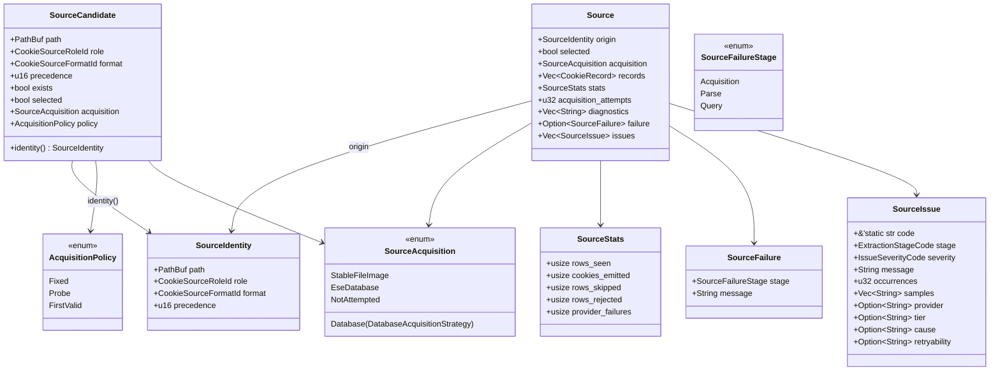

`Source` has no `cookies` field (including under `#[cfg(test)]`). Tests project through `#[cfg(test)] fn cookies()`. `failed` is derived from `failure`, never stored.

#### Registry and Gecko/Safari/IE bags

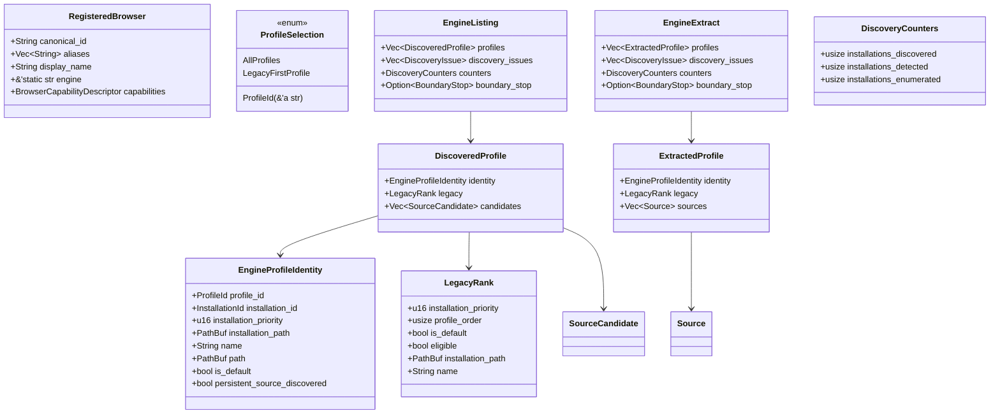

`RegisteredBrowser.capabilities` is `registry::BrowserCapabilityDescriptor` (`Vec<String>` lists). The public wire type is `report_core::BrowserCapabilitiesDescriptor` (newtype ids). Chromium does **not** adopt `EngineProfileIdentity`. `LegacyRank` is selection policy, kept out of a type named identity.

#### Chromium inventory (separate on purpose)

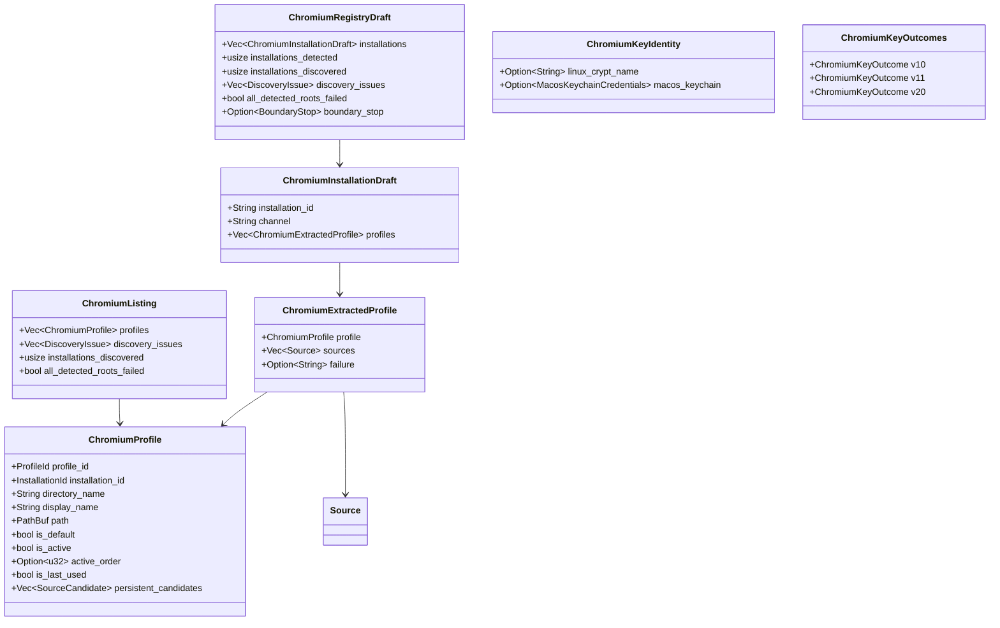

Empty `ChromiumExtractedProfile.sources` without `failure` is ordinary absence. `failure` is “extraction failed before any source could be named.”

#### Gecko engine results and public Firefox listing

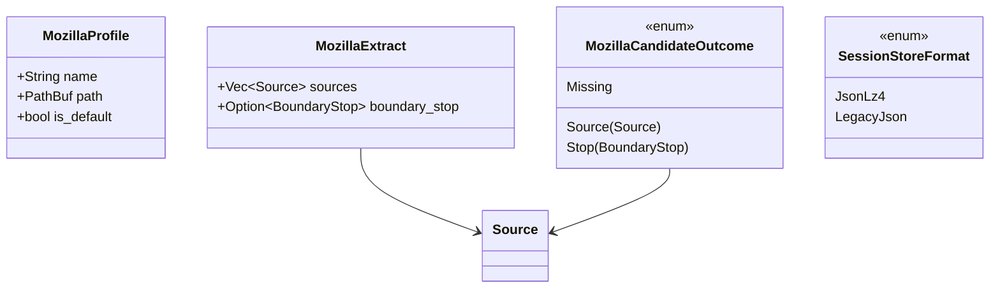

`MozillaProfile` is the public ADR 0002 projection used by `firefox_profiles()`. `MozillaSessionDraft` / `MozillaPersistentDraft` are file-private scratch.

#### Cookie records

```mermaid
classDiagram
  class Cookie {
    +String domain
    +String path
    +bool secure
    +Option~u64~ expires
    +String name
    +String value
    +bool http_only
    +i64 same_site
  }

  class CookieRecord {
    +DomainScope domain
    +String path
    +String name
    +CookieValue value
    +IsolationKey isolation
    +Attributes attributes
    +BTreeMap raw
    +SourceRef origin
  }

  class FinalizedCookieRecord {
    CookieRecord
  }

  class CookieValue {
    <<enum>>
    Plain(SecretString)
    Encrypted { tier CipherTier, bytes Vec~u8~ }
    Unavailable(UnavailableReason)
  }

  class CipherTier {
    <<enum>>
    V10
    V11
    V12SecretPortal
    V20
    LegacyDpapi
    Unknown([u8;3])
    Malformed { observed_len usize }
  }

  class DomainScope {
    <<enum>>
    HostOnly { raw String }
    Domain { raw String }
    Unknown { raw String }
  }

  CookieRecord --> CookieValue
  CookieRecord --> DomainScope
  CookieRecord --> CipherTier
  FinalizedCookieRecord --> CookieRecord : finalize()
  CookieRecord --> Cookie : into_cookie()
```

`FinalizedCookieRecord` is the tuple struct `FinalizedCookieRecord(CookieRecord)` (`cookie_record.rs`); only `CookieRecord::finalize` can construct it, and that rejects `Encrypted` / `Unavailable`. `Cookie` `Debug` redacts `value`. `same_site`: `0` None, `1` Lax, `2` Strict, `SAME_SITE_UNSPECIFIED = -1`.

#### Outcome and report DTO

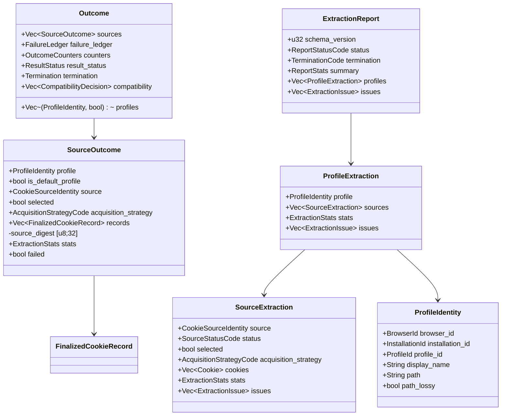

`ResultStatus`: `Complete | Partial | Failed | NoSources`. `Termination`: `Completed | Cancelled | TimedOut | ResourceExhausted`. Independent. `Outcome.profiles` is `Vec<(ProfileIdentity, bool)>` — identity plus `is_default`.

#### Job API

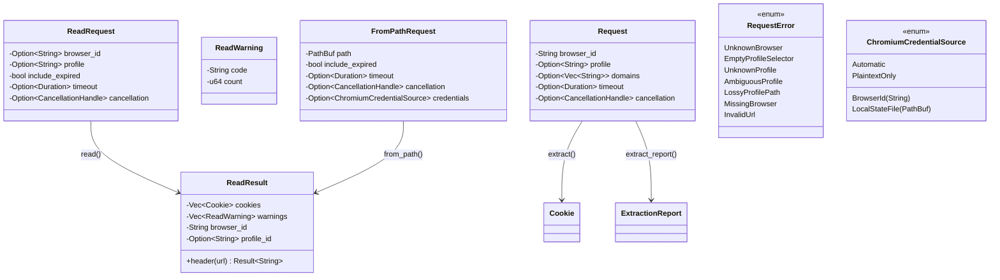

Rust/Python `ReadWarning` machine contract is `code` + `count: u64`. `Display` text is diagnostic only (ADR 0001 / 0004). Node `ReadWarningObject` is a widened view: `{ code, count: u32, message }` with `count` clipped via `u32::try_from(...).unwrap_or(u32::MAX)` and `message = warning.to_string()`. Codes in production today: `decrypt_failed`, `invalid_octets`, plus compatibility skip codes harvested from legacy.

#### Profile query

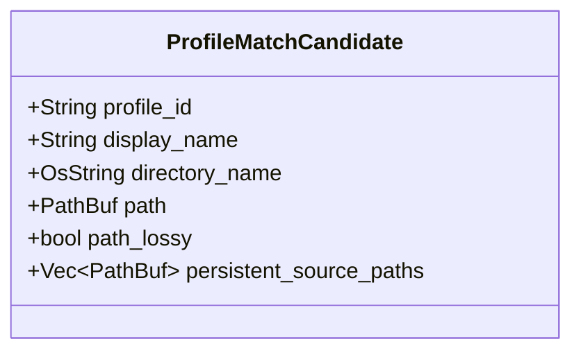

Match order (ADR 0003 + cookie-DB path key): unique opaque `profile_id`, then display name, directory name, non-lossy full path, **or** a persistent source path. Zero or >1 match is `RequestError`. A lossy display path is not a key. Last-used / channel / `is_default` are not tie-breaks.

---

### 4. Data flow or workflow related diagrams

#### `read` (no profile vs with profile)

```mermaid
sequenceDiagram
  participant C as Caller
  participant R as read.rs
  participant Reg as registry
  participant L as legacy.rs
  participant E as extract_report
  participant F as flatten_selected_report_cookies

  C->>R: read(ReadRequest)
  R->>Reg: resolve_registered_browser
  alt no profile
    R->>L: browser_cookies_and_warnings_with_runtime<br/>(LegacyFirstProfile)
    L-->>R: Vec Cookie + skip counts
  else profile query
    R->>Reg: resolve_profile_query
    R->>E: extract_report(Request.profile(id))
    E-->>R: ExtractionReport
    R->>R: harvest_report_warnings (decrypt_failed)
    R->>F: flatten selected succeeded sources
  end
  R->>R: filter_snapshot (expired, sendable_octets)
  R-->>C: ReadResult (unfiltered)
  C->>R: result.header(url)
  Note over R: GetFilter RFC 6265 view; snapshot unchanged
```

#### `extract` / `extract_report`

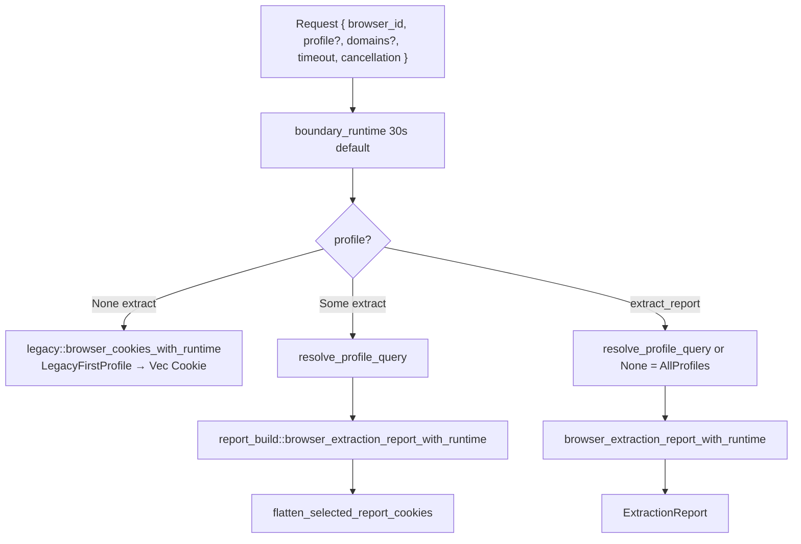

`extract` without a profile does **not** go through the report flatten. `extract` with a profile does, so it includes session cookies (same asymmetry as `read`).

#### Named helpers (`chrome()`)

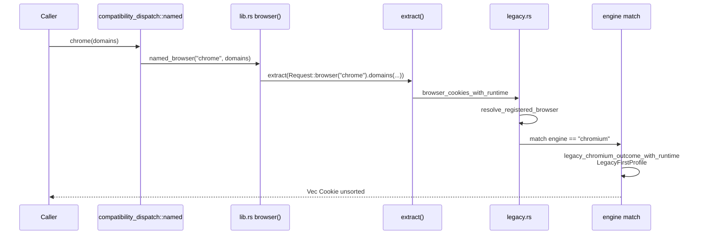

`load()` runs the same named wrappers in that frozen order, concurrently via `fan_out`, then `aggregate_load_results`: skip missing browsers, warn on other per-browser failures, `Ok` if any succeeded, `Err` only when every attempted installed browser failed. New browsers do not enter this list.

#### `from_path`

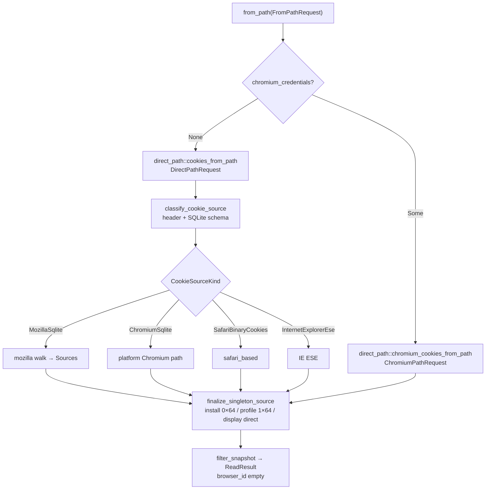

Classification failures are `DirectPathError::InvalidSource` (`FaultKind::Request`, including `SourceInspectionFailed` — a known coarseness). Direct-path does not consult the profile resolver.

#### Chromium unseal (v10 / v20 / ABE)

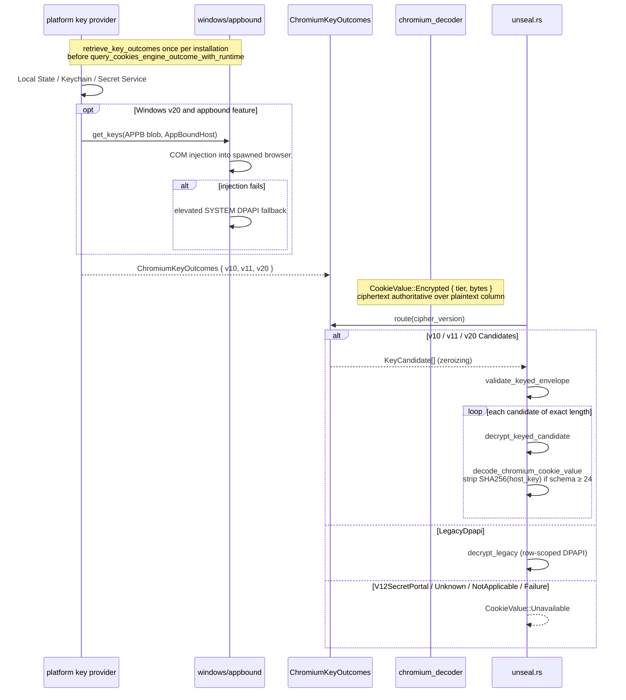

All applicable providers run once per installation/request. Rows dispatch only to their detected tier.

#### Gecko persistent + session

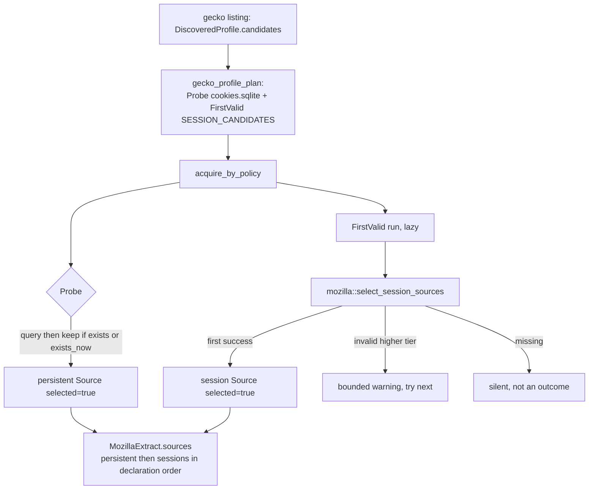

A session-only profile still attempts the persistent probe; `populate_gecko_sources` drops a failed persistent source when listing never discovered `cookies.sqlite` and it is still absent. Direct-path keeps every attempted source.

#### Report projection

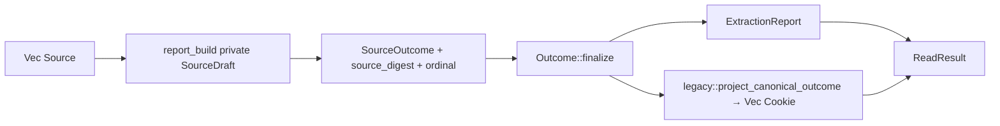

Compatibility projection (`browser/compatibility.rs`) chooses which source digests to emit per family: Chromium persistent-only; Gecko persistent + selected session; Safari / IE their single selected source. `all_rows_rejected` is lifted into `CompatibilityEvidence` and does **not** fail the report source (acquisition/parse/query completed) but **does** fail the named-wrapper projection.

---

## API / Interface Changes

There is no proposed API change. This section is the current public surface.

### Rust crate root (`rookie-rs/src/lib.rs`)

Recommended:

- `read(ReadRequest) -> Result<ReadResult>`
- `from_path(FromPathRequest) -> Result<ReadResult>`
- `profiles(&str) -> Result<Vec<ProfileDescriptor>>`

Still supported, not the lead:

- `extract(Request) -> Result<Vec<Cookie>>`
- `extract_report(Request) -> Result<ExtractionReport>`
- `browser(&str, Option<Vec<String>>) -> Result<Vec<Cookie>>`
- `supported_browsers`, `browser_profiles`, `browser_report`, `load_report`, `chrome_profiles`
- `direct_path::{cookies_from_path, chromium_cookies_from_path, …}`
- `CancellationHandle`, `stop_reason`, `fault_kind`, `version`

Deprecated compatibility (re-exported from `compatibility_dispatch::named`): `arc`, `brave`, `chrome`, `chromium`, `edge`, `firefox`, `firefox_profile`, `firefox_profiles`, `librewolf`, `load`, `opera`, `opera_gx`, `vivaldi`, `zen`, plus platform `safari` / `cachy` / `internet_explorer` / `octo_browser`; `any_browser`; `chromium_based*`; `chrome_profile`.

There is **no** crate-root `fn report` or `fn get`.

`mod browser` is crate-private. `pub use` of `chromium_based` / `firefox_based` / `MozillaProfile` / (cfg) `safari_based` / `internet_explorer_based` remains for the old path APIs.

### Python

`read`, `jar`, `from_path`, `profiles`, `report` (bindings name for `browser_report`), plus the named helpers and dict-shaped `supported_browsers` / `browser_report`. Exceptions: `RookieRequestError`, `RookieEngineError`. `ReadResult.as_list()` / `as_jar()` / `header(url)`. Typed DTOs in `rookie_cookies.dto` are additive; the dict API remains.

`from_path(path, *, include_expired, timeout, cancellation)` does not expose `ChromiumCredentialSource`. Use `chromium_cookies_from_path` / `cookies_from_path` for explicit Chromium credentials.

### Node

Extraction, listing, and report entry points are async (`Promise`). `version()` and `to_netscape()` are synchronous. `read(options, cancellation?)`, `fromPath(options, cancellation?)`, `profiles`, `report`, `browserReport`, `loadReport`, named helpers returning `Promise<CookieObject[]>`. `ReadResult.header(url)`, `.cookies`, `.warnings` (`ReadWarningObject`: `code`, `count: u32`, `message`). `expires` clipped to `i64`.

### CLI

See §2 CLI. Job subcommands are the 0.6 lead; flag grammar remains for 0.5.6 callers. Job subcommands do not arm SIGINT cancellation. Process shutdown is not a CLI option.

### Errors

`RequestError::code()` is the stable branch key (`unknown_browser`, `empty_profile_selector`, `unknown_profile`, `ambiguous_profile`, `lossy_profile_path`, `missing_browser`, `invalid_url`). Human `Display` is not stable. `DirectPathError` has `kind()` + reason codes. `StopReason` is recovered via `stop_reason(&error)` from `BoundaryStop` in the chain.

---

## Data Model Changes

No schema migration is proposed. Current model:

**Three crate-visible source representations:** `SourceCandidate` → `Source` → wire (`SourceExtraction`). The draft hop is private to `report_build`.

**Wire DTO** (`report_core.rs`, `schema/report-dto.schema.json` v1): `ExtractionReport` / `ProfileExtraction` / `SourceExtraction` / `ExtractionIssue` / `ExtractionStats` / `ReportStats` / descriptors. Open newtypes. `u32` counters + `counters_saturated`. Deserialization defaults keep older JSON readable (`schema_version` defaults to 1, `termination` defaults to `completed`, additive counters default to 0).

**Compatibility `Cookie`:** eight constructible fields, including raw `same_site: i64`. Unchanged. `DetailedCookie` is additive (partition/container `CookieContext`) and is not the snapshot element type.

**IDs:** `InstallationId` / `ProfileId` validated as 64 hex chars; `BrowserId` and codes as `^[a-z][a-z0-9_]*$`.

**Goldens:** `rookie-rs/tests/goldens/<os>/*.json` pin listing and extract bytes (paths/ids normalized). A golden change requires an explicit re-golden commit stating the reason.

---

## Alternatives Considered

These are alternatives **already recorded** in ADRs, not new hypotheticals.

### 1. Dual discovery stacks (`config.json` + `common/paths.rs` vs registry)

**Rejected by ADR 0002.** Named APIs used `config.json`; profile/report APIs used the registry. Paths, channels, profile selection, credentials, and failure classification diverged. Cost of the chosen path: `CONFIG` remains a compatibility projection that may contain more descriptive path candidates than the old file; callers should use `supported_browsers()` / `browser_profiles()`. Linux `opera_gx` remains a deprecated 0.5 shim that returns an explicit unsupported-platform error.

### 2. Flatten all-profile discovery behind named functions

**Rejected by ADR 0001.** Would change selected credentials, counts, duplicates, ordering, and errors even if signatures stayed the same. `LegacyFirstProfile` vs `AllProfiles` is the separation. New browsers do not enter `load()`.

### 3. Opaque-id-only `browser_report` vs name/path `chrome_profile` / `firefox_profile`

**Superseded by ADR 0003.** One crate-private resolver; `browser_report`’s middle argument is that query; CLI `--profile` requires `--browser` only. Callers who passed a non-id string to `browser_report` and depended on a request error must stop.

### 4. URL-filtered snapshot / top-level `get` / crate-root `report`

**Rejected by ADR 0004.** Every `read` / `from_path` snapshot is unfiltered. The jar owns send-match. `header(url)` is a view. No top-level binding `header()`, no crate-root `fn get` / `fn report`.

### 5. Engine-plugin trait over Chromium / Gecko / Safari / IE

**Rejected by ADR 0005 Alternative 2.** The engines share no useful behavioural abstraction. Chromium skips `!exists`; Gecko plants `Probe` + `FirstValid`; Safari/IE plant `Fixed` and overlay acquisition after the fact. Four `match` arms on `RegisteredBrowser.engine` are acceptable.

### 6. Line-budget file carve (GitHub #260, closed `NOT_PLANNED`)

**Rejected by ADR 0005 Alternative 1.** Treats length as the defect. After a carve, one bag type would still be both a candidate and a result. Production splits still require a cohesion argument; there is no size lint. Relocating a `#[cfg(test)] mod tests` body to a sibling file is a no-op refactor (unchanged `--list` output), not a substitute for the type boundary.

### 7. Unified Chromium inventory (`Installation` / `Profile` shared with Gecko/Safari/IE)

**Rejected for now by ADR 0005 Decision 4** (second amendment). Chromium keeping its own shapes is a decision, not a leak. Cost: three Chromium-armed dispatch sites (`registry/profile_query.rs`, `report_build.rs` `collect_extraction` and `collect_listing`); the stage boundary is type-enforced for Gecko/Safari/IE and convention-enforced for Chromium. Unifying changes golden-pinned listing bytes unless the shared type carries both polarities of empty `sources` / `!exists`. **Revisit when a fifth engine is added, or when a stage-boundary defect ships in the Chromium path.**

### 8. One profile bag with `candidates` beside `sources`; or `enum EngineSource { Candidate, Acquired }`

**Rejected by ADR 0005 Alternatives 4 and 5.** A listing type that can name `Vec<Source>` still accepts a push. Two types are the enforcement; an enum on a shared bag is not. (A `candidates` field beside `sources` was used once as scaffolding during the type program and deleted.)

### 9. Test extraction alone (`#[cfg(test)] #[path]` on oversized files)

**Rejected as a substitute** (ADR 0005 Alternative 3). Makes files scrollable while leaving the stage leak invisible to rustc. Available afterwards as a workbench when a production file is unreviewable.

---

## Security & Privacy Considerations

Extracted cookies are credentials. Do not log them, commit them, or paste them into issues. Use only profiles and accounts you are allowed to access. Index: [`docs/security.md`](security.md). Intentional corrections vs ADR 0001: [`docs/security-corrections.md`](security-corrections.md). SQLite amalgamation pin: [`docs/sqlite-security.md`](sqlite-security.md).

### Threat model (what this crate does)

The crate reads **local** browser stores of the current user (and, for ABE fallback, may impersonate SYSTEM on Windows). It is not a remote exploit tool. It does not implement DBSC; a decrypted cookie is not always enough to replay a protected Chrome session. It does not export browser private keys.

### Auth / OS credential access

| Platform | Mechanism | Notes |
| --- | --- | --- |
| Windows Chromium v10 | DPAPI on `Local State` `encrypted_key` | Current-user |
| Windows Chromium legacy | Row-scoped DPAPI | No key bucket |
| Windows Chromium v20 | COM injection into spawned vendor process; elevated DPAPI/CNG fallback | `AppBoundHost` required; guessing Chrome fails `kValidationDidNotPass` |
| macOS Chromium v10 | Keychain generic password (`service` / `account` from registry) | May prompt; stderr redacted (C4b) |
| Linux Chromium v10/v11 | libsecret / KWallet via `linux_crypt_name` | Confidential session only (C4a) |
| Safari | Full Disk Access to `Cookies.binarycookies` | FDA is a host permission, not something the crate can grant |
| Gecko | No OS secret for cookies | sqlite + session JSON |

Windows ABE COM injection is in-tree (`windows/appbound/native/`: `abe_extractor.c`, `bootstrap.c`, architecture payload). Destructive acquisition (`RmForceShutdown`) is opt-in on `ChromiumPathRequest::locked_database_policy(AllowProcessShutdown)` only and unused by report/generic paths. CLI, Python, and Node never name that policy (`no_destructive_acquisition` tests in `cli/` and `bindings/`; CLI snapshot rejects `--allow-process-shutdown`).

### Data handling

- `SecretBytes` / `SecretString` / `KeyCandidate` / `Zeroizing` wipe on drop (C4b).
- Diagnostics: `common/diagnostic.rs` redacts paths to `<path>`, bounds to 512 bytes; `Diagnostic::new_with_secrets` replaces cookie values with `<cookie-value>`.
- `Debug` on `Cookie`, `CookieRecord`, `CookieValue`, reports redacts values (C4e). Serde wire and explicit field access still carry values — that is the product.
- Cookie values and key bytes are never included in report issues. Repeated row issues are aggregated with ≤ 8 samples.
- Host matcher: parameterized `LIKE` as a candidate reducer, then the same boundary-aware, case-insensitive host matcher as Safari/session sources. `None` is unfiltered; explicit empty filter matches nothing (ADR 0001 security correction).
- Chromium ciphertext precedence: dual-populated plaintext `value` is discarded when `encrypted_value` is present.
- Cancellation/deadlines are cooperative at most native seams; Keychain child and D-Bus waits are enforceable.

---

## Observability

What exists today — not a metrics proposal.

### Structured warnings (snapshot)

Rust/Python `ReadWarning { code, count: u64 }`. Codes + count are the machine contract; `Display` is “skipped {count} rows ({code})” and is diagnostic only. Node exposes `ReadWarningObject { code, count: u32, message }` (same contract, extra diagnostic `message`). Produced by:

- `read` no-profile: skip codes from `legacy::browser_cookies_and_warnings_with_runtime` (e.g. decrypt skips on Chromium, row-skip counts on Gecko).
- `read` with-profile: `harvest_report_warnings` sums source issues whose code contains `"decrypt"` or equals `decrypt_failed`.
- Both + `from_path`: `invalid_octets` for names/values that are not Cookie-header sendable.

Python `jar()` discards them. CLI job commands print them on stderr.

### Report issues and status

`ExtractionIssue`: `code`, `stage` (`registry|discovery|acquisition|parse|decrypt|decode|query`), `severity` (`info|warning|error`), `cause`, `provider`, `tier`, `retryability` (`retryable|not_retryable|unknown`), `occurrences`, `samples`, optional browser/installation/profile ids, sanitized `message`.

Aggregation key is the full `(code, stage, scope, cause, severity, retryability)` (`FailureLedger`). Top-level `issues` are request/registry/discovery/installation only; source failures stay on `SourceExtraction`.

`status` + independent `termination`. `load_report`: uninstalled registered browsers increment `browsers_not_detected` rather than emitting a per-browser warning; installed failures emit issues.

### Diagnostics

- `Source.diagnostics`: acquisition retry notes, projected as `source_read_retried`.
- `DiscoveryIssue`: bounded to 32 path samples per code.
- Logging: `log` crate; Python forwards `rookie_cookies` target via `pyo3-log` (not the root logger). CLI uses `tracing-subscriber`.
- No statsd/Prometheus surface. No cookie values in logs if `Debug` is used; do not `println!("{:?}", cookie)`.

### Golden / characterization

Per-engine goldens and ADR 0001–0004 characterization tests are the behavioural freeze. Public-api snapshots fail CI on accidental surface drift.

---

## Rollout Plan

This document is a docs landing, not a runtime change.

### Compatibility-bridge / 0.7 deprecation posture

From the root README and ADRs:

- 0.6 keeps named helpers (`chrome()`, `firefox()`, `load()`, …) callable while docs lead with `read` / `jar`.
- That compatibility is a **bridge, not a promise**. Later releases will break the old surface.
- `*_based` / `any_browser` exist in 0.6 and are deprecated for 0.7.
- IE functions exist in 0.6 and are deprecated.
- `chrome_profile` is already `#[deprecated(since = "0.6.0", note = "use extract_report(...) or browser_report(...)")]`.
- The workspace is currently `0.6.0-beta.1`; snippets document the **0.6.0** recommended surface.

No feature flag is required to land this file. Rollback is `git revert` of the docs PR.

### What already gates the architecture

CI (`.github/workflows/test-rust.yml`): `check-cfg-locations`, `check-stage-boundary`, public-api snapshots, DTO schema + `dto.py` freshness, `--no-default-features` tests so the non-`appbound` Windows branch cannot rot.

---

## Open Questions

Only questions that already exist in ADRs or code. Not product brainstorming.

1. **Chromium inventory unification (ADR 0005 Decision 4).** Closed unless a fifth engine is added or a stage-boundary defect ships in the Chromium path. The tax is three Chromium-armed dispatch sites and a convention-enforced boundary on the largest engine.
2. **Historical identifiers (ADR 0005 Decision 3).** `populate_*_sources` and `query_cookies_*` remain production names. A later, deliberate, mechanical rename is allowed; doing it casually would teach contributors to skip ADRs.
3. **Compatibility family-fallback strings (after-the-type-program leftover 2).** Detection of all-rows-rejected is counters + issue codes. Substitution of frozen family fallback text still compares a diagnostic against `SourceIssue::generic_row_read_failed_message`. Policy-on-prose for product strings, not for the boolean.
4. **`fault_kind` coarseness (`lib.rs`).** Every `DirectPathError` classifies as `Request`, including `SourceInspectionFailed` (corrupt/locked file as well as a wrong path). Splitting that reason to `Engine` is a documented reasonable future refinement, not attempted.
5. **ADR 0001 deferred surfaces.** Rich canonical cookie metadata on the public/binding snapshot, CookieEditor output, a non-terminating Windows locked-handle provider, and changing legacy functions to all-profile defaults remain deferred.
6. **v12 SecretPortal.** Recognized, unsupported, until a provider exists.
7. **Python `from_path` credentials.** Rust / Node / CLI accept `ChromiumCredentialSource`; Python `from_path` does not (use `chromium_cookies_from_path`). Whether 0.6 should close that gap is unrecorded.
8. **`acquire_each_candidate` vs `acquire_by_policy`.** Safari/IE still answer `Result<Source>` rather than `MozillaCandidateOutcome`; folding them is the outcome-type unification noted in `registry.rs` (§14b), not required for the current architecture.

`check-stage-boundary` **is** wired into CI (`.github/workflows/test-rust.yml` alongside `check-cfg-locations`). The contrary claim in `docs/design/after-the-type-program.md` is stale relative to this tree.

---

## References

- [ADR 0001](adr/0001-cookie-extraction-compatibility-and-report-contracts.md) — compatibility and report contracts
- [ADR 0002](adr/0002-authoritative-browser-registry.md) — `browser_registry.json`, selection policies
- [ADR 0003](adr/0003-unified-profile-query.md) — one profile resolver
- [ADR 0004](adr/0004-read-is-the-recommended-entry.md) — `read` / snapshot / `header` view / source-policy asymmetry
- [ADR 0005](adr/0005-stage-boundary-types-and-extraction-vocabulary.md) — stage types, vocabulary, module ownership, fence
- [Stage-boundary program record](design/stage-boundary-refactor.md) — motivation and historical PR plan (Progress paragraph may be stale)
- [After the type program](design/after-the-type-program.md) — leftover leaks; Decision 1 amendment (`origin: SourceIdentity`); [Language](design/after-the-type-program.md#language) is the Nouns/Verbs source this document’s class catalog follows (current-state names win where that record is stale)
- [Security](security.md) · [security-corrections](security-corrections.md) · [sqlite-security](sqlite-security.md)
- [Testing](testing.md) · [Building](building.md) · [Troubleshooting](troubleshooting.md)
- `rookie-rs/src/lib.rs`, `read.rs`, `browser/{source,outcome,registry,report_core,report_build,compatibility,legacy,unseal,cookie_record}.rs`
- `rookie-rs/browser_registry.json`
- `schema/report-dto.schema.json`
- `xtask/src/stage_boundary.rs`
- Root [README](../README.md)

---

## Key Decisions

Map of **existing** decisions. Not new ones.

1. **Named APIs stay legacy selectors (ADR 0001).** Signatures, eight-field `Cookie`, `load()` set/order, unsorted rows, and first-profile priority stay. New all-profile discovery is never flattened behind an existing function. Named-selector failures must not collapse into plausible successful empty output. `load()` itself is a best-effort aggregator (`aggregate_load_results`): skip missing browsers, warn on other failures, `Ok` if any succeeded.

2. **`browser_registry.json` is the only hand-maintained discovery source (ADR 0002).** Policies: `AllProfiles`, `ProfileId`, `LegacyFirstProfile`. Selection before lookup/acquire. `CONFIG` is a projection, not an input.

3. **One profile resolver (ADR 0003).** Unique match against opaque id, display name, directory name, non-lossy path (and persistent DB path). Ambiguous / empty / lossy are request errors. CLI `--profile` requires `--browser` only.

4. **`read` is the recommended entry (ADR 0004).** Snapshots are unfiltered. `header(url)` is a view. Python `jar` = `read().as_jar()`. Source-policy asymmetry: no-profile = compatibility flatten; with-profile = report flatten including session. No crate-root `get` / `report`.

5. **Listing values cannot hold extract data (ADR 0005 Decision 1).** `SourceCandidate` vs `Source`; `Source` embeds `origin: SourceIdentity`; `selected` / `acquisition` are constructor arguments on `Source`; `failure: Option<SourceFailure>` replaces `error` + `error_stage`. Fenced by `check-stage-boundary`.

6. **Internal verbs are resolve / discover / select / lookup / acquire / decode / unseal / finalize / project (ADR 0005 Decision 3).** `extract` remains the public name. Wire `query` stage code is not renamed.

7. **Only source-level types are unified (ADR 0005 Decision 4).** No shared `Installation` / `Profile`. No engine-plugin trait. Chromium inventory shapes stay; revisit trigger is a fifth engine or a Chromium stage-boundary defect.

8. **Ids reuse public `InstallationId` / `ProfileId` (ADR 0005 Decision 5).** Direct-path synthetic ids are frozen. Two adjacent same-typed id strings are forbidden.

9. **Module ownership table (ADR 0005 Decision 6).** `compatibility.rs` owns family policy and product strings; `outcome.rs` owns the disposition vocabulary any projection may name; `report_build.rs` does not.

10. **Chromium keys are independent per tier (ADR 0001 §6).** v10 / v11 / v20 providers all run; rows dispatch by prefix; raw DPAPI is row-scoped; v12 is known-unsupported.

11. **SQLite acquisition policy (ADR 0001 §7).** WAL snapshot vs live RO vs verified static single-file. No `-shm` copy. No immutable live reads. Windows sharing-violation fallbacks only. Termination opt-in only.

12. **Firefox session lifecycle is frozen (ADR 0001 §8).** `SESSION_CANDIDATES` in `mozilla.rs` is the single source of truth for listing, extract, and direct-path.

13. **Ciphertext is authoritative** (`chromium_ciphertext_precedence`). Dual-populated plaintext is not a fallback.

14. **Linux Secret Service is confidential-only (C4a).** No `plain` session retry.

15. **Platform cfg lives in capability leaves (#218).** Core files have grandfathered ceilings; new cfg in a core file needs a reason.

16. **Open string newtypes, non-exhaustive DTOs, `u32` counters.** New engines/tiers/codes cannot break downstream matches; Node does not see BigInt counters.

17. **Compatibility is a bridge, not a promise.** Plan on migrating off `chrome()` / `load()` / `*_based` before 0.7.

---

## PR Plan

Documentation of existing architecture. Each PR is independently reviewable. No production-code work.

### PR 1 — Land the architecture document

- **PR title:** `docs: add rookie-cookies architecture map`
- **Files/components affected:** `docs/architecture.md` (this file)
- **Dependencies:** none
- **Description:** Add the current-state architecture document under `docs/`. No code, no golden, no public-api, no registry edits. Reviewers check that types, fields, and call graphs match source (especially ADR 0005 stage names and the `read` source-policy asymmetry).

### PR 2 — Index the document from the README

- **PR title:** `docs: link architecture from README`
- **Files/components affected:** `README.md` Documentation table (and, if needed, `rookie-rs/README.md` / binding READMEs’ “see also”)
- **Dependencies:** PR 1
- **Description:** Add a row next to the existing Design / ADR 0004 links pointing at `docs/architecture.md`, so a contributor arriving from crates.io/PyPI/npm can find the map. Do not rewrite language guides.

### PR 3 — Point stale program records at the current-state map

- **PR title:** `docs: point stage-boundary program records at architecture.md`
- **Files/components affected:** `docs/design/stage-boundary-refactor.md` (Progress is stale), optionally a one-line pointer in `docs/design/after-the-type-program.md` noting CI now runs `check-stage-boundary`
- **Dependencies:** PR 1
- **Description:** Do not rewrite those program records (they are historical). Add a short “current-state map: `docs/architecture.md`” note so readers do not treat Rev-2 Progress or the unwired-fence claim as law. ADR 0005 remains the durable rule.

No further PRs are required to “implement” this document. Follow-on implementation work belongs to existing ADRs and program records, not here.
