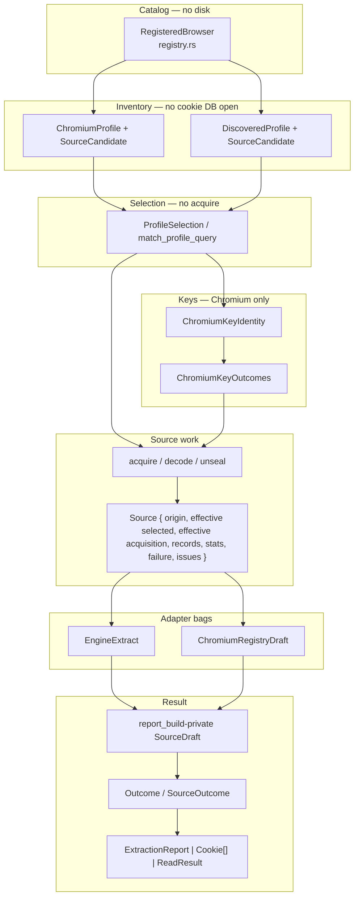
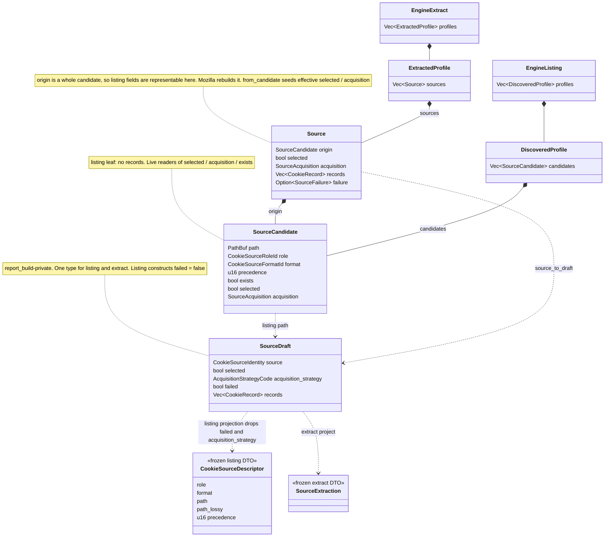
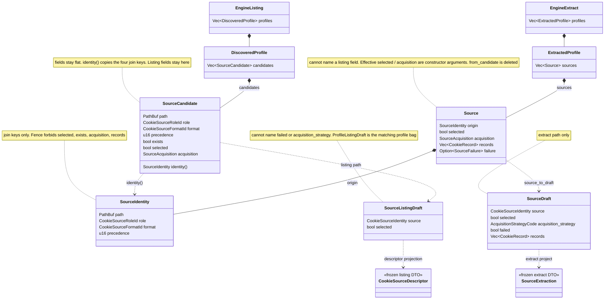
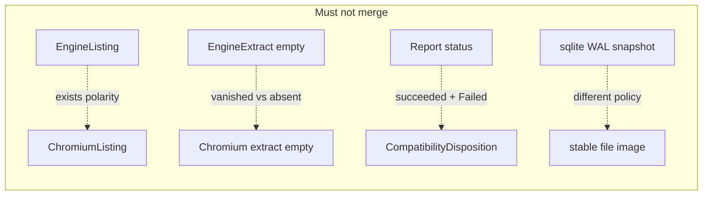

# After the type program: leftover leaks and remaining vocabulary

- **Author:** maintainers
- **Date:** 2026-08-19
- **Status:** Draft
- **Crate:** `rookie-rs` (workspace `/Users/blackmyth/src/rookie-cookies`)
- **Release context:** 0.6.0-beta.1 shipped. Internal structure, not a product feature.
- **Does not revive:** GitHub #260. No `foo.rs` → `foo/mod.rs`. No 600-line prod budget. No CI size lint. Module layout stays `foo.rs` + `foo/child.rs`.
- **ADRs:** 0001–0004 freeze behavior. ADR 0005 (`docs/adr/0005-stage-boundary-types-and-extraction-vocabulary.md`, workspace, Status: Accepted, 2026-08-19) is type-program law — listing/extract types, the fence, rejected `trait Engine` / `T<Stage>` / file-carve, and Decision 1: `Source` embeds `origin: SourceCandidate`. This program's first PR **amends ADR 0005 in place** with leftover leaks, remaining vocabulary, compatibility homes, and Mozilla origin follow-through. Do not mint ADR 0006. Do not rewrite 0005's locked type-program decisions.

Public freeze (do not lift — the DTO exception contemplated in Rev 9 was suspended in Rev 13, so there is no exception): `rookie-rs/public-api/*.txt`, report DTO + `schema/report-dto.schema.json`, `browser_registry.json`, ADR 0001–0004 **behavior**, listing `selected` / `acquisition` / `exists` bytes (frozen per engine), direct-path synthetic identities (`"0"*64` / `"1"*64` / `"display_name": "direct"`), `rookie-rs/tests/goldens/<os>/*.json` (re-golden only with explicit commit + reason). Named-API / characterization error text that goldens do not contain (`legacy.rs:601–624`, `report_build.rs:2576–2603`) is also frozen for this program.

---

## Overview

The stage-boundary **type program** is finished on `main` (`74eddeb`, `#270`–`#283` plus `#279`/`#280`/`#281`). `SourceCandidate` and `Source` are two concrete types; rustc, not a reviewer, forbids a listing from holding records; every engine's crate-visible result is `Source`; `report_build` copies through one `source_to_draft` / `profile_to_draft`; drafts are private to `report_build`; Gecko populate is candidate-driven; Safari inventory lives in `registry/safari.rs`; Chromium acquire options collapsed to `ChromiumAcquireOptions`; `check-stage-boundary` fences the split. The Progress paragraph in the committed `docs/design/stage-boundary-refactor.md` is stale.

ADR 0005 already locks that program, including Decision 1: `Source` embeds `origin` so provenance cannot drift. What remains is not a missing plugin trait and not a missing `T<Stage>` lattice. Two leftover leaks:

1. **Mozilla still forges `Source.origin`.** Chromium `into_source` (`chromium.rs:427–440`), `safari_source` (`safari.rs:128–135`), and production IE (`internet_explorer.rs:222`) use `Source::from_candidate`. Mozilla's `persistent_source` / `session_source` rebuild a candidate from path + constants (`mozilla.rs:816–828`, `869–879`). ADR 0005 Decision 1 is unimplemented for the last engine — but auditing the leak showed the accepted law is itself the wrong shape, so PR 1 amends it rather than finishing it.

   **Scope it honestly, and then fix the right thing.** The listing fields on `origin` — `selected`, `acquisition`, `exists` — have **zero readers in the crate** (Audit: Leftover 1). Only the identity join keys (`path` / `role` / `format` / `precedence`) are read, by `source_to_draft`, and Mozilla's forge already spells those correctly, so the drift this leak permits is unobservable today. That finding redirects the remedy: rather than teach the fourth engine to embed a whole candidate, **`Source` should embed only the candidate's identity** (Decision 17). The same three fields stay live on `SourceCandidate`, where the listing wire reads them; they become unrepresentable on `Source`, where nothing does; and the effective values become required constructor arguments, so the silent-default hazard turns into a compile error. Mozilla's forge then has nothing left to forge.
2. **Family-fallback *strings* are still keyed off generated English.** Detection of all-rows-rejected is already counters + issue codes (`records.is_empty() && rows_skipped > 0`, then ledger `all_rows_rejected` or `row_read_failed | column_read_failed | decode_failed | decrypt_failed` at `report_build.rs:1335–1364`). `.ends_with("row(s) could not be read")` (`:1371–1376`) only chooses whether to substitute a frozen family fallback or keep a custom diagnostic. That is policy-on-prose for product strings, not for the boolean.

There is also a third thing, cheaper than either and found while checking the first two: **`check-stage-boundary` is not wired into CI.** `.github/workflows/test-rust.yml:183` runs `check-cfg-locations` and nothing runs the fence, while the program record, ADR 0005, and this document's own Rollout Plan all describe it as a gate. The mechanism the type program ends with is currently a habit.

The next move is **amend ADR 0005 in place** (remaining vocabulary + these two homes) and wire the gate, not a second ADR and not a second type program. Hygiene (inline tests, `_with_runtime` convenience wrappers, `escape_like_pattern` twins, optional Chromium bag rename) is real and parallel-safe after that amendment; it is not the disease.

---

## Background & Motivation

### What the tree is today

`git log` on committed `main` through `74eddeb`:

| Landed | What it actually did |
| --- | --- |
| #270 | Goldens + Safari/IE push-after-query + cookies-branch delete |
| #271 | `SourceCandidate` / `Source` / `EngineListing` / `EngineExtract` |
| #272 | Chromium engine returns `Source`; `ChromiumProfileDraft` gone |
| #273 | `ChromiumKeyIdentity` |
| #275 | Mozilla / Safari / IE engines return `Source` / `MozillaExtract` |
| #276/#278 | Singleton direct-path + one `profile_to_draft` |
| #279 | Chrome profile selection through `match_profile_query` (stage-boundary optional PR C) |
| #280 | Safari inventory left the BinaryCookies decoder |
| #281 | Chromium `query_*` acquire cartesian collapsed to `ChromiumAcquireOptions` (optional PR A) |
| #282 | Mozilla session walk split; Gecko populate is candidate-driven |
| #283 | Report drafts private to `report_build` (not `report_core`) |

Workspace-only (untracked on this tree, not in committed `main`): `docs/adr/0005-stage-boundary-types-and-extraction-vocabulary.md` (Accepted) plus a pointer in `docs/design/stage-boundary-refactor.md`. Relative to this workspace that ADR is law. Relative to `main` it still needs to land; it is **not** vacant numbering for a new glossary.

`check-stage-boundary` (`xtask/src/stage_boundary.rs`) fences `SourceCandidate`, `Source`, `DiscoveredProfile`, `EngineListing`, `ChromiumProfile`, `ChromiumExtractedProfile`. Goldens live at `rookie-rs/tests/goldens/<os>/*.json`. Remaining optional follow-on from the stage-boundary **program record** is PR B (`#[path]` tests).

### Measured size (2026-08-19 `main`, first `#[cfg(test)] mod tests` split)

| File | Total | Prod | Tests | Test % |
| --- | ---: | ---: | ---: | ---: |
| `browser/mozilla.rs` | 5212 | 2583 | 2629 | 50.4% |
| `browser/registry/chromium.rs` | 4765 | 1464 | 3301 | 69.3% |
| `browser/chromium.rs` | 4188 | 1265 | 2923 | 69.8% |
| `browser/report_build.rs` | 4176 | 1962 | 2214 | 53.0% |
| `browser/registry.rs` | 3025 | 1735 | 1290 | 42.6% |
| `browser/registry/gecko.rs` | 2189 | 660 | 1529 | 69.8% |
| `common/sqlite.rs` | 2129 | 1021 | 1108 | 52.0% |
| `lib.rs` | 1868 | 1270 | 598 | 32.0% |
| `browser/registry/safari.rs` | 1869 | 914 | 955 | 51.1% |
| `browser/safari.rs` | 1733 | 847 | 886 | 51.1% |

`safari.rs` is 1733, not the 2079 in the stage-boundary program record — #280 moved Tabs.db inventory. Huge files are still mostly tests. That is a workbench fact, not an architecture fact.

### The pipeline that actually exists



**Today**, `origin` carries **listing** `selected` / `acquisition` / `exists`. `Source.selected` / `Source.acquisition` are **effective** values extract may overwrite. `source_to_draft` copies the effective fields (`report_build.rs:277–297`). `source_digest` hashes `browser_id`, `installation_id`, `profile_id`, role, format, precedence, and the raw path (`outcome.rs:377–398`) — not listing `selected`/`acquisition`. It is domain-separated by a `v1` tag, so a deliberate identity revision has a designed-in path (Decision 20a). After Decision 17 those listing fields leave `origin`; the pipeline arrows do not change. The types are below.

There is no edge from a listing type to `Source`. Chromium and Gecko/Safari/IE still use two bags after extract because **empty `sources` means the opposite thing** in the two towers. That disagreement is now an argument (`NoSources`), not a pair of mapper functions.

### Types today, and after this program

The [stage-boundary target class diagram](stage-boundary-refactor.md#target-class-diagram-end-state-post-pr-89) is still the listing/extract bags. This program does not reopen them. Chromium uses the same two leaves (`ChromiumProfile.persistent_candidates`, `ChromiumExtractedProfile.sources`); those bags are omitted here. What changes is the leaf — `Source.origin` stops being a whole candidate — and, one layer up, the private `SourceDraft` splits the same way (Decision 21).

**Today** (`74eddeb`, ADR 0005 Decision 1 as written). `Source` embeds a `SourceCandidate`, so listing fields are representable on an extraction result. Mozilla forges them. `from_candidate` seeds effective `selected` / `acquisition`. Listing and extract share one `SourceDraft`.



**After this program** (Decision 17 + Decision 21). `SourceCandidate` fields stay **flat** and gain `identity()`. `Source.origin` is a `SourceIdentity`, so a listing value cannot reach an extraction result. Effective `selected` / `acquisition` are constructor arguments; `from_candidate` is deleted. Listing drafts cannot name `failed` or `acquisition_strategy`. The wire types do not change.



What the two diagrams share, and must keep sharing: listing bags cannot name `Source`; extract bags are not listing returns; `CookieSourceDescriptor` never carries a read. What they do not share is the one field through which a `Source` could still reach listing state.

---

## Audit findings

Citations are `path:line` on 2026-08-19 `main` (`74eddeb`) unless noted as workspace-only. Prior-art claim tables that shaped earlier drafts are in [Appendix A](#appendix-a--prior-art-claim-tables); Key Decisions stand on the citations below.

### Type program: landed

- `SourceCandidate` has no `records` (`source.rs:27–40`). `DiscoveredProfile.candidates` is `Vec<SourceCandidate>` (`registry.rs:882–886`). Fence: `xtask/src/stage_boundary.rs:36–92`.
- Two dispatch sites, four engines: `collect_report` is `chromium` / `gecko` / `dispatch::remaining_engine_report` (`report_build.rs:694–727`); Safari/IE sit behind dispatch. Same shape in `legacy.rs:297–318`.
- `NoSources::{SourceVanished, AbsentUnlessFailed}` (`report_build.rs:246–260`); `ChromiumExtractedProfile` comment (`registry/chromium.rs:798–800`).
- Drafts private to `report_build.rs:152–459`. `report_core.rs` has no `SourceDraft`.
- Gecko populate is candidate-driven (`registry/gecko.rs:448–518`). `select_session_sources` is the single first-valid rule (`mozilla.rs:1006`).
- `finalize_singleton_source` / `direct_engine_extract` (`report_build.rs:1592–1650`).
- Fine-grained boundary traits **are implemented**: `Acquire` on `BrowserDatabaseAcquire` (`sqlite.rs:195`); `Decoder` on `ChromiumBoundaryDecoder`, both Mozilla decoders, `SafariBoundaryDecoder`, `InternetExplorerRecordDecoder`; `KeyProvider` on `SystemKeyProvider` and platform providers.
- `ChromiumAcquireOptions` collapsed acquire combinatorics (`chromium.rs:904–967`). Remaining `query_*` wrappers are projection × recovery × plaintext.
- `load_from_browsers` is `#[cfg(test)]` (`lib.rs:1086`). Production `load` uses `fan_out` (`lib.rs:1179–1190`).
- `mozilla::select_profile` is `#[cfg(test)]` (`mozilla.rs:2115`). `list_profiles_from_str` is production (`:2043`).
- `escape_like_pattern` is byte-identical in `chromium_decoder.rs:181` and `mozilla.rs:118`.
- ADR 0005 (workspace) already rejects `trait Engine`, file-carve, mixed listing/extract bags, and `T<Stage>`-shaped one-bag designs.

### Leftover 1: Mozilla origin (ADR 0005 Decision 1 unimplemented — and the law itself needs amending)

Mozilla `persistent_source` / `session_source` rebuild `SourceCandidate` and write the **effective** acquisition onto `origin` (`mozilla.rs:816–828`, `869–879`), even when `acquire_candidate_source_with_runtime` was handed a planted candidate (`:1153–1186`). Chromium `into_source` (`chromium.rs:427–440`), `safari_source` (`safari.rs:128–135`), and production IE (`internet_explorer.rs:222`, overlay at `:223–226`) use `Source::from_candidate`. `extracted_internet_explorer_source` (`registry/internet_explorer.rs:31–39`) is `#[cfg(test)]` only.

Gecko listing plants `exists: true`, `selected: false`, `acquisition: NotAttempted` (`registry/gecko.rs:49–54`). Mozilla extract overwrites `origin.acquisition` to `Database(...)` / `StableFileImage`.

`Source::from_candidate` still comments "Gecko's path/query populate builds `Source` directly" (`source.rs:214–215`). That comment is stale after #282; PR 1 must edit it.

**Blast radius of the forge: none today.** `rg 'origin\.(selected|acquisition|exists)' rookie-rs/src` returns **no hits outside `source.rs`**, and inside `source.rs` the only reads are `from_candidate` seeding the effective fields. `source_to_draft` reads `origin.path` / `origin.role` / `origin.format` / `origin.precedence` for `source_identity`, and takes the wire `selected` / `acquisition` from the effective fields (`report_build.rs:286–296`). Mozilla's forged candidate already carries the correct identity keys — persistent uses `PERSISTENT_SOURCE_PRECEDENCE` and `PERSISTENT_FORMAT_ID`, matching the gecko plant (`registry/gecko.rs:69–74`); session uses `session_candidate_precedence(index)` over `SESSION_CANDIDATES`, matching both the gecko plant (`:76–85`) and the direct-path probe (`mozilla.rs:985`).

So the forge cannot currently produce a wrong byte anywhere. What it produces is a second constructor for a type that has an accepted one, and three fields whose values disagree with the listing for no reader's benefit.

**The same three fields are live on the candidate side**, which is why the answer is not to delete them: `report_build.rs:644–645` and `:773–774` emit `candidate.selected` and `acquisition_code(candidate.acquisition)` to the listing wire, `:762` and `:1870` filter on `candidate.exists`, and `registry/chromium.rs:131`, `:139`, `:297–299` write then read both during Chromium discovery. Live on `SourceCandidate`, dead on `Source.origin`. Decision 17 narrows the dead position to a `SourceIdentity` and leaves the live one alone; PR 1 implements it.

### Leftover 2: compatibility family-fallback string selection

Detection (the boolean) is already:

```
records.is_empty() && rows_skipped > 0
  && ledger has all_rows_rejected
     or row_read_failed | column_read_failed | decode_failed | decrypt_failed
```

(`report_build.rs:1335–1364`). Chromium production attaches `SourceIssue::ALL_ROWS_REJECTED` (`chromium.rs:452–456`); `source_to_draft` lifts it into `CompatibilityEvidence` and does **not** push it as an extraction issue (`report_build.rs:328–331`, test `:3184–3202`). `all_rows_diagnostic` prefers that evidence map (`:1367–1368`) **before** the English rewrite.

`.ends_with("row(s) could not be read")` (`:1371–1376`) only chooses the diagnostic string: generic `push_row_read_failed(None)` message (`source.rs:271`) → family fallback; any other message kept verbatim.

Safari's arm (`:1459–1471`) never calls `all_rows_diagnostic`. Empty Safari records fail compatibility only via `source_failure` (parse/acquisition). `legacy_safari_projection_errors_when_every_embedded_nul_record_is_malformed` (`legacy.rs:628–638`) asserts `"c string contains embedded NUL"`.

Goldens under `rookie-rs/tests/goldens/` do not contain the family-fallback strings. The freeze that matters is characterization / named-API error text: `legacy.rs:601–624`, `report_build.rs:2576–2603`.

### Leftover 3: the last stage-mixed container is `SourceDraft`, and it is internal

**Corrected in Rev 10. The first version of this finding claimed the listing shape reaches the wire. It does not.** The corrected version is smaller, cheaper to fix, and needs no DTO change at all.

**What is true.** In listing mode, `engine_listing_outcome` (`report_build.rs:596`) → `discovered_profile_outcome` (`:623`) and `chromium_listing_outcome` (`:730`) each build a `SourceDraft` per candidate with `failed: false` (`:199`), `selected`, and `acquisition_code(candidate.acquisition)`. Of those, `failed` is purely extract-only — nothing has been opened, so `false` is an assertion nobody earned. `acquisition_strategy` is subtler: the listing *claim* is real (`NotAttempted` for Chromium/Gecko/IE, `StableFileImage` for Safari), it is simply not a fact about a read. PR 12 drops both from the listing draft, but for different reasons, and the distinction belongs in its description. `SourceDraft` is one internal type serving both stages, and it is the **last container in the pipeline where a listing value sits in an extract-shaped hole** — the thing `SourceCandidate` / `Source` fixed one layer down, unfixed one layer up.

**What is not true: it never reaches a consumer.** The listing drafts are consumed by `browser_profile_descriptors` (`report_build.rs:1801–1806`), which projects through `profile_descriptors_from_outcome` (`:1895`) to `ProfileDescriptor` / `CookieSourceDescriptor`. Both are clean — role, format, path, path_lossy, precedence, and nothing a read produces (`report_core.rs:306–312`). The projection deliberately drops what listing cannot carry; its own comment says so (`report_build.rs:1902–1904`, inside `profile_descriptors_from_outcome` — not a comment on `CookieSourceDescriptor` itself): *"The listing type cannot carry issues, so the ones that caused the loss are reported in the error rather than dropped at this boundary."*

Every `collect_report` caller that builds an `ExtractionReport` passes `extract = true`: the `browser_report` / `chrome_profile` / `extract_report` seam at `:1674`, and `load_extraction_report_with_runtime` at `:1742`. The only `extract = false` caller is the descriptor path (`:1805`). **So `status: "succeeded"` beside `acquisition_strategy: "not_attempted"` is never serialised.** The wire was right all along; `CookieSourceDescriptor` is exactly the distinct listing type this document was about to propose inventing.

**Consequences of the correction.** Fixing Leftover 3 needs no schema bump, no re-golden, no `public-api` update, and no DTO track — it is an internal draft split (Decision 21, PR 12) that belongs in the main program. Rev 13 found the same to be true of the direct-path synthetic identity, by the same method — no public API exposes it either — so Decision 20 is suspended and nothing in this program is DTO-shaped at all.

**A second correction to this document.** The pipeline description previously said `source_digest` hashes path/role/format/precedence. It also hashes `browser_id`, `installation_id`, and `profile_id` (`outcome.rs:377–398`), which is what makes the identity change a digest change. The hash is domain-separated by a version tag — `b"rookie-cookie-source\0v1"` — so the format anticipated exactly this revision.

### Severity is two-owned (keep)

Per-source: `Source.failure` / `push_row_read_failed` → report `status`. A source succeeds when acquisition, parsing/schema validation, and its filtered query finish, even if zero rows match (**ADR 0001 §5**). In-code comments say "Section 5.7"; that is commentary, not an ADR heading.

Per-browser: `compatibility_disposition` → `Emit` / `Absent` / `Failed` for named-API `Cookie[]`. A fully-rejected Chromium source is succeeded-for-report and Failed-for-compatibility.

### `_with_runtime` census

Counting rule: `rg -o --glob '*.rs' 'fn \w+_with_runtime'` under `rookie-rs/src` (includes `direct_path`, `sqlite`, platform dispatch copies). `remaining_engine_snapshot_with_runtime` counts four times (mod + macos + windows + other).

| Measure | Count |
| ---: | ---: |
| `fn …_with_runtime` definitions | **91** |
| Unique names | **86** |
| Same-file unsuffixed twins | **50** production-mod only / **56** counting twins defined inside `#[cfg(test)] mod tests` |
| Of those, unsuffixed is not `#[cfg(test)]` | **28** |

Re-measured 2026-08-19: definitions (91) and the load-bearing figure (28) reproduce exactly. Unique names is **86**, not the 88 published in Rev 2 — `rg -o 'fn \w+_with_runtime' src | sed 's/.*fn //' | sort -u | wc -l`. The twin count depends on whether a same-named `fn` inside the file's test module counts as the twin; say which rule you mean when quoting it.

The injection-shape law (suffix = production) is right; the earlier "77 / ~25" census was wrong (it dropped generic `fn foo_with_runtime<T>(` forms).

**The compiler will not help you find dead wrappers.** `chromium_listing` (`registry/chromium.rs:1368`) is a private, non-`cfg(test)`, unreferenced function — zero occurrences of the bare name anywhere in the workspace outside its own definition — and a cold `cargo check --locked` into a clean `CARGO_TARGET_DIR` completes with **zero warnings**. There is no `#![allow(dead_code)]` in `lib.rs` (only `allow(deprecated)`) and no `allow` in that file. Whatever the reason, dead-wrapper discovery is a grep discipline, not a lint the build performs for you; PR 7 must carry its own evidence per function.

---

## Language

Law: **one word, one meaning, one home.** A senior engineer should be able to lint a PR against this section.

Axes:

- **Aggregation** (what kind of thing): Catalog → Installation → Profile → Source → Record, under a Request.
- **Stage** — **only** the rustc splits: listing vs extract at Profile; candidate vs source at Source; decoded vs finalized at Record. Do not use "Stage" for pipeline phases.
- **Pipeline step** — the ordered verbs: resolve, discover, select, lookup, acquire, decode, unseal, finalize, project. These are not Stage modifiers and must not be written as `Catalog<Resolve>`.

Do **not** fill empty cells. There is no `Installation<Read>`, no `Source<Opened>`, no `Catalog<Canonical>`. Selection is a **policy**, not an aggregation noun. Keys are Chromium-only.

**Listing vs effective** (use these phrases in every signature comment):

| Phrase | Where it lives | Who writes it |
| --- | --- | --- |
| **Listing `selected` / listing `acquisition` / listing `exists`** | `SourceCandidate` **only** | Discover. Frozen per engine. After Decision 17 a `Source` cannot name these at all — `Source.origin` is a `SourceIdentity`, so "extract must not rewrite them" stops being a rule anyone can break. |
| **Effective `selected` / effective `acquisition`** | `Source.selected` / `Source.acquisition` | Extract states them as constructor arguments (Gecko persistent is selected; IE overlays `EseDatabase`; session first-valid). `source_to_draft` copies these. |

### Nouns

| Noun | One-sentence definition | Owner module | Must not contain | Current type name(s) | Stay / rename |
| --- | --- | --- | --- | --- | --- |
| **Catalog** | The compiled-in registry of browsers for this OS, with no disk I/O. | `registry.rs` | Paths that were stat'd; cookie records; key material | `RegisteredBrowser`, `BrowserDefinition`, `BrowserEngine` | Stay. Do not rename `BrowserEngine` → `EngineKind`. Public projection: `BrowserDescriptor` / `EngineId`. |
| **RegisteredBrowser** | One catalog entry after alias resolution: canonical id, engine tag, declared vs available tiers. | `registry.rs` | Filesystem state | `RegisteredBrowser` | Stay. |
| **Installation** | One owned canonical root of one registered browser. | Chromium: `registry/chromium.rs` (`BrowserInstallation`). Gecko/Safari/IE: fields on `EngineProfileIdentity`, **no shared type**. | Cookie records; key material (identity may live here) | `BrowserInstallation`; install fields on `EngineProfileIdentity` | Stay. Do **not** invent a shared `Installation`. |
| **Profile (inventory)** | A profile directory discovery found, with cookie-source candidates, before any cookie DB is opened for cookies. | Chromium: `ChromiumProfile`. Gecko/Safari/IE: `DiscoveredProfile`. | `Vec<Source>`, records, cookies | `ChromiumProfile`, `DiscoveredProfile` | Stay. |
| **Profile (selection)** | Which inventory profiles may be acquired. | `registry.rs` (`ProfileSelection`); `profile_query.rs` | Opened DBs; keys | `ProfileSelection::{AllProfiles, ProfileId, LegacyFirstProfile}` | Stay. |
| **Profile (wire)** | The DTO identity of a profile in a report or descriptor. | `report_core.rs` | Candidates, records | `ProfileIdentity`, `ProfileDescriptor`, `ProfileExtraction` | Stay. Frozen. |
| **SourceIdentity** | The join keys of one cookie source: path, role, format, precedence. What `source_identity` and `source_digest` are built from, and the only part of a candidate an extraction result carries. | `source.rs` | `selected`, `acquisition`, `exists`, records, stats, issues, failure | `SourceIdentity` (new, Decision 17) | Add. |
| **SourceCandidate** | A cookie source discovery found on disk. Listing reports it; extract consumes it. Its `identity` plus **listing** `selected` / `acquisition` / `exists`. | `source.rs` | records, cookies, stats, issues, failure | `SourceCandidate` | Stay. |
| **Source** | What came back from reading one candidate: `origin: SourceIdentity` + **effective** `selected`/`acquisition` + records + stats + optional failure + issues. | `source.rs` | `profile_id`, `installation_id`, `display_name`, `cookies` field, any listing field | `Source` | Stay. |
| **SourceIssue** | A fully-formed pre-report issue the engine/adapter attached. The mapper only copies. | `source.rs` | Cookie values; key bytes | `SourceIssue` | Stay. |
| **SourceStats** | Row accounting for one source, copied into `ExtractionStats` without recompute. | `source.rs` | — | `SourceStats` | Stay. |
| **SourceFailure** | Acquisition, parse, or query of this named source did not complete. | `source.rs` | Row skips (those are issues) | `SourceFailure` + `SourceFailureStage` | Stay. `SourceFailureStage` is a failure-kind enum, not the rustc Stage axis. |
| **SourceAcquisition** | One enum, two **homes**: listing claim on `candidate.acquisition`; effective how-we-opened on `Source.acquisition`. | `source.rs` | Journal-mode policy internals | `SourceAcquisition` | Stay as one type. Never say it is "one field with two jobs" without naming the home. |
| **CookieRecord** | Decode-time row, possibly still encrypted. | `cookie_record.rs` | Report identity | `CookieRecord` → `FinalizedCookieRecord` | Stay. |
| **ChromiumKeyIdentity** | Lookup coordinates for Chromium OS credentials. Never material. | `chromium_platform_keys` | Key bytes | `ChromiumKeyIdentity` | Stay. JSON field `key_credentials` is frozen. |
| **ChromiumKeyOutcomes** | Material: v10 / v11 / v20 outcomes. | `chromium_crypto` | Identity; cookie rows | `ChromiumKeyOutcomes` | Stay. |
| **EngineListing** | Gecko/Safari/IE listing bag. Cannot name `Source`. | `registry.rs` | `Vec<Source>` | `EngineListing` | Stay. |
| **EngineExtract** | Gecko/Safari/IE extract bag. Not a listing return. | `registry.rs` | Cookie fields beside the sources | `EngineExtract` | Stay. Adapter bag, not a "draft". |
| **Chromium extract bag** | Chromium's extract return. | `registry/chromium.rs` | Records beside the profile | Today: `ChromiumRegistryDraft`, `ChromiumInstallationDraft`, `ChromiumExtractedProfile` | Optional rename (Decision 7): `ChromiumExtract` / `ChromiumExtractedInstallation`. `ChromiumExtractedProfile` stays. |
| **Outcome** | Canonical finalized extraction. | `outcome.rs` | Engine bags; discovery | `Outcome`, `SourceOutcome` | Stay. |
| **ExtractionReport** | Frozen grouped-report DTO. | `report_core.rs` | Internal drafts | `ExtractionReport`, `ProfileExtraction`, `SourceExtraction` | Stay. Frozen. |
| **Cookie** | Frozen eight-field compatibility cookie. | `common/enums.rs` | Provenance, container, ciphertext | `Cookie`, `DetailedCookie` | Stay. Frozen. |
| **ReadResult** | ADR 0004 unfiltered snapshot + structured warnings. | `read.rs` | Report grouping | `ReadResult`, `ReadWarning` | Stay. |
| **CompatibilityFamily** | Which compatibility source-set rule and fallback string apply to one browser id. | Today: `report_build.rs`. Home after PR 4: `browser/compatibility.rs` (not `outcome.rs`). | Extraction `status` | `CompatibilityFamily::{Chromium,Gecko,Safari,InternetExplorer}` | Stay as a noun; **move** to the sibling. |
| **CompatibilityDisposition** | What the legacy `Cookie[]` projector should do. | `outcome.rs` | Report `status` | `CompatibilityDisposition`, `CompatibilityDecision` | Stay. |
| **CompatibilityEvidence** | Typed fact a source carries for compatibility only. Chromium-only `AllRowsRejected` today. Never an extraction issue. | `report_build.rs:205` | Wire issue list | `CompatibilityEvidence` | Stay. Do not attach `ALL_ROWS_REJECTED` on Safari/Gecko/IE. |
| **BoundaryRuntime** | Shared deadline + cancellation budget for one request. | `common/deadline.rs` | — | `BoundaryRuntime`, `BoundaryStop` | Stay. |
| **BrowserDatabaseFailure** | Typed SQLite acquire/query/retry context in the `anyhow` chain. | `common/sqlite.rs` | Report issue codes | `BrowserDatabaseFailure`, `BrowserDatabaseFailureKind` | Stay. |
| **DatabaseAcquisitionStrategy** | How the SQLite layer actually opened this attempt. | `common/sqlite.rs` | Non-SQLite engines | `DatabaseAcquisitionStrategy` | Stay. |
| **ReadOnlySource** | Marker for an **opened capability** (connection, bytes) that a `Decoder` may read. | `common/boundary.rs` | Cookie records; report identity | trait `ReadOnlySource` | Stay. **Not** `Source`. |
| **MozillaProfile** | Public persistent-only Firefox profile projection. | `mozilla.rs` | Session-only profiles; registry ids | `MozillaProfile` | Stay. Frozen public. |
| **SafariProfile** | Private Safari inventory row. | `registry/safari.rs` | BinaryCookies parse | `SafariProfile` | Stay. |
| **Request** | Public extract job. | `lib.rs` | — | `Request` | Stay. Distinct from `ReadRequest`. |

### Verbs

The **Pipeline step** column is not Stage.

| Verb | Definition | Pipeline step | Input → output | Allowed module | Forbidden aliases |
| --- | --- | --- | --- | --- | --- |
| **resolve** | Map a browser id/alias to a catalog entry, or a profile query to a unique opaque id. | catalog / selection | `&str` → `RegisteredBrowser`; `(browser, query)` → `ProfileId` | `registry.rs::resolve_registered_browser`; `profile_query.rs` | Not "query" except the public argument name (frozen) and SQL. |
| **discover** | Find installations/profiles/candidates on disk. May read inventory metadata. Must not open a cookie DB for cookies. | inventory | catalog + `DiscoveryFs` → listing bag | `registry/{chromium,gecko,safari,internet_explorer}.rs` | Not the internal verb `populate` (historical identifier; see collisions). Not `query`. |
| **select** | Narrow a listing to the profiles this request may acquire. Must not acquire or decrypt. | selection | listing + `ProfileSelection` → same listing, fewer profiles | `select_listing_profiles`; Chromium selection inside extract; `match_profile_query` | Not `query`. `mozilla::select_profile` is test-only. |
| **lookup** | Retrieve Chromium key material from identity. Must not parse cookies. | keys | identity + installation → `ChromiumKeyOutcomes` | `chromium_platform_keys`, `KeyProvider` | Not `project`. |
| **acquire** | Make one candidate readable and produce a `Source` (or `Err` meaning no source came back). | source work | `SourceCandidate` + runtime (+ Chromium keys) → `Source` or `MozillaCandidateOutcome` | Engine modules; sqlite `Acquire` for the DB capability | Internal verb is `acquire`. Historical identifiers `query_cookies_engine_outcome_with_runtime` / `populate_*_sources` stay until an optional later rename (not this program). |
| **decode** | Turn an opened capability into `CookieRecord`s. Key-free. | source work | `ReadOnlySource` → records + summary | decoder modules; `boundary::decode` | Not crate-visible `parse` (that is a `SourceFailureStage` / wire stage). |
| **unseal** | Combine ciphertext-bearing records with `ChromiumKeyOutcomes`. | source work | `CookieRecord` + keys → `CookieRecord` | `unseal.rs` | Wire stage stays `decrypt`. |
| **finalize** | Assign provenance, fold drafts into `Outcome`, compute `status` vs `termination`. Must not rediscover. | result | drafts / singleton sources → `Outcome` | `outcome.rs`; `report_build::finalize_outcomes*`; `finalize_singleton_source` | Not `canonical_*_extraction` (deleted). |
| **project** | Last pipeline step only: `Outcome` → public type. | result | `Outcome` → `ExtractionReport` / `Cookie[]` / `ReadResult` | `report_build::project_canonical_report*`; `legacy.rs`; `read.rs` | Not key-identity mapping. |
| **list** | Public: `browser_profiles` / `chrome_profiles` / `firefox_profiles`. Internally: discover + listing projection. Never constructs `Source`. | inventory → wire | browser id → descriptors | `collect_report(..., extract=false)` | Not extract. |
| **extract** (public) | Public job name. Internally: discover + select + lookup + acquire + finalize + project. | whole pipeline | `Request` → `Cookie[]` / `ExtractionReport` | `lib.rs` | Internal code says acquire/decode/unseal. |
| **assemble** | Fold per-browser drafts into one report (finalize + project). | result | `Vec<BrowserDraft>` → `ExtractionReport` | `report_build.rs` | Not discover. |
| **dispose** (compatibility) | Decide `CompatibilityDisposition` for one browser family from a finalized `Outcome`. | result (compatibility projection) | `Outcome` + family + evidence → `CompatibilityDisposition` | Target: `browser/compatibility.rs`. Today: `report_build::compatibility_disposition` | Not `discovery_severity`. Not `push_row_read_failed`. |

### Collision resolutions

| Word | Meanings found | Law |
| --- | --- | --- |
| **Draft** | (1) File-private parse scratch. (2) Report adaptation hop, private to `report_build`. (3) Adapter extract bags still named Draft: `ChromiumRegistryDraft`, `ChromiumInstallationDraft`. | (1) Stay, never leave the file. (2) Stay in `report_build`, never `report_core`. (3) Optional rename (Decision 7) — hygiene, not a leftover leak. |
| **query** | SQL `WHERE`; leftover internal `query_cookies_*` names; ADR 0003 profile query string; frozen wire `ExtractionStageCode::query()`. | ADR 0005 deleted `query` as an internal name except SQL. **This program keeps the current function names as historical identifiers.** An optional later rename may align `query_cookies_engine_outcome_with_runtime` with `acquire`. Wire `query` is not renamed. Profile matching is `select` / `resolve`. |
| **populate** | ADR 0005 deleted `populate` as an internal name. Today's `populate_*_sources` is the adapter listing→extract loop. | **Historical identifier.** Verb is the adapter acquire loop. This program does not rename `populate_gecko_sources` / `populate_safari_sources` / `populate_internet_explorer_sources`. |
| **extract / acquire** | Public job vs internal source work. | Public: `extract`. Internal: `acquire`. |
| **canonical** | Browser id; install realpath; deleted `canonical_*_extraction`. | Browser id and install realpath stay. Finalize is `Outcome::finalize`. |
| **project** | Last pipeline step only. | `Outcome` → public type. |
| **Profile** | Eight names, eight jobs. | No shared `Profile`. Say "inventory profile" / "selection" / "wire profile". |
| **Source vs SourceCandidate vs SourceDraft vs SourceOutcome vs SourceExtraction vs ReadOnlySource** | Six types, six jobs. | Candidate = inventory leaf (listing fields). Source = post-unseal work (effective fields). SourceDraft = private report hop. SourceOutcome = finalized canonical. SourceExtraction = wire. ReadOnlySource = opened capability marker. |
| **engine** | Catalog discriminant (`BrowserEngine`); registry string; public `EngineId`; engine source file; "engine listing" = Gecko/Safari/IE bags. | Catalog: `BrowserEngine`. Wire: `EngineId`. Files: `chromium.rs` / `mozilla.rs` / `safari.rs` / `internet_explorer.rs`. Bags: "Gecko/Safari/IE adapter" vs "Chromium adapter". |
| **selected / acquisition** | Listing vs effective. | Always qualify: **listing** `candidate.selected` / `candidate.acquisition`; **effective** `Source.selected` / `Source.acquisition`. After Decision 17 a `Source` cannot name a listing value at all, so the qualification is only needed where both types are in scope. Do not unify listing bytes across engines. |
| **origin** | (1) `Source.origin` — which cookie source this result came from. (2) `CookieRecord.origin: SourceRef` — a row's back-reference, set as `SourceRef::pending(ordinal)` during decode (`safari.rs:192`, `mozilla.rs:163`, `:686`) with a zero digest that `assign_provenance` fills in later (`outcome.rs:275–280`). | Two levels of the same relation, source-level and row-level, and the types differ (`SourceIdentity` vs `SourceRef`). Keep both names; do not introduce a third `origin`, and never write `origin` unqualified in a doc comment where both are in scope. |
| **Stage** | rustc splits only. | Not pipeline steps. Not `SourceFailureStage` (that stays a failure-kind name). |

---

## Goals & Non-Goals

### Goals

- Amend **ADR 0005 in place** with leftover vocabulary and homes. The existing ADR remains already-accepted type-program law (two concrete types, fence, no `trait Engine`, no `T<Stage>`). Do not mint ADR 0006.
- Make `check-stage-boundary` an actual CI gate, so the fence three documents describe as mechanical stops being a habit.
- Narrow `Source.origin` to a `SourceIdentity` (Decision 17), which absorbs Mozilla's forge and makes effective values required constructor arguments.
- Collapse the duplicated engine execution frame — three populate skeletons and two verbatim-duplicated helpers — without pretending Mozilla's acquisition policy is the others' (§13).
- Cost the from-scratch direction and record it, rather than foreclosing it by omission (§14, Decisions 18–21).
- Replace `.ends_with` family-fallback selection with equality against the exact `push_row_read_failed(None)` generator. Detection stays counters + codes. Characterization tests stay byte-identical.
- Move compatibility dispose out of `report_build` so that file owns assembly, not product-string policy.
- Optionally, as workbench after the ADR 0005 amendment: Chromium bag rename, `#[path]` test extraction, `escape_like_pattern`, cfg(test) dead unsuffixed wrappers.

### Non-goals

- No second type program. No `T<Stage>`. No shared `Installation` / `Profile`. Decision 17's `SourceIdentity` is a narrowing *inside* the accepted program — one struct extracted from an existing one, no new stage, no new generic — not a reopening of it.
- No `trait Engine`.
- No `common/fs`. No split of `common/sqlite.rs`.
- No public API, DTO, golden, registry, or ADR 0001–0004 behavior change, in any unit. The DTO revision was accepted in principle and then suspended for want of a demonstrated public payload (Decision 20). **No unit may re-golden.**
- No rename of historical `populate_*` / `query_cookies_engine_outcome_with_runtime` in this program.
- No `foo.rs` → `foo/mod.rs`. No 600-line budget. No CI size lint. No revival of #260.
- No churn of deprecated `lib.rs` named shims.
- No unifying the two listing towers' **bytes or semantics**: Chromium keeps skipping `!exists`, engine listing keeps planting `exists: true`, and empty `sources` keeps meaning opposite things (§12). Sharing the *mechanism* that walks them is a different question, is not forbidden here, and is costed in §13–§14 — the earlier flat "no unifying the listing towers" foreclosed a direction nobody had priced, which is not what a non-goal is for.
- No attaching `ALL_ROWS_REJECTED` on Safari, Gecko, or IE.
- No changing the Safari compatibility arm.
- No moving report drafts into `report_core`.
- No relocating the acquire loop into `collect_report`.

---

## Proposed Design

### 1. Architecture status

**Type program finished; ADR 0005 Decision 1 is both unimplemented on Mozilla and mis-specified (Decision 17); compatibility string selection still prose.** Not broken. Not mid-refactor of the listing/extract types. The stage-boundary "drafts live in `report_core`" item is rejected (Decision 5); #283's home is the end state.

### 2. The next move

**Amend ADR 0005 — including Decision 1 itself — then `SourceIdentity` (which implements the amendment, not the original text), then the compatibility string rule + move dispose.** Dedupe work runs in parallel.

Not a new type program and not a new ADR number. Order is load-bearing: without the 0005 amendment a hygiene PR will rename `EngineExtract` to `Profile<Read>`.

### 3. Parallel concrete types, not `T<Stage>`

Unchanged from ADR 0005. `SourceCandidate` / `Source` stay two types. `EngineListing` / `EngineExtract` stay two types. rustc-illegal-states wins over container reuse. A `Profile<Source>` listing is representable; two types plus the fence are the enforcement. Before/after class diagrams: [Types today, and after this program](#types-today-and-after-this-program).

### 4. `trait Engine` is a mistake

A contract exists. It is a **documented free-function checklist**, not a trait. Writing it as a trait would force a common `Listing` associated type, which is exactly the unification ADR 0005 forbids.

#### Engine checklist (normative)

An engine is one of `chromium` | `gecko` | `safari` | `internet_explorer`. It must provide:

**Discover** (no cookie-DB-for-cookies): listing bag that cannot name `Source`; plant `SourceCandidate`s with that engine's frozen listing `selected` / `acquisition` / `exists`. Chromium lists only databases that exist (`chromium_listing_outcome` skips `!exists`, `report_build.rs:762–764`). Gecko/Safari/IE plant `exists: true`.

**Select** (no acquire, no decrypt): honor `ProfileSelection` before any cookie source is opened. Public profile query strings go through `match_profile_query` only.

**Lookup** (Chromium only, no cookie parse): identity on the installation; material via `KeyProvider`.

**Acquire**: input is a `SourceCandidate` (not a bare path), plus `BoundaryRuntime`, plus Chromium keys when needed. Output is `Source` whose `origin` is that candidate's **identity** (or the probe candidate's, when listing planted none — `persistent_probe_candidate`, `registry/gecko.rs:422`), with effective `selected` and `acquisition` stated as arguments. `Err` means no source came back. `Source.failure` means the named source was attempted and failed. Session first-valid stays `SESSION_CANDIDATES` + `select_session_sources`.

**Adapter bag**: Gecko/Safari/IE `EngineExtract`, 1:1 with the post-select listing; empty `sources` is vanished → `NoSources::SourceVanished`. Chromium extract bag; empty `sources` is absence unless `ChromiumExtractedProfile.failure` is set → `NoSources::AbsentUnlessFailed`.

**Do not provide:** `fn issue_severity` (two times, two owners); `fn compatibility` (projection of `Outcome`).

Two dispatch sites, four engines, remain acceptable.

### 5. What `report_build.rs` still owns

**Allowed:** `collect_report` match arms (including dispatch); orchestration; second profile-id check for compiled-out adapters (`report_build.rs:1686–1698`); private drafts and copy helpers; finalize hand-off and project; `finalize_singleton_source`; `discovery_severity` / `discovery_issue`; `NoSources`.

**Must leave:** `compatibility_disposition`, `compatibility_decision`, `engine_compatibility_family`, the family-specific product strings, and the generic-message equality helper once it exists. Target: **`browser/compatibility.rs`**. Not `report_core`. Not `outcome.rs`. Not the engine files.

**Why the types stay in `outcome.rs` while the policy moves.** After PR 4 the word "compatibility" has two homes — `CompatibilityDisposition` / `CompatibilityDecision` in `outcome.rs`, the policy that produces them in `compatibility.rs` — and this document's law is one word, one home. The split is deliberate and the line is *result vs projection of a result*: `outcome.rs` owns the finalized canonical extraction and the vocabulary any projection of it answers in, exactly as it owns `Termination` and `ResultStatus` without owning the report that renders them. `compatibility.rs` owns one projection — which browser families exist, which source-set rule each takes, and which product string each emits — and that is the half that changes when a browser is added. Moving the enums along with it would make `outcome.rs` depend on a projection to describe its own result. The test for a future contributor: a *value* every projection may name goes in `outcome.rs`; a *rule* only the legacy `Cookie[]` projection applies goes in `compatibility.rs`.

### 6. `common/sqlite.rs` does not get split

| Kind | Test | Lives in |
| --- | --- | --- |
| **SQLite** | Journal mode, WAL snapshot, `immutable=1`, live rollback-journal read, retry-on-classified-corruption. | `common/sqlite.rs` |
| **fs** | Generic path/metadata/copy with **no** journal-mode policy. | Caller's module. We do not share a policy, so no `common/fs`. |
| **Report vocab** | Issue codes, stages, severities, DTO types. | `report_core` / `source` / `report_build`. Already true (zero hits in sqlite). |

Mozilla/Safari stable-image readers are engine acquire policies, not sqlite.

### 7. Deprecated `lib.rs` shims

**Do not touch.** Frozen compatibility surface. `load_from_browsers` is already test-only.

### 8. `_with_runtime` injection shape

**Law:** the function that takes `&BoundaryRuntime<'_>` is the production function. Its name ends `_with_runtime` (or, for new code, takes the runtime and has no unsuffixed twin). The unsuffixed name, if it exists, constructs `SystemClock` + `BoundaryRuntime::standard`.

Census: **91** definitions, **50** same-file unsuffixed twins, **28** of those not `#[cfg(test)]` (rule in Audit). After #281 there is no Chromium acquire cartesian to kill.

Optional hygiene (PR 7): start with wrappers `rg` proves have **no production and no test callers**, and **delete** those rather than `cfg(test)` them — an attribute that hides a function from production leaves it dead in test builds, which is the stricter gate. First example: `chromium_listing` (`registry/chromium.rs:1368`) — non-`cfg(test)` standard-runtime wrapper, zero in-tree callers, delete. `gecko_report` unsuffixed (`gecko.rs:536`) has no production callers (`test_seams::gecko_report` is a different function); if tests call it, `cfg(test)` is right there. `acquire_candidate_source` unsuffixed **does** have callers (`gecko_report_with_context` at `gecko.rs:388` plus gecko tests) — keep it, or retarget the seam at `_with_runtime`; do not `cfg(test)` it.

Public deprecated functions (`firefox_based`, `safari_based`) **must** keep constructing a default runtime.

### 9. Homes map

| Noun / verb | Owner | Must not appear in |
| --- | --- | --- |
| Catalog, `resolve`, `ProfileSelection`, `DiscoveryFs`, ids | `registry.rs` | `report_build`, engines |
| `EngineListing` / `EngineExtract` / `DiscoveredProfile` / `ExtractedProfile` | `registry.rs` | `source.rs`, `report_core.rs` |
| Chromium inventory, listing, extract bag | `registry/chromium.rs` | `report_build`, `chromium.rs` (except acquire) |
| Gecko inventory + adapter loop | `registry/gecko.rs` | `mozilla.rs` decode |
| Safari inventory | `registry/safari.rs` | `safari.rs` |
| IE inventory | `registry/internet_explorer.rs` | ESE model |
| ADR 0003 matcher | `profile_query.rs` | key providers, records |
| `SourceCandidate`, `Source`, issues, stats, failure, acquisition enum | `source.rs` | catalog, profile identity |
| `CookieRecord` / `FinalizedCookieRecord` | `cookie_record.rs` | report identity |
| path+keys → `Source` | `chromium.rs` | report identity |
| sqlite + session decode, `SESSION_CANDIDATES`, `MozillaProfile`, `list_profiles_from_str` | `mozilla.rs` | registry ids, report mapping |
| BinaryCookies decode | `safari.rs` | Tabs.db |
| ESE walk | `internet_explorer.rs` + `internet_explorer_model.rs` | registry ids |
| `Acquire` / `Decoder` / `KeyProvider` / `RecordSink` | `common/boundary.rs` | — |
| WAL/live/immutable | `common/sqlite.rs` | report vocab |
| `Outcome`, `CompatibilityDisposition` | `outcome.rs` | engine bags |
| Compatibility family + dispose | **new** `browser/compatibility.rs` | `report_build` (after the move), engine files |
| Wire DTO + `issue` / `push_aggregated` | `report_core.rs` | engine types, drafts |
| `collect_report`, drafts, copy helpers, finalize, project | `report_build.rs` | compatibility product strings (after the move) |
| `LegacyFirstProfile` + `Cookie` projection | `legacy.rs` | paths, credentials |
| `read` / `from_path` / `ReadResult` | `read.rs` | discovery |
| Public named shims | `lib.rs` | new logic |

### 10. `SourceIdentity`, and Mozilla stops forging (PR 1 specification)

Decision 17 is the rule; this is how it lands. Two halves, one PR, in this order.

#### 10a. Split the identity out

```rust
/// The join keys. What `source_identity` and `source_digest` are built from,
/// and the only part of a candidate an extraction result may carry.
#[derive(Debug, Clone, PartialEq, Eq)]
pub(crate) struct SourceIdentity {
  pub(crate) path: PathBuf,
  pub(crate) role: CookieSourceRoleId,
  pub(crate) format: CookieSourceFormatId,
  pub(crate) precedence: u16,
}

// Fields stay flat (Decision 17): nesting would touch 28 production field
// reads plus every plant, for no gain the objective needs.
pub(crate) struct SourceCandidate {
  pub(crate) path: PathBuf,
  pub(crate) role: CookieSourceRoleId,
  pub(crate) format: CookieSourceFormatId,
  pub(crate) precedence: u16,
  pub(crate) exists: bool,
  pub(crate) selected: bool,
  pub(crate) acquisition: SourceAcquisition,
}

impl SourceCandidate {
  pub(crate) fn identity(&self) -> SourceIdentity { /* … */ }
}

pub(crate) struct Source {
  pub(crate) origin: SourceIdentity,
  pub(crate) selected: bool,
  pub(crate) acquisition: SourceAcquisition,
  // records, stats, acquisition_attempts, diagnostics, failure, issues …
}

impl Source {
  /// Effective values are arguments, never inherited. A caller that knows only
  /// the candidate writes `Source::new(c.identity(), c.selected, c.acquisition)`
  /// and the inheritance it used to get for free is visible in the diff.
  pub(crate) fn new(
    origin: SourceIdentity,
    selected: bool,
    acquisition: SourceAcquisition,
  ) -> Self;
}
```

`Source::from_candidate` is deleted. `source_identity(path, role, format, precedence)` becomes `source_identity(&SourceIdentity)`. **`source_digest` keeps its current three typed arguments** and keeps hashing the profile ids (`outcome.rs:377–398`) — it is not part of this change.

**The transformation is mechanical and must stay that way.** At each of the seven production sites, `from_candidate(c)` becomes `Source::new(c.identity(), c.selected, c.acquisition)` and every existing overwrite stays exactly where it is. That is byte-identical by construction.

**All seven inherit `selected`; not one of them overwrites it.** Three overwrite `acquisition`. Verified site by site:

| Site | Overwrites | Inherits | Note |
| --- | --- | --- | --- |
| `chromium.rs:440` (`into_source`) | `acquisition` | `selected` | |
| `safari.rs:135` (`safari_source`) | neither | both | |
| `internet_explorer.rs:222` | `acquisition` (`EseDatabase`) | `selected` | |
| `registry/chromium.rs:1103` | `acquisition` (from the failure's strategy) | `selected` | failure path |
| `registry/safari.rs:424` | neither | both | placeholder, **discarded** in the `Ok` arm; the seed reaches the wire only on `Err` |
| `registry/internet_explorer.rs:224` | neither | both | same placeholder-then-discard shape |
| `mozilla.rs:1176` | neither | both | unrecognized-session-format guard; the failed source is still reported |

Because no site overwrites `selected`, the mechanical rule is exactly right at all seven and needs no per-site judgment. The placeholder sites deserve one note: `Source::from_candidate(candidate.clone())` is built and then thrown away whenever the query succeeds, so under `Source::new` the construction could move into the `Err` arm and stop allocating on the success path. **Do not do that here** — it is an optimization, not the refactor, and mixing it in forfeits the byte-identical property. Record it as a follow-up.

Deleting `from_candidate` also breaks **five test sites** (`report_build.rs:2504`, `:2577`, `:3030`, `:3217`; `registry/gecko.rs:1893`) and the `#[cfg(test)]` helper `extracted_internet_explorer_source` (`registry/internet_explorer.rs:39`). They convert by the same rule; they are in Commit A's file list, and they are why "seven sites" describes production only.

Do **not** "clean up" any of those pass-throughs in this PR. Making the inheritance visible is the deliverable; questioning each one is a later, separate conversation with a golden diff attached.

**Fence:** add a `SourceIdentity` entry to `xtask/src/stage_boundary.rs` forbidding `selected`, `exists`, `acquisition`, `records`, `cookies`, `stats`, `issues`, `failure` — reason: *identity is the join keys; stage state belongs to the candidate or the source that owns it*. The existing `SourceCandidate` and `Source` fences are unchanged and still apply.

#### 10b. Mozilla stops forging

With 10a in place this is small: Mozilla's two constructors take a `SourceIdentity` instead of building a `SourceCandidate` from path + constants, and the listing fields they used to forge no longer exist in that position, so there is nothing left to get wrong.

Direct-path **persistent** is not a listing: the caller named `cookies.sqlite`, so effective `selected` is `true`. Direct-path **session** leaves get their effective `selected` from first-valid after the read, exactly as the registry walk does. Neither needs a synthetic candidate any more — a direct path has no listing, and with identity-only origins it no longer has to pretend it does. `direct_path_persistent_candidate` is not written; `chromium.rs:585` and `internet_explorer.rs:88` become `SourceIdentity` constructors on the same lines.

#### Listing candidates are unchanged

`SourceCandidate` keeps all three listing fields and every engine keeps planting them exactly as it does today — that is the half of the type with live readers, and its bytes are frozen per engine.

| Plant | `exists` | `selected` | `acquisition` |
| --- | --- | --- | --- |
| Gecko listing (`registry/gecko.rs:38–55`) | `true` | `false` | `NotAttempted` |
| Gecko persistent probe (`persistent_probe_candidate`, `:422–431`) | `identity.persistent_source_discovered` | `false` | `NotAttempted` |
| Chromium listing (`registry/chromium.rs:297–299`, plant at `:310–319`) | stat result | `exists && !already_selected` | `NotAttempted` — Chromium never freezes a strategy at listing time |
| Safari listing | `true` | per engine | `StableFileImage` |
| IE listing (`registry/internet_explorer.rs:149–158`) | `true` | per engine | `NotAttempted` |

**Direct paths no longer construct candidates at all.** A caller who names a file did no discovery, so there is no listing to describe; today's synthetic candidates exist only to feed `origin`, and once `origin` is a `SourceIdentity` they have nothing left to carry. **All three** existing direct-path constructors become `SourceIdentity` constructors — `chromium.rs:585`, `safari.rs:86`, and `internet_explorer.rs:88` — `mozilla::direct_path_persistent_candidate` is never written, and the `exists`-means-two-things problem those plants introduced disappears rather than being documented around.

#### Effective values, stated at every construction site

| Engine | effective `selected` | effective `acquisition` |
| --- | --- | --- |
| Chromium (registry) | `candidate.selected` | from `DatabaseAcquisitionStrategy` |
| Chromium (direct path) | `true` | from `DatabaseAcquisitionStrategy` |
| Gecko persistent | `true` — a profile's authoritative store is always selected | `Database(…)` |
| Gecko session | first-valid, via `select_session_sources` | `StableFileImage` |
| Safari | `candidate.selected` | `StableFileImage` |
| IE | `candidate.selected` | `EseDatabase`, once a query has been attempted |

#### Signatures

```rust
pub(crate) fn acquire_persistent_source_with_runtime(
  origin: SourceIdentity, // was: db_path: &Path
  domains: Option<&[String]>,
  runtime: &BoundaryRuntime<'_>,
) -> Result<Source, BoundaryStop>;

pub(crate) fn acquire_session_source_with_runtime(
  origin: SourceIdentity, // was: path + format + precedence
  domains: Option<&[String]>,
  runtime: &BoundaryRuntime<'_>,
) -> MozillaCandidateOutcome;

// Both twins. gecko_report_with_context (gecko.rs:388) calls the unsuffixed
// one; it takes the candidate because the registry walk still needs the
// listing fields to decide what to acquire — it passes `.identity` inward.
pub(crate) fn acquire_candidate_source(
  candidate: &SourceCandidate,
  domains: Option<&[String]>,
) -> MozillaCandidateOutcome;

pub(crate) fn acquire_candidate_source_with_runtime(
  candidate: &SourceCandidate,
  domains: Option<&[String]>,
  runtime: &BoundaryRuntime<'_>,
) -> MozillaCandidateOutcome;

fn persistent_source(origin: SourceIdentity, draft: MozillaPersistentDraft) -> Source;
fn session_source(origin: SourceIdentity, draft: MozillaSessionDraft) -> Source;
```

`query_cookies_engine_outcome_with_session_probe` (`mozilla.rs:949`) currently calls `acquire_persistent_source_with_runtime(db_path, …)` and `session_outcome_from_probe(path, format, precedence, probed)`. It builds a `SourceIdentity` from `db_path` and one per `SESSION_CANDIDATES` entry — the same `session_candidate_precedence(index)` it already passes (`mozilla.rs:985`) — and calls the identity-taking functions. No path-taking overload survives.

Must-edit: `source.rs:214–215` (stale "Gecko's path/query populate builds `Source` directly").

#### What can still break goldens

The silent-default failure is gone: with `selected` and `acquisition` as required arguments, an omission does not compile. Two hazards remain, both loud.

1. **Passing the wrong value at a site that used to inherit.** The three sites in the 10a table are where to look. Each must pass `candidate.selected`, not `true`, not `false`.
2. **Gecko persistent is the one place where effective disagrees with the plant.** The listing plants `selected: false`; the persistent source is `selected: true` (`mozilla.rs:829`, and the reason is in that function's doc comment — a profile's authoritative store is always its selected source). Mechanically threading `candidate.selected` there would flip every Gecko persistent source's wire `selected` to `false`. It is the single site in the PR where the pass-through rule does *not* apply, and the review should confirm it by name.

`source_to_draft` sends effective `selected` / `acquisition` to the wire (`report_build.rs:294–296`) and identity from `origin` (`:286–293`), so those two hazards plus the join keys are the complete set of golden-visible surface.

#### Tests

Structural, on the type:

- `Source` has no way to name a listing field — a compile-fail test, or the fence entry from 10a, which is cheaper and already runs.
- The identity of a `Source` built from a candidate equals `candidate.identity`.

Behavioural, on the wire, per engine:

- Gecko persistent: effective `selected == true`, `acquisition` is `Database(…)`.
- Gecko session, winning candidate: effective `selected == true`, `acquisition == StableFileImage`; losing candidate `selected == false`.
- Chromium, Safari, IE: effective `selected` equals the listing candidate's, and IE's `acquisition` is `EseDatabase` after a query.
- Goldens byte-identical on every OS in the matrix.

**Do not change** `select_session_sources` or `SESSION_CANDIDATES` order (ADR 0001 §8).

### 11. Compatibility string rule (locked)

Detection stays as today. String selection changes. Safari arm unchanged. `ALL_ROWS_REJECTED` stays Chromium-only and stays **not** an extraction issue.

Introduce one generator, used by `push_row_read_failed(None)` and by dispose:

```rust
impl SourceIssue {
  pub(crate) fn generic_row_read_failed_message(skipped: usize) -> String {
    format!("{skipped} row(s) could not be read")
  }
}
```

`all_rows_diagnostic` becomes:

1. If `compatibility_evidence` has this digest → that diagnostic (Chromium production `ALL_ROWS_REJECTED` path).
2. Else if `all_rows_failure(source)` is `Some(failure)` and `failure.diagnostic.as_str() == SourceIssue::generic_row_read_failed_message(source.stats.rows_skipped as usize)` → family fallback.
3. Else if `all_rows_failure(source)` is `Some(failure)` → `failure.diagnostic` verbatim (custom IE `"every WebCache row failed"`).
4. Else `None`.

Not `.ends_with`. Not a new `SourceIssue` field. Equality against the exact generator for **that source's** skip count, so `"prefix 3 row(s) could not be read"` does not match.

Family fallbacks stay the frozen literals:

- Chromium: `"all Chromium cookie rows failed to decode"`
- Gecko: `"all Firefox cookie database rows failed to decode"`
- IE: `"all Internet Explorer WebCache records failed to decode"`

Do **not** attach `ALL_ROWS_REJECTED` on Gecko, IE, or Safari. Do **not** rewrite custom IE `"every WebCache row failed"`. Do **not** change the Safari arm.

#### Truth table

Assume a selected persistent source unless noted. `skipped>0` means `stats.rows_skipped > 0`. Disposition is for that family after `all_rows_diagnostic` / `source_failure`. Gecko session rescue (`session_succeeded || persistent_has_records` → `Emit`) still applies and is not restated on every Gecko row.

| # | Family | records empty | skipped>0 | `ALL_ROWS_REJECTED` evidence | ledger code | diagnostic text | `source.failed` | Disposition | Exact diagnostic |
| --- | --- | --- | --- | --- | --- | --- | --- | --- | --- |
| 1 | Chromium | yes | yes | yes (production `chromium.rs:452–456`) | (not an extraction issue) | evidence message | no | Failed | evidence message |
| 2 | Chromium | yes | yes (2) | no | `row_read_failed` | generic `"2 row(s) could not be read"` | no | Failed | `"all Chromium cookie rows failed to decode"` — `report_build.rs:2576–2603` |
| 3 | IE | yes | yes (1) | no | `row_read_failed` | custom `"every WebCache row failed"` | no | Failed | `"every WebCache row failed"` — `legacy.rs:601–612` |
| 4 | IE | yes | yes (1) | no | `row_read_failed` | generic `"1 row(s) could not be read"` | no | Failed | `"all Internet Explorer WebCache records failed to decode"` — `legacy.rs:614–624` |
| 5 | Gecko persistent | yes | yes | no | `row_read_failed` | generic `N row(s)…` | no | Failed (unless session rescue) | `"all Firefox cookie database rows failed to decode"` |
| 6 | Gecko persistent | yes | yes | no | `row_read_failed` | custom e.g. `"every row failed"` | no | Failed (unless session rescue) | custom, verbatim |
| 7 | Safari | yes | yes (1) | n/a (arm ignores) | — | — | yes (parse) | Failed | `"c string contains embedded NUL"` — `legacy.rs:628–638` |
| 8 | Safari | yes | yes | n/a | `row_read_failed` only, no `source.failure` | generic or custom | no | **Emit** | (no compatibility error) |
| 9 | Chromium/IE | no | any | no | — | — | no | Emit | — |
| 10 | Chromium/IE | yes | 0 | no | — | — | no | Emit | not all-rows |
| 11 | Chromium/IE | yes | yes | no | — | — | yes (`source.failure`) | Failed | `source_failure` diagnostic if `all_rows_diagnostic` is None; all-rows branch still wins first if codes match |

PR 3 is not allowed to change any diagnostic in rows 1–8. Those tests stay byte-identical.

### 12. What we will not unify

| Pair | Why they must not merge |
| --- | --- |
| `EngineListing` × `ChromiumListing` | Chromium skips `!exists`. Engine listing plants `exists: true`. |
| Empty extract `sources` (Gecko/Safari/IE vs Chromium) | Vanished vs absent. `NoSources`. |
| Listing `selected` / `acquisition` / `exists` across engines | Frozen bytes. |
| Report `status` × compatibility `Failed` | ADR 0001 §5 vs named-API `Cookie[]`. |
| `firefox_profiles()` × report Gecko listing | Persistent-only vs session-capable. ADR 0002. |
| Direct-path identity × discovered identity | Synthetic ids frozen. |
| `Source` × `SourceDraft` × `SourceOutcome` × `SourceExtraction` | Four representations. |
| `ReadOnlySource` × `Source` | Opened capability vs post-unseal work. |
| Mozilla/Safari stable-image read × sqlite WAL snapshot | Opposite journal-mode assumptions. |
| Fine-grained `Acquire`/`Decoder` × coarse engine driver | Different grain. |
| Public `Cookie` × `CookieRecord` | Frozen eight-field vs source-native metadata. |

Every row above is about **values**, not about code paths. Two things that must produce different bytes may still be produced by one function taking different inputs; §13 and §14 are about the mechanism, and nothing in this table forbids them.



### 13. Why Mozilla is shaped differently, and what that licenses

Mozilla is not the odd engine because of accumulated debt. It is odd because **for Firefox the candidate list is not authoritative**, and every difference falls out of that one fact.

- Session cookies live in whichever of the five `SESSION_CANDIDATES` proves readable, and which one that is can only be learned by reading them. **Selection therefore happens during acquisition**, via `select_session_sources`, and the iterator must stay lazy or candidates after the first success would be opened.
- The persistent store is queried whether or not discovery planted it (`registry/gecko.rs:497–501`) — the database may have appeared since the snapshot — and a post-acquire existence recheck then decides whether the resulting source survives.

| Mozilla carries | Because |
| --- | --- |
| `MozillaCandidateOutcome::Missing` | a probed candidate may legitimately yield no source at all |
| `persistent_probe_candidate` | the candidate set is open, not closed |
| the existence-recheck gate | discovery's snapshot goes stale in both directions |
| `&SourceCandidate`, lazily iterated | laziness is the guarantee that later candidates are never acquired |

Chromium, Safari, and IE each have a fixed named source per profile whose existence discovery settles, so their populate is 1:1 and `Err` merely means "record the failure on the placeholder". **None of Mozilla's four differences can be consolidated away.** #282 already made Gecko as candidate-driven as its data model permits; the residue is Firefox.

#### The duplication is Safari ↔ IE, not Mozilla

The comparison that found the above also found the two engines that *are* near-copies:

- **`boundary_stop_from_error` is byte-identical** in `registry/safari.rs:495` and `registry/internet_explorer.rs:262`.
- **`retain_safari_runtime_stop` / `retain_internet_explorer_runtime_stop` are identical modulo the name.**
- Both populates repeat the same skeleton as Gecko's: destructure `EngineListing` → `with_capacity` → per-profile loop → push `ExtractedProfile` → stop-break → `retain_completed_engine_extract`.
- Both build `Source::from_candidate(candidate.clone())` as a placeholder and **discard it in the `Ok` arm** (`safari.rs:422–426`, `internet_explorer.rs:224–228`) — dead work on the success path, twice.

Their real differences are two: the `Err`-arm failure filling (Safari downcasts `SafariParseFailure` and pushes `row_read_failed`; IE maps `internet_explorer_failure_stage` and overlays `EseDatabase`), and deadline handling — **Safari checks `runtime.check()` before and after every candidate while IE's populate never mentions the runtime**, relying entirely on a stop surfacing through the error chain. That asymmetry deserves a decision rather than a silence.

#### What §13 licenses (PRs 8–9)

1. One `boundary_stop_from_error` and one `retain_*_runtime_stop` in `registry.rs`. Verbatim dupes; no judgment required.
2. A shared frame, `populate_engine_sources(listing, completion, |identity, candidates| -> (Vec<Source>, Option<BoundaryStop>))`, absorbing the skeleton identical in all three. Each engine keeps its own per-profile body, so Gecko's probe and first-valid stay where they belong — and become **visible as a body** instead of as a differently-shaped function.

   **Measured before implementing, and it changes the shape.** The three post-loop behaviours are not the same thing, so the frame cannot simply absorb "the stop-break and the retain":

   | Engine | On stop |
   | --- | --- |
   | Safari (`:483–491`) | truncate by `stop_position`; drop the stopped profile too if it committed nothing |
   | Gecko (`:530–532`) | `retain_completed_engine_extract` — keep sources with `acquisition_attempts > 0`, then non-empty profiles |
   | IE (`:250–260`) | nothing after the loop; the retain happens only on the early-return path inside it |

   What is genuinely identical is the envelope: destructuring `EngineListing`, the `with_capacity` construction of `EngineExtract`, the `DiscoveredProfile` destructure, and the `ExtractedProfile { identity, legacy, sources }` push. That is roughly 15–20 lines per engine, not the ~265 the sizing table implies, so **unit 5's line saving is smaller than advertised** — revise the estimate to net −40 or so.

   Its value is not the line saving. Passing completion as an explicit `CompletionPolicy` argument puts three policies that currently disagree *by accident of where they were written* into one signature where the disagreement is legible and reviewable. That is the same move as unit 6, one level up, and it is why unit 5 earns its place even at a smaller diff. **Do not reconcile the three policies** — that is a behaviour change with no golden covering it, and it is out of scope.
3. One `acquire_each_candidate` for the 1:1 engines, parameterized by the `Err`→`Source` filler. Safari and IE then differ only in that closure, and IE inherits Safari's deadline checks by construction. This composes with PR 1: once `Source::new(identity, selected, acquisition)` replaces `from_candidate`, the placeholder moves naturally into the `Err` arm and the discarded-on-success work disappears.

Not licensed: making Gecko 1:1, or hoisting first-valid into the shared frame.

### 14. The direction: plan, executor, fold

Asked what this crate would look like designed from scratch, the answer is three moves. They are recorded here because the alternative to costing a direction is foreclosing it by omission, and because two of the three are already on this program's critical path under other names.

**14a. The plan is a value.** Discovery produces one flat, ordered, engine-agnostic list of what will be read, before anything is read:

```rust
struct PlannedSource {
  identity: SourceIdentity,   // Decision 17 — already PR 1
  owner: ProfileRef,
  reader: ReaderKind,         // sqlite | binarycookies | jsonlz4 | ese
  policy: AcquisitionPolicy,  // Fixed | Probe | FirstValid(group)
}
```

Everything §13 shows to be irreducibly Mozilla becomes **a field rather than a control-flow fork in another file**. `FirstValid(session)` names the alternation; `Probe` names "attempt regardless, keep only if it exists or failed". Chromium's `!exists` skip is a plan-builder choice (omit the entry) and Gecko's `exists: true` plant is another (include it with `Probe`), so the towers share a mechanism **while keeping the divergent bytes §12 requires** — the bytes are outputs of plan construction, not properties of having separate code.

**14b. One executor; the budget is ambient.** The plan is a list, so there is one loop, so there is one place a deadline is checked. Readers take a budget only where they loop internally over rows.

**14c. Execution emits facts; every public surface is a fold.** `ProfileEntered`, `SourceAttempted`, `RowsRead{n}`, `RowRejected`, `SourceFailed{stage,msg}`, `Stopped{reason}`. `ExtractionReport` is one fold, `Cookie[]` another, `ReadResult` a third, compatibility disposition a fourth. Severity stops being ambiguously two-owned (Decision 12) and becomes two folds with different rules, each stated once in its own file.

This last move is the direct antidote to this codebase's own diagnosis. `source.rs` opens with *"one extraction pipeline was described with four vocabularies, so each stage grew its own bag and its neighbour translated."* An event stream makes the **facts singular and the interpretations plural**; four bags with four translators is that idea implemented backwards.

#### What it would delete, in measured quantities

| Move | Deletes |
| --- | --- |
| 14a + 14b | three populate skeletons; two verbatim-duplicated helpers; the `MozillaCandidateOutcome` vs `Result<Source>` split; the Safari/IE placeholder-then-discard; the IE deadline asymmetry; **most of the 91 `_with_runtime` definitions / 28 non-test twins** |
| 14c | the draft hop; the parallel derivations in `report_build.rs`; `NoSources::{SourceVanished, AbsentUnlessFailed}` — emptiness only needs adjudicating when emptiness is the evidence, and events say what happened |
| Decision 21 (internal, no DTO cost) | the last stage-mixed container, `SourceDraft`, and with it the first fence coverage of `report_build` |

#### What it does not change

Two concrete types, no `trait Engine`, the fine-grained `Acquire` / `Decoder` / `KeyProvider` traits, `common/sqlite.rs` unsplit. Those calls were right, and this direction reaches the same conclusions by a different road: `PlannedSource` / `Source` **is** the two-type split, and engines contributing readers plus plan fragments **is** "data and a narrow function, not a fat trait."

---

## Key Decisions

Locked. Implementation PRs do not reopen these.

1. **The type program is finished.** Success is no longer "introduce `Source`." ADR 0005 is that law and stays Accepted. Further work **amends ADR 0005** with leftover leaks, remaining vocabulary, compatibility homes, and Mozilla origin follow-through — it does not reopen two concrete types, the fence, `trait Engine`, or `T<Stage>`. Line counts are not a goal.

2. **The next merge amends ADR 0005 in place** (`docs/adr/0005-stage-boundary-types-and-extraction-vocabulary.md`). Do not mint ADR 0006. The existing ADR remains accepted type-program law that this PR **extends and, for Decision 1, corrects** (Decision 17). Then `SourceIdentity`, which implements the amended Decision 1 rather than the original text. Then the locked compatibility string rule + moving dispose out of `report_build`. Hygiene may proceed in parallel after the amendment.

3. **`SourceCandidate` / `Source` (and the listing/extract bags) stay two concrete types.** `T<Stage>` trades rustc-illegal-states for container reuse. The fence stays. Decision 17's `SourceIdentity` is a third *struct* but not a third stage — it is the shared key material both stages name, and it makes the two-type split stricter by removing the one field through which a `Source` could still reach listing state.

4. **`trait Engine` is a mistake, not a deferred maybe.** The contract is the free-function checklist in Proposed Design §4. Two dispatch sites, four engines, stay. Fine-grained `Acquire` / `Decoder` / `KeyProvider` stay as the trust-boundary verbs.

5. **`report_build` keeps the private drafts.** `report_core` stays the frozen wire contract. #283's home was correct. Do not "complete PR 9" by moving drafts. `report_build` loses compatibility dispose; it keeps assembly, `NoSources`, discovery-severity, finalize, project.

6. **`common/sqlite.rs` is not split.** `common/fs` is not created. Criterion is Proposed Design §6. `escape_like_pattern` may move to a 6-line common helper; that is not a sqlite split.

7. **`ChromiumRegistryDraft` / `ChromiumInstallationDraft` are extract bags.** If optional PR 2 runs, the names are locked: `ChromiumExtract` / `ChromiumExtractedInstallation`. Installation grouping stays in the fields. File-private parse drafts keep `Draft`. `EngineExtract` already has the right word. This rename is **optional hygiene after the ADR 0005 amendment**, not a leftover-leak PR.

8. **`_with_runtime` is the production injection name.** Unsuffixed convenience wrappers construct a standard runtime. Do not invert. Do not delete the suffix. Census: 91 / 50 / 28 under the published counting rule. After #281 there is no Chromium acquire cartesian to kill.

9. **Deprecated `lib.rs` shims are frozen.** `load_from_browsers` stays test-only. No production caller will be invented.

10. **Superseded by Decision 17.** This decision previously required Mozilla to embed a whole `SourceCandidate` as `Source.origin`, matching the other three engines. Decision 17 establishes that the shape being matched is itself wrong: `origin` becomes a `SourceIdentity`, listing values live only on `SourceCandidate`, direct paths stop constructing candidates, and `from_candidate` is deleted. The rejected form is preserved in Alternatives §5, and the specification is Proposed Design §10.

    Retained from the old decision, because it survives the change and is still load-bearing: **Gecko persistent keeps effective `selected: true`** against a plant that says `false`, and first-valid remains effective-only, never a listing value.

11. **Compatibility detection stays counters + codes. Family-fallback *strings* compare equal to `SourceIssue::generic_row_read_failed_message(rows_skipped)`, not `.ends_with`.** `ALL_ROWS_REJECTED` stays Chromium-only and is not an extraction issue. Gecko/IE keep `row_read_failed` for the boolean. Custom diagnostics stay verbatim. Safari's arm does not call `all_rows_diagnostic` and is not changed. Truth table in Proposed Design §11 is the spec. Characterization tests `legacy.rs:601–624` and `report_build.rs:2576–2603` stay byte-identical.

12. **Severity stays two-owned.** Per-source issues drive report `status` (ADR 0001 §5). Compatibility dispose drives named-API `Cookie[]`. A fully-rejected Chromium source remains succeeded-for-report and Failed-for-compatibility.

13. **Hygiene vs architecture is sequenced, not exclusive.** ADR 0005 amendment → leftover homes (origin, compatibility string + move) → hygiene (optional Chromium bag rename, `#[path]` tests, LIKE helper, cfg(test) dead wrappers). Hygiene must not land a rename that fights ADR 0005. `#[path]` test extraction never changes production bytes.

14. **Public freeze stands.** Goldens stay byte-identical. A golden change needs an explicit re-golden commit with a reason. Characterization tests migrate with production; they are not deleted to shrink files. Named-API error text in Proposed Design §11 is frozen for this program even when absent from goldens.

15. **Module layout stays `foo.rs` + `foo/child.rs`.** Dispose lives in a new sibling `browser/compatibility.rs` (same pattern as `source.rs`). It is not folded into `outcome.rs`. No parent becomes `mod.rs`.

16. **`populate_*_sources` and `query_cookies_engine_outcome_with_runtime` are historical identifiers.** ADR 0005 deleted those words as internal *verbs*. This program does not rename the functions. A later mechanical rename is allowed and is not scheduled here.

17. **`Source` embeds the candidate's *identity*, not the candidate.** The listing fields are live on `SourceCandidate` and dead on `Source.origin`; the fix is to narrow the position, not to delete the fields.

    ```rust
    struct SourceIdentity { path, role, format, precedence }

    struct SourceCandidate {           // fields stay FLAT — see below
      path, role, format, precedence,
      exists, selected, acquisition,
    }
    impl SourceCandidate {
      fn identity(&self) -> SourceIdentity { /* … */ }
    }

    struct Source { origin: SourceIdentity, selected, acquisition, /* … */ }
    ```

    **`SourceCandidate` keeps flat fields and gains an `identity()` accessor; it does not nest.** Nesting reads better but is a far wider change than the goal requires: production reads `candidate.path` / `role` / `format` / `precedence` at **28 sites** across `registry/gecko.rs`, `registry/chromium.rs`, `registry/profile_query.rs`, `report_build.rs`, and `mozilla.rs`, plus every plant constructor and a large test surface. None of that is needed to reach the objective. Flat-plus-accessor still makes listing fields unrepresentable on `Source`, still gives `source_identity` one typed argument, and keeps the mechanical commit reviewable. Nesting stays available later as an isolated rename with no semantic content.

    Measured after the decision: the crate has **28 `SourceCandidate { … }` literal constructions**, about ten of them production plants. With flat fields **not one of them changes**. Nesting would have rewritten every one, on top of the 28 field reads — for a struct-layout preference with no semantic content.

    `origin.selected` / `origin.acquisition` / `origin.exists` have no reader anywhere in the crate (Audit: Leftover 1). The same three fields on a `SourceCandidate` reached through a listing have several, all frozen: the listing report emits `candidate.selected` and `acquisition_code(candidate.acquisition)` (`report_build.rs:644–645`, `:773–774`), Chromium listing skips `!candidate.exists` (`:762`, `:1870`), and Chromium discovery writes then reads both (`registry/chromium.rs:131`, `:139`, `:297–299`). Deleting the fields is therefore not available. Narrowing the position is, and it is strictly better than freezing the status quo:

    - **The effective values become required arguments.** `Source::from_candidate` currently seeds `selected` and `acquisition` from the candidate (`source.rs:217–218`), which is why omitting an overwrite silently emits a wrong wire value — the failure mode §10 is built around. With an identity-only origin there is no seed to inherit: `Source::new(identity, selected, acquisition)` turns every omission into a compile error. That is this program's own thesis applied to the one place it was not.
    - **`source_identity` stops taking loose keys.** `source_identity(&origin.path, origin.role.as_str(), origin.format.as_str(), origin.precedence)` (`report_build.rs:97–102`) passes two adjacent same-typed `&str` — the exact hazard ADR 0005 Decision 5 asserts no signature in the crate carries. One `SourceIdentity` argument closes a gap rather than opening one. **`source_digest` is not in scope:** it already takes typed arguments — `(profile: &ProfileIdentity, source: &CookieSourceIdentity, raw_path: &[u8])` (`outcome.rs:377–381`) — and hashing `browser_id` / `installation_id` / `profile_id` is deliberate. Feed it a `CookieSourceIdentity` built from the `SourceIdentity`; do not change its signature, and above all do not drop the profile ids from the hash.
    - **The listing-vs-effective discipline collapses on the `Source` side.** There is only effective, because the listing values are not reachable from a `Source` at all. The Language table keeps its two rows, but half of what it currently asks reviewers to police stops being expressible.

    **Cost, stated plainly.** This amends ADR 0005 Decision 1's "embeds `origin: SourceCandidate` rather than copying join keys" — though a shared identity struct is not the loose copying that decision guarded against, and PR 0 is already amending 0005. It gives up ever reporting listing-vs-effective divergence in the extract report; nothing reads that today and nobody has asked for it. And it touches every engine rather than one, which is why it **replaces** PR 1 rather than following it: PR 1 as previously specified converted Mozilla *to* embedding a whole candidate, and this converts all four engines *away* from that. Doing them in sequence rewrites Mozilla twice.

    This is a narrowing inside the accepted type program, not a second one. Two concrete types, the fence, no `trait Engine`, no `T<Stage>` all stand.

18. **The plan/executor/fold direction is costed and open, not scheduled and not foreclosed.** §14 is the from-scratch answer. Steps 14a and 14b need **no constraint lifted at all** and are reachable from work already on this plan: `SourceIdentity` (PR 1) is the identity half of `PlannedSource`, the shared frame (PR 9) is the executor skeleton, and lifting acquisition policy onto the candidate as `Fixed | Probe | FirstValid` (PR 10, roughly 200 lines) is the keystone — at that point Gecko's populate body *is* the shared executor. Step 14c needs Decision 19. The last mile needs Decision 20.

    Nobody is committing to 14c here. The commitment is that a future proposal to build it does not have to re-derive §13 and §14 first, and that no non-goal in this document forecloses it by silence. Stopping after PR 10 banks most of the value and is a legitimate end state.

    **The most useful thing the costing surfaced:** the largest single internal tax — 91 `_with_runtime` definitions, 28 of them non-test twins — is constrained by **nothing external**. No frozen contract requires it. It exists because engines own control flow, so a runtime must be threaded through every call chain. That is a revisable design consequence, not an obligation.

19. **Lift: characterization tests may be retargeted, one at a time, with proof.** The current rule — tests migrate with the production code they pin, and are never weakened — has quietly made the suite a specification of the *internal structure* rather than of the behavior. It is why every structural move must preserve the private seams tests grab, why the program is a ten-PR crawl, and a large part of why these files are 50–70% inline tests: inline is the only way to reach a `pub(crate)` seam.

    The replacement rule: a characterization test **may** move from an internal seam to a public surface plus goldens, provided the PR demonstrates the new test goes red when the old behavior is deliberately broken. This document already teaches exactly that discipline for moved derivations ("break it deliberately before trusting a green suite" — four unpinned invariants were found that way); Decision 19 applies it to test *placement*. Weakening assertions is still forbidden; so is retargeting in bulk. This converts the safety net from a cage back into a net, and it is the difference between a ten-PR crawl and a three-PR walk.

    **Amended 2026-08-19 (module-size review): "in bulk" applies to retargeting, not to relocating.** The rule above conflated two operations with very different risk, and the conservative half of it was being paid on the safe one.

    - **Retargeting** rewrites a test to hit a *different* seam. The hazard is silent assertion weakening — the rewritten test may pin less than the original while still passing. Unchanged: one at a time, with a red-by-construction demonstration.
    - **Relocating** moves a test *verbatim* to a different file: same seam, same assertions, same body. When the destination is a sibling file of the same module, the module path does not change either, so `cargo test --workspace --all-targets -- --list | sort` is byte-identical across the move. That output is a stronger proof than diff review — it shows no test was lost, renamed, added, or silently skipped — and it makes relocation **bulk-safe**.

    A relocation that *does* change module paths (moving a misfiled test to the module it actually pins) sits between the two: the `--list` diff is legitimately non-empty and must be read by hand, so it stays a reviewed change rather than a mechanical one. PR 5 / PR B is un-dropped to exactly this extent — its stated blocker was collision with units 3 and 5, which shipped as #287 and #289.

20. **SUSPENDED pending evidence — the direct-path identity does not surface publicly either.** The maintainer confirmed the DTO may change, and Rev 9 scoped three changes on that permission. Rev 10 retracted the largest after checking where the shape surfaced. Rev 13 retracts the rest, for the same reason, found the same way — by tracing to a public API instead of reasoning from the code's appearance.

    The synthetic identity (`"0"`×64 installation, `"1"`×64 profile, `display_name: "direct"`, `report_build.rs:1610–1650`) is real and is ugly. It is also **internal**:

    - No public API produces an `ExtractionReport` from a path. `Request` has only `browser()` and `profile()` constructors — there is no path variant — so `extract_report`, `browser_report`, `chrome_profile`, and `load_report` all reach the report through discovery.
    - `finalize_singleton_source` feeds `project_canonical_outcome`, whose output is `Vec<Cookie>` — the frozen eight-field type, no provenance.
    - `from_path` returns a `ReadResult` whose `profile_id` is explicitly `None` (`read.rs:280`), not the synthetic value.
    - `DetailedCookie` / `CookieContext` carry browser-native metadata and no identity.
    - No golden contains the synthetic ids: `grep '0000' rookie-rs/tests/goldens/*/*.json` returns nothing.

    So making the ids optional would change no published byte, and `source_digest`'s `v1` tag would not need bumping. That does not make the scaffolding good — a path read inventing a profile identity is still a wart, and it is exactly the shape Decision 21 is fixing one layer up. It makes it a **refactor, not a DTO revision**, and it is not scheduled here because nothing has been shown to depend on it.

    **Reopen this with evidence, not with aesthetics.** The test is a public surface that exposes the value: a consumer reading `installation_id` off a direct-path report, or a report API that accepts a path. Neither exists today. The maintainer's permission stands; the need has not been demonstrated.

21. **`SourceDraft` splits into a listing draft and an extract draft (Leftover 3).** The distinct-type answer, chosen by the maintainer for the wire, applies **internally instead** — because the wire already has it. `CookieSourceDescriptor` is the clean listing DTO; the gap is that `report_build`'s single `SourceDraft` carries `failed` and `acquisition_strategy` through a listing path that cannot populate them honestly.

    A `ProfileListingDraft` / `SourceListingDraft` pair beside the extract drafts, mirroring `SourceCandidate` / `Source` one layer up, makes the listing path unable to name an extract-only field — and, unlike the wire proposal it replaces, costs no schema bump, no re-golden, no `public-api` change, and no DTO track. It also brings the drafts inside `check-stage-boundary`'s reach, which is the first time the fence can cover `report_build` at all.

    Cheaper than the Rev 9 plan by an entire release-blocking track. That is the value of checking where a shape actually surfaces before designing its replacement.

---

## API / Interface Changes

**Public API: none.** `public-api/*.txt` stay green without edits.

Crate-private (PR 1) — full set in Proposed Design §10.

```rust
pub(crate) struct SourceIdentity { path, role, format, precedence }

impl Source {
  pub(crate) fn new(
    origin: SourceIdentity,
    selected: bool,
    acquisition: SourceAcquisition,
  ) -> Self;
}
// Source::from_candidate is deleted.

pub(crate) fn acquire_persistent_source_with_runtime(
  origin: SourceIdentity,
  domains: Option<&[String]>,
  runtime: &BoundaryRuntime<'_>,
) -> Result<Source, BoundaryStop>;

pub(crate) fn generic_row_read_failed_message(skipped: usize) -> String; // on SourceIssue

pub(crate) fn compatibility_disposition(
  outcome: &Outcome,
  evidence: &BTreeMap<[u8; 32], Diagnostic>,
  browser_id: &BrowserId,
  family: CompatibilityFamily,
) -> CompatibilityDisposition;
```

`SourceDraft` remains private to `report_build`. No new public types.

---

## Data Model Changes

No on-disk schema, no DTO, no registry JSON.

Internal:

- New `pub(crate) struct SourceIdentity { path, role, format, precedence }`. `SourceCandidate` becomes `identity` plus its three listing fields; `Source.origin` becomes a `SourceIdentity`; `Source::from_candidate` is replaced by `Source::new(origin, selected, acquisition)`. Listing `exists` / `selected` / `acquisition` become unrepresentable on `Source` rather than merely unwritten. Direct-path engines construct a `SourceIdentity` instead of a synthetic candidate.
- `source_identity` takes `&SourceIdentity` instead of four positional keys, two of them adjacent `&str`. `source_digest` is unchanged: it already takes `(&ProfileIdentity, &CookieSourceIdentity, &[u8])` and must keep hashing the profile ids.
- `push_row_read_failed(None)` and dispose share `generic_row_read_failed_message`. `.ends_with` is deleted.
- Optional: `ChromiumRegistryDraft` / `ChromiumInstallationDraft` renamed (fields unchanged).

Migration: mechanical, per PR. Goldens byte-identical. Characterization tests in §11 byte-identical. `check-stage-boundary` + `check-cfg-locations` + `check-public-api.py` stay green.

---

## Alternatives Considered

### 1. Stop. Stage-boundary was enough; live with large files.

**Proposal:** Close the book. Files are long because tests are honest. Compatibility-on-prose has characterization tests. Mozilla origin forging has not failed a golden.

**Trade-off:** Zero risk. ADR 0005 Decision 1 stays unimplemented for Gecko. Family fallback remains one edited `push_row_read_failed` string away from a wrong substitute.

**Why not as the whole answer:** This is the closest alternative, and the audit strengthened it. Since the forged `origin` fields have no reader, PR 1 fixes nothing observable — a maintainer who stopped after PR 0 and PR 3 would be giving up a duplicated constructor and keeping every behavioural guarantee. What tips it is that the two cheap items are not optional in the same way: PR 0b's missing CI gate means the fence is enforced by memory, and PR 0's Decision 3 is falsifiable by one `rg`, which costs an ADR its authority. Those land regardless. PR 1 then follows because a second constructor for `Source` is exactly how the first four vocabularies got in, and because the next engine added will copy whichever Mozilla does.

### 2. Original 5-step plan ending in `trait Engine`

**Proposal:** tests out → kill shims → `common/fs` + sqlite helpers → untangle `report_build` → Engine trait.

**Why not:** Type program already did the architecture. Engine-trait destination is the wrong actor (Decision 4). `common/fs` invites merging WAL snapshot with stable-image retry. `lib.rs` shims fight the public freeze.

### 3. Generic `T<Stage>` + `trait Engine`

**Proposal:** `Profile<S>`, `Source<S>`, `Listing<S>`; coarse `trait Engine`.

**Why not:** A `Profile<Source>` listing is representable. ADR 0005 already rejected this.

### 4. Walk-back (ADR + hygiene + policy extraction; defer trait)

**Proposal:** ADR; `#[path]` tests; kill `_with_runtime`; sqlite/`common/fs`; then `compatibility_disposition` out; defer `trait Engine`.

**Why not as written:** Amend ADR 0005 and take the compatibility move. Reject `common/fs` and suffix-deletion. Close the door on the trait. Replace the origin-planting PR with `SourceIdentity`, which amends Decision 1 rather than finishing it. Optional Chromium bag rename is hygiene, not critical path.

### 5. Mozilla embeds a whole `SourceCandidate`, like the other three engines

**Proposal:** the Rev 3–5 form of PR 1 — teach Mozilla to call `Source::from_candidate`, matching Chromium, Safari, and IE, and leave `Source.origin: SourceCandidate` as ADR 0005 Decision 1 wrote it.

**Why not:** it makes the fourth engine consistent with a shape that is itself wrong. `Source.origin`'s three listing fields have no reader (Audit: Leftover 1), and `from_candidate`'s seeding of the effective values is the reason an omitted overwrite silently emits a wrong wire byte — the hazard that PR's own test plan had to be built around. Consistency with a defect is not the goal; Decision 17 removes the position instead, and Mozilla's forge stops existing as a side effect rather than as the deliverable.

**What it cost to find:** nothing but a `rg` for readers, which is why the audit rule for the rest of this document is to measure the reader before proposing the writer.

### 6. Rewrite to the from-scratch design in one go

**Proposal:** build §14 directly — plan, executor, event fold — and port the four engines onto it.

**Why not:** the characterization tests encode ADR 0001–0004 behavior at internal seams, so a rewrite discards the safety net exactly when it is most needed; four engines and ~20k lines is longer than this entire program; and the payoff arrives all at once at the end, which is the risk profile that produced #260. The incremental path in Decision 18 reaches 14a and 14b through PRs already planned, and lets the project stop after any of them with the value banked.

**What is worth taking from it immediately:** §14 is not deferred vapour — it is the reason PR 1 chose `SourceIdentity` over embedding a candidate, the reason PR 9's frame takes a per-profile closure rather than a per-candidate one, and the reason PR 10 puts policy on the candidate instead of in the loop. A costed direction changes today's small decisions even when it is never built.

### 7. This recommendation

Wire the CI gate → amend ADR 0005 → `SourceIdentity` (Decision 17, absorbing the Mozilla forge) → generic-message equality + move dispose → optional Chromium `*Draft` rename / `#[path]` tests / `escape_like_pattern` / delete dead wrappers. No trait. No generics. No sqlite split. No shim churn. No Safari `ALL_ROWS_REJECTED`. No ADR 0006.

**Cost:** three small production PRs, one medium one (PR 1, four engines, two commits), and two docs/CI PRs. PR 1 is the only one that touches an acquire path (ADR 0001 §8 risk: low if `select_session_sources` and goldens stay).

**Benefit:** a listing value cannot reach an extraction result, which is what ADR 0005 meant and not quite what it said. Effective values are arguments, so the compiler catches the one mistake this area invites. Family fallback cannot break because someone reworded a suffix. `report_build` is assembly. The fence is enforced by CI rather than by memory.

---

## Security & Privacy Considerations

Internal structure. Do not change cookie handling.

| Topic | Constraint |
| --- | --- |
| Ciphertext | `unseal.rs` remains the only post-decode key consumer. Decoders stay key-free. |
| Redaction | `Diagnostic::new_with_secrets`, `REDACTED_PATH`. `SourceIssue.samples` must not include cookie values or key bytes. |
| Compatibility text | Family fallback strings and the characterization diagnostics in §11 are frozen for this program. Changing them is a re-golden / test rewrite with a reason, not a drive-by. Goldens do not contain those strings. |
| SQLite | Acquisition policy unchanged. No `common/fs`. |
| EncryptedValuePolicy | Direct-path `RejectMissingIdentity` vs registry `UseKeyOutcomes` unchanged. |
| Session lifecycle | ADR 0001 §8. Origin planting must not acquire a later candidate after first-valid. `select_session_sources` stays the single rule. |

Threat model unchanged: local profile files, OS key providers, no network.

---

## Observability

No new metrics. Issue codes, stages (including wire `query`), aggregation bounds, `status` vs `termination`, Chromium `provider_failures` = distinct failed tiers, `ReadWarning { code, count }` stay frozen.

PR 3 must not change a diagnostic in the §11 truth table. Goldens are the wrong freeze for these strings; characterization / named-API tests are the freeze.

---

## Rollout Plan

Not a feature flag. Independently green PRs. Rollback = revert.

Each PR, in the order CI runs them:

```console
cargo fmt --all -- --check
cargo clippy --workspace --all-targets --all-features --locked -- -D warnings
cargo test --workspace --all-targets --locked
cargo test -p rookie-cookies --no-default-features --all-targets --locked
cargo run -p xtask --locked -- check-cfg-locations
cargo run -p xtask --locked -- check-stage-boundary
git status --porcelain -- rookie-rs/tests/goldens/ rookie-rs/public-api/   # must be empty
```

**`cargo fmt --all -- --check` is first because it is the cheapest and it is the one that actually broke.** Rev 12 listed the gate without it; three of the first four PRs then failed CI on formatting alone, twice on widened `use` blocks that rustfmt reflows and once on a hand-written test. Nothing about those diffs was wrong — the gate was. A verification list that omits the cheapest check is worse than no list, because it reads as complete.

`--no-default-features` matters for the same reason: CI runs it (`test-rust.yml:168`) so the non-`appbound` Windows branch cannot rot, and a workspace-only run will not catch it.

PR 3 (inside unit 4) also: `legacy.rs` and `report_build.rs` characterization tests in §11 byte-identical.

---

## PR Plan

**Seven shipping units.** The specifications below stayed as originally written — they are the useful part — but they ship grouped. Fifteen review cycles was tidiness, not risk management.

| Unit | Absorbs | Prod lines | Risk |
| --- | --- | ---: | --- |
| **1. The written rules become true** | PR 0, PR 0b | ~2 | none — docs and one CI step |
| **2. Dedupe** | PR 6, PR 7, PR 8 | ~58 | none — provable no-ops only |
| **3. `SourceIdentity`** | PR 1 | ~150 | medium-high; two commits |
| **4. Compatibility: fix and new home** | PR 3, PR 4 | ~265 moved, ~8 changed | low |
| **5. Populate frame** | PR 9 | ~265 restructured, net ~−40 | medium |
| **6. Policy becomes data** | PR 10 | ~80 | medium-high — the keystone |
| **7. Draft split** | PR 12 | ~80 | low |

Total production churn is roughly **1000 lines against ~20k**, and about half of it is code moving rather than code changing. This is not a rewrite.

**Dropped, not merged: PR 2 (rename Chromium bags) and PR 5 (`#[path]` tests).** Both are hygiene with no correctness content, both collide with units 3 and 5, and PR 5 alone churns ~7000 test lines to make files scrollable. Dropping them also means unit 3 blocks only unit 5, instead of three separate PRs. Their specs stay below, marked, in case someone wants them later.

**Why unit 3 merges with nothing.** It is the widest change and the only one with a golden-visible silent failure. **Why units 5 and 6 stay apart:** unit 5 is a provable restructure and unit 6 moves where acquisition policy lives; merged, a reviewer can no longer say "the frame move was a no-op" on its own, and that sentence is the entire reason for doing them in that order. **Why unit 2 merges with nothing else:** never mix a provable no-op with a semantic change — "this cannot change behavior" is the cheapest review a PR can get, and mixing forfeits it. If six units is wanted, fold unit 7 into unit 4; both shrink `report_build` and both are low risk. Folding 5 into 6 is not the same trade.

Units 1, 2, 4 and the DTO track are mutually independent, so this is about **three waves**, not seven rounds. Only 3 → 5 → 6 is strictly sequential.

Golden/API impact is **none** unless a spec says otherwise; only PR 11b may re-golden. Characterization impact is called out on PR 3.

### PR 0 — Amend ADR 0005: leftover leaks and remaining vocabulary

- **Title:** `docs: amend ADR 0005 with leftover leaks and remaining vocabulary`
- **Files:** `docs/adr/0005-stage-boundary-types-and-extraction-vocabulary.md` (amend in place); pointer from `docs/design/stage-boundary-refactor.md` Progress (type program landed; Decision 1 leftover is Mozilla origin).
- **Must edit, not append:**
  1. **Decision 3** and the matching “Internal verbs and nouns” paragraph. Those *words* (`query` except SQL, `populate`, `canonical_*_extraction`, `Draft` for a result) are not crate verbs; today’s function identifiers stay until a later unscheduled rename. The ADR currently says they are "Deleted as internal names" while `populate_gecko_sources`, `populate_safari_sources`, `populate_internet_explorer_sources`, `query_cookies_engine_outcome_with_runtime`, `query_cookies_from_connection`, and `query_cookies_with_key_outcomes` are all live production identifiers — an ADR that a `rg` disproves in one command teaches contributors to skip ADRs.
  2. **Decision 1's** "`Source` embeds `origin: SourceCandidate` rather than copying join keys" → `Source` embeds `origin: SourceIdentity`, per Decision 17. The anti-drift guarantee is unchanged and strengthened — a shared identity struct is not the loose field-copying that sentence was written against — but the sentence as it stands forbids the shape this program is about to adopt. Also drop "the frozen listing values stay readable on `origin`": after PR 1 they are not on `Source` at all, and they never had a reader there.
  3. **Decision 5's** "No signature carries two adjacent same-typed id strings, so a transposition is a compile error." That is false today: `source_identity(path, role: &str, format: &str, precedence)` (`report_build.rs:97–102`) is exactly that shape. PR 1 fixes the code; PR 0 should not restate the claim until it is true, and may note the `SourceIdentity` argument as how it becomes true.
  4. **The Decision 6 ownership table**, two rows: `browser/report_build.rs` loses compatibility dispose, and `browser/outcome.rs` gains an explicit `CompatibilityDisposition` / `CompatibilityDecision` entry it does not have today. Add the new `browser/compatibility.rs` row with the result-vs-projection line from Proposed Design §5. `browser/source.rs` gains `SourceIdentity`.
- Also add: leftover leaks, listing-vs-effective phrasing, the compatibility string rule, and the Mozilla origin follow-through. Do **not** rewrite Decisions 1–2 otherwise, 4–5, the fence, or the rejected alternatives.
- **Dependencies:** none.
- **Description:** Extends already-accepted ADR 0005. No production code. No ADR 0006.
- **Golden/API impact:** none.

### PR 0b — Make `check-stage-boundary` a CI gate

- **Title:** `ci: run check-stage-boundary alongside check-cfg-locations`
- **Files:** `.github/workflows/test-rust.yml` (one step beside `:183`); `docs/testing.md` (`:28` command block and the CI-gate list at `:69`).
- **Dependencies:** none. Land with or before PR 0.
- **Description:** The fence is not wired into CI. `.github/workflows/test-rust.yml:183` runs `check-cfg-locations` and nothing runs `check-stage-boundary`; `docs/testing.md` lists only the former. Meanwhile the stage-boundary program record calls the fence "a CI property, not a social rule", ADR 0005's Enforcement section says it must gate CI in the same job as `check-cfg-locations`, and this document's Rollout Plan lists it as a per-PR gate. Three documents assert a gate that does not exist, and the only thing standing between `main` and a re-leaked stage boundary is that contributors keep running the lint by hand.
- **Risk:** the check passes on `74eddeb` today, so wiring it gates nothing retroactively. Verify with `cargo run -p xtask --locked -- check-stage-boundary` before adding the step.
- **Golden/API impact:** none.

### PR 1 — `Source` carries a `SourceIdentity`, not a candidate (Decision 17)

- **Title:** `refactor: Source.origin is the candidate's identity, not the candidate`
- **Split it in two commits, reviewed in order.** The first is a wide mechanical change with a provable no-op property; the second is narrow and is where the thinking is. Reviewing them as one diff hides the second inside the first.
  - **Commit A — introduce `SourceIdentity`.** `source.rs` (new type, `SourceCandidate::identity()` accessor — **fields stay flat**, Decision 17 — plus `Source.origin`, `Source::new`, and deleting `from_candidate`); the seven production construction sites (`chromium.rs:440`, `safari.rs:135`, `internet_explorer.rs:222`, `registry/chromium.rs:1103`, `registry/safari.rs:424`, `registry/internet_explorer.rs:224`, `mozilla.rs:1176`); five test sites plus the `#[cfg(test)]` helper (`report_build.rs:2504`, `:2577`, `:3030`, `:3217`, `registry/gecko.rs:1893`, `registry/internet_explorer.rs:39`) which will not compile otherwise; `report_build.rs` (`source_identity` takes the type — **`source_digest` is untouched and keeps hashing the profile ids**); `xtask/src/stage_boundary.rs` (new fence entry). Every site is `Source::new(c.identity(), c.selected, c.acquisition)` — byte-identical by construction, with the one named exception below.
  - **Commit B — Mozilla stops forging; direct paths stop planting.** `mozilla.rs` (`persistent_source`, `session_source`, both acquire pairs, `query_cookies_engine_outcome_with_session_probe`); all three direct-path constructors become `SourceIdentity` constructors — `chromium.rs:585`, `safari.rs:86`, `internet_explorer.rs:88`; `source.rs:214–215` comment.
- **Dependencies:** PR 0 recommended (reviewers use the amended ADR 0005), and PR 0 must carry the Decision 1 amendment this PR implements. Independent of PR 3–4. Land before optional PR 2 and PR 5, both of which would conflict textually.
- **Description:** Proposed Design §10. Replaces the previous "Mozilla embeds the planted candidate" PR — that one moved Mozilla *toward* embedding a whole candidate, which this moves all four engines away from. Direct paths stop constructing synthetic candidates entirely.
- **What this PR is worth:** it deletes three fields from a position where nothing reads them without touching the position where the wire does, and it converts the silent-default hazard into a compile error. Mozilla's forge is a symptom fixed on the way, not the point. Do not review it as a bug fix — no wrong byte is reachable today (Audit: Leftover 1).
- **Test plan, in order:**
  1. **The one site where the mechanical rule does not apply:** Gecko persistent passes effective `selected: true` against a plant that says `false` (§10). Confirm by name before reading anything else; getting it wrong flips a wire field in every Gecko report.
  2. The three inherit-sites in the 10a table pass `candidate.selected` and not a literal.
  3. Structural: fence entry rejects a listing field on `SourceIdentity`; a `Source`'s identity equals its candidate's.
  4. Behavioural, per engine, from §10's table.
  5. Goldens byte-identical, on every OS the matrix runs.
- **Golden/API impact:** none. Public API untouched — `SourceIdentity` is `pub(crate)`.
- **Risk:** Medium-high — wider than the previous PR 1 (four engines, not one) but strictly safer per site, because the failure mode it removes was the one that could not be caught by the compiler. Mitigations: two commits; the mechanical rule in 10a; do not change `select_session_sources` or `SESSION_CANDIDATES` order; do not adjust any pass-through value in the same PR.

### PR 2 — DROPPED (was: rename Chromium extract bags)

> Not scheduled. Hygiene with no correctness content, and it collides with units 3 and 5. Spec retained below if it is ever wanted on its own.


- **Title:** `refactor(chromium): ChromiumRegistryDraft is an extract bag, not a Draft`
- **Files:** `registry/chromium.rs` (type definitions); `registry.rs` re-export (`:1156–1160`); `report_build.rs`; `legacy.rs` (type names + comments only).
- **Dependencies:** PR 0 and **PR 1** — PR 1 rewrites construction sites in `registry/chromium.rs` and `report_build.rs` that this rename also touches. **Optional hygiene**, not on the leftover-leak critical path.
- **Description:** `ChromiumRegistryDraft` → `ChromiumExtract`. `ChromiumInstallationDraft` → `ChromiumExtractedInstallation`. Fields unchanged. File-private `ChromiumExtractionDraft` in `chromium.rs` **keeps** `Draft`.
- **Golden/API impact:** none.

### PR 3 — Generic-message equality (ships inside unit 4)

- **Title:** `refactor: family-fallback strings compare equal to the generic row-read message`
- **Files:** `source.rs` (`generic_row_read_failed_message`; `push_row_read_failed(None)` uses it); `report_build.rs` `all_rows_diagnostic` deletes `.ends_with` and uses equality against that generator for `source.stats.rows_skipped`. **No** attach of `ALL_ROWS_REJECTED` on Gecko/IE/Safari. **No** Safari arm edit.
- **Dependencies:** PR 0. Independent of PR 1–2.
- **Description:** Proposed Design §11. Detection unchanged. Chromium evidence path unchanged. Tests that must stay byte-identical: `legacy.rs::internet_explorer_all_row_failure_remains_an_error` (`:601–624`), `report_build.rs::a_direct_path_chromium_read_is_dispositioned_as_chromium` (`:2576–2603`), `legacy.rs::legacy_safari_projection_errors_when_every_embedded_nul_record_is_malformed` (`:628–638`), `report_build.rs::the_all_rows_rejected_issue_becomes_evidence_rather_than_an_issue` (`:3184`).
- **Golden/API impact:** none. Goldens do not contain these strings. Characterization / named-API impact: **none** (byte-identical). A PR that changes row 3's `"every WebCache row failed"` is a behavior change and is out of scope.

### PR 4 — Compatibility dispose leaves `report_build` (unit 4, absorbing PR 3)

- **Title:** `refactor: move compatibility_disposition to browser/compatibility.rs`
- **Files:** new `rookie-rs/src/browser/compatibility.rs`; `browser/mod.rs`; `report_build.rs` (call site only); tests that construct `CompatibilityFamily` / call dispose move with the production.
- **Dependencies:** none — PR 3 ships *inside* this PR. `all_rows_diagnostic` is a closure inside `compatibility_disposition` (`report_build.rs:1256–1490`), the block being moved, so doing them separately means editing five lines and then relocating the block that contains them. One PR creates `browser/compatibility.rs` with the corrected helper already in it. The move is otherwise still the verbatim #251 recipe, and the five changed lines are called out separately in the description so the no-op part stays checkable.
- **Description:** `report_build` keeps assembly. `engine_compatibility_family` and the generic-message compare move with dispose. `discovery_severity` stays. Verbatim move (#251 recipe). Do **not** fold into `outcome.rs`.
- **Golden/API impact:** none.
- **#218:** new file must not grow platform `cfg`. Dispose is platform-neutral today.

### PR 5 — DROPPED (was: `#[path]` tests on the worst files)

> Not scheduled. ~7000 test lines moved to make files scrollable, colliding with units 3 and 5, for no correctness gain. Decision 19's retargeting rule is the better answer to the same problem. Spec retained below.


- **Title:** `chore: move <module> characterization tests behind #[path]`
- **Files:** one module per PR, largest first: `registry/chromium.rs`, `chromium.rs`, `registry/gecko.rs`.
- **Dependencies:** PR 0 and **PR 1** — moving a module's tests into a new file while PR 1 rewrites construction sites inside them is a guaranteed conflict. Do not block PR 3, 4.
- **Description:** `#[cfg(test)] #[path = "chromium_tests.rs"] mod tests;`. Production untouched. Platform `cfg` in the new file: grandfather in `cfg-location-allowlist.toml`; never `[leaves]`.
- **Golden/API impact:** none.

### PR 6 — Optional: `escape_like_pattern` once

- **Title:** `refactor: share SQL LIKE escaping between Chromium and Mozilla decoders`
- **Files:** tiny helper in `common/utils.rs` (not `common/fs`; LIKE escaping is not sqlite acquisition); `chromium_decoder.rs`; `mozilla.rs`.
- **Dependencies:** none.
- **Description:** Identical 4-line function.
- **Golden/API impact:** none.

### PR 7 — Optional: retire unsuffixed runtime wrappers with no callers

- **Title:** `chore: delete unreferenced unsuffixed runtime wrappers`
- **Files:** start with `chromium_listing` (`registry/chromium.rs:1368`).
- **Dependencies:** PR 0. Not a rename.
- **Description:** Two different situations, two different actions, and Rev 5 conflated them.
  - **No callers at all — delete.** `chromium_listing` has zero occurrences of the bare name in the workspace outside its own definition: not production, not tests, not re-exported (`registry.rs:1156–1160` exports only `chromium_listing_with_runtime`). `#[cfg(test)]` would be the wrong tool — it would leave the function dead in test builds too, where `--all-targets -D warnings` is the stricter gate. Delete it.
  - **Test-only callers — `#[cfg(test)]`.** Reserve the attribute for wrappers a test genuinely calls, matching the `load_from_browsers` (`lib.rs:1086`) and `mozilla::select_profile` (`mozilla.rs:2115`) precedent.
  - **Any production caller — leave alone.** `acquire_candidate_source` is called by `gecko_report_with_context` (`gecko.rs:388`) plus gecko tests: neither delete nor `cfg(test)` it.
- **Evidence rule:** the build does not flag these. A cold `cargo check` into a clean target dir is warning-free with `chromium_listing` unreferenced (Audit: `_with_runtime` census), so every function in this PR carries its own `rg` output in the description. Do not batch on the assumption that a green build means the remainder are live.
- **Do not touch** public deprecated shims (`firefox_based`, `safari_based`) — they must keep constructing a default runtime. Injection shape unchanged.
- **Golden/API impact:** none.

### PR 8 — Share the two duplicated engine helpers

- **Title:** `refactor: one boundary_stop_from_error and one retain_runtime_stop`
- **Files:** `registry.rs` (both helpers); `registry/safari.rs` (`:495`, `:505`); `registry/internet_explorer.rs` (`:262`, `:272`).
- **Dependencies:** none. Independent of PR 1.
- **Description:** §13. `boundary_stop_from_error` is byte-identical between the two files; `retain_*_runtime_stop` is identical modulo the name. Verbatim move, no behavior.
- **Golden/API impact:** none.

### PR 9 — One populate frame, three bodies

- **Title:** `refactor: share the engine populate frame across gecko, safari, and IE`
- **Files:** `registry.rs` (new `populate_engine_sources`); `registry/gecko.rs`, `registry/safari.rs`, `registry/internet_explorer.rs` (each keeps its per-profile body); optionally one `acquire_each_candidate` for the two 1:1 engines.
- **Dependencies:** PR 1 (rewrites the construction sites inside these loops) and PR 8.
- **Description:** §13. The frame absorbs the destructure, `with_capacity`, the `ExtractedProfile` push, the stop-break, and the `retain_completed_engine_extract` call. Gecko's probe, existence gate, and first-valid stay in Gecko's body and become visible as a body. Safari and IE reduce to their `Err`-arm fillers.
- **Decide explicitly:** IE's populate never checks the runtime while Safari checks before and after every candidate. Sharing the frame forces the question. Recommend adopting Safari's checks for both and saying so in the PR; if that changes an IE stop boundary, that is a behavior change and gets its own PR.
- **Golden/API impact:** none expected. Walk order must not change — the report orders sources by role and precedence under a stable sort, so equal keys reshuffle if production order moves (`mozilla.rs:944–948`).

### PR 10 — Acquisition policy moves onto the candidate

- **Title:** `refactor: Fixed | Probe | FirstValid is data, not control flow`
- **Files:** `source.rs` (`AcquisitionPolicy`); the four plant sites; `registry/gecko.rs` (probe and first-valid become policy interpretations in the shared frame); `xtask/src/stage_boundary.rs` if the fence needs the new field named.
- **Dependencies:** PR 9.
- **Description:** §14a, the keystone. After this, Gecko's populate body *is* the shared executor and the engine difference is a field. Chromium keeps skipping `!exists` at plan time; Gecko keeps planting `exists: true` with `Probe`. §12's divergent bytes are preserved because they are outputs of plan construction.
- **Risk:** Medium-high. This is where an executor could quietly change acquisition order or the laziness guarantee. `select_session_sources` must remain the single first-valid rule and the iterator must stay lazy (ADR 0001 §8).
- **The laziness guarantee is already pinned**, which Rev 12 wrongly implied it was not: `populate_stops_acquiring_session_candidates_after_the_first_valid_one` (`registry/gecko.rs:1361`) plants two live session candidates, counts acquisitions through the injected query closure, and asserts `session_reads == 1` — "the second session candidate must never be acquired". An eager executor fails it immediately. Run it first, and if the implementation makes the injected-closure seam unavailable, **port the counting test before changing the code**, because losing the counter is how this becomes silent again.
- **What is still unpinned** and is what the independent reviewer should hunt: acquisition *order* within a profile beyond first-valid, and whether a policy-driven executor preserves the persistent-then-session emission order that the report's stable sort depends on (`mozilla.rs:944–948`).
- **Golden/API impact:** none. This is the last PR in the program with a plausible route to a golden diff; re-verify on every OS.

### PR 12 — Split `SourceDraft` into listing and extract drafts

- **Title:** `refactor: a listing draft cannot name an extract-only field`
- **Files:** `report_build.rs` (`SourceDraft` / `ProfileDraft`, `discovered_profile_outcome` `:623`, `chromium_listing_outcome` `:730`, `profile_descriptors_from_outcome` `:1895`); `xtask/src/stage_boundary.rs` (fence the listing draft against `failed`, `acquisition_strategy`, `cookies`, `records`, `stats`, `issues`).
- **Dependencies:** PR 4 (dispose leaves `report_build` first, so this touches a smaller file). Independent of PRs 1, 8–10.
- **Description:** Decision 21. The listing path stops constructing `failed: false` and `acquisition_code(...)` for sources nobody opened; the descriptor projection reads from a draft that only has what listing knows. First time `check-stage-boundary` reaches `report_build`.
- **Measured before implementing:** `profile_descriptors_from_outcome` (`:1935–1948`) reads exactly **one** field off each `SourceDraft` — `source.source`, the `CookieSourceIdentity`. Not `selected`, not `acquisition_strategy`, not `failed`, not stats, cookies, or issues. At the profile level it reads `is_default` and `profile`; at the browser level, `discovery_failed` and `issues`. So the listing draft's honest payload is an identity and nothing else.
- **Two shapes; implementer picks, with a reason.** (a) Add `SourceListingDraft` / `ProfileListingDraft` / `BrowserListingDraft` beside the extract drafts — symmetric with `SourceCandidate` / `Source`, fenceable, but three new types. (b) Have the listing path build `ProfileDescriptor`s directly and keep only the browser-level error handling, **deleting** the listing draft path instead of duplicating it. (b) is likely smaller and is preferred if the shared `collect_report` work (dispatch, discovery issues, counters, termination) can be kept without a draft envelope; if it cannot, take (a) rather than duplicating that work.
- **Golden/API impact:** **none.** These fields are discarded before any consumer sees them — that is the whole finding. If a golden moves, the split is wrong; stop and re-read Leftover 3.

### PRs 11a / 11b — SUSPENDED (was: the DTO track)

> Not scheduled. Decision 20's premise failed verification in Rev 13: the
> synthetic direct-path identity never reaches a public surface, so there is no
> published byte to fix and no schema, digest tag, or golden to move. If the
> scaffolding is cleaned up later it is an ordinary refactor, sequenced after
> unit 7, not a pre-1.0 release-blocking track. Reopen only with a public
> surface that exposes the value.

### Will not schedule

- `trait Engine`
- `T<Stage>`
- `common/fs` / sqlite split
- `lib.rs` shim edits
- Unifying the listing towers' **bytes or semantics** (sharing the mechanism is PR 9–10)
- Relocating acquire into `collect_report` — the shared frame lives in `registry.rs`, not the report layer
- Moving drafts to `report_core`
- Re-collapsing Chromium `query_*` projection wrappers
- Normalizing listing `selected` / `acquisition` / `exists`. Decision 20b does **not** schedule this — it says revisit and measure after the DTO track lands, having pre-judged nothing
- Building §14c, the event fold — costed in Decision 18, not scheduled; it needs Decision 19 first
- Attaching `ALL_ROWS_REJECTED` on Safari/Gecko/IE
- Renaming `populate_*` / `query_cookies_engine_outcome_with_runtime` (historical identifiers; Decision 16)

### Suggested landing order

```text
Wave A (independent, land in any order)
  unit 1  docs + CI          (PR 0, PR 0b)
  unit 2  dedupe             (PR 6, PR 7, PR 8)
  unit 4  compatibility      (PR 3 + PR 4)

Wave B
  unit 3  SourceIdentity     (PR 1; commit A mechanical, commit B Mozilla)
  unit 7  draft split        (PR 12; after unit 4)

Wave C
  unit 5  populate frame     (PR 9; needs units 2 and 3)
   └─ unit 6  policy as data (PR 10; the keystone of §14a)
```

**Legitimate stopping points**, in case the program is cut short: after unit 4 leftovers 1–2 are closed (leftover 3 is unit 7); after PR 9 the triplicated frame is gone; after PR 10 the engine difference is data and §14a is banked. Each is a coherent end state, not a half-migration.

PR 0b first is the cheap ordering: PR 0 amends an ADR whose Enforcement section claims a CI gate, and PR 1 is the first change since the fence was written that moves fields between stage types — it adds a fence entry of its own. Landing the gate before the PR that exercises it costs one line.

PR 1 now precedes PR 2 and PR 5 rather than running beside them: it touches every engine's construction sites, so a concurrent rename or test-file move guarantees conflicts. PR 3, PR 4, PR 6, and PR 7 touch disjoint code and can run in parallel.

---

## Open Questions

**1. Does Decision 19 apply retroactively or only to new work?** The retargeting rule is written for tests as they are touched. Whether an explicit sweep is ever worth running — retargeting internal-seam tests that no in-flight PR touches — is unresolved and deliberately unscheduled.

**Resolved**

1. **Chromium extract bag name:** `ChromiumExtract` / `ChromiumExtractedInstallation`. Installation grouping is already visible in the fields. Not `ChromiumRegistryExtract`.
2. **Home of `compatibility_disposition`:** new sibling `browser/compatibility.rs`. Do not fold into `outcome.rs`.
3. **Can the dead listing fields on `origin` just be deleted?** No — they are live on `SourceCandidate` and dead only in the `Source.origin` position. Resolved by narrowing the position: `Source.origin: SourceIdentity` (Decision 17), which also makes the effective values required constructor arguments.
4. **May the DTO change?** Yes — confirmed by the maintainer, and then not needed. Every candidate change failed the same test: nothing published depends on it (Decision 20, Rev 13). The permission stands for a future proposal that can show a public surface.
5. **Distinct listing type, or a `not_attempted` status variant?** Distinct type, chosen by the maintainer. It then turned out the wire already has one — `CookieSourceDescriptor` — so the choice applies to the internal drafts instead (Decision 21, PR 12), at no DTO cost. The answer was right; the layer was wrong.

Compatibility mechanism, ADR 0005-in-place (no 0006), Mozilla signatures, Safari scope, bag name, and dispose home are locked. Generics and `trait Engine` are closed. Decisions 3–6, 8–9, 12, 14–15 are not reopened.

---

## References

- ADR 0001: `docs/adr/0001-cookie-extraction-compatibility-and-report-contracts.md` (report success: §5)
- ADR 0002: `docs/adr/0002-authoritative-browser-registry.md`
- ADR 0003: `docs/adr/0003-unified-profile-query.md`
- ADR 0004: `docs/adr/0004-read-is-the-recommended-entry.md`
- ADR 0005 (workspace, Accepted; this program amends it in place): `docs/adr/0005-stage-boundary-types-and-extraction-vocabulary.md`
- Stage-boundary program record (Progress stale on committed `main`): `docs/design/stage-boundary-refactor.md`
- `rookie-rs/src/browser/source.rs` (`from_candidate` → `new` + `SourceIdentity` per Decision 17; `push_row_read_failed`)
- `rookie-rs/src/browser/outcome.rs`
- `rookie-rs/src/browser/report_build.rs` (`source_to_draft`, `all_rows_diagnostic`, `compatibility_disposition`)
- `rookie-rs/src/browser/mozilla.rs` (`persistent_source`, `session_source`, `acquire_candidate_source*`)
- `rookie-rs/src/browser/internet_explorer.rs` (production `from_candidate` at `:222`)
- `rookie-rs/src/common/boundary.rs`
- `rookie-rs/src/common/sqlite.rs`
- `xtask/src/stage_boundary.rs`
- `.github/workflows/test-rust.yml` (`:183` runs `check-cfg-locations`; the stage-boundary gate is missing — PR 0b)
- `docs/testing.md` (`:28`, `:69` — same omission)
- GitHub #260 closed `NOT_PLANNED`
- Landed PRs: #270–#283 (see Background)

---

## Appendix B — Execution: which model runs which unit

Execution guidance, not design. It lives in an appendix because it dates faster than everything above it, and because a wrong entry here costs a re-run while a wrong entry above costs a wrong program.

### The rule

Match the model to **what fails if it is wrong**, not to how many lines change.

1. **Can the compiler or a golden catch the mistake?** Then the risk is fidelity, not judgment — use the cheapest model that can hold the task, and lean on the gate.
2. **Is there a known *silent* failure mode?** Then no gate is sufficient on its own. Strongest model, and a verification pass by a *different* session.
3. **Is the output durable prose that becomes law?** Strongest model. Nobody re-reads an ADR; a wrong sentence there outlives the PR that introduced it.
4. **Is it high-volume, fully specified, and mechanical?** Fastest model. The spec is already written; the work is transcription.

The default resolution when unsure: **a cheaper model behind a strong gate beats a stronger model with no gate — except where the failure is silent**, which is rule 2 and the only place this inverts.

### Assignment

| Work | Run on | Why | Gate before merge |
| --- | --- | --- | --- |
| 1a. ADR 0005 amendment | **Opus** | Durable law, and three of its four must-edits *correct false claims*. Getting this wrong re-teaches the error. | Human read; `rg` every factual assertion against the tree |
| 1b. CI step | **Haiku** | One YAML line beside `:183` | Deliberately break a fence and confirm CI goes red |
| 2. Dedupe | **Fable** | Highest volume, zero judgment — two verbatim helpers, one deletion, one 12-line function | `diff` the originals to prove identity; full suite |
| 3. `SourceIdentity` | **Opus** | 13 files, an accessor-vs-nesting call already made, a fence entry to design, and **one silent trap** (Gecko `selected`) | Gecko-persistent assertion first; goldens on all three OS |
| 4a. Dispose move | **Fable** | Verbatim #251 recipe, 265 lines | `git diff -M` shows pure move |
| 4b. Equality fix | **Sonnet** | Five lines, one subtle predicate, fully specified in §11 | The four named characterization tests byte-identical |
| 5a. Frame design + Gecko body | **Opus** | Must hold three populates (265 lines) and their differences simultaneously | Walk order unchanged; goldens |
| 5b. Apply frame to Safari/IE | **Fable** | Mechanical once the signature is fixed | Compiler + goldens |
| 6. Policy becomes data | **Opus** | Widest semantic change; the laziness guarantee is invisible to goldens (extra I/O, same output) though a counting test does pin it | Run `populate_stops_acquiring_session_candidates_after_the_first_valid_one` first; **independent second session** to look for guarantees that test does *not* cover |
| 7. Draft split | **Sonnet** | One file, bounded, and any golden movement proves it wrong | Goldens unchanged, which is the whole test |

Rough shape: Opus on three items, Sonnet on two, Fable on three, Haiku on one. The expensive model is reserved for the three units that can fail silently and the two that produce durable law.

### What no model decides

- Whether Decision 19 ever justifies a retroactive test-retargeting sweep (Open Question 1).
- Whether IE adopts Safari's per-candidate deadline checks in unit 5, since that may change a stop boundary.
- Whether to spend the DTO revision at all — already answered, but the *shape* of 20a was a maintainer call and the next one will be too.

### Verification is not optional

Every delegated unit gets its gate run before merge, including the ones assigned to the strongest model. Unit 6 additionally gets a second session that did not write the code — not because laziness is unpinned (it is pinned, see PR 10), but because the reviewer's job is to find the guarantees *no* test covers, and self-review is worst at exactly that.

## Appendix A — Prior-art claim tables

Earlier drafts structured the audit as verdicts on named interlocutors. The measurements above are independent. These tables are kept only so a reader can see where this program agrees with or rejects those documents. They are not the spine.

**Stage-boundary program record.** Progress paragraph stale (PRs landed). Missing abstraction was a data type: confirmed. Two concrete types: confirmed. Do not split sqlite: confirmed. Drafts-in-`report_core`: rejected as a home; #283 was right. Mozilla walk candidate-driven: confirmed. Engines accept a path: refined — three engines accept a candidate; Mozilla still takes a path.

**Mechanical vs real (file size, shims, Engine trait).** File-size % confirmed. `_with_runtime` is injection shape (census corrected to 91/50/28). No coarse `trait Engine`: absence is correct. `report_build` still owns dispose: confirmed. Report vocab in sqlite: rejected. `lib.rs` dead dispatch: rejected (`load_from_browsers` is test-only). Sequence ending in Engine trait: rejected.

**Level × Stage generics + `trait Engine`.** Naming discipline for two rustc splits only; filling the matrix rejected. Fine-grained traits **are** adopted. `issue_severity` on one trait would merge two times. `BrowserEngine` → `EngineKind`: rejected.

**Walk-back.** No type-state rewrite: confirmed. `#[path]` tests: workbench. Kill `_with_runtime` suffix: rejected. `common/fs`: rejected. Dispose out of `report_build`: confirmed. Defer trait: strengthened to mistake. Vocabulary: amend ADR 0005 in place, do not mint 0006. `lib.rs` shims: confirmed leave.

---

## Addendum: the module-size program (2026-08-19)

Recurring maintainer friction with seven long files — `mozilla.rs` 5219,
`registry/chromium.rs` 4767, `chromium.rs` 4189, `report_build.rs` 3964,
`registry.rs` 3387, `sqlite.rs` 2129, `lib.rs` 1868 — prompted a review of
whether the architecture was at fault. It is not. **42–70% of each file was an
inline `mod tests`**, and production responsibilities in all seven are
coherent. This addendum replaces a standalone `module-size-and-cohesion.md`,
which would have drifted from ADR 0005.

**Two genuine defects were found, and neither is about size.**
`load_from_browsers` is a `#[cfg(test)]`-only reimplementation of `load`'s
aggregation rules that does not share production `load`'s `fan_out` path, so
six tests can stay green while `load` regresses (`sniff_cookie_source` has the
same shape). And `compatibility_dispatch/{macos,windows}.rs` call back into
`crate::named_browser`, making the crate root and its submodule mutually
dependent.

**Three PRs**, each independently green against the full gate list:

1. Amendments (ADR 0005 Decision 4, Consequences, Alternative 3; Decision 19
   here) plus the test-body sweep across seven modules. Zero production lines
   moved; proof is an unchanged `--list`.
2. The `load_from_browsers` retarget, plus two hygiene items: Gecko calling the
   shared `retain_engine_runtime_stop`, and `sqlite::connect` becoming
   `#[cfg(test)]`.
3. `mozilla.rs` decomposed into an orchestrator plus `mozilla_persistent.rs`,
   `mozilla_session.rs`, and `mozilla_profiles.rs`; `lib.rs`'s named shims and
   `load` moving to `compatibility_dispatch` to break the cycle.

**Corrections to claims made during the review**, recorded because each was
asserted confidently and was wrong:

- `retain_gecko_runtime_stop` was called dead. It is live (`gecko.rs:554`,
  `:626`) and byte-identical to the shared helper — a redirect, not a deletion.
- `sqlite::connect` was called a free delete. It has zero production callers
  but **eleven** test call sites, so the repo's own convention makes it
  `#[cfg(test)]`, not deleted.
- `VerifiedStaticSingleFile` was called dead speculative API. The enum
  *variant* is live at `report_build.rs:98`; only the struct and
  `open_verified_static_single_file` are test-only.
- `load` was proposed for `browser/legacy.rs`, whose header forbids owning
  acquisition. Its home is `compatibility_dispatch`.
- `firefox_cookie_context` and `firefox_session_cookie_context` were called
  duplicate implementations. The session one *delegates* to the sqlite one for
  string values and handles only the JSON-object form. Already correct.
- "No line budget" was attributed to Decision 2. It lives in §Consequences and
  Alternative 3; Decision 2 is the mechanical fence.

**Rejected, and why** — carried from the review and verified: Chromium listing
bags → `EngineListing` (Decision 4, now trigger-gated); the two acquisition
frames (documented §14b deferral); `common/fileio.rs` (Decision 6, and
`sqlite.rs` is ~1021 lines after the sweep regardless); retiring the Chromium
`query_*` tower (live at `direct_path/{linux,macos,windows}.rs`); draft-accumulator
and `_with_runtime` unification (golden-sensitive, ~130-line payoff); a
workspace crate split (`report_build` is called from `lib.rs` above and
`direct_path`/`legacy.rs` below, so layering is bidirectional and would need
fixing first — a `#[cfg(rookie_internals)]` module, the `tokio_unstable`
pattern, would get most of the benefit if ever wanted).

**Measured outcome.** No production line was moved in PR 1, and no golden,
DTO, `browser_registry.json`, or `public-api` byte changed in any of the three.

| File | Before | After |
| --- | ---: | ---: |
| `mozilla.rs` | 5219 | 1134 (+ 798 session, 451 persistent, 289 profiles) |
| `registry/chromium.rs` | 4767 | 1468 |
| `chromium.rs` | 4189 | 1268 |
| `report_build.rs` | 3964 | 1697 |
| `registry.rs` | 3387 | 1481 |
| `sqlite.rs` | 2129 | 1023 |
| `lib.rs` | 1868 | 739 (+ 528 `compatibility_dispatch/named.rs`) |

Test count went 835 → 837: the two additions cover `load`'s stop branches,
which nothing reached before. Four deliberate breaks were run rather than the
one Decision 19 requires, because two of the moves were behaviour-adjacent:
removing `load`'s `attempted < names.len()` inference, neutering its
total-failure condition, deleting the session store's size guard, and making
the relocated aggregator treat every failure as uninstalled. Each went red on
the expected tests; the second and fourth would have stayed green under the old
`load_from_browsers` twin.

**Follow-up, since landed.** Misfiled tests moved to the module they pin — the
one piece the three PRs deliberately skipped. 22 decrypt/decode tests left
`chromium.rs`'s test module for `unseal.rs`, which had **no `mod tests` at all**
despite owning `decode_chromium_cookie_value` and all three
`decrypt_encrypted_value*` entry points; one schema test went to
`chromium_decoder.rs`; and 14 Safari/IE discovery tests went to
`registry/{safari,internet_explorer}.rs`, which already had their own modules.

The two engine tests that merely *name* unseal symbols
(`late_missing_identity_error_wipes_staged_plaintext_before_returning`,
`unwind_during_later_unseal_wipes_every_staged_success`) stayed, as did three
cross-engine registry tests that use Safari or IE only as a vehicle for
`DiscoveryContext` and catalog assertions. The distinction that decided each
case was whether the test touches an engine fixture (`seed_chromium_cookies`,
`unique_tmpdir`) or only the pure function under test.

Two fixtures were genuinely shared and became
`browser/chromium_test_support.rs` rather than being duplicated:
`host_bound_plaintext` and the Windows-only `encrypt_windows_gcm_cookie`.
`chromium.rs` also shed a `#[cfg(test)] const CHROMIUM_HOST_HASH_LEN` that
duplicated `unseal.rs`'s real one and was reachable only from the moved tests.

Unlike the PR 1 sweep this changes module paths, so `--list` is not a
byte-identical check; the count held at 837 and each moved name was matched by
hand. Disabling `unseal.rs`'s host-hash strip fails seven of the relocated
tests plus one engine test, which is the proof they still pin what they used
to.

---

## Verification log

Every `path:line` in Audit findings and Proposed Design §10–§11 was re-checked against `74eddeb` on 2026-08-19 before Rev 6. Confirmed as written: the Mozilla forge and its two call sites; `.ends_with` at `report_build.rs:1371–1376` and the detection block at `:1335–1364`; `source_to_draft`'s identity-from-`origin` / wire-from-effective split; the gecko plant, probe candidate, and both direct-path candidate constructors; `escape_like_pattern` byte-identical in two decoders; all four characterization tests named in PR 3; `NoSources`, `finalize_singleton_source`, `direct_engine_extract`.

Corrected in Rev 6:

| Claim | Finding |
| --- | --- |
| Mozilla's forge is a live ADR 0005 violation | Structural only — the forged fields have no reader, which redirected the remedy to Decision 17 |
| The three listing fields could simply be deleted | No — live on `SourceCandidate` (listing wire at `report_build.rs:644`, `:773`; `exists` filters at `:762`, `:1870`; Chromium selection at `registry/chromium.rs:131`, `:139`, `:297`). Dead only in the `Source.origin` position |
| ADR 0005 Decision 5: no signature carries two adjacent same-typed id strings | False — `source_identity(path, role: &str, format: &str, precedence)` at `report_build.rs:97–102` |
| `source_digest` hashes path/role/format/precedence | Incomplete — it also hashes `browser_id`, `installation_id`, `profile_id` (`outcome.rs:377–398`), which is what makes Decision 20b a digest change |
| *(Rev 9)* The direct-path synthetic identity is published | **Wrong, corrected in Rev 13.** No public API builds an `ExtractionReport` from a path (`Request` has no path constructor); `from_path` returns `profile_id: None` (`read.rs:280`); `Cookie` / `CookieContext` carry no identity; no golden contains the ids. Decision 20 suspended |
| *(Rev 9)* The wire emits `status: "succeeded"` for unopened sources | **Wrong, corrected in Rev 10.** The listing drafts never serialise — `browser_profile_descriptors` (`:1805`) projects them to the clean `ProfileDescriptor` / `CookieSourceDescriptor`, and every public `ExtractionReport` producer passes `extract = true`. The real leftover is the internal `SourceDraft` (Decision 21), fixable with no DTO change |
| `_with_runtime` unique names: 88 | 86 under the published rule; 91 / 28 reproduce exactly |
| PR 7: `cfg(test)` `chromium_listing` | Delete it — no callers in production *or* tests |
| `check-stage-boundary` is a per-PR gate | Not wired into CI at all; now PR 0b |
| PR 4 moves dispose to a new home | Needed the result-vs-projection justification, since the types stay behind |

**Only one producer of the family-fallback suffix.** `rg 'row\(s\) could not be read'` over `rookie-rs/` returns the generator at `source.rs:271` and the consumer at `report_build.rs:1374`, nothing else. PR 3's equality swap is therefore a strict narrowing with no reachable behaviour change — no message in the tree ends with that suffix without being equal to it.

## Revision Summary

Rev 14, 2026-08-19. Module-size review. Addendum added recording that the seven long files are 42–70% inline tests rather than tangled production, and that the two real defects found (`load_from_browsers` shadowing `load`; the `lib.rs` ↔ `compatibility_dispatch` cycle) are not size problems. ADR 0005 amended a second time: Decision 4 records the accepted Chromium translator tax and a revisit trigger; Consequences and Alternative 3 separate production carving (still needs a cohesion argument, still no line budget) from test-body relocation (a no-op refactor). Decision 19 here amended to distinguish bulk-safe **relocation** from one-at-a-time **retargeting** — the conservative rule was being paid on the safe operation. PR 5 / PR B un-dropped to that extent; its blocker was collision with units 3 and 5, which shipped as #287 and #289. Six confidently-asserted claims from the review were checked and found wrong; all six are recorded in the addendum rather than silently dropped.

Rev 2, 2026-08-19. Compatibility mechanism locked; Mozilla PR 1 specified; `_with_runtime` census 91/50/28; PR 2 optional; Open Question 3 deleted.

Rev 3, 2026-08-19. User decision: **amend ADR 0005 in place**; do not mint ADR 0006. PR 0, Decision 2, Overview, Goals, Alternatives, and landing order retargeted. Locked type-program decisions of 0005 are not rewritten.

Rev 4, 2026-08-19. Direct-path session candidates plant like Gecko listing session leaves (`selected: false`); first-valid is effective only. Safari/IE listing vs effective acquisition spelled correctly. PR 0 must **edit** ADR 0005 Decision 3 (historical identifiers), not only append.

Rev 5, 2026-08-19. User resolved Open Questions: extract bag is `ChromiumExtract` / `ChromiumExtractedInstallation`; dispose home is `browser/compatibility.rs`, not `outcome.rs`.

Rev 13, 2026-08-19. Class diagrams added under Background: types today (`Source.origin: SourceCandidate`, mixed `SourceDraft`) versus after this program (`Source.origin: SourceIdentity`, `SourceCandidate` fields still flat, listing draft split). Listing/extract bags unchanged.

Rev 13, 2026-08-19. **Decision 20 suspended.** Executing the plan started with tracing the direct-path synthetic identity to a public surface, and there is none: `Request` has no path constructor, so no public API builds an `ExtractionReport` from a path; `finalize_singleton_source` terminates in `Vec<Cookie>`; `from_path` returns `profile_id: None`; `CookieContext` carries no identity; no golden contains the ids. That is the second time in this document that "the code looks wrong" was mistaken for "the output is wrong" — the first was Rev 9's listing-shape claim, retracted in Rev 10 by the same method. The DTO track (PRs 11a–11b) is unscheduled, the freeze has no exception again, and the remaining cleanup is an ordinary refactor nobody has shown a need for. **The lesson is now a rule for this document: before proposing a change to an output, trace the value to the public API that emits it.**

Rev 12, 2026-08-19. Appendix B added: per-unit model assignment, keyed to what fails if the work is wrong rather than to how many lines change. Opus on the three units that can fail silently plus the two that produce durable law; Fable on the mechanical bulk; Sonnet and Haiku on the bounded remainder. Unit 6 additionally requires a second, independent session to attack the laziness guarantee, because that is the one failure a golden cannot see.

Rev 11, 2026-08-19. External review pass (Grok), then restructure into shipping units.

*Contradictions fixed.* Decision 10 still stated the pre-Decision-17 law — embed the whole candidate, listing values live on `origin` — and is now marked superseded, keeping only the Gecko-persistent `selected: true` exception that survives. The listing-vs-effective table, the `SourceAcquisition` noun row, the engine checklist's Acquire clause, Proposed Design §1–§2, Decision 2, and Alternatives §4 were all still describing that law; retargeted.

*Design changed.* `SourceCandidate` **keeps flat fields and gains an `identity()` accessor** rather than nesting `identity`. Nesting would touch 28 production field reads across five files plus every plant and a large test surface, which contradicted PR 1's "seven sites, byte-identical by construction" claim. Flat-plus-accessor reaches the whole objective; nesting stays available later as an isolated rename.

*Factual corrections.* `source_digest` already takes typed arguments and hashes the profile ids — the earlier claim that it "follows" `source_identity` to a `&SourceIdentity` signature invited dropping them; it is now explicitly out of scope. Safari's `direct_path_candidate` (`safari.rs:86`) added to the direct-path conversions — all three engines, not two. Production IE (`internet_explorer.rs:222`) added to the relied-on-the-seed table. `report_build.rs:1742` is `load_extraction_report_with_runtime`. Chromium's plant is `NotAttempted`, not "—". The "listing type cannot carry issues" comment is at `:1902–1904`. `CookieRecord.origin` is `SourceRef::pending` with the digest filled later by `assign_provenance`. Decision 20 / Non-goals / "will not schedule" now agree that 20b measures rather than schedules. Header freeze names the DTO-track exception. Five test sites plus the `#[cfg(test)]` IE helper named in PR 1's file list.

*Restructured.* Fifteen PRs became **seven shipping units plus a parallel DTO track**, in three waves. PR 3 ships inside PR 4 because `all_rows_diagnostic` lives in the block PR 4 moves. PR 2 and PR 5 are dropped rather than merged. Sizing added: ~1000 production lines against ~20k, about half of it code moving rather than changing.

Rev 10, 2026-08-19. Maintainer chose the distinct type over a `not_attempted` status variant. Checking where the shape surfaces before specifying it **retracted the Rev 9 finding**: the listing drafts never serialise — `browser_profile_descriptors` projects them to `ProfileDescriptor` / `CookieSourceDescriptor`, both clean, and every public `ExtractionReport` producer passes `extract = true`. The wire already had the distinct listing type this document was about to propose inventing. The chosen answer therefore applies to the internal drafts (new Decision 21, PR 12): split `SourceDraft` so a listing path cannot name `failed` or `acquisition_strategy`, at no schema, golden, or public-api cost, and bringing `report_build` inside the fence for the first time. Decision 20 shrinks to the direct-path synthetic identity, which is genuinely published; PRs 11a–11b rescoped accordingly.

Rev 9, 2026-08-19. Maintainer confirmed the DTO may change, so Decision 20 moves from proposal to accepted and scoped. Scoping it surfaced **Leftover 3**, now the largest of the three: in listing mode the report emits `SourceExtraction { status: "succeeded", acquisition_strategy: "not_attempted" }` for sources nobody opened — the stage-boundary bug, on the wire, in a DTO the internal fence cannot reach — and `"not_attempted"` appears zero times in the goldens, so the shape is unpinned. Hence PR 11a (pin it first) before PR 11b (change it), as a parallel pre-1.0 track. Two corrections to earlier revisions: `source_digest` also hashes browser/installation/profile ids, which makes 20b a digest change (tag `v1` → `v2`, already domain-separated for this); and `CookieSourceDescriptor` is clean, so the listing DTO problem is the report's use of the extraction type, not the descriptor. Open Question 1 replaced: the remaining choice is 20a's shape, with a distinct listing wire type recommended.

Rev 8, 2026-08-19. From-scratch design costed rather than foreclosed. New §13 (why Mozilla's shape is irreducible — the candidate list is not authoritative — and the finding that the real duplication is Safari ↔ IE, including two byte-identical helpers) and §14 (plan / executor / fold, with what each move deletes). Decisions 18–20 added: the direction is open and reachable from PRs already planned; characterization tests may be retargeted one at a time with a deliberate-break proof; one versioned DTO revision is spent before 1.0 to drop mandatory ids and per-engine listing conventions. PRs 8–10 added (share duplicated helpers, one populate frame, acquisition policy as data). The flat "no unifying the listing towers" non-goal narrowed to bytes and semantics — it had foreclosed a direction nobody had priced. Alternatives gains "rewrite in one go", rejected. Landing order gains explicit stopping points.

Rev 7, 2026-08-19. Decision 17 rewritten around a `SourceIdentity` split after establishing that the three listing fields are live on `SourceCandidate` and dead only on `Source.origin` — deletion is unavailable, narrowing the position is not. PR 1 respecified across four engines in two commits (wide mechanical `SourceIdentity` introduction, then Mozilla), replacing the Mozilla-embeds-a-candidate PR, which moves to Alternatives §5. `Source::from_candidate` deleted in favour of `Source::new(origin, selected, acquisition)`, so effective values are required arguments and the silent-default golden hazard becomes a compile error. Direct paths stop constructing synthetic candidates. `SourceIdentity` noun row and the `origin` collision (`Source.origin` vs `CookieRecord.origin`) added to Language. PR 0 gains two more must-edits (Decision 1's embed sentence, Decision 5's false adjacent-`&str` claim). PR 2 and PR 5 now sequence after PR 1.

Rev 6, 2026-08-19. Review pass against `74eddeb`; see Verification log. Decision 17 added (`origin`'s listing fields are inert provenance, and ADR 0005 must say so), which rescopes Leftover 1 and PR 1 from bug fix to second-constructor removal. PR 0b added: `check-stage-boundary` is not a CI gate. PR 0 given three must-edit items including the `outcome.rs` ownership row. PR 1 given an ordered test plan led by the effective-`selected` golden break. PR 7 changed from `cfg(test)` to delete for `chromium_listing`, with the evidence rule that the build does not flag dead wrappers. PR 4 given the result-vs-projection justification. `_with_runtime` unique-name count corrected to 86.
