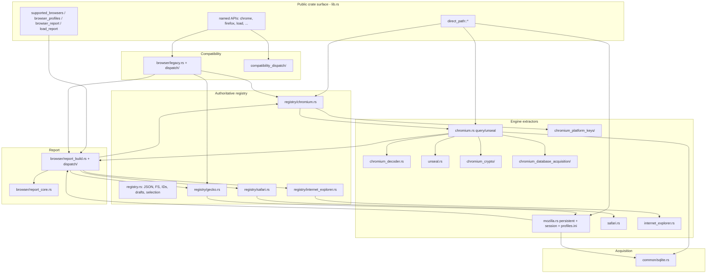
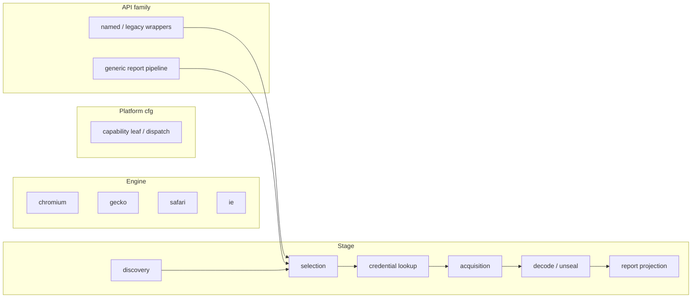
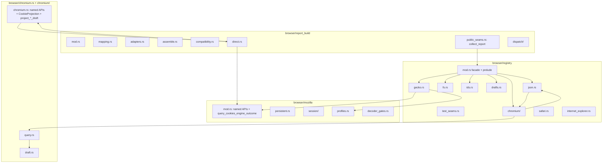

# Modularize Oversized Browser, Registry, and Report Modules

- **Author:** Grok (design)
- **Date:** 2026-08-17
- **Status:** Draft — open questions resolved
- **Scope:** Structure-only refactor of `rookie-rs` browser / registry / report / SQLite modules
- **Workspace:** `/Users/blackmyth/src/rookie-cookies`
- **Related ADRs:** [0001](docs/adr/0001-cookie-extraction-compatibility-and-report-contracts.md), [0002](docs/adr/0002-authoritative-browser-registry.md)

---

## Overview

`rookie-rs` already has the right *crate* shape: one library, one authoritative registry (`browser_registry.json` + `browser/registry.rs`), engine extractors under `browser/{chromium,mozilla,safari,internet_explorer}.rs`, and a frozen report contract in `browser/report_core.rs`. What it does *not* have is a file shape that matches those seams. Four production modules mix several responsibilities (`mozilla.rs` ~1886 true prod / ~2313 through the first `mod tests`, `report_build.rs` ~2070, `registry.rs` ~1691, `registry/chromium.rs` ~1565), and several files are dominated by in-file `mod tests` (`browser/chromium.rs` 73% tests, `registry/chromium.rs` 67%, `registry/gecko.rs` 68%). The 4000-line files are therefore two problems that must be designed separately.

This document proposes a file/module refactor only: extract tests into `#[path]` siblings that keep private-item access, then split production along the type and function clusters that already exist. No new crates, no new engine-plugin traits, no public API change, no report DTO / schema change, no `browser_registry.json` change. Named APIs and the generic report pipeline continue to share internals as required by ADR 0002.

The first compileable step is not “move a test module.” It is “move the test module *and* grandfather the new `*_tests.rs` file at the exact platform-cfg hit count that moved.” `xtask` walks every `.rs` file under `rookie-rs/src`; an unlisted sibling with any `target_os` / `unix` / `windows` `cfg` fails `check-cfg-locations`.

---

## Background & Motivation

### Current state

The crate-private browser package is already staged:

```text
rookie-rs/src/browser/
  mod.rs
  registry.rs + registry/{chromium,gecko,safari,internet_explorer}.rs
  chromium.rs + chromium_crypto/ + chromium_decoder.rs
               + chromium_platform_keys/ + chromium_database_acquisition/
  mozilla.rs
  safari.rs + internet_explorer.rs + internet_explorer_model.rs
  report_core.rs
  report_build.rs + report_build/dispatch/{macos,windows,other}.rs
  legacy.rs + legacy/dispatch/
  cookie_record.rs, outcome.rs, unseal.rs
```

Public crate surface lives in `rookie-rs/src/lib.rs` and is snapshotted in `rookie-rs/public-api/*.txt`. Bindings (`bindings/python`, `bindings/node`, `cli/`) consume that surface only.

Measured 2026-08-17 (`wc -l`; “Prod” = lines before the first top-level `mod tests` / `mod engine_chain_tests`, including any `#[cfg(test)]` items that precede that module):

| Lines | Prod | Tests | % tests | Path |
|------:|-----:|------:|--------:|------|
| 4747 | 1565 | 3182 | 67.0% | `rookie-rs/src/browser/registry/chromium.rs` |
| 4745 | 2313† | 2432 | 51.3% | `rookie-rs/src/browser/mozilla.rs` |
| 3988 | 2070 | 1918 | 48.1% | `rookie-rs/src/browser/report_build.rs` |
| 3848 | 1024 | 2824 | 73.4% | `rookie-rs/src/browser/chromium.rs` |
| 2928 | 1691 | 1237 | 42.2% | `rookie-rs/src/browser/registry.rs` |
| 2129 | 1022 | 1107 | 52.0% | `rookie-rs/src/common/sqlite.rs` |
| 2114 | 669 | 1445 | 68.4% | `rookie-rs/src/browser/registry/gecko.rs` |
| 2079 | 1084 | 995 | 47.9% | `rookie-rs/src/browser/safari.rs` |
| 1770 | 1170 | 600 | 33.9% | `rookie-rs/src/lib.rs` |
| 1521 | 725 | 796 | 52.3% | `rookie-rs/src/direct_path/mod.rs` |
| 1359 | 428 | 931 | 68.5% | `rookie-rs/src/browser/chromium_database_acquisition/mod.rs` |
| 1324 | 573 | 751 | 56.7% | `rookie-rs/src/browser/registry/safari.rs` |
| 1253 | 647 | 606 | 48.4% | `rookie-rs/src/linux/mod.rs` |
| 1221 | 814 | 407 | 33.3% | `rookie-rs/src/browser/report_core.rs` |

† `mozilla.rs` lines 1887–2312 are `#[cfg(test)]` decoder gates (`structured_*_decoder_gate`) that sit *before* `mod tests`. True production is **~1886 lines**. Split-size estimates below use 1886, not 2313.

A design that only splits tests still leaves 1.5–2.1k-line production files. A design that only splits production still leaves 4k files. Both must happen, in that order.

### Pain points

1. **Review cost.** A Chromium discovery change in `registry/chromium.rs` is buried in 4700 lines that also own Local State parsing, key-credential projection, `SystemKeyProvider`, listing, `chrome_profile` selection, and 80 unit tests.
2. **Blame / bisect noise.** Tests and production share a file, so a fixture edit looks like an engine change.
3. **Visibility accidents.** Helpers that should stay file-private (`parse_local_state`, `legacy_chromium_profile_group`, `decode_persistent_cookies`) live next to `pub(crate)` adapters that `report_build` and `legacy` must call. The next edit is tempted to widen visibility rather than move the helper.
4. **cfg containment (#218).** `cfg-location-allowlist.toml` already treats `chromium.rs` (max 60), `registry.rs` (max 8), and `registry/chromium.rs` (max 20) as grandfathered hot spots. Leaving them as mega-files makes further containment harder. Extracting tests without updating that file fails CI on day one.

### What is *not* broken

ADR 0002 already did the architectural split: `browser_registry.json` is the only hand-maintained discovery source; `ProfileSelection::{AllProfiles, ProfileId, LegacyFirstProfile}` is the only selection policy; named wrappers and reports share discovery, acquisition, parse, and decrypt. Platform cfg is already isolated in `chromium_crypto/{unix,windows,unsupported}.rs`, `chromium_platform_keys/{linux,macos,windows,unsupported}.rs`, `chromium_database_acquisition/windows.rs`, `report_build/dispatch/`, `legacy/dispatch/`, and `compatibility_dispatch/`. This refactor copies those patterns. It does not invent a new crate split or an engine plugin framework.

---

## Goals & Non-Goals

### Goals

- Make every *related* oversized module navigable: a reviewer can open one file and see one responsibility cluster.
- Separate the test-volume problem from the production-cohesion problem.
- Preserve rustc private-item access for the tests that characterize `DiscoveryFs`, `ChromiumProfile`, `BrowserInstallation`, `KeyCredentials`, `EngineExtractionDraft`, and decoder internals.
- Keep each PR independently compilable, test-green, and reviewable (no “move 15k lines” PR, and no production-split PR that also carves 3000 test lines).
- Leave behind cohesion axes so new files do not re-grow into 4k dumps.
- Respect issue #218: new production files are cfg-free unless they are declared capability leaves. Extracted `*_tests.rs` files are **grandfathered**, never leaves.

### Non-goals

- No public API change. `rookie-rs/public-api/*.txt` must stay byte-identical. `MozillaProfile`, `firefox_based`, `firefox_based_detailed`, `chromium_based`, `chromium_based_detailed`, `supported_browsers`, `browser_profiles`, `browser_report`, `load_report`, `chrome_profiles`, `chrome_profile`, `Cookie`, `config::Browser` / `CONFIG` remain source compatible. `lib.rs` re-export list is unchanged on every conversion PR.
- No behavior change. Profile order, source precedence (`Network/Cookies` then `Cookies`; Mozilla session lifecycle), first-profile compatibility, issue codes, `load()` concatenation order, and `chrome_profiles()` last-used preference are frozen by ADR 0001/0002.
- No report DTO / schema change (`schema_version: 1`, `report_core` wire types, Python/Node/CLI projections).
- No `browser_registry.json` schema or content change.
- No new workspace crates.
- No new engine-plugin trait, no unification of `ChromiumRegistryDraft` with `EngineExtractionDraft`, no moving decode/unseal into the registry, no merging `profiles.ini` parsing into `registry/gecko.rs`.
- No `registry/types.rs` / `registry/prelude.rs` file. The rustc-allowed `json` ↔ `chromium` cycle is accepted (Decision 12).
- No relocation of `linux/mod.rs` confidential primitives, `direct_path/`, or crate-root named wrappers in `lib.rs`. Those are oversized but not in this cluster; they are listed as follow-ons only.
- No production split of `registry/gecko.rs` in this series (user rejected 2026-08-17; 669 prod after Phase A stays one file).
- No CI size lint in this series. Size targets are review guidelines only.
- No rustfmt/edition change.

---

## Key Decisions

1. **Two-phase split: tests first (`#[path]`), then production.** Extracting `mod tests` via `#[cfg(test)] #[path = "..."] mod tests;` drops the 4k files immediately without changing rustc visibility. Production splits then happen against already-small test-free files. Rationale: a production move that also relocates 3000 lines of tests is unreviewable, and crate-level `rookie-rs/tests/` integration tests cannot see `DiscoveryFs` / `BrowserInstallation`.

2. **Reuse the existing `foo.rs` + `foo/` rustc pattern. Do not invent a new crate or a new module style.** `registry.rs` already owns `registry/{chromium,gecko,safari,internet_explorer}.rs`. `report_build.rs` already owns `report_build/dispatch/`. Convert those parents to `mod.rs` only when the next sibling would otherwise live beside a 1600-line file, and only as an **atomic** commit (Decision 2a). For `browser/chromium.rs`, add `browser/chromium/{draft,query}.rs` as children of the existing file (same pattern) rather than creating a `chromium/` package that would visually collide with `chromium_crypto/`.

   **2a. Atomic parent→`mod.rs` conversion.** Any PR that `git mv`s a parent into an existing (or newly created) sibling directory does all four of these in the **same commit**: (1) `git mv parent.rs parent/mod.rs`, (2) `git mv parent_tests.rs parent/tests.rs` (and any second `#[path]` sibling), (3) replace `#[path = "..."]` with `mod tests;`, (4) rewrite the allowlist key. There is no “or immediately after.” `#[path]` is resolved relative to the file that carries the attribute; after the parent moves, the old path string does not compile.

3. **Split along existing type/function clusters, not new abstractions.** Target files are named after types that already exist (`KeyCredentials`, `LocalStateMetadata`, `ChromiumExtractionDraft`, `MozillaSessionDraft`, `DiscoveryContext`, `EngineExtractionDraft`). Do not introduce an `Engine` trait or a shared “adapter framework.”

4. **Do not unify Chromium and non-Chromium draft types.** `ChromiumRegistryDraft` / `ChromiumProfileDraft` and `EngineExtractionDraft` / `EngineProfileDraft` stay distinct. Chromium owns installation-scoped key retrieval and `CookieSourceCandidate` precedence; Gecko/Safari/IE share the generic source draft. Unifying them is a behavior-risk abstraction, not a file refactor.

5. **Co-locate single-cluster tests; keep cross-cluster characterization tests on the parent.** rustc private items are visible to the defining module and its descendants, not to siblings. After a production split, a test in `discovery.rs` cannot see a sibling-private `parse_local_state`. Tests that only exercise one cluster’s private helpers move next to that file. Tests that call `extract_chromium_with_provider` *and* assert Local State / listing stay on the parent `chromium/tests.rs` (or `extract.rs`’s tests, which already see `pub(super)` `legacy_windows_local_state`). Do not `pub(super)` `parse_local_state` “just for tests.” Cross-engine fixtures stay in `registry::test_seams` (`pub(crate)`). A parent `tests.rs` above the 900-line test-file soft cap is accepted for the production-move PR; a later optional PR may resplit it.

6. **New production files are cfg-free unless they are declared #218 leaves.** Platform cfg stays in existing dispatch / capability leaves (`chromium_platform_keys/`, `chromium_crypto/{unix,windows}`, `chromium_database_acquisition/windows.rs`, `report_build/dispatch/`, `legacy/dispatch/`, `compatibility_dispatch/`, `registry/{safari,internet_explorer}.rs`). Splitting a grandfathered file must *lower* its cfg count or move cfg into a leaf, then update `cfg-location-allowlist.toml` in the same PR. `registry/ids.rs` is a leaf for the two `normalized_path_bytes` copies. `registry/chromium/credentials.rs` is a leaf for Chromium key-identity cfg.

7. **Size guideline: 600 production-line soft cap, 800 review flag; 900-line test-file soft cap.** A few dense algorithms are allowed to exceed the soft cap (see [Size Targets](#size-targets)). Combined prod+test files over 1000 lines are a review flag after this work, except the explicit one-PR exception in Decision 5.

8. **Preserve `git` history with `git mv`.** Parent-to-`mod.rs` conversions and test extractions are renames, not copy-paste. Phase A moves the *inner items* of `mod tests { ... }` into the sibling file; the wrapper stays in the production file as `#[path] mod tests;`. Moving the wrapper would nest `chromium::tests::tests`.

9. **Keep the existing `pub(crate)` crate surface of `registry` and `report_build` stable across PRs.** Child modules may use `pub(super)`; the parent re-exports the names in the [Registry prelude](#registry-prelude-exhaustive). Intermediate PRs must not force drive-by import rewrites outside the cluster being split.

10. **Safari/IE registry modules remain compiled on every CI target via `#[cfg(any(target_os = "...", test))]`.** Linux CI compiles and runs their portable tests today. A split that `cfg`s the whole subtree to the native OS would drop that coverage.

11. **Extracted `*_tests.rs` files are grandfathered at the exact moved hit count, never leaves.** A `leaves` entry grants unlimited cfg growth in a 3k-line test file and defeats #218. `cfg-location-allowlist.toml` is a required file in every PR that creates or moves a `.rs` file that contains a platform `cfg`/`cfg_attr`. After extract, the production ceiling drops to the remaining production hits (0 for `gecko.rs` and `sqlite.rs` — those grandfathered keys are **deleted**, not renamed). File-top `#[cfg(all(test, ...))]` imports that exist only to serve `mod tests` move with the tests and count toward the test-file ceiling.

12. **Named registry prelude; accept the rustc-allowed `json` ↔ `chromium` cycle.** `BrowserDefinition.key_credentials` and `InstallationRoot.legacy_profile_layout` already mention `chromium::KeyCredentials` and `chromium::LegacyChromiumProfileLayout`, and `validate_registry` calls `chromium::validate_key_credentials`. After the split, `json.rs` imports those three names from `chromium` (re-exported on `chromium/mod.rs`). `chromium/*` imports `embedded_registry` / `browser_definition` from `json`. That is a cycle. rustc allows it; it is the current parent-file shape. Do **not** introduce `registry/types.rs` to break it — that is a new abstraction this refactor refuses. `EnvOverride` stays `pub(crate)` on the `registry` facade so `lib.rs` tests and `registry/safari.rs` tests keep compiling.

13. **Gecko production split is rejected for this series.** Leave `registry/gecko.rs` as one file after the Phase A test extract. Do not land a discovery/extract/legacy split. Revisit only if a later change has to touch discovery and legacy selection in the same review.

---

## Existing Architecture (verified)

### Contracts

ADR 0001 freezes the compatibility boundary and the report/profile/source model. ADR 0002 makes `rookie-rs/browser_registry.json` the only hand-maintained discovery source and names the three selection policies:

- `AllProfiles` — full browser and `load_report`
- `ProfileId` — explicit report profile
- `LegacyFirstProfile` — named compatibility wrappers

Selection happens *before* credential retrieval and source acquisition. Named wrappers must not extract profiles they will discard.

### Call graph (today)



The last two edges are the existing cycle: engine extractors call `report_build::canonical_direct_*_extraction` to project legacy `Vec<Cookie>`, and `report_build` names `ChromiumExtractionDraft` / `MozillaExtractionDraft`. Rust allows this. After this refactor the Chromium half of that cycle stays on the **facade** `chromium.rs` (`project_legacy_draft` / `project_detailed_draft` / `CookieProjection`). It is not moved onto `chromium/draft.rs` or `chromium/query.rs`.

### How `registry.rs` includes children

```1092:1150:rookie-rs/src/browser/registry.rs
/// Resolves the installation roots an engine adapter should walk, in the fixed
/// registry order of priority then root ID.
fn engine_roots<'a>(...) { ... }

mod chromium;
// cfg-gated pub(crate) re-exports of chromium adapters
mod gecko;
pub(crate) use gecko::{ gecko_profiles_with_runtime, gecko_report_with_runtime, ... };
#[cfg(any(target_os = "macos", test))]
mod safari;
#[cfg(any(target_os = "windows", test))]
mod internet_explorer;
```

Children are ordinary rustc submodules of `registry`. They import parent-private items (`DiscoveryFs`, `embedded_registry`, `installation_id`, `ProfileSelection`, `EngineExtractionDraft`) via `use super::...`. That works only because they are *children*, not siblings.

`registry.rs` itself is already a mix of:

| Lines (approx) | Cluster | Types / functions |
|---:|---|---|
| 1–335 | Embedded JSON + validation | `Registry`, `BrowserDefinition`, `BrowserEngine`, `BrowserCapabilities`, `InstallationRoot`, `DiscoveryStrategy`, `REGISTRY` / `include_str!("../../browser_registry.json")`, `validate_registry`, `validate_identifier`, `validate_alias`, `capability_descriptor`, `registered_browsers`, `resolve_registered_browser`. Embeds `chromium::KeyCredentials` and `chromium::LegacyChromiumProfileLayout`; calls `chromium::validate_key_credentials`. |
| 336–383 | Selection + platform | `PlatformId`, `ProfileSelection` |
| 385–675 | Discovery FS + env | `DiscoveryFs`, `RealDiscoveryFs`, `GlobExpansion`, `DiscoveryContext`, `EnvOverride` (`pub(crate)`), `resolve_template_for_selection` (legacy Linux `{config_home}` pin) |
| 677–801 | IDs | `DiscoveryIssue`, `installation_id`, `profile_id`, `normalized_path_bytes` (unix/windows) |
| 803–1107 | Shared engine drafts + selection | `EngineSourceDraft` (**`cookies` is not `#[cfg(test)]`**), `EngineProfileDraft`, `EngineExtractionDraft`, `SourceAcquisition`, `SourceFailureStage`, `select_engine_profiles`, `retain_completed_engine_work`, `push_bounded_discovery_issue`, `canonical_installation_root`, `installation_root_is_directory`, `sort_engine_profiles`, `engine_roots` |
| 1109–1150 | Child modules + re-exports | `mod chromium/gecko/safari/internet_explorer` and the [prelude](#registry-prelude-exhaustive) |
| 1154–1689 | Test seams | `pub(crate) mod test_seams` — `TestDiscoveryFs`, `TempDir`, `seed_chromium_profile`, `seed_gecko_profile`, `chromium_report`, `gecko_report`, … |
| 1691–2928 | In-file tests | env construction, registry validation, Safari/IE cross-engine tests; imports `discover_browser_with_context`, `discover_gecko_with_context`, `discover_safari_with_context`, `populate_safari_sources`, `safari_report_with_query`, `select_legacy_safari_profile`, `SAFARI_COOKIE_FILE`, `discover_internet_explorer_with_context`, `INTERNET_EXPLORER_COOKIE_FILE` |

`#![allow(dead_code)]` on `registry.rs` exists because some helpers are only referenced from cfg-gated children. Do not copy that allow onto every new file.

### `registry/chromium.rs` clusters (1565 prod)

| Lines | Cluster | Surface |
|---:|---|---|
| 29–120 | Credential schema | `pub(super) struct KeyCredentials`, `MacosKeychainCredential`, `LegacyChromiumProfileLayout`, `validate_key_credentials` (parent `validate_registry` calls this) |
| 122–180 | Profile / installation types | `CookieSourceCandidate`, `ChromiumProfile`, `pub(super) struct BrowserInstallation` |
| 182–232 | Legacy layout | `legacy_chromium_profile_group`, `add_legacy_flat_chromium_profiles` |
| 234–605 | Discovery | `ChromiumDiscovery`, `LocalStateMetadata`, `parse_local_state`, `persistent_candidates`, `discover_installation_profiles`, `discover_browser_with_context[_and_selection]` |
| 343–372 | Compat Local State gate | `legacy_windows_local_state` — **called from extract** (`extract_chromium_with_provider_and_selection_runtime` ~1026), not only from discovery |
| 787–1144 | Extraction composition | `ChromiumProfileDraft`, `ChromiumProfileFailure`, `ChromiumInstallationDraft`, `ChromiumRegistryDraft`, `extract_chromium_with_provider[_and_selection][_runtime]` |
| 1146–1274 | Key provider + identity | `registry_key_credentials`, `direct_path_chromium_identity`, `chromium_key_credentials`, `project_key_credentials`, `SystemKeyProvider`, `key_request_for_installation` |
| 1276–1563 | Listing / report / legacy adapters | `chrome_profiles_with_runtime`, `prefer_active_profiles`, `select_chrome_profile_with_runtime`, `chromium_listing_with_runtime`, `chromium_registry_report_with_runtime`, `legacy_chromium_outcome_with_runtime` |

`test_seams` imports `discover_browser_with_context`, `extract_chromium_with_provider`, `profiles_for_listing`, `BrowserInstallation`. Those are `pub(super)` today and must stay visible to the `registry` parent after the chromium file becomes a directory.

Platform-cfg inventory (20 hits = today’s grandfathered ceiling):

| Where | Hits | After Phase A |
|---|---:|---|
| File-top `#[cfg(all(test, target_os = "macos"))]` import (line 4) | 1 | Moves with tests |
| Production identity/provider (1151–1239) | 8 | Stays, later moves to `credentials.rs` (leaf) |
| `mod tests` (1577, 1584, 1596, 1664, 1717, 1766, 1769, 2287, 2323, 2872, 3229) | 11 | Moves to `chromium_tests.rs` |

### `registry/gecko.rs` clusters (669 prod)

Already the right *width* (one engine). Internal clusters: listing (`gecko_profiles_with_context`), markerless recovery (`markerless_gecko_profiles`), discovery (`discover_gecko_with_context`), source population (`populate_gecko_sources`), runtime adapters, legacy sort (`sort_legacy_gecko_profiles`). Tests (1445 lines) are the size problem. The file’s entire grandfathered `max_cfg = 1` is `#[cfg(unix)]` at line 1103 **inside `mod tests`**. After Phase A, production has **zero** platform hits.

### `mozilla.rs` clusters (~1886 true prod)

| Lines | Cluster | Surface |
|---:|---|---|
| 48–102 | Public named APIs | `firefox_based`, `firefox_based_detailed` + `*_with_runtime` |
| 104–565 | Persistent SQLite | `MozillaPersistentReadOnlySource`, `MozillaPersistentDecoder`, `decode_persistent_cookies`, schema-16 expiry, `firefox_cookie_context` |
| 567–758 | Session types / table | `SessionStoreFormat`, `SESSION_CANDIDATES`, `MozillaSessionDecoder`, `MozillaSessionDraft` |
| 760–914 | **Engine outcome (not session)** | `query_cookies_engine_outcome[_with_runtime]` / `query_cookies_engine_outcome_with_session_probe` — runs persistent SQLite (`sqlite::with_browser_database_with_runtime` at 798) *then* the session probe. Belongs on `mozilla/mod.rs`. |
| 916–1612 | Session acquire + parse | jsonlz4 / legacy JSON, `get_session_cookies` / `get_session_cookies_lz4` (crate-visible `pub` on a private module — **not** in `public-api/*.txt`) |
| 1614–1885 | profiles.ini | `pub struct MozillaProfile` (crate-root re-export), `list_profiles_from_str`, `select_profile`, `resolve_default_path` |
| 1887–2312 | Decoder gates (`#[cfg(test)]`) | `structured_persistent_decoder_gate`, `structured_*_session_decoder_gate` — not production |
| 2313–4745 | In-file tests | persistent, session, profiles.ini, domain filter, WAL snapshot |

`SESSION_CANDIDATES` remains the single lifecycle table; gecko imports `mozilla::SESSION_CANDIDATES` and `mozilla::session_candidate_precedence`.

### `chromium.rs` clusters (1024 prod)

Production is already the *smallest* of the 4k files; tests make it look huge.

| Lines | Cluster | Surface |
|---:|---|---|
| 23–26 | Projection switch | `CookieProjection` — private enum used by **named APIs on this file** and by the query pipeline. Stays on `chromium.rs`. |
| 51–227 | Named / probe APIs | `chromium_based` / `chromium_based_detailed` (windows vs unix signatures), plaintext-only, probes |
| 234 | Log pin | `SQLITE_CONNECTION_LOG` — used by the query path at line 800; moves with `query.rs` |
| 236–424 | Draft / issues | `ChromiumRowIssueCode`, `ChromiumRowIssue`, `ChromiumExtractionStats`, `ChromiumExtractionDraft` |
| 429–475 | Legacy/detailed projection | `project_legacy_draft[_with_runtime]`, `project_detailed_draft[_with_runtime]` — the cycle into `report_build`. **Stays on `chromium.rs`.** |
| 477–1022 | Query / unseal pipeline | `query_cookies_engine_outcome_with_runtime`, `query_cookies_from_database_with_runtime` → `sqlite` → `decode_and_unseal_cookie_records_with_runtime` → `unseal_chromium_record` |

Platform-cfg inventory (60 hits = today’s grandfathered ceiling):

| Where | Hits | After Phase A |
|---|---:|---|
| Production named APIs / query / draft (through line 781) | 33 | Stays on `chromium.rs` (later some move to `query.rs`) |
| File-top `#[cfg(all(test, unix))]` import (line 28) | 1 | Moves with tests |
| `mod tests` (26 hits from 1028 through 3786) | 26 | Moves to `chromium_tests.rs` |

### `report_build.rs` clusters (2070 prod)

| Lines | Cluster | Target file |
|---:|---|---|
| 39–170 | Issue / identity mapping | `mapping.rs` |
| 171–414 | Engine → `ProfileDraft` | `adapters.rs` |
| 416–551 | Browser draft + descriptors | `adapters.rs` (`BrowserDraft`, `CompatibilityFamily`, `chromium_browser_outcome`, `engine_browser_outcome`, `supported_browser_descriptors`) |
| 562–652 | **`collect_report` + `chromium_listing_outcome`** | **`public_seams.rs` only** — `collect_report` is the dispatcher `browser_extraction_report` / `load_extraction_report` / `browser_profile_descriptors` call. Not an adapter. |
| 654–775, 766–774, 1005–1121 | Canonicalize / counters / finalize | `assemble.rs` |
| 776–1000 | `project_canonical_report[_with_runtime]` | `assemble.rs` |
| 1123–1379 | Compatibility disposition | `compatibility.rs` |
| 1382–1394 | `assemble` / `assemble_with_runtime` | `assemble.rs` (after compatibility in the current file; same module after the split) |
| 1395–1760 | Canonical + direct-path seams | `direct.rs` |
| 1762–2068 | Public report seams | `public_seams.rs` |
| 2070–3115 | Unit tests | `report_build_tests.rs` |
| 3116–3988 | `engine_chain_tests` | `report_build_engine_chain_tests.rs` |

`mod dispatch` already isolates Safari/IE. Chromium/Gecko stay inline because they are portable. The one production platform cfg is `#[cfg(target_os = "windows")]` on `canonical_direct_internet_explorer_extraction_with_runtime` (line 1677).

### `common/sqlite.rs` clusters (1022 prod)

Types (`DatabaseAcquisitionStrategy`, `BrowserDatabaseOutcome`, `BrowserDatabaseFailure`, `SqliteReader`) stay on `mod.rs`. The rest is **interleaved**, not three independent piles:

- `acquire_verified_wal_snapshot` (line 337) sits in the acquire half and is snapshot I/O.
- `database_uses_wal` (line 576) sits between acquire retry classification and `open_*` (605+).

Required `pub(super)` edges after the split:

```text
acquire.rs  -->  snapshot.rs   (acquire_verified_wal_snapshot, snapshot_database_*)
acquire.rs  -->  open.rs       (open_live_read_only, pin_read_snapshot, database_uses_wal)
snapshot.rs -->  open.rs       (sidecar / open helpers used while copying)
```

The file’s entire grandfathered `max_cfg = 1` is `#[cfg(unix)]` at line 1845 **inside `mod tests`**. After Phase A, production has **zero** platform hits.

### `report_core.rs` (814 prod)

Frozen DTO + identifier newtypes + counter helpers + `sort_cookies`. Republished by `rookie-rs/src/report.rs`. This file is allowed to stay large. Tests are only 407 lines.

### How tests reach private items

Every large file uses the same rustc unit-test pattern:

```rust
#[cfg(test)]
mod tests {
  use super::*;
  // plus, for registry children:
  use super::super::test_seams::{...};
}
```

**rustc rule:** an item with no `pub` is visible in the module that defines it and in that module’s descendants. A sibling module cannot see it unless it is at least `pub(super)`. `#[cfg(test)] #[path = "foo_tests.rs"] mod tests;` is still a child of the production module, so Phase A `use super::*;` still sees `DiscoveryFs`, `BrowserInstallation`, `parse_local_state`, `decode_persistent_cookies`. After a production split, a test file attached to `discovery.rs` cannot see a private `parse_local_state` in `local_state.rs`.

Crate integration tests under `rookie-rs/tests/` (`public_contract.rs`, `public_report_api.rs`) only see the public surface and must stay that way. The existing `#[path]` in `rookie-rs/tests/linux_confidential_primitives.rs` is a different pattern (integration test pulling production files in). Phase A is the first in-tree use of `#[path]` for unit-test extraction; rustc will honor it.

`registry::test_seams` is the one intentional `pub(crate)` test hub. Keep that hub; do not invent a second one.

---

## Cohesion Axes (do not re-grow)

Future files must be named and placed on **all four** axes. A file that cuts across more than one axis without being a declared facade is the next 4k file.



1. **Stage.** Discovery enumerates installations/profiles and emits issues. Selection (`ProfileSelection`) narrows *before* I/O. Credential lookup is installation-scoped (`SystemKeyProvider`, `HostKeySession`). Acquisition is `common/sqlite` / Safari file / IE ESE. Decode/unseal is engine-private. Report projection is `report_build` → `report_core`.
2. **Engine.** Chromium / Gecko / Safari / IE. Registry composition is already split this way under `registry/`. Engine *extractors* stay under `browser/{chromium,mozilla,safari,internet_explorer}.rs`.
3. **Platform cfg.** Isolated in existing capability leaves. Core files do not grow new `target_os` / `unix` / `windows` attributes (issue #218 + `cfg-location-allowlist.toml`).
4. **API family.** Named APIs and the generic report pipeline **must share** discovery, selection, acquisition, and decode (ADR 0002). They differ only in `ProfileSelection` and in the final projection (`legacy::project_canonical_outcome` vs grouped `ExtractionReport`). Never reimplement paths or profile enumeration in a wrapper.

Anti-patterns that would re-grow files:

- Adding a new browser’s discovery, extraction, *and* tests to `registry.rs`.
- Putting Local State parsing back into `chromium.rs` (query) or `chromium_platform_keys`.
- Teaching `report_build` to query SQLite.
- Duplicating `SESSION_CANDIDATES` in the registry.
- Unifying Chromium and Gecko drafts “to make the report layer simpler.”

---

## Proposed Design

### Pattern to copy

Use the crate’s existing modularization, nothing new:

| Pattern | Existing example | Apply to |
|---|---|---|
| Parent file + child directory | `registry.rs` + `registry/*.rs`; `report_build.rs` + `report_build/dispatch/` | `chromium.rs` + `chromium/{draft,query}.rs`; convert parents to `mod.rs` when they themselves split, atomically (Decision 2a) |
| Platform dispatch leaf | `report_build/dispatch/{macos,windows,other}.rs`, `legacy/dispatch/`, `compatibility_dispatch/` | **Do not redo.** New files stay portable. |
| Engine-specific registry leaf | `registry/{chromium,gecko,safari,internet_explorer}.rs` | Further *intra-engine* split only (gecko production split is optional) |
| Capability subdirectory | `chromium_crypto/`, `chromium_platform_keys/`, `chromium_database_acquisition/` | **Do not replace or nest under `chromium/`.** They stay siblings of `chromium.rs`. |
| In-file unit tests | `#[cfg(test)] mod tests` | Keep, but via `#[path]` so the test *text* lives beside the module |

### Target module tree

Paths are relative to `rookie-rs/src/`. Visibility is the rustc surface *after* the parent re-export. Items not listed stay private to their file.

```text
browser/
  registry.rs                          # DELETED in the atomic conversion PR
  registry/mod.rs                      # was registry.rs; then slim facade + prelude
    json.rs                            # NEW
    fs.rs                              # NEW
    ids.rs                             # NEW (leaf: normalized_path_bytes)
    drafts.rs                          # NEW
    test_seams.rs                      # NEW (move of existing mod test_seams)
    tests.rs                           # was registry_tests.rs
    chromium.rs                        # later → chromium/mod.rs
    chromium/
      mod.rs                           # types + required pub(super) re-exports
      credentials.rs                   # leaf
      local_state.rs
      discovery.rs
      extract.rs
      listing.rs
      tests.rs                         # stays here through the production-move PR
    gecko.rs                           # stays a single file (production split rejected)
    gecko_tests.rs                     # Phase A sibling; stays #[path] (parent is still gecko.rs)
    safari.rs                          # keep (573 prod); tests extracted
    safari_tests.rs
    internet_explorer.rs               # keep

  mozilla.rs                           # DELETED in the atomic conversion PR
  mozilla/mod.rs                       # named APIs + query_cookies_engine_outcome*
    persistent.rs
    session/
      mod.rs                           # SESSION_CANDIDATES, format, session drafts
      acquire.rs
      parse.rs
    profiles.rs
    decoder_gates.rs                   # cfg(test) only
    tests.rs

  chromium.rs                          # stays; named APIs + CookieProjection + project_*_draft
  chromium/
    draft.rs                           # issue/stats/draft types only
    query.rs                           # query/unseal pipeline + SQLITE_CONNECTION_LOG
  chromium_tests.rs                    # Phase A sibling; stays #[path] (parent is still chromium.rs)

  report_build.rs                      # DELETED in the atomic conversion PR
  report_build/mod.rs
    dispatch/                          # UNCHANGED
    mapping.rs
    adapters.rs
    assemble.rs
    compatibility.rs
    direct.rs
    public_seams.rs                    # collect_report lives only here
    tests.rs
    engine_chain_tests.rs

  report_core.rs                       # keep; optional test extract only

common/
  sqlite.rs                            # DELETED in the atomic conversion PR
  sqlite/mod.rs
    acquire.rs                         # calls snapshot.rs and open.rs
    snapshot.rs
    open.rs
    tests.rs
```

`browser/mod.rs` does not change its `pub(crate) mod` list except that `registry`, `mozilla`, `report_build` remain the same module *names*. `lib.rs` re-exports stay:

```20:23:rookie-rs/src/lib.rs
pub use browser::{
  chromium::{chromium_based, chromium_based_detailed},
  mozilla::{firefox_based, firefox_based_detailed, MozillaProfile},
};
```

`mozilla/profiles.rs` is **not** a public module. `MozillaProfile` is re-exported through `mozilla/mod.rs` and then through `lib.rs`.

### Registry prelude (exhaustive)

This is the compile contract for PRs 3–5. Every name below is re-exported from `registry/mod.rs` at the visibility shown. Implementers do not invent a shorter list.

#### `pub(crate)` on `registry/mod.rs` (today’s crate surface)

Defined in the parent today; after the split, defined in the child and re-exported here:

| Name | After split lives in | Notes |
|---|---|---|
| `BrowserCapabilityDescriptor` | `json.rs` | |
| `RegisteredBrowser` | `json.rs` | imported by `report_build.rs` |
| `registered_browsers` | `json.rs` | |
| `resolve_registered_browser` | `json.rs` | |
| `PlatformId` | `fs.rs` | used as a discovery-context field; keep next to `DiscoveryContext` |
| `ProfileSelection` | `drafts.rs` | |
| `RealDiscoveryFs` | `fs.rs` | |
| `DiscoveryContext` | `fs.rs` | |
| `EnvOverride` | `fs.rs`, **re-export `pub(crate)`** | `lib.rs` tests call `browser::registry::EnvOverride::install`; `registry/safari.rs` tests call `super::super::EnvOverride` |
| `DiscoveryIssue` | `ids.rs` | |
| `is_informational_discovery_issue` | `ids.rs` | |
| `SOURCE_ROLE_PERSISTENT` | `drafts.rs` | |
| `SOURCE_ROLE_SESSION` | `drafts.rs` | |
| `PERSISTENT_SOURCE_PRECEDENCE` | `drafts.rs` | |
| `EngineSourceDraft` | `drafts.rs` | `cookies` is **not** `#[cfg(test)]` |
| `SourceFailureStage` | `drafts.rs` | |
| `SourceAcquisition` | `drafts.rs` | |
| `EngineProfileDraft` | `drafts.rs` | |
| `EngineExtractionDraft` | `drafts.rs` | |
| `retain_completed_engine_work` | `drafts.rs` | |
| `test_seams` | `test_seams.rs` | `#[cfg(test)] pub(crate) mod` |

Child adapter re-exports, with **the same cfg predicates as today** (`registry.rs` 1111–1149):

```rust
#[cfg(unix)]
pub(crate) use chromium::chromium_key_credentials;
#[cfg(test)]
pub(crate) use chromium::CookieSourceCandidate;
pub(crate) use chromium::{
  chrome_profiles_with_runtime, chromium_listing_with_runtime,
  chromium_registry_report_with_runtime, legacy_chromium_outcome_with_runtime,
  select_chrome_profile_with_runtime, ChromiumProfile, ChromiumProfileDraft,
  ChromiumProfileFailure, ChromiumRegistryDraft,
};
#[cfg(any(target_os = "linux", target_os = "macos"))]
pub(crate) use chromium::{
  direct_path_chromium_identity, registry_key_credentials, DirectPathChromiumIdentity,
};

pub(crate) use gecko::{
  gecko_profiles_with_runtime, gecko_report_with_runtime, legacy_gecko_outcome_with_runtime,
  legacy_gecko_profiles_with_runtime,
};

#[cfg(target_os = "macos")]
pub(crate) use safari::{
  legacy_safari_outcome_with_runtime, safari_profiles_with_runtime, safari_report_with_runtime,
};

#[cfg(test)]
pub(crate) use internet_explorer::InternetExplorerRows;
#[cfg(target_os = "windows")]
pub(crate) use internet_explorer::{
  internet_explorer_profiles_with_runtime, internet_explorer_report_with_runtime,
  legacy_internet_explorer_outcome_with_runtime,
};
```

`InternetExplorerRows` is required: `report_build` `engine_chain_tests` import it.

#### `pub(super)` on `registry/chromium/mod.rs` (required after PR 5)

`pub(super)` on a child of `chromium/` is only `chromium/mod.rs`. These names are imported from **outside** the chromium module today and must be re-exported here:

| Name | Importer |
|---|---|
| `KeyCredentials` | `json.rs` (`BrowserDefinition.key_credentials`) |
| `MacosKeychainCredential` | `json.rs` / chromium tests |
| `LegacyChromiumProfileLayout` | `json.rs` (`InstallationRoot.legacy_profile_layout`) |
| `validate_key_credentials` | `json.rs` (`validate_registry`) |
| `BrowserInstallation` | `test_seams` |
| `discover_browser_with_context` | `test_seams`, `registry::tests` |
| `extract_chromium_with_provider` | `test_seams` |
| `extract_chromium_with_provider_runtime` | chromium tests (via `super`) |
| `extract_chromium_with_provider_and_selection` | chromium tests |
| `extract_chromium_with_provider_and_selection_runtime` | chromium tests |
| `profiles_for_listing` | `test_seams` |
| `ChromiumDiscovery` | chromium tests |

`LegacyChromiumProfileLayout` is **defined or re-exported on `chromium/mod.rs`**, not left as a `discovery.rs`-only `pub(super)`. `json.rs` must not import `chromium::discovery::…`.

#### `pub(super)` on engine siblings that `registry::tests` / `test_seams` import

These already exist on the current single files. They stay `pub(super)` on that file (gecko/safari/ie are not required to become directories):

| Module | Names |
|---|---|
| `gecko` | `gecko_profiles_with_context`, `discover_gecko_with_context`, `gecko_report_with_context`, `populate_gecko_sources` |
| `safari` | `SAFARI_COOKIE_FILE`, `discover_safari_with_context`, `safari_report_with_context`, `safari_report_with_query`, `populate_safari_sources`, `select_legacy_safari_profile` |
| `internet_explorer` | `INTERNET_EXPLORER_COOKIE_FILE`, `discover_internet_explorer_with_context`, `internet_explorer_report_with_context`, `populate_internet_explorer_sources` |

#### `pub(super)` on the new registry children (so siblings compile)

| Module | Names children need |
|---|---|
| `json.rs` | `Registry`, `BrowserDefinition`, `BrowserEngine`, `BrowserCapabilities`, `InstallationRoot`, `DiscoveryStrategy`, `embedded_registry`, `browser_definition`, `capability_descriptor`, `registered_browsers_for`, `validate_registry` |
| `fs.rs` | `DiscoveryFs`, `GlobExpansion`, `GlobExpansionIssue`, `ResolvedRoot`, `environment_value` |
| `ids.rs` | `ProfileLocator`, `installation_id`, `profile_id`, `normalized_path_bytes`, `DiscoveryIssue::new`, `push_bounded_discovery_issue`, `MAX_DISCOVERY_ISSUE_SAMPLES` |
| `drafts.rs` | `select_engine_profiles`, `canonical_installation_root`, `installation_root_is_directory`, `sort_engine_profiles`, `engine_roots` |

`registry/mod.rs` re-exports a short parent prelude of those `pub(super)` names so children write `use super::{DiscoveryFs, embedded_registry, installation_id, ...}` rather than `use super::json::embedded_registry`. That prelude is `pub(super)`, not `pub(crate)`.

#### Parent `use`s that children name via `super::` (not definitions)

Keep today’s non-item `use`s on the `registry/mod.rs` facade whenever a child still writes `use super::…`. Do **not** rewrite those child imports in PR 4.

```rust
#[cfg(test)]
use super::report_core::sort_cookies;
#[cfg(test)]
use crate::common::sqlite::DatabaseAcquisitionStrategy;
```

| Name | Today | After PR 4 | Why the facade keeps it |
|---|---|---|---|
| `sort_cookies` | `#[cfg(test)] use super::report_core::sort_cookies` (`registry.rs:10-11`) | same `#[cfg(test)] use` on `registry/mod.rs` | `registry/gecko.rs` tests do `use super::{sort_cookies, …}` |
| `DatabaseAcquisitionStrategy` | production `use crate::common::sqlite::DatabaseAcquisitionStrategy` (`registry.rs:14`) | production import moves to `drafts.rs` with `SourceAcquisition::Database`; facade keeps a **`#[cfg(test)] use`** of the same path | `registry/gecko.rs` tests do `use super::{…, DatabaseAcquisitionStrategy, …}` and construct `SourceAcquisition::Database(DatabaseAcquisitionStrategy::…)` (e.g. gecko.rs 1434, 1832) |

`DatabaseAcquisitionStrategy` is not a `pub(crate)` item of `registry`. It is a parent `use`. Dropping it when slimming `registry/mod.rs` to “the prelude and nothing else” makes `use super::DatabaseAcquisitionStrategy` fail. Decision 9 forbids changing gecko to `use crate::common::sqlite::…` in PR 4.

### Per-module ownership

#### 1. `browser/registry/`

**`registry/mod.rs`** (facade + prelude, target ~150–250 prod)

- `mod drafts; mod fs; mod ids; mod json;` (rustfmt will alphabetize)
- `mod chromium; mod gecko;`
- `#[cfg(any(target_os = "macos", test))] mod safari;`
- `#[cfg(any(target_os = "windows", test))] mod internet_explorer;`
- `#[cfg(test)] pub(crate) mod test_seams;`
- The [prelude](#registry-prelude-exhaustive), including the `#[cfg(test)]` parent `use`s of `sort_cookies` and `DatabaseAcquisitionStrategy`. Nothing else.

**`registry/json.rs`** — `pub(super)` / prelude `pub(crate)`

- `Registry`, `BrowserDefinition`, `BrowserEngine`, `BrowserCapabilities`, `BrowserCapabilityDescriptor`, `RegisteredBrowser`, `InstallationRoot`, `DiscoveryStrategy`
- `REGISTRY: Lazy<...>`, `embedded_registry`, `validate_registry`, `validate_identifier`, `validate_alias`
- `capability_descriptor`, `registered_browsers`, `registered_browsers_for`, `resolve_registered_browser`, `resolve_registered_browser_for`, `browser_definition`
- `use super::chromium::{KeyCredentials, LegacyChromiumProfileLayout, validate_key_credentials};` — the accepted cycle (Decision 12).
- `include_str!("../../../browser_registry.json")`. The extra `../` is introduced by the **parent→`mod.rs` conversion** (PR 3), when the include still lives in `registry/mod.rs`. `json.rs` is the same directory as `mod.rs`, so it keeps that already-rewritten path. It is not an extra level for `json.rs` itself.

**`registry/fs.rs`** — `pub(super)`; `EnvOverride` re-exported `pub(crate)` from the facade

- `DiscoveryFs`, `RealDiscoveryFs`, `GlobExpansion`, `GlobExpansionIssue`, `ResolvedRoot`
- `DiscoveryContext`, `environment_value`, `EnvOverride` (`#[cfg(test)]`)
- `DiscoveryContext::system` / `from_system_env` / `resolve_template` / `resolve_template_for_selection`
- The legacy-Linux `{config_home}` pin in `resolve_template_for_selection` stays here.

**`registry/ids.rs`** — `pub(super)`; **#218 leaf**

- `INSTALLATION_ID_DOMAIN`, `PROFILE_ID_DOMAIN`, `ProfileLocator`
- `installation_id`, `profile_id`, `append_length_prefixed`, `digest_fields`
- `normalized_path_bytes` (`#[cfg(unix)]` / `#[cfg(windows)]`)
- `DiscoveryIssue`, `DiscoveryIssue::new`, `is_informational_discovery_issue`, `push_bounded_discovery_issue`, `MAX_DISCOVERY_ISSUE_SAMPLES`

**`registry/drafts.rs`** — `pub(super)` / prelude `pub(crate)`

- `EngineSourceDraft`, `EngineProfileDraft`, `EngineExtractionDraft`
- `SourceFailureStage`, `SourceAcquisition`, `ProfileSelection`
- `select_engine_profiles`, `retain_completed_engine_work`
- `canonical_installation_root`, `installation_root_is_directory`
- `sort_engine_profiles`, `engine_roots`
- `SOURCE_ROLE_*`, `PERSISTENT_SOURCE_PRECEDENCE`

**`registry/test_seams.rs`** — `#[cfg(test)] pub(crate)`

Move the existing `mod test_seams` body verbatim. Keep `pub(crate)` constructors. Leave this file as **one hub**; do not split seeds vs FS doubles unless it later exceeds 900 lines. Switch child imports of this module to `crate::browser::registry::test_seams` in the same PR so later directory deepening cannot break `super::super`.

#### 2. `browser/registry/chromium/`

Convert `registry/chromium.rs` → `registry/chromium/mod.rs` **atomically** with `chromium_tests.rs` → `chromium/tests.rs`. Then extract production. Tests stay on the parent for that PR.

**`chromium/mod.rs`** — types + the required `pub(super)` re-export list above

- Defines (or immediately re-exports) `LegacyChromiumProfileLayout`, `CookieSourceCandidate`, `ChromiumProfile`, `BrowserInstallation`, `ChromiumDiscovery`, `ChromiumProfileDraft`, `ChromiumProfileFailure`, `ChromiumInstallationDraft`, `ChromiumRegistryDraft`, `ChromiumListing`
- `pub(crate)` adapters keep today’s names so the registry prelude does not change

**`chromium/credentials.rs`** — `pub(super)`; **#218 leaf**

- `KeyCredentials`, `MacosKeychainCredential`, `validate_key_credentials`
- `project_key_credentials`, `provider_input`, `registry_key_credentials`, `direct_path_chromium_identity`, `chromium_key_credentials`
- `SystemKeyProvider`, `key_request_for_installation`
- The 8 remaining production identity cfg attributes move here. `chromium/mod.rs` then has **zero** platform cfg (delete or zero its grandfathered key). Discovery / extract / listing stay cfg-free.

**`chromium/local_state.rs`** — `pub(super)`

- `LocalStateMetadata`, `parse_local_state` (`pub(super)` because `discovery.rs` calls it)
- `legacy_windows_local_state` (`pub(super)` because **`extract.rs` calls it**)
- Portable: no-ops unless `context.platform == PlatformId::Windows`, so Linux/macOS tests can still drive a Windows `DiscoveryContext`.

**Required edges:** `discovery.rs` → `local_state.rs` (`parse_local_state`); `extract.rs` → `local_state.rs` (`legacy_windows_local_state`). Both via `pub(super)`.

**`chromium/discovery.rs`** — `pub(super)`

- `legacy_chromium_profile_group`, `add_legacy_flat_chromium_profiles`
- `persistent_candidates`, `profile_has_source`, `has_profile_marker_file`, `is_chromium_service_directory`
- `discover_installation_profiles`, `discover_browser_with_context`, `discover_browser_with_context_and_selection`
- Does **not** own `LegacyChromiumProfileLayout` (that stays on `mod.rs` so `json.rs` can name it).

**`chromium/extract.rs`** — `pub(super)`

- `extract_chromium_with_provider*` (all four runtime/selection variants)
- Calls `legacy_windows_local_state` through `super` / `crate` as `pub(super)`
- Must keep: keys retrieved **once per installation**; `LegacyFirstProfile` ranking; `add_legacy_flat_chromium_profiles` only on that policy

**`chromium/listing.rs`** — `pub(crate)` via parent

- `prefer_active_profiles`, `chrome_profiles_with_runtime`, `chromium_profiles_with_runtime`
- `select_chrome_profile_with_runtime`, `select_chromium_profile`
- `profiles_for_listing`, `lost_chromium_profile_error`
- `chromium_listing_with_runtime`, `chromium_registry_report_with_runtime`, `legacy_chromium_outcome_with_runtime`

#### 3. `browser/mozilla/`

**`mozilla/mod.rs`**

- Re-export public items: `firefox_based`, `firefox_based_detailed`, `MozillaProfile`
- **Defines** `query_cookies_engine_outcome`, `query_cookies_engine_outcome_with_runtime`, `query_cookies_engine_outcome_with_session_probe`, and `MozillaExtractionDraft`. These are the engine facade, not session internals.
- Re-export crate surface: `firefox_based_with_runtime`, `SESSION_CANDIDATES`, `session_candidate_precedence`, `SessionStoreFormat`, `PERSISTENT_FORMAT_ID`, `SESSION_*_FORMAT_ID`, `list_profiles_from_str`, `select_profile`, `MozillaSessionDraft`, decoder types
- `#[cfg(test)] pub(super) use decoder_gates::{structured_persistent_decoder_gate, structured_legacy_session_decoder_gate, structured_jsonlz4_session_decoder_gate};` so `browser/mod.rs` keeps compiling

**`mozilla/persistent.rs`** — `pub(crate)` decoder types, rest `pub(super)`

- `escape_like_pattern`, `PersistentCookieQuery`
- `MozillaPersistentReadOnlySource`, `MozillaPersistentDecoder`, `MozillaPersistentDecodeSummary`
- `mozilla_schema_version`, `persistent_cookie_expiry`, `decode_persistent_cookies`
- `sqlite_table_columns`, `raw_sqlite_value`, `optional_sqlite_*`, `firefox_cookie_context`

**`mozilla/session/mod.rs`** — locked three-file split (`mod.rs` + `acquire.rs` + `parse.rs`)

- `SessionStoreFormat`, `SESSION_CANDIDATES`, `session_candidate_precedence`
- `MozillaSessionReadOnlySource`, `MozillaSessionDecoder`, `MozillaSessionDraft`
- Does **not** own `query_cookies_engine_outcome*` or `MozillaExtractionDraft`

**`mozilla/session/acquire.rs`**

- `read_stable_session_file[_with_runtime]`, `decompress_session_store`, `parse_session_candidate_with_runtime`, `is_missing_session_file`

**`mozilla/session/parse.rs`**

- `parse_session_json[_with_runtime]`, `parse_legacy_session_cookies*`, `parse_session_cookies_lz4*`
- `decode_acquired_session`, `decode_session_source`, `create_cookie_record`, `create_cookie`
- `get_session_cookies`, `get_session_cookies_lz4` (keep `pub` inside the private module; absent from `public-api/*.txt`)

**`mozilla/profiles.rs`**

- `MozillaProfile` (`pub`, `#[non_exhaustive]`)
- `list_profiles_from_str`, `list_profiles` (`#[cfg(test)]`), `select_profile`
- `profile_sections`, `install_defaults`, `resolve_default_path`, `profiles_from_ini`

**`mozilla/decoder_gates.rs`** — `#[cfg(test)] pub(super)`

- The ~426 lines currently at 1887–2312.

#### 4. `browser/chromium.rs` + `browser/chromium/`

Keep `chromium.rs` as the module root.

**`chromium.rs`** (facade)

- `mod draft; mod query;`
- `pub use` / `pub(crate) use` of today’s public and crate items
- Named APIs (`chromium_based`, `chromium_based_detailed`, plaintext-only, probes) — stay on this file; do **not** move into `compatibility_dispatch/` in this series
- **`CookieProjection`** (private enum; named APIs and `query.rs` both use it)
- **`project_legacy_draft[_with_runtime]`**, **`project_detailed_draft[_with_runtime]`** — the `report_build` cycle stays on this facade
- Probe result types that only wrap those projections may stay here or in `draft.rs`; the `report_build` *calls* do not leave this file

**`chromium/draft.rs`** — `pub(crate)`

- `ChromiumRowIssueCode`, `ChromiumRowIssue`, `ChromiumExtractionStats`
- `ChromiumProbeResult`, `ChromiumDetailedProbeResult` (if not on the facade)
- `ChromiumExtractionDraft` and its `record_row_issue*` / `record_unseal_failure` / `total_row_failure`
- Does **not** call `report_build`

**`chromium/query.rs`** — `pub(crate)`; grandfathered at the exact cfg count that moves, never a leaf

- `query_cookies*` / `query_detailed_cookies*` / `query_cookies_engine_outcome*`
- `query_cookies_from_database_with_runtime`, `decode_and_unseal_cookie_records[_with_runtime]`
- `SQLITE_CONNECTION_LOG` (used at the `log::info!` in this file)
- Windows `*_without_platform_recovery` stay here with their existing `#[cfg(target_os = "windows")]`
- In the same PR: inventory every platform cfg that moved, set `query.rs` `max_cfg` to that number, lower `chromium.rs` by the same number

#### 5. `browser/report_build/`

Convert `report_build.rs` → `report_build/mod.rs` atomically with both test files. `dispatch/` is untouched.

**`report_build/mod.rs`** — re-exports today’s `pub(crate)` functions.

**`mapping.rs`** — `pub(super)`: `discovery_severity`, `discovery_issue`, `acquisition_code`, `source_identity`, `row_issue`, `profile_identity`

**`adapters.rs`** — `pub(super)`: `BrowserDraft`, `CompatibilityFamily`, `engine_compatibility_family`, `chromium_profile_outcome`, `engine_profile_outcome`, `engine_source_outcome`, `chromium_browser_outcome`, `engine_browser_outcome`, `capabilities`, `browser_descriptor`, `supported_browser_descriptors`, `termination_from_stop`, `stop_from_error`. **Not** `collect_report`.

**`assemble.rs`** — `pub(super)`: `canonicalize_profile`, `increment_counter`, `narrow`, `finalize_outcomes[_with_runtime]`, `project_canonical_report[_with_runtime]`, `assemble[_with_runtime]`

**`compatibility.rs`** — `pub(super)`: `compatibility_decision`, `compatibility_disposition`, `failure_browser_id`. One file.

**`direct.rs`** — `pub(crate)` via parent: `canonical_engine_extraction*`, `canonical_chromium_extraction*`, `canonical_direct_*`. The Windows cfg on `canonical_direct_internet_explorer_extraction_with_runtime` moves here. In the same PR: grandfather `direct.rs` at `max_cfg = 1` and delete the `report_build.rs` / `report_build/mod.rs` grandfathered key (remaining production hits = 0).

**`public_seams.rs`** — `pub(crate)` via parent: **`collect_report`**, `chromium_listing_outcome`, `browser_extraction_report[_with_runtime]`, `load_extraction_report[_with_runtime]`, `browser_profile_descriptors`, `chrome_profile_descriptors`, `chrome_profile_report`, `stopped_browser_draft`, `chromium_profile_descriptor`, `profile_descriptors_from_outcome`

#### 6. `common/sqlite/`

**`sqlite/mod.rs`** — types + re-exports: `DatabaseAcquisitionStrategy`, `BrowserDatabaseOutcome`, `BrowserDatabaseFailure`, `BrowserDatabaseFailureKind`, `SqliteReader`, `VerifiedStaticSingleFile`, `connect`, `with_browser_database*`. `SqliteReader` field order (`connection` before `snapshot`) stays next to its Windows comment.

**`acquire.rs`** — `BrowserDatabaseAcquire`, `acquire_browser_database_*`, `with_browser_database_using*`, `is_retryable_snapshot_error`, attempt constants. **`pub(super)` calls into `snapshot.rs` and `open.rs`.**

**`snapshot.rs`** — `acquire_verified_wal_snapshot`, `snapshot_database_*`, `copy_database_*`, `copy_file_with_runtime`, `files_are_identical`, `has_nonempty_wal*`, `sidecar`. **`pub(super)`.**

**`open.rs`** — `open_live_read_only*`, `pin_read_snapshot*`, `open_verified_static_single_file`, `open_read_only`, `database_uses_wal*`, `ensure_single_file`. **`pub(super)`.**

After Phase A the grandfathered `sqlite.rs` key is already deleted. The conversion PR only rewrites `sqlite_tests.rs` → `sqlite/tests.rs`.

#### 7. `registry/gecko.rs` (not split)

Production split is **rejected for this series**. 669 production lines sit under the 800 review flag once tests move. Leave `gecko.rs` as one file. Do not add `discovery.rs` / `extract.rs` / `legacy.rs`. Revisit only if a later change has to touch discovery and legacy selection in the same review.

#### 8. Files we deliberately do *not* split in this program

| File | Why |
|---|---|
| `report_core.rs` | Frozen public DTO. 814 prod is above the soft cap but splitting identifier newtypes from report structs hurts more than it helps. |
| `registry/safari.rs` (573 prod) | Under the soft cap once tests move. |
| `registry/gecko.rs` (669 prod) | Under the 800 review flag once tests move. Production split rejected for this series. |
| `browser/safari.rs` (1084 prod) | Adjacent, not in the trigger cluster. |
| `lib.rs` (1170 prod) | Public named wrappers. |
| `linux/mod.rs`, `direct_path/mod.rs` | Different domains. |
| `chromium_database_acquisition/mod.rs` | Already a leaf; 68% tests. Extract tests only (no platform cfg in those tests). |

### Target tree after the last required PR



The `json` ↔ `chromium` cycle and the `chromium.rs` ↔ `report_build/direct.rs` cycle are drawn on purpose. rustc allows both. Do not “fix” them with a new types crate or by pushing `project_*_draft` into `draft.rs`.

---

## API / Interface Changes

**None on the public crate surface.** Every conversion PR states: `lib.rs` re-export list unchanged; `public-api/*.txt` diff empty.

Internal names that must keep working are the [Registry prelude](#registry-prelude-exhaustive) plus:

| Symbol | Callers today |
|---|---|
| `chromium::query_cookies_engine_outcome_with_runtime` | `registry/chromium` extract |
| `chromium::{ChromiumExtractionDraft, ChromiumRowIssue, ChromiumRowIssueCode}` | `report_build` |
| `mozilla::query_cookies_engine_outcome[_with_runtime]` | `registry/gecko.rs` |
| `mozilla::{SESSION_CANDIDATES, session_candidate_precedence, list_profiles_from_str, MozillaExtractionDraft}` | `registry/gecko.rs`, `report_build` |
| `mozilla::{firefox_based, firefox_based_detailed, MozillaProfile}` | `lib.rs` re-export |
| `report_build::{browser_extraction_report, load_extraction_report, browser_profile_descriptors, chrome_profile_*, supported_browser_descriptors, canonical_*}` | `lib.rs` / named wrappers / engines |
| `sqlite::{with_browser_database_with_runtime, DatabaseAcquisitionStrategy, BrowserDatabaseFailure}` | engines, `report_build` |

No new traits. `DiscoveryFs` and `KeyProvider<BrowserInstallation>` stay where they are.

---

## Data Model Changes

None. No SQLite schema, no `browser_registry.json` schema, no report DTO schema, no identifier algorithm change.

`installation_id` / `profile_id` move files but keep the ADR 0001 domain strings and `normalized_path_bytes` implementations exactly.

`MozillaProfile` remains `#[non_exhaustive]` with the same three public fields.

Copy field `#[cfg]` attrs exactly when moving a type:

| Field | Gated on `#[cfg(test)]`? |
|---|---|
| `EngineSourceDraft.cookies` | **No** |
| `ChromiumProfileDraft.cookies` | Yes |
| `ChromiumExtractionDraft.cookies` / `detailed_cookies` | Yes |
| `MozillaExtractionDraft.persistent_cookies` / `persistent_detailed_cookies` | Yes |
| `MozillaSessionDraft.cookies` | Yes |

---

## Test Strategy (separate from production split)

### Decision

| Option | Private-item access | File-size win | Cross-module reuse | Verdict |
|---|---|---|---|---|
| Keep `#[cfg(test)] mod tests { ... }` inline | Yes | None | Via `super::` | Status quo; rejected as the *only* step |
| `#[cfg(test)] #[path = "foo_tests.rs"] mod tests;` | Yes (still a child module) | Immediate | Same | **Default for Phase A** |
| `foo/tests.rs` included as `mod tests;` after `foo/mod.rs` | Yes | Immediate | Same | **Default once the parent is a directory, in the same commit as the `git mv`** |
| Crate `rookie-rs/tests/` integration tests | **No** — public API only | N/A | N/A | Keep for `public_contract.rs` / `public_report_api.rs` only |
| Promote helpers to `pub(crate)` so one giant `tests.rs` can see them | Artificial | Yes | Encourages leakage | Rejected |

### rustc private-item rule

```text
module A
  private item x          -- visible to A and A's descendants
  pub(super) item y       -- visible to A's parent
  sibling B               -- cannot see x; can see y only if B is the parent or y is re-exported
  #[path] mod tests       -- descendant of A: sees x and y
```

Phase A `#[path]` tests are descendants. After `chromium/` exists, `chromium/tests.rs` (`mod tests;` on `chromium/mod.rs`) sees everything `chromium/mod.rs` defines or `pub(super)`-re-exports. It does **not** see a private `parse_local_state` in `local_state.rs`.

**Home for cross-cluster characterization tests:** parent `registry/chromium/tests.rs` (and parent `mozilla/tests.rs`, `report_build/tests.rs`). Those files stay above 900 lines for the production-move PR. Tests that *only* call `parse_local_state` move to `local_state.rs`’s own `mod tests` in a later optional PR. Tests that extract *and* list stay on the parent.

### Phase A recipe (no production move)

The sibling file contains the **inner items only** — every `use`, helper, and `#[test]` that is today inside `mod tests { ... }`. The production file keeps the wrapper:

```rust
#[cfg(test)]
#[path = "chromium_tests.rs"]
mod tests;
```

Do not `git mv` the `mod tests {` line into the sibling. That would compile as `chromium::tests::tests`.

Also move file-top `#[cfg(all(test, ...))]` imports that exist only to serve those tests (Decision 11).

### Phase A allowlist policy (required, not “if needed”)

`xtask` (`SCAN_ROOT = "rookie-rs/src"`) errors on any unlisted `.rs` file that has a platform `cfg`/`cfg_attr`, and on any stale allowlist path. Extracted `*_tests.rs` files are **grandfathered at the exact moved hit count, never leaves**.

Verified inventory for PR 1 (one allowlist edit; see [PR Plan](#pr-plan)):

| New / updated path | Action | `max_cfg` |
|---|---|---:|
| `rookie-rs/src/browser/registry/chromium_tests.rs` | add grandfathered | **12** (11 in `mod tests` + moved line-4 import) |
| `rookie-rs/src/browser/registry/chromium.rs` | lower ceiling | **8** (remaining production identity cfg) |
| `rookie-rs/src/browser/chromium_tests.rs` | add grandfathered | **27** (26 in `mod tests` + moved line-28 import) |
| `rookie-rs/src/browser/chromium.rs` | lower ceiling | **33** |
| `rookie-rs/src/browser/registry/gecko_tests.rs` | add grandfathered | **1** |
| `rookie-rs/src/browser/registry/gecko.rs` | **delete** grandfathered key | 0 remaining |
| `rookie-rs/src/common/sqlite_tests.rs` | add grandfathered | **1** |
| `rookie-rs/src/common/sqlite.rs` | **delete** grandfathered key | 0 remaining |
| `rookie-rs/src/browser/registry/safari_tests.rs` | add grandfathered | **1** (parent stays a **leaf**) |

`mozilla.rs` and `report_build.rs` tests have no platform cfg (the one `report_build.rs` cfg is production). Those extracts do not touch the allowlist.

`chromium_database_acquisition/mod.rs` is already a leaf. Its tests (line 428+) have **no** platform cfg. Extracting `tests.rs` does not require an allowlist entry.

### Phase A files

| Production file | New test file | Allowlist in PR 1? |
|---|---|---|
| `browser/registry/chromium.rs` | `browser/registry/chromium_tests.rs` | yes |
| `browser/chromium.rs` | `browser/chromium_tests.rs` | yes |
| `browser/registry/gecko.rs` | `browser/registry/gecko_tests.rs` | yes |
| `browser/registry/safari.rs` | `browser/registry/safari_tests.rs` | yes |
| `common/sqlite.rs` | `common/sqlite_tests.rs` | yes |
| `browser/mozilla.rs` | `browser/mozilla_tests.rs` | no — PR 2 |
| `browser/report_build.rs` | `report_build_tests.rs` + `report_build_engine_chain_tests.rs` | no — PR 2 |
| `browser/registry.rs` | `browser/registry_tests.rs` | no — PR 2 |
| `chromium_database_acquisition/mod.rs` | `chromium_database_acquisition/tests.rs` | no — PR 2 |

### After production splits

The production-move PR leaves tests on the parent (`mod tests;`). A later optional PR may attach single-cluster tests to the file that owns the private helper. Cross-cluster tests stay on the parent.

### Characterization tests that gate every PR

These already exist and must stay green:

- First-profile / `LegacyFirstProfile` order (`legacy_chromium_outcome`, `legacy_gecko_outcome`, Opera flat layout, Gecko declaration order).
- `AllProfiles` vs `ProfileId` (selected report does not change `installations_discovered`).
- Chromium source precedence `Network/Cookies` then `Cookies`.
- Mozilla `SESSION_CANDIDATES` lifecycle; missing files silent; invalid higher-priority falls through.
- `chrome_profiles()` last-used / `last_active_profiles` preference.
- `load()` browser set and concatenation order (`lib.rs` / compatibility tests).
- Issue codes and severity (`discovery_severity`, `row_issue`, `source_extraction_failed` stage).
- WAL snapshot vs live rollback (`common/sqlite.rs` tests, Firefox schema-from-WAL).
- `cfg-location-allowlist` and `public-api/*.txt`.

Reviewer check on extract/conversion PRs: `rg -c '^\s*fn ' old.rs new.rs` — the `fn` count must not drop.

### What we will not do

- Rewrite tests to only use public APIs so they can become integration tests.
- Share `#[cfg(test)]` helpers across sibling modules via `pub(crate)` “just for tests” except through `test_seams`.
- Treat `*_tests.rs` as `leaves` or as out of scope for `check-cfg-locations`.

---

## Visibility & rustc pitfalls

1. **`foo.rs` and `foo/mod.rs` cannot coexist.** Conversion is `git mv foo.rs foo/mod.rs` **in the same commit as** retargeting `#[path]` and rewriting the allowlist key (Decision 2a).

2. **`pub(super)` changes meaning when a file moves down a directory.** Today `KeyCredentials` is `pub(super)` in `registry/chromium.rs` → visible in `registry`. After `registry/chromium/credentials.rs`, `pub(super)` is only `chromium/mod.rs`. `json.rs` needs `chromium::KeyCredentials`; `chromium/mod.rs` re-exports it (`pub(super) use credentials::KeyCredentials`). Same for every name in the chromium `pub(super)` prelude table.

3. **Child modules see parent-private items; siblings do not.** After the split, children use the `pub(super)` parent prelude on `registry/mod.rs` (`embedded_registry`, `DiscoveryFs`, `installation_id`, …).

4. **Two rustc-allowed cycles, both drawn, both kept shallow.**

   ```text
   json.rs  ←→  chromium/mod.rs     (KeyCredentials, LegacyChromiumProfileLayout,
                                     validate_key_credentials / embedded_registry)

   chromium.rs  ←→  report_build/direct.rs
       (project_*_draft / canonical_direct_chromium_extraction*)
   ```

   Do not add `registry/types.rs`. Do not move `project_*_draft` onto `chromium/draft.rs`. Never let `json.rs` import `report_build`. Never let `mozilla/persistent.rs` import `registry`. `query.rs` and `persistent.rs` do not call `report_build`.

5. **`#[cfg(test)]` helpers used across siblings.** `EnvOverride` is `pub(crate)` on the facade. `CookieSourceCandidate`’s test-only re-export stays `#[cfg(test)] pub(crate)`. `sort_cookies` and `DatabaseAcquisitionStrategy` stay `#[cfg(test)] use`s on the registry facade so `registry/gecko.rs` can keep `use super::{sort_cookies, test_seams, DatabaseAcquisitionStrategy, …}`. Do not move those imports onto `test_seams` or rewrite gecko in PR 4.

6. **Safari/IE must keep compiling on Linux CI.** The **module declaration** keeps `#[cfg(any(target_os = "...", test))]`. Do not cfg individual portable functions to the native OS.

7. **#218 allowlist is load-bearing.** Failures: unlisted file with a platform cfg; grandfathered count goes up; stale path after a `git mv`. Every PR that creates or moves a `.rs` file with platform cfg edits `cfg-location-allowlist.toml` in the same commit. Test files are grandfathered, never leaves. Production ceilings drop to remaining production hits; at 0 the key is deleted.

8. **`include_str!` path.** Today `browser/registry.rs` uses `include_str!("../../browser_registry.json")`. The atomic conversion PR rewrites that to `../../../browser_registry.json` while the include still lives in `registry/mod.rs`. `json.rs` inherits that path. A wrong relative path is a compile error. `embedded_registry_is_versioned_and_contains_current_chrome_definition` stays green.

9. **`#![allow(dead_code)]`.** Do not copy the file-wide allow. Use a targeted `#[cfg_attr]` or keep the helper next to its only caller.

10. **Windows/macOS/Linux + `--no-default-features`.** `v20` availability stays `platform == Windows && cfg!(feature = "appbound")`. CI already builds no-default-features on Windows.

11. **`rustfmt` `reorder_modules = true`.** After adding `mod json; mod fs; ...`, rustfmt will alphabetize. Do not fight it.

12. **Draft cookie fields.** Copy `#[cfg(test)]` attrs exactly. Do not assume every draft gates `cookies` — `EngineSourceDraft.cookies` does not.

13. **`pub(crate) use chromium::CookieSourceCandidate` is `#[cfg(test)]` today.** Keep it that way.

---

## Size Targets

| Limit | Value | Enforcement |
|---|---|---|
| Production soft cap | **600 lines** before any `#[cfg(test)] mod` | Reviewer guideline. **No CI size lint in this series.** |
| Production review flag | **800 lines** | PR description must name why the file exceeds 600. `registry/gecko.rs` at 669 after Phase A is under this flag and is **not** split. |
| Test-file soft cap | **900 lines** | Later optional resplit. Parent `tests.rs` may exceed 900 for the production-move PR (Decision 5). |
| Combined prod+inline-tests review flag | **1000 lines** | After Phase A this should be rare. |

### Allowed to stay large

| File | Expected size | Why |
|---|---|---|
| `browser/report_core.rs` | ~800 prod | Frozen public DTO. |
| `report_build/compatibility.rs` | ~250 | One family-dispatch table. |
| `mozilla/persistent.rs` `decode_persistent_cookies` | ~220 in a ~550 file | One row walker. |
| `registry/chromium/discovery.rs` `discover_installation_profiles` | ~210 in a ~550 file | One enumeration algorithm. |
| `registry/gecko.rs` | 669 prod after Phase A | Under the 800 review flag. Production split rejected for this series. |
| `registry/chromium/tests.rs` (and mozilla/report_build parent tests) | 1900–3200 for one PR | Decision 5 exception. |
| `lib.rs` | ~1170 prod | Out of scope. |
| `registry/ids.rs` `normalized_path_bytes` | tiny | Two cfg copies; leaf, not a trait. |

### Expected production sizes after the last *required* PR

| File | Est. prod lines |
|---|---:|
| `registry/mod.rs` | 180 |
| `registry/json.rs` | 340 |
| `registry/fs.rs` | 320 |
| `registry/ids.rs` | 120 |
| `registry/drafts.rs` | 280 |
| `registry/test_seams.rs` | 540 (test-only; one hub; split only if it later exceeds 900) |
| `registry/chromium/mod.rs` | 180 |
| `registry/chromium/credentials.rs` | 200 |
| `registry/chromium/local_state.rs` | 80 |
| `registry/chromium/discovery.rs` | 520 |
| `registry/chromium/extract.rs` | 400 |
| `registry/chromium/listing.rs` | 280 |
| `registry/gecko.rs` | 669 (unsplit) |
| `mozilla/mod.rs` | 200 |
| `mozilla/persistent.rs` | 550 |
| `mozilla/session/mod.rs` | 200 |
| `mozilla/session/acquire.rs` | 200 |
| `mozilla/session/parse.rs` | 520 |
| `mozilla/profiles.rs` | 280 |
| `chromium.rs` (facade) | 400 |
| `chromium/draft.rs` | 220 |
| `chromium/query.rs` | 420 |
| `report_build/mod.rs` | 60 |
| `report_build/mapping.rs` | 180 |
| `report_build/adapters.rs` | 350 |
| `report_build/assemble.rs` | 420 |
| `report_build/compatibility.rs` | 260 |
| `report_build/direct.rs` | 320 |
| `report_build/public_seams.rs` | 400 |
| `sqlite/mod.rs` | 200 |
| `sqlite/acquire.rs` | 320 |
| `sqlite/snapshot.rs` | 280 |
| `sqlite/open.rs` | 220 |

---

## Existing Good Seams (reuse, do not replace)

| Seam | Owns | Do not |
|---|---|---|
| `chromium_crypto/` | Cipher versions, `KeyProvider`, `ChromiumKeyOutcomes` | Move crypto into `chromium/query.rs` |
| `chromium_decoder.rs` | SQLite row → `CookieRecord` | Re-merge into `chromium.rs` |
| `chromium_platform_keys/` | `HostKeySession`, platform providers | Parse Local State profile lists here |
| `chromium_database_acquisition/` | Windows sharing-violation recovery | Duplicate `with_force_kill_recovery` in `query.rs` |
| `report_build/dispatch/` | Safari/IE arms of `collect_report` | Add Chromium/Gecko arms |
| `legacy/dispatch/` | Safari/IE named wrappers | Reimplement discovery |
| `compatibility_dispatch/` | crate-root named-API platform routing | Bypass registry |
| `registry::{chromium,gecko,safari,internet_explorer}` | Per-engine composition | Put a fourth engine back into `registry/mod.rs` |
| `mozilla::SESSION_CANDIDATES` | Session lifecycle | Copy the table into gecko discovery |
| `common/sqlite.rs` | WAL/live/immutable policy | Engine-specific snapshot code |

---

## Alternatives Considered

### Alternative A — Tests only (`foo/tests.rs`), leave production

- **Pros:** Fastest 4k → 1.5k win; zero visibility work.
- **Cons:** `mozilla.rs` is still ~1886 lines of mixed persistent/session/profiles.ini.
- **Rejected as the complete design.** Accepted as **Phase A**.

### Alternative B — One mega-PR that moves everything

- **Pros:** No intermediate states.
- **Cons:** Unreviewable; any behavior miss is undebuggable.
- **Rejected.** Production-move PRs that also resplit 3000 test lines are the same failure at cluster scale.

### Alternative C — New `rookie-browser` / `rookie-registry` crates

- **Rejected.** No compile-time reason; ADR 0002 wants shared internals in one crate.

### Alternative D — `Engine` trait + plugin registry

- **Rejected.** Chromium is not a plugin.

### Alternative E — Crate integration tests only

- **Rejected as a replacement.** Cannot inject `DiscoveryFs`.

### Alternative F — Production-first, tests later

- **Rejected as the default order.** Tests first makes production diffs readable.

### Alternative G — Treat `*_tests.rs` as out of scope for `check-cfg-locations`

- **Pros:** Phase A would not touch the allowlist.
- **Cons:** `xtask` walks every `.rs` file under `rookie-rs/src`. Carving tests out of the scan would let a 3k-line test file grow unlimited platform cfg and defeat #218. Making them `leaves` is the same hole.
- **Rejected.** Grandfather at the exact moved hit count (Decision 11).

### Alternative H — `registry/types.rs` / `registry/prelude.rs` so `json` does not import `chromium`

- **Pros:** A true DAG.
- **Cons:** New file whose only job is two serde types and one validator that already live on the chromium module. That is a new abstraction this refactor refuses.
- **Rejected.** Accept the rustc-allowed `json` ↔ `chromium` cycle (Decision 12). The “prelude” in this document is a `pub(crate)` / `pub(super)` re-export list on `registry/mod.rs` and `chromium/mod.rs`, not a new module.

### Alternative I — Keep `foo.rs` + `foo/` forever; never convert to `mod.rs`

- **Pros:** Avoids `#[path]` retarget and allowlist key rewrites. `registry.rs` + `registry/` already works.
- **Cons:** The next production sibling of `registry.rs` (`json.rs`) cannot live in `registry/` without becoming a child of `registry.rs` *or* converting the parent. Children of `registry.rs` are already the engines. Putting `json.rs` beside `chromium.rs` as a sibling child is exactly `registry/json.rs` under the current parent — that **does** work without converting to `mod.rs`.
- **Partially accepted, then rejected for the files we actually split.** `registry/json.rs` *could* be added while `registry.rs` remains the parent. Converting to `mod.rs` is still required before `registry.rs` itself is slimmed (a 1691-line parent plus four new children is the thing we are trying to stop). When that conversion happens, it is atomic (Decision 2a). `browser/chromium.rs` is the case where we **do** keep `foo.rs` + `foo/` (Decision 2).

### Alternative J — Leave gecko and sqlite production unsplit after Phase A

- **Gecko (669 prod):** **Accepted for this series (user rejected the split 2026-08-17).** Under the 800 review flag. Not a planned or optional PR. Revisit only if a later change has to touch discovery and legacy selection in the same review.
- **SQLite (1022 prod):** **Rejected as an unsplit.** 1022 is over the 800 review flag, and the acquire/snapshot/open interleaving is the reason the file is hard to review. Split production; keep the required `pub(super)` edges explicit.

### Trade-off summary

Phase A `#[path]` tests (one allowlist PR for cfg-bearing files) → atomic parent `mod.rs` conversions → cluster-by-cluster production splits **without** test resplit → optional later test resplit. Gecko production stays one file. That is the reviewable path.

---

## Security & Privacy Considerations

This is a structure refactor, but the files being moved *are* the security boundary.

| Threat | Severity if a move drifts | Mitigation |
|---|---|---|
| Host matcher / `LIKE` escape change (`escape_like_pattern` in `mozilla.rs`) | High — filter bypass | Move `escape_like_pattern` with the persistent decoder and its tests. `some_domain_in_host` lives in `common/utils.rs` and is **out of scope**. |
| Chromium host-hash strip / UTF-8 mismatch (`decode_chromium_cookie_value`) | High — wrong cookie value | Those functions already live in `unseal.rs`; do not pull them into `query.rs` |
| Key bytes or cookie values in diagnostics | High — secret leak | `REDACTED_PATH`, `sanitize`, `SecretString` stay; `#[cfg(test)]` cookie vectors on Chromium/Mozilla drafts must not be compiled into production |
| WAL `immutable=1` on a live DB | High — missing cookies / wrong snapshot | `sqlite` policy comments and tests move with the functions; field order on `SqliteReader` is load-bearing on Windows |
| Registry credential validation skipped | Medium — blank keychain / wrong platform subfield | `validate_key_credentials` stays on the JSON-load path |
| Legacy Linux `{config_home}` pin removed | Medium — named API reads the wrong profile | Keep `resolve_template_for_selection` intact |
| `force_kill` becoming default | High — ADR 0001 forbids it on generic/report | Do not move `with_force_kill_recovery` onto the generic extract path |

Auth does not change. No new filesystem trust. `DiscoveryFs` remains an in-process test seam, not a public hook.

---

## Observability

No new metrics. Logging strings that tests pin must move with the function:

- `SQLITE_CONNECTION_LOG = "Creating SQLite connection to <path>"` lives at `chromium.rs:234`, is used by the query path at line 800, and **moves with `chromium/query.rs`**. The pin test is `sqlite_connection_log_redacts_an_absolute_path_with_spaces`.
- Mozilla session / persistent `log::warn!` on row failures.
- `profiles.ini` competing-install `log::warn!`.

Do not reword these in a move PR. Alerting is unchanged (library crate).

---

## Rollout Plan

No feature flag. This is a compile-time module refactor; there is nothing to flag.

**Staged rollout** = the PR series below. Each PR:

1. `git mv` / extract only the named cluster.
2. `cargo test --workspace --all-targets` and `cargo test --workspace --doc`.
3. `cargo run -p xtask -- check-cfg-locations`.
4. `scripts/check-public-api.py` — snapshots must be unchanged.
5. Cross-platform CI (Linux, macOS, Windows, including Windows `--no-default-features`).

**Every conversion PR one-liner (required in the PR body):**

> `lib.rs` re-export list unchanged; `public-api/*.txt` diff empty.

**Rollback:** revert the single PR.

**Stop condition:** if a PR needs a `public-api/*.txt` update that is not a rustdoc path accident, it has violated the contract and must not merge.

There is **no CI size lint** in this series. The 600/800/900 line targets are reviewer guidelines only.

---

## Risks

| Risk | Severity | Mitigation |
|---|---|---|
| Silent behavior drift (profile order, source precedence, first-profile, issue codes) | **High** | Characterization tests; no algorithm “cleanup” in move PRs |
| Increased `pub(crate)` leakage | **Medium** | Prelude is the allow-list; reject extra `pub(crate)` “for tests” outside `test_seams` |
| Test coverage holes after a move | **Medium** | `git mv` inner items only; `rg -c '^\s*fn '` must not drop |
| Windows-only / macOS-only modules stop compiling on other CI targets | **High** | Keep `cfg(any(target_os=..., test))` on Safari/IE *module* declarations |
| #218 allowlist miss | **High** | Decision 11 inventory; allowlist is a required file whenever a cfg-bearing `.rs` is created or moved |
| `#[path]` not retargeted after parent `git mv` | **High** | Decision 2a; no “or immediately after” |
| Incomplete prelude after `pub(super)` changes meaning | **High** | Decision 12 tables |
| rust-analyzer / rustdoc path of `MozillaProfile` | **Low** | Crate-root re-export is what `public-api` records |
| Merge conflict on the allowlist | **Medium** | One cfg-bearing extract PR, then cfg-free extracts |

---

## Resolved Questions

Resolved 2026-08-17. Treat these as locked; do not re-open them in implementation PRs.

1. **`mozilla/session` split.** Three files: `session/mod.rs` + `acquire.rs` + `parse.rs`. Keep PR 6 as specified. Not a single `session.rs`.

2. **`chromium.rs` named APIs.** Do **not** move `chromium_based` / `chromium_based_detailed` into `compatibility_dispatch/` in this series. Leave them on `chromium.rs`. That is #218 containment, not this modularization.

3. **`registry/test_seams.rs`.** Leave as one hub. Split seeds vs FS doubles only if it later grows past 900 lines.

4. **CI size lint.** Not in this series. Size targets stay review guidelines only.

5. **Gecko production split (former PR 10).** **Rejected.** Leave `gecko.rs` as one file. Not planned and not optional. Revisit only if a later change has to touch discovery and legacy selection in the same review.

`normalized_path_bytes` lives in `registry/ids.rs`, declared as a leaf (Decision 6).

---

## References

- `docs/adr/0001-cookie-extraction-compatibility-and-report-contracts.md`
- `docs/adr/0002-authoritative-browser-registry.md`
- `docs/TESTING.md` — workspace test invocation; #218 cfg checker
- `cfg-location-allowlist.toml` — leaves vs grandfathered cfg ceilings
- `xtask/src/main.rs` (`SCAN_ROOT = "rookie-rs/src"`) — every `.rs` file is scanned; stale allowlist paths are a hard error
- `rookie-rs/public-api/*.txt` — frozen public surface
- `rookie-rs/browser_registry.json` — sole hand-maintained discovery source
- `rookie-rs/src/report.rs` — public re-export of `report_core`
- Prior modularization PRs named in the allowlist: #219 (platform keys), #221 (crypto), #222 (DB acquisition), #224 (direct_path), #227 (IE registry), #231 (Safari registry), #233 (compatibility_dispatch), #242 (legacy/report dispatch), #251 (chromium/gecko split out of `registry.rs`)

---

## PR Plan

Each required PR compiles, keeps tests green, and leaves `public-api/*.txt` untouched. Conversion PRs include the one-liner: `lib.rs` re-export list unchanged; `public-api/*.txt` diff empty.

`cfg-location-allowlist.toml` is a required file in every PR that creates or moves a `.rs` file with a platform `cfg`/`cfg_attr`. PRs that do not create or move such a file do not touch the allowlist.

### PR 1 — Extract every cfg-bearing in-cluster `mod tests` + allowlist

- **Title:** `refactor: extract cfg-bearing registry/chromium/gecko/safari/sqlite tests`
- **Files:**
  - `rookie-rs/src/browser/registry/chromium.rs` + new `chromium_tests.rs`
  - `rookie-rs/src/browser/chromium.rs` + new `chromium_tests.rs`
  - `rookie-rs/src/browser/registry/gecko.rs` + new `gecko_tests.rs`
  - `rookie-rs/src/browser/registry/safari.rs` + new `safari_tests.rs`
  - `rookie-rs/src/common/sqlite.rs` + new `sqlite_tests.rs`
  - **`cfg-location-allowlist.toml` (required)**
- **Depends on:** none
- **Changes:** One commit, one allowlist edit. For each file: leave `#[cfg(test)] #[path = "..._tests.rs"] mod tests;` in the production file; the sibling contains the **inner items** of today’s `mod tests` plus any file-top `#[cfg(all(test, ...))]` import that exists only for those tests. Apply the [Phase A allowlist table](#phase-a-allowlist-policy-required-not-if-needed) exactly: grandfather the five new test files at 12 / 27 / 1 / 1 / 1; lower `registry/chromium.rs` to 8 and `browser/chromium.rs` to 33; **delete** the `gecko.rs` and `sqlite.rs` grandfathered keys. Do not advertise this as parallel with any other allowlist-editing PR — there is no other.

### PR 2 — Extract remaining in-cluster tests (no platform cfg)

- **Title:** `refactor: extract mozilla, report_build, registry, and acquisition unit tests`
- **Files:** `mozilla.rs` + `mozilla_tests.rs`; `report_build.rs` + `report_build_tests.rs` + `report_build_engine_chain_tests.rs`; `registry.rs` + `registry_tests.rs`; `chromium_database_acquisition/mod.rs` + `tests.rs`
- **Depends on:** PR 1 only so the `#[path]` recipe is already in tree. Does **not** edit the allowlist (no platform cfg in these test modules).
- **Changes:** Same inner-items recipe. `mozilla.rs` becomes ~2313 lines through `mod tests` of which ~1886 are production and ~426 are decoder gates. `report_build.rs` drops to ~2070. `registry.rs` drops to ~1691.

### PR 3 — Convert `registry.rs` → `registry/mod.rs` (atomic)

- **Title:** `refactor: convert browser/registry.rs into registry/mod.rs`
- **Files:**
  - `git mv rookie-rs/src/browser/registry.rs rookie-rs/src/browser/registry/mod.rs`
  - `git mv rookie-rs/src/browser/registry_tests.rs rookie-rs/src/browser/registry/tests.rs`
  - `cfg-location-allowlist.toml`: rewrite key `rookie-rs/src/browser/registry.rs` → `rookie-rs/src/browser/registry/mod.rs` (`max_cfg` stays **8**)
- **Depends on:** PR 2 (so `registry_tests.rs` exists)
- **Changes:** In the **same commit**: replace `#[path = "registry_tests.rs"]` with `mod tests;`; rewrite `include_str!("../../browser_registry.json")` to `include_str!("../../../browser_registry.json")`; `mod chromium;` still resolves. **`lib.rs` re-export list unchanged; `public-api/*.txt` diff empty.** No cluster split yet.

### PR 4 — Split registry core: json / fs / ids / drafts / test_seams

- **Title:** `refactor: split registry core into json, fs, ids, and drafts`
- **Files:** new `registry/{json,fs,ids,drafts,test_seams}.rs`; slim `registry/mod.rs` to the [prelude](#registry-prelude-exhaustive); `cfg-location-allowlist.toml`: add `registry/ids.rs` as a **leaf**; lower `registry/mod.rs` `max_cfg` from 8 to **6** (the two `normalized_path_bytes` cfg move to the leaf; the six child-module / re-export gates stay)
- **Depends on:** PR 3
- **Changes:** Move clusters per [Per-module ownership](#per-module-ownership). `json.rs` imports `KeyCredentials`, `LegacyChromiumProfileLayout`, `validate_key_credentials` from `chromium` (cycle accepted). `EnvOverride` is defined in `fs.rs` and re-exported `pub(crate)` from `mod.rs`. Keep `#[cfg(test)] use` of `sort_cookies` and `DatabaseAcquisitionStrategy` on `registry/mod.rs`. Do **not** change `registry/gecko.rs` to `use crate::common::sqlite::DatabaseAcquisitionStrategy`. Switch engine-child test-seam imports to `crate::browser::registry::test_seams`.

### PR 5 — Convert and split `registry/chromium` production; tests stay on the parent

- **Title:** `refactor: split registry Chromium adapter production modules`
- **Files:**
  - `git mv registry/chromium.rs registry/chromium/mod.rs`
  - `git mv registry/chromium_tests.rs registry/chromium/tests.rs`
  - new `credentials.rs`, `local_state.rs`, `discovery.rs`, `extract.rs`, `listing.rs`
  - `cfg-location-allowlist.toml`: rewrite `chromium.rs` → `chromium/mod.rs`; add `credentials.rs` as a **leaf**; set `chromium/mod.rs` `max_cfg` to **0** and delete that grandfathered key if the checker treats 0 as stale — remaining production cfg (8) all live in the leaf; rewrite `chromium_tests.rs` → `chromium/tests.rs` (`max_cfg` stays **12**)
- **Depends on:** PR 4
- **Changes:** Same-commit `#[path]` → `mod tests;`. Production split per ownership. `chromium/mod.rs` publishes the required `pub(super)` list (`KeyCredentials`, `LegacyChromiumProfileLayout`, `validate_key_credentials`, `BrowserInstallation`, `discover_browser_with_context`, `extract_chromium_with_provider*`, `profiles_for_listing`). `extract.rs` → `local_state.rs` is a required `pub(super)` edge. **Tests stay on `chromium/tests.rs` (3182 lines; Decision 5 exception). Do not resplit tests in this PR.**

### PR 6 — Convert and split `mozilla` production; tests stay on the parent

- **Title:** `refactor: split mozilla into persistent, session, and profiles`
- **Files:**
  - `git mv mozilla.rs mozilla/mod.rs`
  - `git mv mozilla_tests.rs mozilla/tests.rs`
  - new `persistent.rs`, `session/{mod,acquire,parse}.rs`, `profiles.rs`, `decoder_gates.rs`
- **Depends on:** PR 2. Independent of PRs 3–5 except merge noise in `browser/mod.rs`.
- **Changes:** Same-commit `#[path]` → `mod tests;`. No allowlist (no platform cfg). `query_cookies_engine_outcome*` and `MozillaExtractionDraft` live on `mozilla/mod.rs`. `SESSION_CANDIDATES` stays the single table. `MozillaProfile` remains re-exported from `mozilla/mod.rs` and `lib.rs` — `profiles.rs` is not public. **`lib.rs` re-export list unchanged; `public-api/*.txt` diff empty.** Tests stay on `mozilla/tests.rs`.

### PR 7 — Convert and split `report_build` production; tests stay on the parent

- **Title:** `refactor: split report_build into mapping, adapters, assemble, and seams`
- **Files:**
  - `git mv report_build.rs report_build/mod.rs`
  - `git mv report_build_tests.rs report_build/tests.rs`
  - `git mv report_build_engine_chain_tests.rs report_build/engine_chain_tests.rs`
  - new `mapping.rs`, `adapters.rs`, `assemble.rs`, `compatibility.rs`, `direct.rs`, `public_seams.rs`
  - `cfg-location-allowlist.toml`: delete `report_build.rs`; add `report_build/direct.rs` grandfathered `max_cfg = 1`
- **Depends on:** PR 2. Soft-depends on PR 5 only for import merge conflicts.
- **Changes:** Same-commit `#[path]` replacements (`mod tests;` and `mod engine_chain_tests;`). `collect_report` lives only in `public_seams.rs`. `dispatch/` untouched. Tests stay on the parent.

### PR 8 — Split `chromium.rs` production into `chromium/{draft,query}.rs`

- **Title:** `refactor: move Chromium draft types and query pipeline into child modules`
- **Files:** new `browser/chromium/draft.rs`, `browser/chromium/query.rs`; slim `chromium.rs`; `cfg-location-allowlist.toml`: lower `chromium.rs` by the exact number of platform cfg that moved; add `chromium/query.rs` grandfathered at that exact count (never a leaf)
- **Depends on:** PR 1 (tests already extracted). `project_*_draft` stays on `chromium.rs`, so this PR does not depend on PR 7 for the cycle.
- **Changes:** Named APIs, `CookieProjection`, and `project_*_draft` stay on `chromium.rs`. `SQLITE_CONNECTION_LOG` moves with `query.rs`. Tests stay on `browser/chromium_tests.rs` via the existing `#[path]` (parent is still `chromium.rs` — no conversion).

### PR 9 — Convert and split `common/sqlite.rs`

- **Title:** `refactor: split sqlite acquisition, snapshot, and open helpers`
- **Files:**
  - `git mv common/sqlite.rs common/sqlite/mod.rs`
  - `git mv common/sqlite_tests.rs common/sqlite/tests.rs`
  - new `acquire.rs`, `snapshot.rs`, `open.rs`
  - `cfg-location-allowlist.toml`: rewrite `sqlite_tests.rs` → `sqlite/tests.rs` (`max_cfg` stays **1**). There is no production `sqlite.rs` key (deleted in PR 1).
- **Depends on:** PR 1 (so `sqlite_tests.rs` exists)
- **Changes:** Same-commit `#[path]` → `mod tests;`. `acquire.rs` `pub(super)`-calls `snapshot.rs` and `open.rs`. Keep `SqliteReader` field order and ADR 0001 §7 comments. Tests stay on the parent.

### PR 10 — Out of scope: gecko production split

- **Status:** **Out of scope / deferred. User rejected 2026-08-17.** Do not land.
- **Title:** (not planned) `refactor: split gecko registry adapter into discovery, extract, and legacy`
- **Files:** none in this series. Leave `registry/gecko.rs` and `registry/gecko_tests.rs` as they stand after Phase A.
- **Changes:** None. A later change may revisit only if it has to touch discovery and legacy selection in the same review.

### PR 11 — Optional: later test resplit and adjacent tails

- **Title:** `refactor: attach single-cluster tests to owning modules`
- **Files:** `registry/chromium/tests.rs` → `discovery_tests.rs` / `extract_tests.rs` / … only for tests that do not cross clusters; leftover characterization tests stay on the parent. Optionally extract `browser/safari.rs` / `report_core.rs` tests.
- **Depends on:** PRs 5–9
- **Changes:** Do not `pub(super)` `parse_local_state` to make a sibling test compile. `lib.rs` / `linux/mod.rs` / `direct_path/` remain outside this program.

**Parallelism:** PR 1 is alone (allowlist). PR 2 follows PR 1. PR 3 → 4 → 5 are sequential. PRs 6, 8, and 9 are independent of the registry series once their test extracts exist (6 after 2; 8 after 1; 9 after 1). PR 7 can overlap 5. PR 10 is out of scope. PR 11 is optional (test resplit only).

**Done when (required series, PRs 1–9):** no *required* in-cluster production file exceeds 600 lines without a written exception; `registry/gecko.rs` stays one 669-line production file; `public-api/*.txt` unchanged; ADR 0002 characterization tests green on Linux, macOS, and Windows; every extracted `*_tests.rs` is grandfathered, never a leaf.
