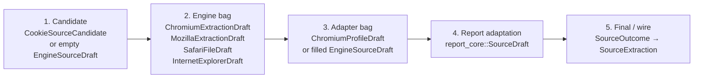
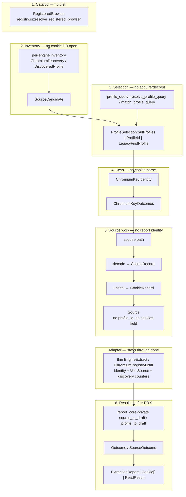
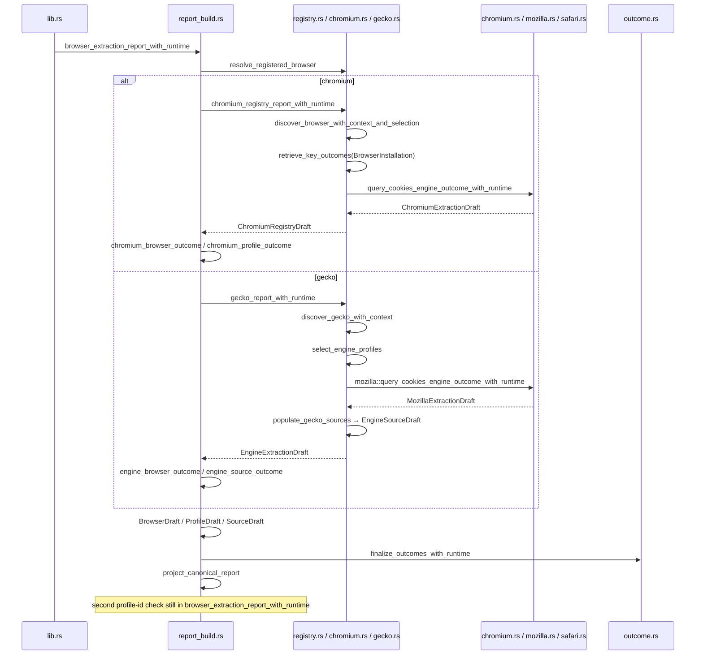
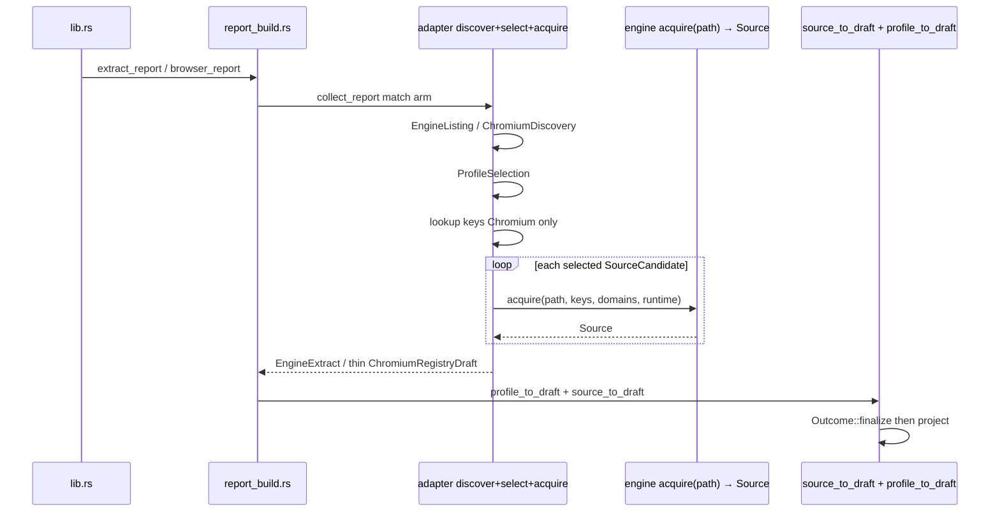
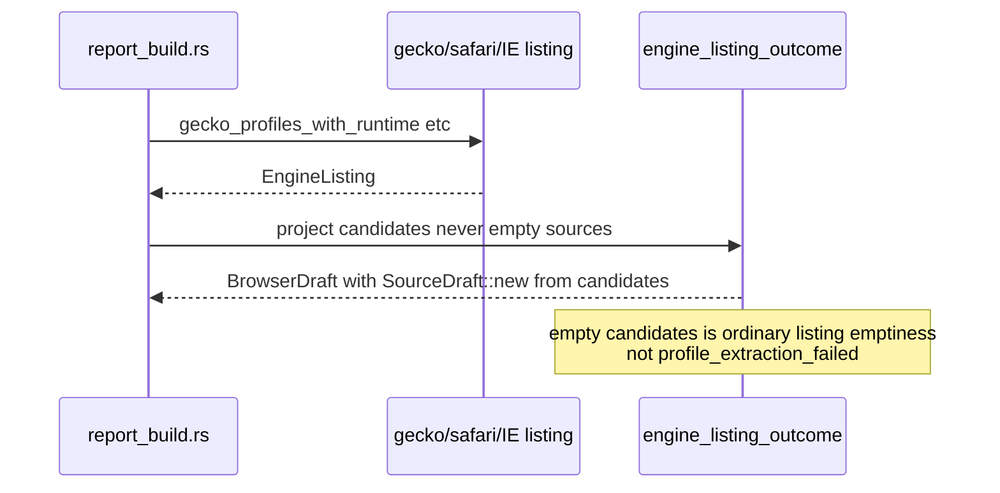

# Stage-boundary refactor of the rookie-rs browser / registry / report pipeline

- **Author:** maintainers
- **Date:** 2026-08-18 (Rev 1) · revised 2026-08-19 (Rev 2 — review feedback + internal constraint lifts; consistency pass)
- **Status:** Draft (Rev 2)
- **Crate:** `rookie-rs` (workspace root `/Users/blackmyth/src/rookie-cookies`, crate path `rookie-rs/`)
- **Release context:** 0.6.0-beta.1 just shipped. This is an internal structure-and-domain-language refactor, not a product feature.
- **Does not revive:** GitHub #260 ("Modularize oversized browser, registry, and report modules"), closed `NOT_PLANNED`. Its design doc was dropped from PR #262. This document is not that epic.

---

## Revision 2 changes (2026-08-19)

Rev 2 folds in review feedback and lifts four **internal** constraints. It lifts nothing external: public API snapshots, the report DTO and `schema/report-dto.schema.json`, `browser_registry.json`, ADR 0001–0004 behavior, direct-path synthetic ids, and every listing byte stay frozen exactly as in Rev 1.

**Public API impact of this revision: none.** Verified against the tree: `report_core::SourceDraft` is `pub(crate)` (`report_core.rs:483`) and absent from `public-api/*.txt`, so making it private to wire projection (PR 9) changes no snapshot; `CookieSourceRoleId` / `CookieSourceFormatId` / `InstallationId` / `ProfileId` are already-public wire vocabulary (`report.rs` re-exports), so reusing them internally adds no surface; golden snapshots are tests, not schema; PR 8 preserves ADR 0001 §8 semantics.

Lifted constraints:

1. **The freeze is now executable.** Per-engine golden report snapshots (new PR 0a) enforce byte-stability in CI, in addition to characterization tests. This is what makes the internal normalizations below safe to attempt. Reports need a path/digest normalization pass to be comparable at all (see PR 0a); build that harness on one engine and prove it before writing the rest.
2. **`report_core`'s adaptation layer is in scope.** After the towers collapse (PR 5), `SourceDraft` stops being a crate-visible hop (new PR 9). End state is three source representations: `SourceCandidate` → `Source` → wire.
3. **The Mozilla walk split is required, not optional.** Former optional PR D is now PR 8 — still a dedicated PR on top of PR 3.
4. **Scaffolding staging is allowed.** The Safari/IE populate control-flow rewrite and the `canonicalize_profile` cookies-branch delete land **before** the type swap (PR 0b / PR 0c), against the old bags, so PR 1 becomes near-mechanical. Alternative 4 stays rejected as an end state; it is permitted once as scaffolding.

Design amendments from review:

- Ids reuse the already-public `report_core::{InstallationId, ProfileId}` (Decision 18) — same pattern as Decision 21; kills the adjacent-`&str` swap hazard in `profile_to_draft` without a second pair of types. Do **not** mint crate-internal twins in `registry.rs`. The wire fields are those newtypes today, not `String`.
- `EngineProfileIdentity` no longer carries selection policy: the six `legacy_*` fields split into `LegacyRank` (Decision 19).
- `Source` embeds `origin: SourceCandidate` instead of copying five join keys; `failure: Option<SourceFailure>` replaces the `error` + `error_stage` sibling pair (Decision 20).
- `SourceCandidate.role` / `format` use the existing public wire vocabulary types instead of `&'static str` (Decision 21).
- The stage boundary gets a permanent regression fence: an xtask boundary lint following the `check-cfg-locations` precedent (Decision 22). This is **not** the rejected size lint.
- Must-move test lists and freeze-table rows are copied into each PR description as a checklist at PR-open time; this document is not the tracking artifact once implementation starts (line references here are as of 2026-08-18 `main` and will rot).
- Decisions 3, 4, 13, 14, 15, 16 amended in place; changes are marked **[Rev 2]**.

Deliberately **not** lifted (would change public behavior or wire bytes): the listing `selected` / `acquisition` / `exists` byte freeze, direct-path synthetic identities (`source_digest` stability), and the public API / DTO / registry / ADR freezes.

**Consistency pass (same day).** Folded in review of Rev 2 against itself and the tree. No new lifts. Fixes: Decision 18 reuses `report_core` id newtypes (the Decision 21 pattern) instead of inventing `registry.rs` twins or claiming wire fields stay `String`; PR 0b is typed against the old `EngineSourceDraft` bag; “done when,” Stage 2 gecko populate, the module table, and the target mermaid describe one end state (post-PR 8/9); leftover “rewrite / cookies-branch delete live in PR 1” sentences retargeted to PR 0b / PR 0c; `check-stage-boundary` lands in PR 1 (the types do not exist in PR 0a); PR 0a includes `internet_explorer_based`.

---

## Overview

The oversized files in `rookie-rs/src/browser/` are a symptom, not the disease. One extraction pipeline is currently described with four vocabularies, so each stage grew its own types and a neighbor translated. A cookie source exists today as five successive bags (`CookieSourceCandidate` / empty `EngineSourceDraft` → `ChromiumExtractionDraft` / `MozillaExtractionDraft` / `SafariFileDraft` → `ChromiumProfileDraft` / filled `EngineSourceDraft` → `report_core::SourceDraft` → `SourceOutcome` / `SourceExtraction`). The word `Draft` names parse scratch, a per-file engine result, a whole-browser adapter result, *and* report adaptation. The word `query` names SQL, "extract this file", and ADR 0003 profile matching.

The refactor introduces compiler-enforced stage types so a value physically cannot carry the next stage's data. `SourceCandidate` has no `cookies`/`records`. `Source` has no `profile_id`. Listing returns a listing type (`DiscoveredProfile` / `EngineListing`) that has no `Vec<Source>` field; extract returns a separate type (`ExtractedProfile` / `EngineExtract`) that has no candidate-placeholder slots. rustc rejects `listing.profiles[i].sources.push(source)` because the field does not exist.

Engines then accept a path and return `Source`. Adapters stay discover + select + acquire into a thin extract bag. After PR 5, `report_build.rs` collapses to one `source_to_draft` plus one `profile_to_draft` and deletes `canonical_direct_*`. **[Rev 2]** PR 9 then makes those helpers private to `report_core`; crate-visible source representations are `SourceCandidate` → `Source` → wire. Public API, `public-api/*.txt`, the report DTO, `browser_registry.json`, and ADR 0001–0004 behavior stay frozen. That freeze is executable from the start: per-engine golden report snapshots (PR 0a) pin listing and extract bytes before any type moves.

This is not a file-carve, not a 600-line budget, and not an engine-plugin trait. Four `match` arms remain acceptable. The missing abstraction is a **data** type. Shared across engines in this program: `SourceCandidate` and `Source`. Inventory installation/profile objects stay per-engine.

---

## Background & Motivation

### Current crate shape

The crate already uses `foo.rs` + `foo/child.rs` (see `registry.rs` + `registry/`, `report_build.rs` + `report_build/dispatch/`, `legacy.rs` + `legacy/dispatch/`, `chromium_crypto/`, `chromium_platform_keys/`). Parents are not `mod.rs` and must not be converted. PR #251 already split Chromium/Gecko production out of `registry.rs` by a verbatim move with explicit imports and minimum `pub(super)`. That recipe is the relocation standard; this program is the domain-language follow-up that #251 deliberately did not attempt.

Clean counterexamples already in tree, and the reason they stay small:

| Module | Why it does not leak |
| --- | --- |
| `browser/chromium_decoder.rs` | Key-free SQLite row decoder. Emits ciphertext-bearing `CookieRecord`. Header forbids key-provider/cipher deps. |
| `browser/unseal.rs` | Only post-decode consumer that combines records with `ChromiumKeyOutcomes`. |
| `browser/cookie_record.rs` | Internal record passed from decode, through unseal, to public projection. `FinalizedCookieRecord` makes encrypted values unrepresentable after finalize. |
| `browser/outcome.rs` | Canonical extraction result. Compatibility and grouped-report views are projections. |
| `browser/legacy.rs` | Policy and result-shape only — no paths, credentials, discovery, acquisition, parsing, or decryption. |
| `browser/registry/profile_query.rs` | ADR 0003 resolver. Header: "Listing drafts only — no key providers." |
| `common/sqlite.rs` | Acquisition capability. Long, but one job. **Do not split for architecture.** |
| `common/boundary.rs` | `Acquire` / `Decoder` / `KeyProvider` / `RecordSink`. The trust-boundary verbs already exist. |

### God-objects of operations (not just big files)

Line counts as of 2026-08-18 `main` (totals match `wc -l`; prod/test splits are approximate):

| File | Total | Prod | Tests | Operations jammed together |
| --- | ---: | ---: | ---: | --- |
| `browser/registry/chromium.rs` | 4747 | 1564 | 3183 | discover, Local State, validate credentials, key lookup, extract, list, `select_chrome_profile` |
| `browser/mozilla.rs` | 4747 | ~1886 true prod + 434 decoder gates | 2433 | named APIs, sqlite decode, session decode, profiles.ini inventory, `select_profile`, engine bag |
| `browser/report_build.rs` | 3990 | 2071 | 1919 | two tower mappers, `canonical_direct_*` fake identities, assemble, listing, `load_report`, `chrome_profile_report`, compatibility family, second profile-id check |
| `browser/chromium.rs` | 3848 | 1023 | 2825 | one real op (`path+keys→records`) exposed as cartesian `query_*` wrappers, then projected via `canonical_direct_chromium_extraction` |
| `browser/registry.rs` | 2947 | ~1173 core + 536 `test_seams` | 1238 | catalog + `DiscoveryFs` + ids + shared extraction language (`Engine*Draft`) |
| `common/sqlite.rs` | 2129 | 1021 | 1108 | **out of scope for this program** |
| `browser/registry/gecko.rs` | 2114 | 668 | 1446 | discover vs `populate_gecko_sources` |
| `browser/safari.rs` | 2079 | 1083 | 996 | BinaryCookies parser **and** Tabs.db inventory |

The size is not "files are long." It is domain-language leakage: each of those operations grew types in the file that happened to call it, and the next file translated.

### Five representations of one cookie source today



Concrete constructors:

1. **Candidate.** Chromium: `CookieSourceCandidate` in `registry/chromium.rs` (`path`, `precedence`, `exists`, `selected` — no cookies). Gecko listing: `gecko.rs::source_candidate()` fills an empty `EngineSourceDraft` (`cookies: Vec::new()`, `records: Vec::new()`, `acquisition_attempts: 0`, `selected: false`, `acquisition: NotAttempted`). Safari listing: the same empty `EngineSourceDraft` stuffed into `EngineProfileDraft.sources` at discover time (`selected: true`, `acquisition: StableFileImage`, `acquisition_attempts: 0`). IE listing: `selected: true`, `acquisition: NotAttempted`, `attempts: 0`.
2. **Engine bag.** `chromium.rs::query_cookies_engine_outcome_with_runtime` → `ChromiumExtractionDraft`. `mozilla.rs::query_cookies_engine_outcome_with_runtime` → `MozillaExtractionDraft` (persistent **and** session, i.e. a profile-level bag). `safari.rs::safari_based_outcome_with_runtime` → `SafariFileDraft`. `internet_explorer.rs::internet_explorer_outcome_with_runtime` → `InternetExplorerDraft`.
3. **Adapter bag.** Chromium: `extract_chromium_with_provider_and_selection_runtime` wraps the engine bag plus `ChromiumProfile` into `ChromiumProfileDraft` inside `ChromiumRegistryDraft`. Gecko: `populate_gecko_sources` **pushes** filled `EngineSourceDraft`s. Safari/IE: `populate_*_sources` **mutates planted slots** in `profile.sources` (double-index, then stop-index truncate).
4. **Report adaptation.** `report_build.rs::chromium_profile_outcome` and `engine_source_outcome` copy those bags into `report_core::SourceDraft`. Listing (`collect_report(..., extract=false)`) feeds the planted empty bags to `engine_browser_outcome` → `engine_profile_outcome`, which iterates `profile.sources` and, if empty, emits `profile_extraction_failed`. Direct-path skips discovery and invents identity in `canonical_direct_*`.
5. **Final/wire.** `finalize_outcomes_with_runtime` → `Outcome` / `SourceOutcome`; `project_canonical_report_*` → `ExtractionReport`; `legacy.rs::project_canonical_outcome_*` → `Vec<Cookie>`.

Each hop is a translator. Translators diverge (Chromium row issues vs Gecko `row_error` strings; listing `selected: false` on Gecko candidates vs `selected: true` on Safari placeholders; Safari listing `stable_file_image` vs Gecko/Chromium `not_attempted`). Those listing bytes are **frozen** (see Stage 2 freeze table), not bugs to fix in PR 1. The compiler cannot see a listing that carries cookies because `EngineProfileDraft.sources` is allowed to hold a filled result.

### Vocabulary collisions this plan resolves

| Word | Current meanings | Target |
| --- | --- | --- |
| **Draft** | parse scratch (`SessionCookieParseDraft`); per-file engine result (`ChromiumExtractionDraft`, `SafariFileDraft`); whole-browser adapter result (`ChromiumRegistryDraft`, `EngineExtractionDraft`); report adaptation (`SourceDraft`, `ProfileDraft`, `BrowserDraft`) | Deleted as an internal name for anything that is already a result. Keep `report_core::SourceDraft` through PR 5 (the comment at `report_core.rs:478` already picked it). **[Rev 2]** PR 9 makes it private to `report_core` wire projection — never public; no snapshot change. Engine-private parse scratch may keep a local name that never crosses a module boundary. |
| **query** | SQL (`common/sqlite.rs`, Chromium `WHERE`); "extract this file" (`query_cookies_engine_outcome`, `gecko_report_with_query`); ADR 0003 profile-name match (`Request::profile`, `resolve_profile_query`) | Internal verb deleted except SQL. Profile matching is `select` / `ProfileQuery`. Engine work is `acquire`. Public `extract` stays. Frozen wire `ExtractionStageCode::query()` is **not** renamed. |
| **extract** vs **populate** vs **query_cookies_engine_outcome** | Chromium registry `extract_chromium_*`; Gecko/Safari/IE `populate_*_sources`; engines `query_cookies_engine_outcome` — the same stage | Internal verb: the stage pipeline (`acquire` / `decode` / `unseal`). `extract` remains the **public** name (`lib.rs::extract`, `extract_report`). |
| **canonical** | browser id (`RegisteredBrowser.canonical_id`); install realpath (`canonical_installation_root`); draft→`Outcome` (`canonical_*_extraction`) | Browser id and install realpath stay. Internal `canonical_*_extraction` deleted in PR 4. Finalize is `Outcome::finalize`. |
| **project** | credentials JSON→key identity (`project_key_credentials`); `CookieRecord`→`Cookie`; `Outcome`→`ExtractionReport`; "call report_build then legacy" | Projection is the last stage only: `Outcome` → `ExtractionReport` / `Cookie[]` / `ReadResult`. Key-identity mapping is `lookup` input, not a projection. |
| **Profile** | eight types (see Data Model) | Per-engine inventory (`DiscoveredProfile`, `ChromiumProfile`, public `MozillaProfile`); selection `ProfileSelection` / `ProfileQuery`; wire `ProfileIdentity` / `ProfileDescriptor`. No shared `Profile` / `Installation` type in this program. |
| **Credentials** | JSON `KeyCredentials` / `MacosKeychainCredential` in `registry/chromium.rs`; runtime `ChromiumKeyCredentials` / `MacosKeychainCredentials` in `chromium_platform_keys` | Identity vs material split is correct. One identity type: `ChromiumKeyIdentity`. Material stays `ChromiumKeyOutcomes`. JSON field names in `browser_registry.json` do not change. |

---

## Goals & Non-Goals

### Goals

- Make listing and extract **types** refuse the next stage's data. `SourceCandidate` has no cookie fields. `Source` has no `profile_id`. `DiscoveredProfile` has no `sources: Vec<Source>`. `ExtractedProfile` is not a listing return type.
- One crate-visible `Source` after unseal: `origin: SourceCandidate` + effective `selected` / `acquisition` + records + stats + `failure: Option<SourceFailure>` + `Vec<SourceIssue>`, **no** `profile_id`, **no** `cookies` field.
- Engines accept a path and return a `Source`. Session lifecycle stays in `SESSION_CANDIDATES` plus the existing mozilla walk until PR 8; crate-visible return becomes `Vec<Source>` in PR 3 without splitting that walk.
- Adapters stay discover + select + acquire into a thin extract bag. `report_build` stops implementing two mapper towers and `canonical_direct_*`. The acquire loop does **not** move into `collect_report` as part of "done when."
- Direct-path is "this path is the only candidate," finalized by a shared helper, not by four identity forgeries in `report_build.rs`.
- `registry.rs` keeps catalog + `DiscoveryFs` + ids + Gecko/Safari/IE adapter bags (`EngineListing` / `EngineExtract`). Shared `Source` / `SourceCandidate` / `SourceStats` live in `browser/source.rs` next to `outcome.rs`.
- Every PR independently compilable, test-green, reviewable. No behavior change to the ADR freeze (see Rollout), including per-engine listing `selected` / `acquisition_strategy`.
- Characterization tests migrate with the production they pin. They are not deleted to make files look smaller.
- **[Rev 2]** Per-engine golden report snapshots land first (PR 0a) and stay byte-identical through every PR.
- **[Rev 2]** Reuse `report_core::{InstallationId, ProfileId}` internally: no new signature carries two adjacent same-typed id strings; no second pair of types in `registry.rs`.
- **[Rev 2]** An xtask boundary lint (`check-stage-boundary`) keeps the listing/extract split from regressing after the program ends.
- **[Rev 2]** End state has three source representations (`SourceCandidate`, `Source`, wire); `SourceDraft` becomes private to `report_core` wire projection in PR 9.

### Non-goals

- Do **not** revive #260: no tests-first file-carve, no `foo.rs` → `foo/mod.rs`, no 600-line prod budget, no allowlist-count epic, no CI size lint.
- Do **not** invent an engine-plugin trait unifying Chromium/Gecko/Safari/IE. Four `match` arms in `collect_report` / `browser_cookies_and_warnings_with_runtime` are fine.
- Do **not** invent a shared `Installation` / `Profile` type. Chromium keeps `BrowserInstallation` / `ChromiumProfile`. Gecko/Safari/IE keep identity fields on `DiscoveredProfile` / `ExtractedProfile`. Only `SourceCandidate` and `Source` are unified.
- Do **not** split Gecko production (`registry/gecko.rs`) or `common/sqlite.rs` for architecture.
- Do **not** add workspace crates.
- Do **not** change public API, `rookie-rs/public-api/*.txt`, the report DTO (`report_core` public structs / `schema/report-dto.schema.json`), `browser_registry.json`, or ADR 0001–0004 behavior.
- Do **not** change cookie handling, redaction, ciphertext precedence, deadline/cancellation, `EncryptedValuePolicy`, or unseal.
- Do **not** flatten all-profile discovery behind named functions; `firefox_profiles()` remains persistent-only `MozillaProfile` (ADR 0002); `read` / `jar` / `from_path` stay as ADR 0004.
- Do **not** convert parents to `mod.rs`.
- Do **not** "fix" Safari listing `selected: true` or listing `stable_file_image` in **any** PR of this program — the bytes are frozen and golden-pinned. Normalizing them on the wire is a public-behavior change deliberately not taken in Rev 2.
- Extracting `mod tests` via `#[cfg(test)] #[path]` is a later **workbench** when a production file is unreviewable, not a goal of this program.
- Relocating the acquire loop into `collect_report` is **not** required for "done when."

---

## Key Decisions

These are locked from the accepted direction. They are not reopened in implementation PRs.

1. **The size problem is domain-language leakage, not file length.** Success is conceptual (one `Source`, listing types without cookie fields, `report_build` without per-engine mappers / `canonical_direct_*`), not a line-count budget. No CI size lint is added.

2. **Six stages; inventory objects stay per-engine.** Catalog `RegisteredBrowser` / resolve. Inventory: per-engine installation/profile shapes plus unified `SourceCandidate` / discover, list. Selection `ProfileSelection` \| `ProfileQuery` / select. Keys: identity `ChromiumKeyIdentity` vs material `ChromiumKeyOutcomes` / lookup. Source work `Source` / acquire, decode, unseal. Result `Outcome` then wire / finalize, then project. Only `SourceCandidate` and `Source` are the unified data types this program introduces. Do not invent a shared `Installation` or `Profile`.

3. **Compiler-enforced listing/extract split in PR 1.** The first PR introduces types that cannot hold the next stage's data:
   - `SourceCandidate` has no `records` / `cookies`.
   - `Source` has no `profile_id`.
   - `DiscoveredProfile { candidates: Vec<SourceCandidate> }` has no `sources` field. Listing functions (`gecko_profiles_with_runtime`, `safari_profiles_with_runtime`, `internet_explorer_profiles_with_runtime`, `discover_*` used for listing) return `EngineListing` (`profiles: Vec<DiscoveredProfile>`).
   - `ExtractedProfile { sources: Vec<Source> }` is not a listing return type. Extract adapters return `EngineExtract`.
   A `SourceCandidate` with a `records` field is a bug in the PR, not a follow-up. A listing function that returns a type with `Vec<Source>` is the same. Field-splitting one mixed `EngineProfileDraft { candidates, sources }` is **not** sufficient as an end state (**[Rev 2]** it is used once as PR 0b scaffolding — a `candidates` field beside `sources: Vec<EngineSourceDraft>` on the old bag — and deleted here; PR 0b does **not** introduce `Source`). Rename-only PRs are out of scope.

4. **Keep `report_core::SourceDraft`; delete `EngineSourceDraft`.** The `SourceDraft` comment already names it as the engine adaptation layer into the shared report builder. `EngineSourceDraft` is the collision (empty candidate **and** filled result). New stage result is `Source`, living in `browser/source.rs` next to `outcome.rs`. **[Rev 2]** `SourceDraft` survives as the crate-visible adaptation type only through PR 5: PR 9 moves `source_to_draft` / `profile_to_draft` into `report_core` as private helpers behind finalize/listing entries that consume identity fields plus `Vec<Source>` (or candidates), and `SourceDraft` becomes a private detail of wire projection. It was never public (`pub(crate)`, absent from `public-api/*.txt`), so this is invisible outside the crate.

5. **`extract` stays the public name.** Internally the stage pipeline uses resolve / discover / select / lookup / acquire / decode / unseal / finalize / project. Delete as internal names: `query` except SQL, `populate`, `canonical_*_extraction`, and `Draft` for anything that is already a result. Frozen wire identifiers (`ExtractionStageCode::query()`, issue codes, `browser_registry.json` keys including `key_credentials`) do not change.

6. **No engine-plugin trait. No new crates. No public API change.** Four match arms remain. `RegisteredBrowser.engine` stays `"chromium" | "gecko" | "safari" | "internet_explorer"`.

7. **Module layout stays `foo.rs` + `foo/child.rs`.** New sibling: `browser/source.rs`. Do not create `browser/registry/mod.rs` or `browser/report_build/mod.rs`. Relocations follow the PR #251 recipe: verbatim bodies, explicit production imports (no production `use super::*;`), minimum `pub(super)` the compiler demands, #218 allowlist only when platform `cfg` actually moves.

8. **`registry.rs` keeps catalog + `DiscoveryFs` + ids + Gecko/Safari/IE adapter bags.** `registered_browsers`, `resolve_registered_browser`, `PlatformId`, `ProfileSelection`, `installation_id` / `profile_id` (return `report_core::{InstallationId, ProfileId}` — Decision 18), `DiscoveryContext`, `RealDiscoveryFs`, `DiscoveryIssue` stay. So do `EngineProfileIdentity`, `DiscoveredProfile`, `ExtractedProfile`, `EngineListing`, and `EngineExtract` (same role `Engine*Draft` has today). Shared extraction **result** (`Source`, `SourceCandidate`, `SourceFailure`, `SourceIssue`, `SourceStats`, `SourceAcquisition`, `SourceFailureStage`) lives in `browser/source.rs`, not here. Chromium bags stay in `registry/chromium.rs`. Do **not** define a second `InstallationId` / `ProfileId` here.

9. **Inventory types leave the decoders; engines accept a path and return a `Source`.** `mozilla::list_profiles_from_str` / `MozillaProfile` and `safari::discover_safari_profiles*` / `SafariProfile` are inventory. The BinaryCookies / sqlite / session / ESE parsers remain engines. End state: decoder files do not own profile listing types.

10. **Direct-path synthetic identity stays byte-for-byte** (`installation_id` `"0"*64`, `profile_id` `"1"*64`, `display_name` `"direct"`, browser id `chromium` / `firefox` / `safari` / `internet_explorer` as today). Construction moves out of `report_build` in PR 4 into one singleton-candidate helper next to `Outcome`. PR 1 may wrap `Source` in the existing `canonical_direct_*` helpers **without** rewriting those literals. Changing the strings would change `source_digest` and is a behavior change.

11. **Characterization tests are the ADR freeze.** Tests such as `legacy_chromium_policy_*`, `legacy_gecko_policy_*`, `load_from_browsers_preserves_source_order`, `gecko_profiles_are_default_first_then_name_and_path`, Chrome `prefer_active_profiles` cases, `profile_query` uniqueness/lossy/ambiguous cases, listing descriptor / Safari `selected` / Gecko session-candidate tests, Safari/IE stop-index tests, `session_only_profile_whose_candidate_vanishes_before_query_has_no_sources_at_this_layer`, `a_gecko_session_candidate_that_vanishes_before_query_is_failed_not_absent`, and the cookies-only finalize fixtures named in Decision 13 move with the types they pin. They are not rewritten to the new names in a way that weakens assertions, and they are not deleted to shrink files.

12. **#218 allowlist is not a capability-leaf registry.** New `*_tests.rs` files that contain platform `cfg` are **grandfathered** in `cfg-location-allowlist.toml` with a one-line reason, never added to `[leaves]`. Production files touched by a move update a ceiling only when cfg actually moves, with a reason in the same PR.

13. **`Source` has no `cookies` field, including under `#[cfg(test)]`.** Characterization tests project from `records` (or a `#[cfg(test)] fn cookies(&self) -> Vec<Cookie>` method that maps records). `SourceCandidate`, `DiscoveredProfile`, and `EngineListing` have no `cookies` field even under `cfg(test)`. `canonicalize_profile`'s cookies-if-records-empty branch (`report_build.rs` ~718–726) is **one shared finalize path**, not an engine-tower vs Chromium-tower delete. **[Rev 2] PR 0c** (before the type swap) migrates every cookies-only `SourceDraft` fixture to also carry `records` (`CookieRecord::from_cookie`) **in the same commit as the delete**. Named fixtures: `completed_source`, `finalization_and_projection_share_runtime_and_keep_completed_partial_sources`, `report_row_counters_reconcile_across_every_backend_adapter`. Do not claim a per-tower delete; do not defer the delete past PR 0c. `engine_source_outcome` / `source_to_draft` may set `SourceDraft.cookies` **from `records`** for `canonicalize_profile`'s secrets walk (`report_build.rs` ~688–691); that is not a substitute for empty `records`. `report_core::SourceDraft.cookies` remains for wire projection after finalize.

14. **Mozilla session lifecycle stays authoritative in `SESSION_CANDIDATES` (`mozilla.rs` symbol; array at line 592).** Intermediate PRs convert `MozillaExtractionDraft` → `Vec<Source>` at the engine function boundary without splitting the walk. The end state is path-in / `Source`-out per candidate. Splitting the walk is **not** PR 1 and is **not** folded into PR 6. **[Rev 2]** The split is **required for “done”** as PR 8 — still its own dedicated PR on top of PR 3, pinned by goldens and with the `SESSION_CANDIDATES` tests moving in that PR alone.

15. **PR 1 is all `EngineSourceDraft` construction sites plus listing projection, not a rename sweep.** It is larger than “one file.” That is required for rustc to enforce the boundary and for `browser_profiles` to stay green. Later optional cleanups (test extract, `query_*` combinatorics, folding `select_chrome_profile` into `profile_query`) can be skipped without blocking the type program. **[Rev 2]** PR 1 is preceded by PR 0a (goldens), PR 0b (Safari/IE populate rewrite against the old bags), and PR 0c (cookies-branch delete), so both intentional body changes are reviewed in isolation and PR 1 itself is a near-mechanical type swap.

16. **Adapters remain discover + select + acquire into a thin bag through PR 4 and after “done.”** PR 5 is one `source_to_draft` plus one `profile_to_draft`. It does **not** relocate the acquire loop into `collect_report`. `profile_to_draft` is defined on the fields `ProfileIdentity` needs, not on `&EngineProfileIdentity`. Chromium does not adopt `EngineProfileIdentity`. **[Rev 2]** Its id arguments are the existing `report_core::{InstallationId, ProfileId}` (Decision 18), so transposed ids are a compile error.

17. **[Rev 2] Golden snapshots are the executable freeze (PR 0a).** One fixture per engine (and per direct-path entry point, including `internet_explorer_based`): listing report and extract report, **normalized** JSON, byte-compared. Reports are not byte-stable as captured — paths are temp-dir-randomized and the opaque `installation_id` / `profile_id` are SHA-256 over path bytes — so the golden tokenizes the root spellings and ranks the ids. **Proven by spike on 2026-08-19** (see PR 0a): two different synthetic roots produce byte-identical normalized JSON across separate processes. Every subsequent PR must leave them byte-identical; a golden change requires an explicit re-golden commit with a reason. Characterization tests remain and still migrate with production — goldens are the belt over those braces, and they are what makes the internal normalizations in Decisions 19–21 safe.

18. **[Rev 2] Ids reuse the existing public newtypes.** `report_core::{InstallationId, ProfileId}` already exist (`report_core.rs:150–151`), are re-exported from `report.rs`, already type `ProfileIdentity` on the wire, and are already in every `public-api/*.txt` snapshot. They are the same class of vocabulary type as `CookieSourceRoleId` / `CookieSourceFormatId` (Decision 21). Reuse them internally — do **not** mint a second pair in `registry.rs`. Today's `installation_id` / `profile_id` helpers keep producing the same hex and return the report_core newtypes (`FromStr` / `known`). Inventory structs that already carry both (`EngineProfileIdentity`, `ChromiumProfile`) store those types rather than `String`. Any new signature carrying both takes those types — never two adjacent `&str` ids. `ProfileSelection::ProfileId(&'a str)` stays the existing policy variant (one id, not a second type). Snapshots do not change: the types are already on the wire.

19. **[Rev 2] `EngineProfileIdentity` is identity only; `LegacyRank` carries first-profile policy.** The six `legacy_*` fields move to `LegacyRank`, a sibling field on `DiscoveredProfile` / `ExtractedProfile`. ADR 0002 selection-policy inputs do not ride in a type named Identity.

20. **[Rev 2] `Source` embeds its provenance.** `origin: SourceCandidate` replaces the five copied join keys, so they cannot diverge from inventory. `selected` and `acquisition` remain effective fields on `Source` because extract legitimately overwrites them (Gecko persistent select at populate; IE `EseDatabase` overlay); the frozen listing values stay readable on `origin`. `failure: Option<SourceFailure { stage, message }>` replaces `error: Option<String>` + sibling `error_stage`, making a failure stage without an error unrepresentable. `failed` is still derived (`failure.is_some()`), never stored.

21. **[Rev 2] `role` / `format` are the wire vocabulary types from construction.** `SourceCandidate` uses the already-public `CookieSourceRoleId` / `CookieSourceFormatId` (report_core `vocabulary!`) instead of `&'static str`; strings appear only at the wire, emitted by the existing code paths. PR 1 touches every construction site anyway, so this is the cheapest moment. No new strings, no byte changes.

22. **[Rev 2] The boundary gets a permanent fence.** A small xtask check, `check-stage-boundary` (same family as `check-cfg-locations`), fails CI if the listing types (`SourceCandidate`, `DiscoveredProfile`, `EngineListing`, `ChromiumProfile`) gain `cookies` / `records` / `Vec<Source>` fields, or `Source` gains a `cookies` field — including under `#[cfg(test)]` (the `#[cfg(test)] fn cookies()` *method* from Decision 13 stays allowed). This is an identifier lint on named structs, not the rejected size lint (Decision 1 stands). **Lands in PR 1**, when those types first exist — not in PR 0a. Compile-fail (trybuild) tests were considered and rejected: the boundary types are `pub(crate)`, and exposing a test-support surface to an external test crate would bleed into the public-api snapshots.

---

## Proposed Design

### Target language

```
Catalog        RegisteredBrowser
Inventory      per-engine installation/profile + SourceCandidate   (no cookies/records)
               Chromium: BrowserInstallation, ChromiumProfile
               Gecko/Safari/IE: DiscoveredProfile (no shared Installation type)
Selection      ProfileSelection | ProfileQuery
Key identity   ChromiumKeyIdentity                        (today: *Credentials)
Key material   ChromiumKeyOutcomes
Source result  Source     origin: SourceCandidate + records + stats + Vec<SourceIssue>
Extract bag    EngineExtract / thinned ChromiumRegistryDraft   (identity + Vec<Source>)
Final          Outcome
Published      ExtractionReport | Cookie[] | ReadResult
```

Public leftovers stay as **projections**: `MozillaProfile` from inventory (ADR 0002 `firefox_profiles()`); eight-field `Cookie` from `Outcome`. `ProfileIdentity` / `ProfileDescriptor` / `SourceExtraction` remain the report DTO.

Internal verbs: resolve, discover, select, lookup, acquire, decode, unseal, finalize, project.

### Target pipeline



Through PR 5 the same arrows exist, but `source_to_draft` / `profile_to_draft` still live in `report_build`. PR 9 moves them behind `report_core` finalize/listing entries; crate-visible source representations are then exactly `SourceCandidate` → `Source` → wire.

### Current vs target call graph for a generic report

**Today** (`lib.rs::extract_report` → `report_build::browser_extraction_report_with_runtime` → `collect_report`):



**Target (done when):** same public function. Adapters still discover + select + acquire. `collect_report` does **not** own the acquire loop. Through PR 5, `report_build` only adapts thin bags and finalizes. After PR 9 the copy helpers live in `report_core`; `report_build` orchestrates.



**Listing (`extract=false` / `browser_profiles`):**



`legacy.rs` continues to call the extract adapter with `ProfileSelection::LegacyFirstProfile` and project `Outcome` → `Vec<Cookie>`. It still owns no paths or credentials.

### Stage 1 — Catalog

**Stays in `registry.rs`.**

- `RegisteredBrowser`, `registered_browsers()`, `resolve_registered_browser()`
- `BrowserDefinition` / `key_credentials: Option<chromium::KeyCredentials>` (JSON). Runtime identity type is renamed later; the JSON field name does not change.
- `capability_descriptor` (declared vs available tiers). The v20-overclaim comment at `registry.rs:72` remains load-bearing.
- Catalog **must not touch disk**. `supported_browsers()` already doesn't (`report_build::supported_browser_descriptors` → `registered_browsers`).

No new catalog types. `ProfileSelection` stays here because it is the policy applied *before* acquire (ADR 0002).

### Stage 2 — Inventory

**Object:** per-engine installation/profile plus unified `SourceCandidate`. **Must not** open a cookie DB for cookies. Safari Tabs.db and Chromium Local State are inventory metadata, not cookie sources; they may be read. Cookie SQLite/BinaryCookies/ESE files are not.

#### Unified leaf types (`browser/source.rs`)

`source.rs` owns **only** the cookie-source leaf types. It does not own profile identity, listing bags, or extract bags (`DiscoveryIssue` lives in `registry.rs`; putting `EngineListing` here would couple `source.rs` to catalog/discovery or fork `DiscoveryIssue`).

```rust
/// Inventory: a cookie source that may exist on disk.
/// Must not carry cookies, records, stats, or issues.
#[derive(Debug, Clone, PartialEq, Eq)]
pub(crate) struct SourceCandidate {
  pub(crate) path: PathBuf,
  /// [Rev 2] Wire vocabulary from construction (Decision 21), not &'static str.
  pub(crate) role: CookieSourceRoleId,
  pub(crate) format: CookieSourceFormatId,
  pub(crate) precedence: u16,
  /// Chromium listing skips `!exists`. Gecko/Safari/IE planted candidates
  /// freeze `exists: true` (being listed already meant the path was discovered).
  pub(crate) exists: bool,
  pub(crate) selected: bool,
  /// Listing metadata, frozen per engine (see table below).
  /// Not “how the cookie DB was opened” — that lives on `Source.acquisition`
  /// after a query returns.
  pub(crate) acquisition: SourceAcquisition,
}
```

Also in `source.rs`: `Source`, `SourceFailure`, `SourceIssue`, `SourceStats`, `SourceAcquisition`, `SourceFailureStage` (Stage 5). **[Rev 2]** `role` / `format` are the already-public wire vocabulary types `CookieSourceRoleId` / `CookieSourceFormatId` from construction (Decision 21); the report adaptation stops parsing strings, and the wire emits the same bytes through the existing code paths.

#### Adapter listing/extract bags (`registry.rs`)

Gecko/Safari/IE adapter bags stay in `registry.rs` (same role `Engine*Draft` has today). Chromium bags stay in `registry/chromium.rs` (`ChromiumDiscovery`, `ChromiumListing`, `ChromiumProfile`, `CookieSourceCandidate`, `ChromiumRegistryDraft`).

```rust
/// Identity fields shared by Gecko/Safari/IE listing and extract profile types.
/// This is a field bundle, not a stage object and not a public Profile.
/// Chromium does not adopt it (`ChromiumProfile` keeps directory_name /
/// display_name / is_active / is_last_used).
/// [Rev 2] Identity only — first-profile policy inputs live in `LegacyRank`.
pub(crate) struct EngineProfileIdentity {
  pub(crate) profile_id: ProfileId,           // [Rev 2] report_core newtype (Decision 18)
  pub(crate) installation_id: InstallationId, // [Rev 2] report_core newtype
  pub(crate) installation_priority: u16,
  pub(crate) installation_path: PathBuf,
  pub(crate) name: String, // → ProfileIdentity.display_name
  pub(crate) path: PathBuf,
  pub(crate) is_default: bool,
  pub(crate) persistent_source_discovered: bool,
}

/// [Rev 2] ADR 0002 LegacyFirstProfile ranking inputs — Stage 3 policy data,
/// split from identity (Decision 19). `select_engine_profiles` and the
/// legacy-first sort read this; report identity never does.
pub(crate) struct LegacyRank {
  pub(crate) legacy_installation_priority: u16,
  pub(crate) legacy_profile_order: usize,
  pub(crate) legacy_is_default: bool,
  pub(crate) legacy_eligible: bool,
  pub(crate) legacy_installation_path: PathBuf,
  pub(crate) legacy_name: String,
}

/// Listing return profile. rustc: no place to put a Source.
pub(crate) struct DiscoveredProfile {
  pub(crate) identity: EngineProfileIdentity,
  pub(crate) legacy: LegacyRank,
  pub(crate) candidates: Vec<SourceCandidate>,
}

/// Extract return profile. Not returned by listing functions.
pub(crate) struct ExtractedProfile {
  pub(crate) identity: EngineProfileIdentity,
  pub(crate) legacy: LegacyRank,
  pub(crate) sources: Vec<Source>,
}

/// Shared discover counters. Both bags embed this so listing/extract cannot
/// diverge on `all_detected_roots_failed` (detected > 0 && enumerated == 0).
pub(crate) struct DiscoveryCounters {
  pub(crate) installations_discovered: usize,
  pub(crate) installations_detected: usize,
  pub(crate) installations_enumerated: usize,
}

pub(crate) struct EngineListing {
  pub(crate) profiles: Vec<DiscoveredProfile>,
  pub(crate) discovery_issues: Vec<DiscoveryIssue>,
  pub(crate) counters: DiscoveryCounters,
  pub(crate) boundary_stop: Option<BoundaryStop>,
}

/// Thin adapter extract bag. Survives through “done when.”
pub(crate) struct EngineExtract {
  pub(crate) profiles: Vec<ExtractedProfile>,
  pub(crate) discovery_issues: Vec<DiscoveryIssue>,
  pub(crate) counters: DiscoveryCounters,
  pub(crate) boundary_stop: Option<BoundaryStop>,
}
```

`EngineProfileIdentity` + `LegacyRank` are a convenience so listing and extract do not duplicate these fields. Neither is the missing shared `Profile` stage object. **[Rev 2]** The split (Decision 19) keeps ADR 0002 selection-policy inputs out of a type named Identity; behavior of the legacy-first rank is unchanged.

Chromium already has the listing/extract split this program is giving Gecko/Safari/IE: `ChromiumProfile` + `CookieSourceCandidate` vs `ChromiumProfileDraft`. Chromium listing stays on `ChromiumListing` / `chromium_listing_outcome` in PR 1. Converging `CookieSourceCandidate` onto `SourceCandidate` is allowed in PR 2 if small; not required for PR 1.

`canonical_installation_root` and `installation_root_is_directory` take `&mut EngineListing` only. Discover never produces `EngineExtract`. Populate copies `discovery_issues` + `DiscoveryCounters` from the listing into the extract bag. `legacy.rs::discovery_failure` becomes a function of `(issues, counters, profiles_empty, browser_id)` used by both bags (`firefox_profiles` listing; extract paths that still need the string). `retain_completed_engine_work` and `engine_skipped_row_count` stay on `EngineExtract`.

#### Listing `selected` / `acquisition` / `exists` freeze

Do **not** unify these in PR 1. `SourceCandidate.acquisition` exists so Safari's listing `StableFileImage` is representable. `engine_listing_outcome` copies `selected` / `acquisition` through `acquisition_code`.

**`exists`:** every Gecko/Safari/IE planted candidate freezes `exists: true`. `engine_listing_outcome` projects **all** candidates (no `exists` filter), matching today's “if it is on `sources`, it is a descriptor.” Chromium listing **keeps** its own `!exists` skip (`chromium_listing_outcome` ~633–636). Do not copy the Chromium filter onto the engine listing path: a default `exists: false` would drop every Gecko/Safari/IE source descriptor from `browser_profiles`.

| Engine | Listing constructor today | `selected` | `acquisition` | `exists` | Listing projection |
| --- | --- | --- | --- | --- | --- |
| Gecko | `gecko.rs::source_candidate` (`gecko_profiles_with_context` only) | `false` | `NotAttempted` | **`true`** (planted ⇒ discovered) | `engine_listing_outcome` over **all** `candidates` |
| Safari | `registry/safari.rs` discover plant | `true` | `StableFileImage` | **`true`** | same; extract reports pin `acquisition_strategy == stable_file_image()` (`a_real_safari_profile_reaches_the_frozen_report`) |
| IE | `registry/internet_explorer.rs` discover plant | `true` | `NotAttempted` | **`true`** | same |
| Chromium | `CookieSourceCandidate` | first existing is selected | n/a on candidate | real `exists` field | `chromium_listing_outcome` **skips** `!exists`; always emits `AcquisitionStrategyCode::not_attempted()` |

Extract inherits listing `selected` unless the engine walk overwrites it (Gecko persistent becomes `selected: true` at populate; Gecko session `selected` comes from the mozilla walk). Safari extract keeps `selected: true` and `StableFileImage` from the candidate and overlays records/attempts/errors. IE extract **overwrites** acquisition to `EseDatabase` after a query attempt (today's populate). Preserve that overlay.

#### How listing vs extract is enforced

| Function | Today returns | After PR 1 |
| --- | --- | --- |
| `discover_gecko_with_context` | `EngineExtractionDraft` (**sources empty**; does **not** plant session candidates) | `EngineListing` with identity + `candidates: vec![]` (or only `persistent_source_discovered`). **Does not plant session candidates.** |
| `gecko_profiles_with_context` / `_with_runtime` | `EngineExtractionDraft` with empty `EngineSourceDraft`s in `sources` | `EngineListing` (`candidates` filled; `exists: true`) |
| `legacy_gecko_profiles_with_runtime` | `EngineExtractionDraft` | `EngineListing` (then `legacy.rs` projects `MozillaProfile`) |
| `safari_profiles_with_runtime` / IE listing | `EngineExtractionDraft` | `EngineListing` |
| `select_engine_profiles` | mutates `EngineExtractionDraft` | mutates `EngineListing` |
| `populate_gecko_sources` | mutates the same bag; **path/query-based** (does not iterate planted `sources`) | takes `EngineListing`, returns `EngineExtract`. **Through PR 7:** path/query-based — do **not** iterate `candidates`. **After PR 8:** candidate-driven (walk split). 1:1 empty `sources` / `profile_extraction_failed` still hold either way. |
| rewritten Safari/IE populate | mutates planted `sources` slots | takes `EngineListing`, **iterates `candidates`**, returns `EngineExtract` |
| `gecko_report_with_runtime` / safari/IE report | `EngineExtractionDraft` | `EngineExtract` |
| `collect_report(..., extract=false)` | `engine_browser_outcome(listing bag)` | **`engine_listing_outcome(EngineListing)`** |
| `collect_report(..., extract=true)` | `engine_browser_outcome(extract bag)` | `engine_browser_outcome(EngineExtract)` |

**Gecko populate 1:1 profiles (ADR-visible).** Today `discover_gecko_with_context` admits a session-only profile (`gecko_profile_has_source`) with **empty** `sources`. `populate_gecko_sources` mutates that same bag and, if the session file vanishes, **leaves the profile in `profiles` with `sources == []`** (`gecko.rs` `session_only_profile_whose_candidate_vanishes_before_query_has_no_sources_at_this_layer`). `engine_profile_outcome` then emits `profile_extraction_failed` so the report is `failed` with `profiles_discovered == 1`, not `no_sources` (`report_build.rs` `a_gecko_session_candidate_that_vanishes_before_query_is_failed_not_absent`). After PR 1:

1. `discover_gecko_with_context` returns `EngineListing` with identity + empty/unplanted session candidates (or only `persistent_source_discovered`). It does **not** plant session candidates.
2. **Through PR 7**, `populate_gecko_sources` stays path/query-based. It must **not** iterate `candidates` the way Safari/IE populate does. Unifying gecko with the Safari candidate loop before the walk split would extract from discover (`candidates: vec![]`) and emit nothing.
3. Output `EngineExtract.profiles` is **1:1 with the post-select listing**, including `sources: vec![]` when the query pushed nothing. Do not “only push profiles that have sources.”
4. `engine_profile_outcome` / `profile_to_draft` still treat that empty extract profile as `profile_extraction_failed`.
5. **[Rev 2] After PR 8** the walk is candidate-driven and the path/query-only exception goes away. Populate may then iterate `candidates`. Items 3–4 still hold: 1:1 with the post-select listing, empty `sources` is still `profile_extraction_failed`.

`engine_listing_outcome` projects **every** `SourceCandidate` as `SourceDraft::new(..., acquisition_code(candidate.acquisition))` using `candidate.selected`. No `exists` filter. It must **never** treat empty `candidates` as `profile_extraction_failed`. That error remains extract-only, on an `ExtractedProfile` whose `sources` is empty after a source present at discovery vanished.

`profile_query.rs::engine_candidate` reads `DiscoveredProfile.candidates` for persistent paths. rustc rejects reading `.sources` on a listing profile. `gecko_profiles_with_context` (not discover) is what fills those listing candidates.

`retain_completed_engine_work` applies only to `EngineExtract` **on `boundary_stop`**: drop uncommitted `Source`s (`acquisition_attempts == 0` must not appear — populate pushes only after a query returns) and drop profiles with empty `sources` **because of the stop**. It must **not** run on the vanish-before-query path (no stop): that profile stays in `EngineExtract.profiles` with `sources: vec![]`. Listing never constructs `Source`, so it cannot fabricate a successful zero-row source.

**[Rev 2] Regression fence.** `cargo run -p xtask --locked -- check-stage-boundary` (Decision 22) fails CI if the listing types (`SourceCandidate`, `DiscoveredProfile`, `EngineListing`, `ChromiumProfile`) gain `cookies` / `records` / `Vec<Source>` fields, or `Source` gains a `cookies` field — including under `#[cfg(test)]`. The boundary outlives the program as a CI property, not a social rule.

#### Inventory that must leave the decoder files (PR 6)

| Today | Owner today | Target owner |
| --- | --- | --- |
| `mozilla::list_profiles_from_str` / `list_profiles` / `MozillaProfile` | `mozilla.rs` | Parser may stay as a function gecko discovery calls; `MozillaProfile` remains the **public** projection. Gecko inventory already consumes it. |
| `mozilla::select_profile` | `mozilla.rs`, `#[cfg(test)]` | Leftover of the pre-ADR 0003 Firefox API. Keep as a unit test helper or delete once its tests are expressed via `match_profile_query`. Not a production path. |
| `safari::SafariProfile`, `discover_safari_profiles_with_runtime`, Tabs.db / directory fallback | `safari.rs` | Move to `registry/safari.rs`. `safari.rs` keeps BinaryCookies parse + `safari_based`. |
| Chromium Local State (`parse_local_state`, `prefer_active_profiles`) | `registry/chromium.rs` | Already inventory. Stays. |

Safari Tabs.db is a SQLite read of profile UUID/title, not cookie acquisition. It may use `sqlite::with_browser_database_with_runtime`. It must not produce `CookieRecord`s.

### Stage 3 — Selection

**Must not acquire or decrypt.**

Types already correct:

- `ProfileSelection<'a> { AllProfiles, ProfileId(&'a str), LegacyFirstProfile }` in `registry.rs`. Applied by `select_engine_profiles` on `EngineListing` (Gecko/Safari/IE) and `discover_browser_with_context_and_selection` / the filter inside `extract_chromium_with_provider_and_selection_runtime` (Chromium, including the `legacy_profile_id` rank over `legacy_priority` × profile group × source precedence).
- `ProfileMatchCandidate` + `resolve_profile_query` + `match_profile_query` in `profile_query.rs` (ADR 0003 + cookie-DB path key from ADR 0004). Unique match against opaque id, display name, directory name, non-lossy full path, persistent cookie-DB path. Zero/more-than-one is `RequestError`. Lossy display path is not a key. Last-used / channel / `is_default` are not tie-breaks.

`select_chrome_profile_with_runtime` in `registry/chromium.rs` reimplements the ADR 0003 matcher. **Optional follow-on PR C:** fold it into `profile_query`. `chrome_profiles()` last-used preference (`prefer_active_profiles`) stays frozen and stays Chromium-specific.

`report_build::browser_extraction_report_with_runtime` still contains a second profile-id check for "registered browser whose engine has no adapter compiled into this build." That check stays. It is not selection policy; it is the compiled-out-adapter boundary.

### Stage 4 — Keys

Identity vs material is already the right split. Duplication and home are not.

| Layer | Today | Target |
| --- | --- | --- |
| JSON (registry load) | `registry/chromium.rs::KeyCredentials` / `MacosKeychainCredential` | Serde DTO may keep those field names because `browser_registry.json` is frozen. Immediately projected into the runtime identity type. `validate_key_credentials` stays on registry load. |
| Runtime identity | `chromium_platform_keys::{ChromiumKeyCredentials, MacosKeychainCredentials}` | **Rename** to `ChromiumKeyIdentity` (PR 7). One type, one home: `chromium_platform_keys`. |
| Material | `chromium_crypto::ChromiumKeyOutcomes` `{ v10, v11, v20 }` | Unchanged. |
| Lookup | `HostKeySession::retrieve`, `KeyProvider<BrowserInstallation>` | Unchanged verbs. `chromium_key_credentials` (returns `config::Browser` for deprecated unix wrappers) stays a projection of identity. |

`BrowserInstallation.key_credentials` is identity, correctly stored on the installation during inventory. `extract_chromium_*` must not parse cookies before `retrieve_key_outcomes`. That order is already implemented; the refactor must not invert it.

### Stage 5 — Source work

**Object:** `Source`. **Verbs:** acquire, decode, unseal. **Must not** invent report identity.

```rust
/// Post-unseal source work. No profile_id, installation_id, display_name, or cookies.
pub(crate) struct Source {
  /// [Rev 2] Provenance (Decision 20): the candidate this result came from.
  /// Immutable join keys (path, role, format, precedence) and the frozen
  /// listing metadata are read through here and cannot diverge from inventory.
  /// source_to_draft and finalize_singleton_source use these; this is not a
  /// second inventory bag.
  pub(crate) origin: SourceCandidate,
  /// Effective values. Extract legitimately overwrites the listing values
  /// (Gecko persistent select at populate; IE EseDatabase overlay after a
  /// query attempt); the listing values stay readable on `origin`.
  pub(crate) selected: bool,
  pub(crate) acquisition: SourceAcquisition,

  pub(crate) records: Vec<CookieRecord>,
  pub(crate) stats: SourceStats, // copies; source_to_draft does not recompute from cookies
  pub(crate) acquisition_attempts: u32,
  pub(crate) diagnostics: Vec<String>, // retry notes → source_read_retried
  /// [Rev 2] Decision 20: a failure stage without an error is unrepresentable.
  pub(crate) failure: Option<SourceFailure>,
  pub(crate) issues: Vec<SourceIssue>,
}

/// [Rev 2] Replaces `error: Option<String>` + sibling `error_stage`.
pub(crate) struct SourceFailure {
  pub(crate) stage: SourceFailureStage,
  pub(crate) message: String,
}

/// Row accounting on Source. `acquisition_attempts` stays a sibling field on
/// `Source` (same as today's EngineSourceDraft / ChromiumExtractionDraft).
/// `source_to_draft` copies this struct into `ExtractionStats` (plus attempts);
/// it does not recompute `cookies_emitted` from `SourceDraft.cookies`.
pub(crate) struct SourceStats {
  pub(crate) rows_seen: usize,
  pub(crate) cookies_emitted: usize,
  pub(crate) rows_skipped: usize,
  pub(crate) rows_rejected: usize,
  pub(crate) provider_failures: usize,
}

/// Crate-private. Not report_core::ExtractionIssue.
/// Preserves Chromium provider/tier/retryability/samples so source_to_draft only copies.
pub(crate) struct SourceIssue {
  pub(crate) code: &'static str,
  pub(crate) stage: ExtractionStageCode,
  pub(crate) severity: IssueSeverityCode,
  pub(crate) message: String,
  pub(crate) occurrences: u32,
  pub(crate) samples: Vec<String>,
  pub(crate) provider: Option<String>,
  pub(crate) tier: Option<String>,
  pub(crate) cause: Option<String>,
  pub(crate) retryability: Retryability,
}

impl Source {
  #[cfg(test)]
  pub(crate) fn cookies(&self) -> Vec<Cookie> {
    self.records
      .iter()
      .cloned()
      .filter_map(|record| record.into_cookie().ok())
      .collect()
  }
}
```

`failed` is **not** stored on `Source`. `source_to_draft` sets `SourceDraft.failed` from `source.failure.is_some()`.

`compatibility_evidence` is **not** a field on `Source`. Chromium `legacy_error` / `CompatibilityEvidence::AllRowsRejected` is folded into `SourceIssue` (distinguished `cause` or code the copy helper maps back to `CompatibilityEvidence` in `source_to_draft` / `canonicalize_profile`). Until PR 2, only the Chromium tower still uses `ChromiumProfileDraft.legacy_error`.

`SourceAcquisition` and `SourceFailureStage` move from `registry.rs` to `source.rs` (re-export from `registry` for one PR if import churn needs a landing pad). `report_core::SourceDraft` is **not** this type.

**Who fills `SourceStats`:** Gecko/Safari/IE set `cookies_emitted = records.len()`, `provider_failures = 0` when constructing `Source` (PR 1). Chromium copies `ChromiumExtractionStats` (`rows_seen`, `cookies_emitted`, `rows_skipped`, `rows_rejected`, `provider_failures`) in PR 2. Do not derive `cookies_emitted` from `cookies.len()` after records-only `Source` — that is today's `engine_source_outcome` records-empty fallback and dies with the cookies-if-records-empty branch.

Gecko/Safari/IE `row_read_failed` (including “skipped without a row error”) is produced at the adapter/engine boundary when constructing `Source` (PR 1 helper, e.g. `push_row_read_failed(&mut source)`). Pin `skipped_rows_without_a_row_error_still_degrade_the_report` and `a_source_that_skipped_nothing_reports_no_row_issue` to that helper. `source_to_draft` does not re-derive issues from `rows_skipped`.

#### Engine contract

| Engine | Today | Target |
| --- | --- | --- |
| Chromium | `query_cookies_engine_outcome_with_runtime(...) -> ChromiumExtractionDraft` | Same arguments, returns `Source`. Decode remains `chromium_decoder`; unseal remains `unseal_chromium_record`. PR 2 maps `ChromiumRowIssue` → `SourceIssue` in the Chromium engine (`row_issue()` moves next to that conversion). |
| Mozilla | `query_cookies_engine_outcome_with_runtime(db_path, ...) -> MozillaExtractionDraft` (walks session candidates from the profile directory) | Crate-visible return becomes `Vec<Source>` in PR 3. Walk stays private. `SESSION_CANDIDATES` remains SoT for relative paths and formats. |
| Safari | `safari_based_outcome_with_runtime(...) -> SafariFileDraft` | `Source` in PR 3. Parser stays. |
| IE | `internet_explorer_outcome_with_runtime(...) -> InternetExplorerDraft` | `Source` in PR 3. |

`chromium.rs` cartesian `query_*` wrappers are optional follow-on PR A.

Named public functions stay as projections: acquire `Source` for the explicit path, finalize as a singleton candidate, `legacy::project_canonical_outcome_*`.

### Stage 6 — Result

**Finalize, then project. Must not rediscover.**

`report_core::SourceDraft` stays as the adaptation layer (Decision 4). Today two functions copy two bags into it:

- `chromium_profile_outcome(ChromiumProfileDraft) -> ProfileDraft`
- `engine_source_outcome(EngineSourceDraft) -> SourceDraft` plus `engine_profile_outcome` (empty `sources` → `profile_extraction_failed`)

**Done when:**

```rust
fn source_to_draft(source: Source) -> SourceDraft

/// Fields ProfileIdentity actually needs, plus browser_id from the caller.
/// Chromium does not adopt EngineProfileIdentity.
fn profile_to_draft(
  browser_id: &BrowserId,
  installation_id: &InstallationId, // [Rev 2] report_core newtypes (Decision 18):
  profile_id: &ProfileId,           // transposed ids are a compile error
  display_name: &str,
  path: &Path,
  is_default: bool,
  sources: Vec<Source>,
) -> Result<ProfileDraft>
```

Display-name mapping: `EngineProfileIdentity.name` → `display_name`; `ChromiumProfile.display_name` → `display_name`. Callers pass those strings; `profile_to_draft` does not take `&EngineProfileIdentity` or `&ChromiumProfile`.

`source_to_draft` copies `SourceIssue` → `ExtractionIssue`, `SourceAcquisition` → `AcquisitionStrategyCode`, diagnostics → `source_read_retried`, `failure` (stage + message) → `source_extraction_failed`, `SourceStats` → `ExtractionStats` (no recompute from `cookies`), and derives `failed`. It may set `SourceDraft.cookies` from `records` for the secrets walk. It does not inspect `ChromiumRowIssue` and does not re-derive `row_read_failed` from counters.

`profile_to_draft` builds `ProfileIdentity` from the arguments above and appends `source_to_draft` results. Extract-only: empty `sources` after a discovered source vanished still raises `profile_extraction_failed` (Gecko vanish-before-query 1:1 empty `ExtractedProfile`). Listing never calls this with that meaning.

`BrowserDraft` is `report_build`'s private per-browser assembly state through PR 5. Through and after “done,” it is filled from **thin adapter bags** (`EngineExtract`, thinned `ChromiumRegistryDraft`), not by `collect_report` calling `acquire(path)` in a loop. **[Rev 2]** PR 9 moves draft construction (`source_to_draft` / `profile_to_draft` / listing drafts / `BrowserDraft`) into `report_core` as private helpers; `report_build` keeps `collect_report`, orchestration, finalize hand-off, and projection.

**[Rev 2] PR 9 — the last translator goes private.** After PR 5, `source_to_draft` / `profile_to_draft` and the listing draft construction move into `report_core` as private helpers behind finalize/listing entries that consume identity fields plus `Vec<Source>` (or candidates). `SourceDraft` / `ProfileDraft` stop being crate-visible; the crate-visible source representations are then exactly `SourceCandidate`, `Source`, and the wire DTO. `SourceDraft` is `pub(crate)` today and absent from `public-api/*.txt`, so this changes no snapshot. The secrets walk and issue aggregation (`MAX_ISSUE_SAMPLES`) move verbatim.

`Outcome::finalize` / `SourceOutcome` / `FailureLedger` / `CompatibilityDecision` stay. `legacy.rs` stays the cookie projector. `read.rs` stays the ADR 0004 projector.

#### Direct-path

Today `canonical_direct_chromium_extraction_impl`, `canonical_direct_mozilla_extraction_impl`, and `canonical_direct_engine_source` each mint

```text
browser_id:      engine-specific ("chromium" / "firefox" / "safari" / "internet_explorer")
installation_id: "0" × 64
profile_id:      "1" × 64
display_name:    "direct"
path:            parent of the file
```

**PR 1:** those functions still live in `report_build` and still mint those literals. They wrap `Source` instead of `EngineSourceDraft` via the existing shared `canonical_direct_engine_source` (Safari/IE already share it; Mozilla can keep its own persistent+session assembly). Do not rewrite the four identity forgeries in PR 1.

**PR 4:** one helper next to `outcome.rs` / `source.rs`:

```rust
pub(crate) fn finalize_singleton_source(
  browser_id: &str,
  path: &Path,
  source: Source,
  runtime: Option<&BoundaryRuntime<'_>>,
) -> Result<Outcome>
```

`report_build.rs` deletes `canonical_direct_*`. Join keys on `Source` are used as-is (`selected` plus `origin` path / role / format / precedence — Decision 20). Do not change the synthetic id strings (Decision 10).

#### Orchestration

`collect_report` keeps the four engine match arms (plus `dispatch::remaining_engine_report` for Safari/IE).

- `extract=true` → adapter report function → thin extract bag → `engine_browser_outcome` / `chromium_browser_outcome` (after PR 5: `profile_to_draft` loop).
- `extract=false` → adapter listing function → `EngineListing` / `ChromiumListing` → `engine_listing_outcome` / `chromium_listing_outcome`.

It must not invent profile identity for a real discovered profile, implement `canonical_direct_*` after PR 4, re-check source precedence, open a cookie DB, or grow an acquire loop.

`load_extraction_report_with_runtime` stays: `fan_out` over `registered_browsers` in registry order.

`chrome_profile_report` is `#[allow(dead_code)]`. Deleting it is allowed in a PR that would otherwise have to keep it compiling.

### Wrapper-draft fate

| Type | Fate | PR |
| --- | --- | --- |
| `EngineSourceDraft` | **Delete.** Replaced by `SourceCandidate` + `Source`. | 1 |
| `EngineProfileDraft` | **Delete.** Split into `DiscoveredProfile` + `ExtractedProfile`. | 1 |
| `EngineExtractionDraft` | **Delete** as a mixed bag. Split into `EngineListing` + `EngineExtract`. | 1 |
| `EngineListing` | **Keep** as Gecko/Safari/IE listing return. **Home: `registry.rs`.** | 1–done |
| `EngineExtract` | **Keep** as thin adapter extract bag (identity + `Vec<Source>` + discovery counters). **Home: `registry.rs`.** `collect_report` still consumes it after “done.” | 1–done |
| `ChromiumExtractionDraft` | Engine-private or delete once Chromium returns `Source`. Must not appear in `report_build` / `legacy`. | 2 |
| `ChromiumProfileDraft` | **Delete.** Records move onto `Source`; identity stays on `ChromiumProfile` / extract profile. | 2 |
| `ChromiumInstallationDraft` | **Thin or fold** into the extract bag (installation_id + channel + profiles with `Vec<Source>`). Not a cookie-bearing bag after PR 2. | 2 |
| `ChromiumRegistryDraft` | **Thin and keep** as Chromium extract return (discovery counters + extracted profiles). `collect_report` still consumes it. | 2–done |
| `MozillaExtractionDraft` / `MozillaSessionDraft` / `SafariFileDraft` / `InternetExplorerDraft` | Engine-private scratch or delete. Must not appear in `registry` / `report_build` / `legacy`. | 3 |
| `report_core::SourceDraft` / `ProfileDraft` / `BrowserDraft` | **Keep** through PR 5. **[Rev 2]** PR 9 makes draft construction private to `report_core` wire projection (never public; no snapshot change). | 9 |
| `CookieSourceCandidate` | May alias `SourceCandidate` in PR 2; otherwise stays Chromium-private without cookie fields. | optional in 2 |

### Module responsibilities after the program

| Module | Owns | Must not own |
| --- | --- | --- |
| `registry.rs` | catalog, `DiscoveryFs`, ids, `ProfileSelection`, `DiscoveryIssue`, `DiscoveryCounters`, `EngineProfileIdentity`, `DiscoveredProfile`, `ExtractedProfile`, `EngineListing`, `EngineExtract` | `Source` / `SourceCandidate` / `SourceIssue` / `SourceStats` definitions; report mapping |
| `registry/chromium.rs` | Chromium inventory, listing, legacy-first rank, key-identity projection, discover+select+lookup+acquire | `canonical_direct_*`; ADR 0003 matcher long-term |
| `registry/gecko.rs` | Gecko inventory, legacy-first sort, discover+select+acquire | sqlite/session decode |
| `registry/safari.rs` | Safari inventory (Tabs.db listing once moved), discover+select+acquire | BinaryCookies parser |
| `registry/internet_explorer.rs` | IE inventory + acquire | ESE model |
| `registry/profile_query.rs` | ADR 0003 + cookie-DB path key | key providers, cookie records |
| `source.rs` **new** | `SourceCandidate`, `Source`, `SourceFailure`, `SourceIssue`, `SourceStats`, `SourceAcquisition`, `SourceFailureStage` | profile identity, catalog, `EngineListing` / `EngineExtract` / `DiscoveryIssue` |
| `outcome.rs` | `Outcome`, `SourceOutcome`, finalize, `source_digest`, singleton helper (PR 4) | engine bags, discovery |
| `report_core.rs` | wire DTO + private `SourceDraft` / `ProfileDraft` / `BrowserDraft` + `source_to_draft` / `profile_to_draft` / listing draft construction (PR 9) | engine types |
| `report_build.rs` | `collect_report` match arms, orchestration, finalize hand-off, projection | per-engine bag mappers, `canonical_direct_*` (after PR 4), acquire loop, draft construction (after PR 9) |
| `legacy.rs` | `LegacyFirstProfile` application + `Cookie` projection | paths, credentials, discovery |
| `chromium.rs` | path+keys → `Source`, named/direct wrappers | report identity |
| `mozilla.rs` | sqlite + session decode, `SESSION_CANDIDATES`, named wrappers, public `MozillaProfile` | registry ids, report mapping |
| `safari.rs` | BinaryCookies decode, named wrappers | Tabs.db inventory (end state) |
| `cookie_record.rs` | `CookieRecord` / `FinalizedCookieRecord` | — |

The table is the **end state** (after PR 9). Through PR 5, `source_to_draft` / `profile_to_draft` / `engine_listing_outcome` / `BrowserDraft` still live in `report_build.rs`.

`common/sqlite.rs` is not in this table on purpose.

---

## API / Interface Changes

**Public API: none.** `rookie-rs/src/lib.rs` re-exports, `rookie-rs/public-api/*.txt`, Python/Node/CLI bindings, `schema/report-dto.schema.json` are frozen. `scripts/check-public-api.py` must stay green without editing snapshots.

Frozen public functions that keep calling the same seams:

| Public | Internal seam today | Internal seam after |
| --- | --- | --- |
| `supported_browsers` | `report_build::supported_browser_descriptors` | same |
| `browser_profiles` | `collect_report(..., extract=false)` → `engine_browser_outcome` | `collect_report(..., extract=false)` → **`engine_listing_outcome(EngineListing)`** |
| `chrome_profiles` | `chrome_profiles_with_runtime` + `prefer_active_profiles` | same order, descriptors from Chromium inventory |
| `browser_report` / `extract_report` | `browser_extraction_report_with_runtime` | same; adapters return `EngineExtract` / thin `ChromiumRegistryDraft` |
| `extract` / named browsers | `legacy::browser_cookies_with_runtime` | same; consumes thin extract bag via `Outcome` |
| `firefox_profiles` | `legacy::gecko_profiles` → `legacy_gecko_profiles_with_runtime` → `MozillaProfile` | listing type → same projection; persistent-only |
| `read` / `from_path` / `jar` | `read.rs` | unchanged (ADR 0004) |
| `chromium_based` / `firefox_based` / `safari_based` | `canonical_direct_*` | PR 1: same functions wrapping `Source`. PR 4: `finalize_singleton_source` |

Crate-private (illustrative):

```rust
// Listing
pub(crate) fn gecko_profiles_with_runtime(...) -> Result<EngineListing>;
pub(crate) fn safari_profiles_with_runtime(...) -> Result<EngineListing>;

// Extract adapter — still a bag, still discover+select+acquire
pub(super) fn acquire_gecko_sources<Q, E>(listing: EngineListing, ...) -> EngineExtract;
// Q eventually: FnMut(&Path, Option<&[String]>) -> Source
// Intermediate Q may still return Vec<Source> from the mozilla walk (PR 3)

// Chromium engine
pub(crate) fn query_cookies_engine_outcome_with_runtime(...) -> Result<Source>;
// query_* name may remain until PR A; returning Source is the load-bearing change
```

`chromium_key_credentials(browser_id) -> Result<Option<config::Browser>>` stays until the deprecated unix wrappers die.

---

## Data Model Changes

No on-disk schema, no `browser_registry.json` migration, no report DTO migration.

### Profile types (the eight-way collision)

| Type | Role today | Fate |
| --- | --- | --- |
| `MozillaProfile` | public, owned by decoder; `firefox_profiles()` | **Keep** as public projection. Fields frozen. |
| `SafariProfile` | decoder inventory | Move to `registry/safari.rs` (PR 6). Not public. |
| `ChromiumProfile` | Chromium inventory | **Stay.** No convergence onto `EngineProfileIdentity`. **[Rev 2]** `installation_id` / `profile_id` fields become the existing `report_core` newtypes (Decision 18) when the helpers' return types change in PR 1. |
| `EngineProfileDraft` | inventory **or** extract | **Delete PR 1.** `DiscoveredProfile` + `ExtractedProfile` in `registry.rs`. |
| `EngineProfileIdentity` | — | **Add PR 1** in `registry.rs`. Field bundle only. Chromium does not adopt it. |
| `ProfileMatchCandidate` | ADR 0003 | Stay in `profile_query.rs`. |
| `report_core::ProfileDraft` | report adaptation | Stay. Listing fills it from candidates; extract from `Source`s. |
| `ProfileIdentity` / `ProfileDescriptor` | public DTO | Frozen. |
| `ProfileSelection` | acquire policy | Stay in `registry.rs`. |

There is no shared inventory `Profile` or `Installation` type.

### Source types (the five-way collision)

See [Wrapper-draft fate](#wrapper-draft-fate). `report_core::SourceDraft` is kept. `SourceOutcome` / `SourceExtraction` are frozen.

### Key types

`KeyCredentials` (JSON) → project → `ChromiumKeyIdentity` (runtime, PR 7). `ChromiumKeyOutcomes` unchanged. Do not store key material on inventory types.

### Migration strategy for types

No data migration. Mechanical steps per PR:

1. Add the refusing type (listing type **and** extract type, not a mixed bag).
2. Change the producer (listing or engine) to construct it.
3. Change the consumer (`collect_report` listing vs extract, populate, profile_query) until rustc is quiet.
4. Delete the old type when it has no remaining values.
5. `cargo test --workspace --all-targets --locked` (**[Rev 2]** includes the PR 0a golden snapshots — byte-identical) + `cargo run -p xtask --locked -- check-cfg-locations` + **[Rev 2]** `check-stage-boundary` + public-api check.

Do not keep the old type as a `From` trampoline across more than one PR if both sides hold cookies — that re-creates the translator.

---

## Alternatives Considered

### 1. Revive #260 file-carve (rejected)

**Proposal:** tests first into `*_tests.rs`, then `foo.rs` → `foo/mod.rs`, then carve production until every file is under a 600-line prod budget, with allowlist-count gates.

**Why it was closed `NOT_PLANNED`:** it treats length as the defect. After the carve, `EngineSourceDraft` would still be both a candidate and a result. This program does not revive that epic.

**Trade-off if done anyway:** files become navigable; translators remain. #218 allowlist work explodes because test files with platform cfg get created as a *goal*.

### 2. Engine-plugin trait (rejected)

**Proposal:** `trait BrowserEngine { fn discover(...); fn acquire(...); }` implemented by Chromium/Gecko/Safari/IE.

**Why not:** ADR 0002 already separated discovery from selection with policies, not with a plugin. The engines do not share a useful behavioral abstraction. Four match arms are acceptable. The missing abstraction is a **data** type (`Source` / `SourceCandidate`).

### 3. Tests-only extract with no type unification (rejected as the program)

**Proposal:** `#[cfg(test)] #[path = "..."] mod tests;` on the eight oversized files, leave production types alone.

**Trade-off:** files become scrollable; rustc still cannot see a listing that carries `records`. Allowed later as a **workbench** (optional PR B), not as the definition of done.

### 4. Field-split only: `EngineProfileDraft { candidates, sources: Vec<Source> }` (rejected)

**Proposal:** Keep one profile bag. Listing fills `candidates` and leaves `sources` empty. Social rule: listing must not push a `Source`.

**Why not:** Decision 3 requires the compiler to refuse the next stage's data. A listing return type with `sources: Vec<Source>` still accepts `profile.sources.push(source)`. Absence of `Default` on `Source` does not stop construction. Chromium already has a real split (`ChromiumProfile` vs `ChromiumProfileDraft`); leaving Gecko/Safari/IE mixed would make PR 1 a rename, not a boundary. This was the previous draft's PR 1 shape. **[Rev 2]** Still rejected as an end state; permitted once as scaffolding in PR 0b (a `candidates` field planted beside `sources: Vec<EngineSourceDraft>` on the old bag so the Safari/IE populate rewrite lands and is reviewed **before** the type swap; PR 1 deletes the mixed bag). PR 0b does **not** introduce `Source`.

### 5. Single enum `EngineSource { Candidate(SourceCandidate), Acquired(Source) }` (rejected)

**Proposal:** One field `sources: Vec<EngineSource>` on one profile type.

**Why not:** Listing can still hold `Acquired(Source)`. rustc only rejects mixing if the listing type cannot name the extract variant. Two types are the enforcement; an enum on a shared bag is not.

### 6. Relocate the acquire loop into `collect_report` (deferred, not “done when”)

**Proposal:** `collect_report` calls `acquire(path) -> Source` itself; adapters become inventory-only.

**Why not now:** adapters already own discover + select + acquire, including Chromium key lookup, Gecko session walk injection, Safari/IE stop-index truncate, and `test_seams` query injection. Moving the loop is a second architecture change and is **not** required to delete the two mapper towers. If wanted later, it is a separate PR after “done when.”

### 7. Recommended: stage-boundary program with listing/extract typestate in PR 1 (this document)

`DiscoveredProfile` / `EngineListing` vs `ExtractedProfile` / `EngineExtract` in PR 1; one `Source`; thin adapter bags stay; `report_build` collapses to copy helpers.

**Costs:** PR 1 touches every `EngineSourceDraft` construction site plus listing projection (**[Rev 2]** the Safari/IE populate control-flow rewrite lands earlier, in PR 0b). Temporary two-tower window while Chromium still uses `ChromiumProfileDraft`.

**Benefits:** rustc is the reviewer for stage leaks; `browser_profiles` cannot silently lose sources; characterization tests keep pinning ADR behavior; public API is untouched.

---

## Security & Privacy Considerations

This is an internal structure refactor. Security posture is **do not change cookie handling**.

| Topic | Constraint |
| --- | --- |
| Ciphertext / plaintext | `CookieValue::{Plain, Encrypted, Unavailable}` and `unseal.rs` remain the only post-decode key consumer. Decoders stay key-free. |
| Host-hash / v24 | `unseal` behavior (ADR 0001 §6) stays. |
| Redaction | `Diagnostic::new_with_secrets`, `REDACTED_PATH`, `CookieValue` `Debug` redaction. `Source` must not `Debug` `CookieRecord.value`. `SourceIssue.samples` must not include cookie values or key bytes. |
| Credential identity vs material | Identity may be logged as service/account/crypt-name. Material stays zeroizing. Do not copy material onto inventory types. |
| SQLite acquisition | `common/sqlite.rs` policy unchanged. |
| EncryptedValuePolicy | Direct-path `RejectMissingIdentity` vs registry `UseKeyOutcomes` unchanged. |
| Deadline / cancellation | Every acquire path keeps `runtime.check()`. Listing never constructs `Source`. Extract populate pushes `Source` only after a query returns; Safari/IE keep stop-index truncate. `acquisition_attempts` stays on `Source` so a half-written result cannot be confused with a listing placeholder. |
| Persistent source precedence | First existing Chromium candidate is authoritative; no silent fallthrough on acquire failure (ADR 0001 §4). Selection still happens before acquire. |
| Session lifecycle | ADR 0001 §8 order is frozen. Do not split the mozilla walk in PR 1, PR 3 (convert bag only), or PR 6. The required split is PR 8, its own dedicated PR on top of PR 3. |
| `firefox_profiles()` | Persistent-database-only even when reports list session-only profiles. |

Threat model is unchanged: local profile files, OS key providers, no network.

---

## Observability

Existing diagnostics and issue codes are frozen. The refactor may **move** where a code is attached (engine vs mapper) but must not change:

- `IssueCode` vocabulary in `report_core.rs`
- Discovery codes and `discovery_severity` in `report_build.rs`
- `ExtractionStageCode` including **`query`** as a wire stage
- Aggregation (`push_aggregated`, `MAX_ISSUE_SAMPLES = 8`, `MAX_DISCOVERY_ISSUE_SAMPLES = 32`)
- `status` vs `termination` independence
- Row-skip vs source-failure: rejected rows leave the source succeeded; only acquire/parse/query incompletion sets `failed` (derived from `Source.failure`)
- Chromium `provider_failures` = distinct failed credential-provider tiers, not rows
- `ReadWarning { code, count }` (ADR 0004)
- Chromium issue detail: `column_read_failed` / `decrypt_failed` / `decode_failed` / `provider_unavailable` / `provider_failed` with `provider` / `tier` / `retryability` / samples (`merged_column_failures_keep_the_column_in_their_samples`, `provider_failure_retryability_reaches_the_canonical_report_issue`)

No new metrics or log lines are required. If a mapper move would change issue `stage` or `message` text: **don't**, unless a test is explicitly re-golden'd with a reason. **[Rev 2]** These bytes are additionally pinned by the PR 0a golden snapshots; the re-golden-with-a-reason commit is the only sanctioned way to change them.

---

## Rollout Plan

This is not a feature-flag rollout. It is a sequence of independently green PRs. The ADR freeze is the existing characterization suite.

### Freeze (do not change)

- Profile order: generic default-first (`sort_engine_profiles`); Chrome last-used (`prefer_active_profiles`); Gecko legacy declaration order (`sort_legacy_gecko_profiles`)
- Source precedence: Chromium `Network/Cookies` then `Cookies`; Mozilla `SESSION_CANDIDATES`; Safari `first_existing_cookie_candidate*`
- First-profile compatibility: `ProfileSelection::LegacyFirstProfile`, including Chromium `legacy_profile_id` rank and Opera flat-root admission (`add_legacy_flat_chromium_profiles`)
- **Per-engine listing `selected`, listing `acquisition_strategy`, and listing `exists`** (Stage 2 freeze table: Gecko/Safari/IE `exists: true`, `engine_listing_outcome` has no exists filter)
- Issue codes and stages (see Observability)
- `load()` historical browser set and concatenation order (`load_from_browsers_preserves_source_order`)
- `chrome_profiles()` last-used preference
- `firefox_profiles()` persistent-only `MozillaProfile`
- Direct-path synthetic ids (Decision 10)
- Public snapshots, DTO schema, `browser_registry.json`
- Safari/IE stop-index truncate semantics (`populate_safari_sources_impl` profile/source index truncate; IE `retain_completed_engine_work` on stop)

### PR discipline

- Each PR: `cargo test --workspace --all-targets --locked` (and `--no-default-features` as CI does), Clippy `-D warnings`, `check-cfg-locations`, **[Rev 2]** `check-stage-boundary` (from PR 1 on), **[Rev 2]** golden snapshots byte-identical (from PR 0a on; a change needs an explicit re-golden commit + reason), `check-public-api.py` unchanged.
- Relocations: PR #251 recipe (verbatim body, explicit imports, minimum `pub(super)`), except the Safari/IE populate rewrite in **PR 0b**, which is an **intentional body change** against the old bags. PR 1 is a near-mechanical type swap.
- No "move 15k lines" PR. No parent → `mod.rs`.
- Rollback = revert the PR.
- Two-tower window (Chromium still on `ChromiumProfileDraft`, Gecko already on `Source`) is acceptable. Do not add a third tower.

### Characterization tests migrate, they do not vanish

When a type moves, the tests that construct it move in the **same** PR, even if that makes the new file large. Later `#[cfg(test)] #[path = "foo_tests.rs"] mod tests;` is optional workbench; if the new test file contains platform `cfg`, grandfather it and do **not** list it under `[leaves]`.

### Done when (conceptual)

The program is done when all of the following are true, regardless of line counts:

1. There is one crate-visible `Source` type after unseal. `EngineSourceDraft`, `EngineProfileDraft`, `EngineExtractionDraft` (mixed), `ChromiumExtractionDraft`, `MozillaExtractionDraft`, `SafariFileDraft`, `InternetExplorerDraft`, and `ChromiumProfileDraft` are gone from crate-visible APIs. Thin `EngineExtract` and thinned `ChromiumRegistryDraft` **remain** as adapter return types.
2. Listing types (`SourceCandidate`, `DiscoveredProfile`, `EngineListing`, `ChromiumProfile`) have no `cookies` / `records` / `Vec<Source>` fields.
3. After PR 5, `report_build.rs` has no per-engine mapper (`chromium_profile_outcome` / `engine_source_outcome` as two towers) and no `canonical_direct_*`. It has `source_to_draft` + `profile_to_draft(browser_id, installation_id, profile_id, display_name, path, is_default, sources)` + `engine_listing_outcome`. Direct-path uses `finalize_singleton_source`. The acquire loop is still in the adapters. Chromium does not adopt `EngineProfileIdentity`. **[Rev 2]** PR 9 then moves those copy helpers into `report_core` (item 9); they do not remain in `report_build` at “done.”
4. Engines' crate-visible acquire functions take a path (plus Chromium keys) and return `Source`. **Through PR 7** Mozilla may return `Vec<Source>` from a private walk; **after PR 8** each session candidate acquires as its own `Source` (item 8).
5. Public API snapshots, ADRs, DTO, and `browser_registry.json` are unchanged.
6. Characterization tests still exist and still pin the freeze list above.
7. **[Rev 2]** Per-engine golden report snapshots exist (PR 0a) and are byte-identical to the pre-program capture.
8. **[Rev 2]** The Mozilla session walk is split (PR 8): each session candidate acquires as its own `Source`; `SESSION_CANDIDATES` is inventory, first-valid is selection. Gecko populate is then candidate-driven (the path/query-only exception ends).
9. **[Rev 2]** `source_to_draft` / `profile_to_draft` / listing draft construction / `BrowserDraft` are private to `report_core` (PR 9); crate-visible source representations are exactly `SourceCandidate`, `Source`, wire.
10. **[Rev 2]** `check-stage-boundary` runs in CI from PR 1 on (Decision 22).

Optional follow-ons may remain open after "done."

### Risks

| Risk | Severity | Mitigation |
| --- | --- | --- |
| Splitting `mozilla::query_cookies_engine_outcome`'s session walk changes first-valid session semantics | **High** | Do not split the walk in PR 1, PR 3 (convert bag only), or PR 6. Dedicated PR on top of PR 3 only. |
| PR 1 listing adapter missing → `browser_profiles` empty or `profile_extraction_failed` | **High** | `engine_listing_outcome` in PR 1; no `exists` filter; listing tests on the must-move list. |
| Gecko populate rewritten to skip profiles with no pushed `Source` | **High** | 1:1 with post-select listing, including `sources: vec![]`. Pin both vanish-before-query tests. Do not iterate `candidates` **through PR 7** (discover leaves them empty). After PR 8 populate is candidate-driven; items 3–4 still hold. |
| Safari/IE populate left iterating empty `sources` | **High** | Intentional rewrite in **PR 0b** against the old bag: iterate `candidates`, push filled `EngineSourceDraft` after query, keep stop-index truncate. Stop tests stay green in PR 0b; PR 1 retypes the pushed results to `Source`. |
| Shared `canonicalize_profile` cookies-if-records-empty deleted without fixture `records` | **High** | Same-commit migrate of `completed_source`, runtime-cancel cookie push, `report_row_counters_reconcile_across_every_backend_adapter`. Not a per-tower delete. |
| Characterization tests rewritten weakly | **High** | Move tests verbatim with producers. |
| Two-tower divergence during transition | **Medium** | Keep both towers compiling against `SourceDraft` / `Outcome`. Collapse in PR 5. |
| Chromium issue detail lost when towers collapse | **Medium** | `Source.issues: Vec<SourceIssue>` from PR 1; Chromium fills it in PR 2; `source_to_draft` only copies. |
| Chromium legacy-first rank accidentally replaced | **Medium** | `legacy_chromium_policy_*` stay with extract. |
| #218 drift | **Medium** | Grandfather test files. Raise a production ceiling only with a reason, only if cfg moved. |
| Synthetic direct-path ids change | **Low** | Decision 10. PR 1 does not touch the literals. Golden snapshots (PR 0a) fail if `source_digest` shifts. |
| **[Rev 2]** Internal normalization (Decisions 19–21) silently changes a wire byte | **Medium** | PR 0a goldens gate every PR; a byte change is a red CI, not a silent regression. |
| **[Rev 2]** PR 8 (walk split) changes first-valid session semantics | **High** | Highest ADR 0001 §8 risk. Dedicated PR on top of PR 3; goldens + `SESSION_CANDIDATES` tests move in that PR alone. |
| **[Rev 2]** Boundary regresses after the program ends | **Low** | `check-stage-boundary` xtask lint (Decision 22). |
| `pub(super)` creep | **Low** | #251 rule. |
| `select_chrome_profile` vs `match_profile_query` | **Low** | Fold is optional PR C. |

---

## Open Questions

None that block implementation. Sequencing is locked: goldens in PR 0a; Safari/IE populate rewrite + cookies-branch delete in PR 0b/0c before the type swap; listing/extract typestate in PR 1; adapters keep the acquire loop; Mozilla walk split is a dedicated PR (PR 8) on top of PR 3, now required for "done"; no shared `Installation`/`Profile` type.

**[Rev 2] Considered and settled during the revision** (not reopened):
- *Selection as a distinct type* (`SelectedCandidate` produced only by the matcher, instead of a mutable `selected: bool`). Cleaner, but it reshapes ADR 0002/0003 selection flow and earns nothing the byte-freeze doesn't already force. Deferred as a possible post-"done" follow-on, not in this program.
- *trybuild compile-fail tests for the boundary.* Rejected: the boundary types are `pub(crate)`, so a trybuild harness would need an external test crate touching internals, risking public-api snapshot churn. The xtask lint (Decision 22) fences the boundary without exposing surface.
- *Honest path-derived direct-path identity.* Rejected: changes `source_digest`; a public-behavior change out of scope.
- *Crate-internal `InstallationId` / `ProfileId` twins in `registry.rs`.* Rejected: `report_core` already publishes those names as wire vocabulary (`report_core.rs:150–151`, `report.rs` re-export, every snapshot). Reuse them (Decision 18), same pattern as Decision 21. The wire fields are those newtypes, not `String`.

---

## References

- ADR 0001: `docs/adr/0001-cookie-extraction-compatibility-and-report-contracts.md`
- ADR 0002: `docs/adr/0002-authoritative-browser-registry.md`
- ADR 0003: `docs/adr/0003-unified-profile-query.md`
- ADR 0004: `docs/adr/0004-read-is-the-recommended-entry.md`
- Issue #218 and `cfg-location-allowlist.toml`
- PR #251 (Chromium/Gecko split out of `registry.rs` — verbatim move recipe)
- GitHub #260 closed `NOT_PLANNED`; design dropped from PR #262 — do not revive
- `rookie-rs/src/browser/report_core.rs` `SourceDraft` comment (engine adaptation layer)
- `rookie-rs/src/browser/legacy.rs` header (policy and result-shape only)
- `rookie-rs/src/browser/cookie_record.rs` header (decode → unseal → projection)
- `mozilla::SESSION_CANDIDATES` (`rookie-rs/src/browser/mozilla.rs`, array starts at line 592)
- `docs/testing.md`
- `common/boundary.rs` (`Acquire` / `Decoder` / `KeyProvider`)

---

## PR Plan

Architecture-first, stage-by-stage. Each PR independently compilable and test-green. Later optional PRs can be skipped without undoing the type program.

Characterization tests move with the production they pin in the same PR. #218 allowlist work is called out only where cfg actually moves.

**[Rev 2]** Must-move test lists and freeze-table rows below are copied into each PR's description as a checklist when the PR opens; this document is the rationale, not the live tracker. Line references are as of 2026-08-18 `main` and will drift once PR 1 lands.

### PR 0a — Golden report snapshots (the executable freeze)

- **Title:** `test: pin per-engine listing and extract reports as golden snapshots`
- **Rev 2, new.** Pure test addition; no production change.
- **Files:** `rookie-rs/tests/` golden fixtures + **normalized** JSON snapshots, one per engine (chromium, gecko, safari, IE) for both listing (`browser_profiles`) and extract (`extract_report`), plus one per direct-path entry point (`chromium_based` / `firefox_based` / `safari_based` / `internet_explorer_based`).
- **Feasibility: PROVEN by spike, 2026-08-19** (`rookie-rs/tests/golden_spike.rs`, throwaway — delete or promote when PR 0a is written). Two seeded Chrome profiles captured under two different synthetic roots produced **byte-identical normalized JSON across separate processes**, while the raw JSON differed. Findings:
  - Tests run under a randomized `TempDir` in `std::env::temp_dir()` (`report_build.rs:3127–3146`) and the `SyntheticHome` env-override harness (`tests/public_report_api.rs`), so every absolute path differs per run and per machine.
  - **`source_digest` never reaches the wire** — zero occurrences of `digest` in `schema/report-dto.schema.json`, and `SourceExtraction` has no digest field. It needs no normalization and no separate pin. *(This corrects the first draft of this section.)*
  - The real instability is the **opaque ids**: `installation_id` hashes the path bytes (`registry.rs:756`) and `profile_id` hashes a normalized path (`registry.rs:771`), and both are public DTO fields on `ProfileIdentity`.
  - `ExtractionReport` derives `Serialize` and `serde_json` is a regular dependency with `preserve_order`, so map ordering is deterministic. Integration tests receive both `[dependencies]` and `[dev-dependencies]`, so **no manifest change is needed** — despite `serde_json` / `rusqlite` not appearing under dev-deps.
  - No snapshot library is present (dev-deps are `tracing-subscriber` + `base64`); hand-rolling the compare is ~40 lines and avoids a dependency for a test-only concern.
- **Normalization (validated):** serialize to JSON, replace **every spelling** of the synthetic root with `<ROOT>`, then replace each 64-char lowercase-hex run with its first-appearance rank (`<ID:0>`, `<ID:1>`, …).
  - Collect root spellings as `{home, home.canonicalize()}` and replace **longest first** — on macOS `std::env::temp_dir()` is `/var/folders/…` whose realpath is `/private/var/folders/…`, and replacing the short form first corrupts the long one.
  - Rank rather than blank the ids: it keeps a real property under test — an id appearing in two places must stay the same token in both. The spike's listing golden shows one `<ID:0>` installation shared by two profiles with distinct `<ID:1>` / `<ID:2>`.
- **Goldens are per-platform.** Root-relative paths are OS-specific (`Library/Application Support/Google/Chrome` vs `.config/google-chrome` vs `AppData/Local/…`), so each snapshot is captured per target OS, matching how `public-api/*.txt` is already split. On Windows the root replacement must also handle the JSON-escaped `\\` form.
- **Known coverage gap — goldens complement the characterization tests, they do not replace them.** `browser_profiles` returns `ProfileDescriptor`, whose sources are `CookieSourceDescriptor { role, format, path, path_lossy, precedence }` — there is **no `selected` and no `acquisition_strategy` on the listing wire**. So the Stage 2 freeze table's listing `selected` / `acquisition` columns are an *internal* projection contract and stay pinned by characterization tests only. The goldens do pin extract-side `acquisition_strategy` (Safari's golden shows `stable_file_image` + `selected: true`, i.e. `a_real_safari_profile_reaches_the_frozen_report` is now golden-pinned), profile ordering, `is_default`, source precedence, stats, and issues.
- **LANDED** as `rookie-rs/tests/report_goldens.rs` + `rookie-rs/tests/goldens/<os>/*.json`. One golden per engine holding **both** the listing and extract report, so a change that moves a source between them cannot hide. A `normalization_survives_a_different_synthetic_root` test guards the harness itself — without it every golden would still pass while pinning nothing. Regenerate with `UPDATE_GOLDENS=1 cargo test -p rookie-cookies --test report_goldens`.
  - Covered on macOS: `chrome` (two profiles, shared installation id), `firefox` (declaration order `other` then `default`, so the golden pins the default-first sort), `safari` (`stable_file_image`, plus the `safari_profile_discovery_degraded` Tabs.db-fallback warning that PR 6 could break).
  - `rookie-rs/tests/` is **not** scanned by `check-cfg-locations` (`SCAN_ROOT = "rookie-rs/src"`), so the platform gating here needs no allowlist entry. Decision 12's grandfathering concern does not apply to this file.
  - **Deviations from this section's original scope, both deliberate:**
    1. **`internet_explorer` has no golden.** It is Windows-only and cannot be captured or verified from a macOS host. Capture it on a Windows runner before PR 0b, or accept that the IE populate rewrite in PR 0b is characterization-test-only. Linux goldens likewise need a Linux capture (`chrome` + `firefox`); the harness is already platform-generic.
    2. **Direct-path entry points have no golden.** `chromium_based` / `firefox_based` / `safari_based` return `Vec<Cookie>`, not a report, so the Decision 10 synthetic identities (`"0"*64` / `"1"*64` / `"direct"`) are **not observable** through them — a cookie-list snapshot would pin nothing those ids affect. PR 4 must therefore keep relying on its characterization tests for the identity freeze, or add a report-shaped direct-path capture first.
- **Public API:** none (tests only).
- **Dependencies:** none. **Lands first.**
- **Sequencing note:** build the normalization harness against **one** engine first (gecko or safari — smallest fixtures) and confirm it is stable across two runs and two machines *before* writing the other seven snapshots. If normalization needs more than root + digest tokenization, that must be discovered here, not during PR 0b.
- **Description:** Establishes the byte-freeze as a CI property so every later PR — including the internal normalizations in Decisions 19–21 — proves it changed no wire byte. A golden change thereafter requires an explicit re-golden commit with a reason.

### PR 0b — Safari/IE populate: push-after-query rewrite (against the old bag)

- **Title:** `refactor: Safari/IE populate pushes after query, not into planted slots`
- **Rev 2, new.** The single most behavior-risky change, isolated **before** the type swap. Does **not** introduce `Source` / `SourceCandidate` — those land in PR 1.
- **Files:** `registry.rs` (add a `candidates` field beside `sources: Vec<EngineSourceDraft>` on `EngineProfileDraft`; the struct does not `derive(Default)`, so every struct-literal site must set the new field), `registry/safari.rs`, `registry/internet_explorer.rs`, plus the other `EngineProfileDraft { ... }` construction sites that must compile: `registry/gecko.rs`, `report_build.rs` tests, `legacy.rs` tests. Temporarily plant listing-shaped `EngineSourceDraft`s (empty cookies/records, frozen `selected` / `acquisition`) in `candidates` (Alternative 4 shape, permitted once as scaffolding — Decision 3). Populate iterates `candidates`, pushes filled `EngineSourceDraft` onto `sources` only after `query` returns, preserves the `(profile_index, source_index)` stop-index truncate over **pushed** sources, inherits Safari `selected: true` + `StableFileImage`, overlays IE `EseDatabase`. Gecko populate is untouched in this PR (still path/query-based; `candidates` stays empty on discover).
- **Must-stay-green:** Safari/IE populate stop tests (`completed-before-stop`), `a_real_safari_profile_reaches_the_frozen_report`, plus PR 0a goldens byte-identical.
- **Dependencies:** PR 0a.
- **Description:** Reviewers see the control-flow rewrite alone, against the old bags. PR 1 then deletes the mixed bag mechanically and retypes `candidates` → `Vec<SourceCandidate>` and pushed results → `Source`.
- **LANDED.** The PR 0a goldens are byte-identical across the rewrite, including Safari's listing and extract reports — the intended proof that the riskiest change in the program altered no wire output. Three things this section did not anticipate:
  1. **A listing hand-off is required, and this section omitted it.** Once discovery plants into `candidates`, `sources` is empty at listing time, and `safari_profiles_with_runtime` / `internet_explorer_profiles_with_runtime` return discovery output *directly* to a consumer that reads `profile.sources`. Both now move candidates across (`profile.sources = std::mem::take(&mut profile.candidates)`) with the frozen placeholder shape intact. Without this, `browser_profiles` silently loses every Safari/IE source descriptor — the exact "PR 1 listing adapter missing" risk, arriving one PR earlier than the risk table expects. PR 1 replaces the shim with `engine_listing_outcome`.
  2. **Safari's source-level stop truncate disappears rather than being preserved.** `sources` now holds only committed queries, so `sources.truncate(source_index)` is a no-op by construction; `stop_position` narrows from `(profile_index, source_index)` to `profile_index`, and only the profile-level drops remain (later profiles, plus the stopped profile when it committed nothing). The atomicity the truncate protected is now structural instead of restorative.
  3. **IE's populate is testable off-Windows.** `registry.rs` gates it `#[cfg(any(target_os = "windows", test))]`, so its populate tests compile and run on macOS. Only IE's *golden* needs a Windows host (discovery reaches real roots) — the control-flow rewrite itself is covered here. This narrows, but does not remove, the IE gap recorded under PR 0a.
- **Test updates were provenance corrections, not weakened assertions:** fixtures that pushed a second *discovery placeholder* into `.sources` now push into `.candidates`, and two `registry.rs` tests that asserted on discovery output (`safari_default_profile_preserves_modern_then_legacy_candidate_precedence`, the IE placeholder shape) now read `.candidates`. Every assertion — path, precedence, `NotAttempted`, zero attempts, post-stop `sources.len()` — is unchanged in meaning; the IE one additionally asserts `sources.is_empty()` at discovery, which was previously inexpressible.

### PR 0c — Delete the `canonicalize_profile` cookies-if-records-empty branch

- **Title:** `refactor: fixtures carry records; delete cookies-if-records-empty finalize branch`
- **Rev 2, new.** Separates the fixture migration + shared-branch delete (Decision 13) from the type swap.
- **Files:** `report_build.rs` `canonicalize_profile` (~718–726 as of 2026-08-18); migrate `completed_source`, `finalization_and_projection_share_runtime_and_keep_completed_partial_sources`, `report_row_counters_reconcile_across_every_backend_adapter` to carry `records` via `CookieRecord::from_cookie` in the **same commit** as the delete.
- **Must-stay-green:** the three named fixtures + goldens.
- **Dependencies:** PR 0a. Independent of PR 0b.
- **Description:** One shared finalize path, not a per-tower delete. Removes the last reason PR 1 would need to touch finalize semantics.

### PR 1 — Listing/extract typestate: `SourceCandidate` / `Source` / `EngineListing` / `EngineExtract`

- **Title:** `refactor: split EngineSourceDraft into listing SourceCandidate and extract Source`
- **Honest scope:** every `EngineSourceDraft` construction site, plus listing projection. **[Rev 2]** Near-mechanical type swap, because PR 0b (Safari/IE push-after-query) and PR 0c (cookies-branch delete) already landed the two intentional body changes. Not “the stage-boundary program is done.” `canonical_direct_*` identity literals stay until PR 4.
- **Files/components:**
  - **New** `rookie-rs/src/browser/source.rs` (`SourceCandidate`, `Source`, **[Rev 2]** `SourceFailure`, `SourceIssue`, `SourceStats`, `SourceAcquisition` / `SourceFailureStage` moved or re-exported). `SourceCandidate.role/format` are `CookieSourceRoleId` / `CookieSourceFormatId`; `Source` embeds `origin: SourceCandidate` and uses `failure: Option<SourceFailure>`. Does **not** own `EngineListing` / `EngineExtract` / `EngineProfileIdentity` / `LegacyRank`.
  - `rookie-rs/src/browser/mod.rs` (`mod source`)
  - `rookie-rs/src/browser/registry.rs`:
    - delete `EngineSourceDraft` / mixed `EngineProfileDraft` / mixed `EngineExtractionDraft` (**[Rev 2]** including the PR 0b scaffolding `candidates` field)
    - **[Rev 2]** add `LegacyRank`; `installation_id` / `profile_id` helpers return the existing `report_core::{InstallationId, ProfileId}` (Decision 18) — do **not** add twins here
    - add `EngineProfileIdentity` (identity-only), `DiscoveredProfile`, `ExtractedProfile`, `EngineListing`, `EngineExtract`, `DiscoveryCounters`
    - `select_engine_profiles` mutates `EngineListing`
    - `retain_completed_engine_work` stays on `EngineExtract` (stop only)
    - `all_detected_roots_failed` on `DiscoveryCounters` (both bags)
    - **retarget** `canonical_installation_root` / `installation_root_is_directory` to `&mut EngineListing` only
  - `rookie-rs/src/browser/registry/gecko.rs`:
    - `discover_gecko_with_context` returns `EngineListing` with identity + `candidates: vec![]` (does **not** plant session candidates)
    - `gecko_profiles_with_context` fills `candidates` with `exists: true`, `selected: false`, `NotAttempted`
    - `populate_gecko_sources` takes listing, stays **path/query-based** (do not iterate `candidates`), **pushes** `Source` after query
    - output `EngineExtract.profiles` is **1:1** with post-select listing, including `sources: vec![]` when the query pushed nothing
  - `rookie-rs/src/browser/registry/safari.rs` (**[Rev 2]** mechanical retype only — the push-after-query control flow already landed in PR 0b against `EngineSourceDraft`; here `candidates` becomes `Vec<SourceCandidate>` on `DiscoveredProfile` and the pushed results become `Source`)
  - `rookie-rs/src/browser/registry/internet_explorer.rs` (same mechanical retype; the `EseDatabase` overlay and stop truncate already in PR 0b)
  - `rookie-rs/src/browser/registry/chromium.rs` (**[Rev 2]** `ChromiumProfile.installation_id` / `profile_id` become `report_core` newtypes because the helpers' return types change — mechanical, no listing/extract type swap for Chromium in this PR)
  - `rookie-rs/src/browser/registry/profile_query.rs` (`engine_candidate` reads `DiscoveredProfile.candidates`)
  - `rookie-rs/src/browser/report_build.rs`:
    - `engine_source_outcome` takes `Source`, copies `SourceStats` / `issues`, may set `SourceDraft.cookies` **from `records`** for the secrets walk
    - **new** `engine_listing_outcome(EngineListing)` — projects **all** `candidates` (no `exists` filter); never `profile_extraction_failed`
    - `collect_report(..., extract=false)` calls listing functions + `engine_listing_outcome`
    - `engine_profile_outcome` takes `ExtractedProfile`; empty `sources` → `profile_extraction_failed` remains extract-only
    - `canonical_direct_*` wrap `Source` through existing `canonical_direct_engine_source` / Mozilla helper; **do not rewrite** `"0"*64` / `"1"*64` / `"direct"`
    - **[Rev 2]** `canonicalize_profile` cookies-if-records-empty branch is already gone (PR 0c). PR 1 does not touch finalize semantics.
  - `rookie-rs/src/browser/legacy.rs` (`engine_skipped_row_count` on `EngineExtract`; `discovery_failure(issues, counters, profiles_empty, browser_id)` used by listing `firefox_profiles` and extract; `gecko_profiles_with_runtime` consumes `EngineListing`)
  - `rookie-rs/src/browser/registry.rs` `test_seams` (return types)
- **#218:** `source.rs` should have no platform cfg. Do not add it as a leaf.
- **[Rev 2] Boundary lint:** land `check-stage-boundary` in **this PR** so the new listing types are fenced from the moment they exist (Decision 22). Not PR 0a — those types do not exist yet.
- **Dependencies:** PR 0a, PR 0b, PR 0c
- **Must-move / must-stay-green tests:**
  - Listing: `gecko_profiles_are_default_first_then_name_and_path`, Gecko session candidates appearing on listing profiles, `browser_profile_descriptors` / public `browser_profiles` source-descriptor shape for firefox (and safari/IE where compiled), Safari listing `selected` + `stable_file_image` (`a_real_safari_profile_reaches_the_frozen_report` is extract, but listing projection must emit the same candidate `selected`/`acquisition`), Chromium listing remains on `chromium_listing_outcome` (unchanged)
  - Extract empty-sources 1:1: `session_only_profile_whose_candidate_vanishes_before_query_has_no_sources_at_this_layer` (gecko populate leaves `sources == []`) **and** `a_gecko_session_candidate_that_vanishes_before_query_is_failed_not_absent` (report is `failed`, `profiles_discovered == 1`, not `no_sources`)
  - Cookies-if-records-empty fixtures (**already migrated in PR 0c** — stay green here, do not re-delete the branch): `completed_source` (used by `stopped_drafts_keep_atomic_completed_sources_for_report_and_legacy_projection`, `a_stopped_draft_that_is_not_last_still_keeps_every_other_drafts_completed_work`), `finalization_and_projection_share_runtime_and_keep_completed_partial_sources`, `report_row_counters_reconcile_across_every_backend_adapter`
  - Stop truncate: `gecko_adapter_report_and_legacy_drop_interrupted_discovery_placeholders`, Safari/IE populate stop tests (e.g. `completed-before-stop` in `registry/safari.rs`) — rewrite already in PR 0b; PR 1 only retypes
  - Row issues: `skipped_rows_without_a_row_error_still_degrade_the_report`, `a_source_that_skipped_nothing_reports_no_row_issue` (pin to the adapter `SourceIssue` helper)
  - `engine_adapter_orders_sources_and_preserves_session_selection`
  - `profile_query` tests (persistent path keys)
- **Description:** Compiler-enforced boundary. Listing cannot store records. Extract cannot be used as a listing return. Gecko populate stays path/query-based (until PR 8) and emits 1:1 `ExtractedProfile`s (empty `sources` is `profile_extraction_failed`, not absence). Safari/IE populate is a **mechanical retype** of the PR 0b rewrite, not a control-flow change in this PR. Keep `acquisition_attempts` on `Source`. No `cookies` field on `Source`. Chromium tower (`ChromiumProfileDraft` / `ChromiumExtractionDraft`) is **not** migrated. Two-tower window starts.

### PR 2 — Chromium extract emits `Source`; delete `ChromiumProfileDraft`

- **Title:** `refactor: emit Source from Chromium extract; delete ChromiumProfileDraft`
- **Files/components:**
  - `rookie-rs/src/browser/chromium.rs` (crate-visible acquire returns `Source`; map `ChromiumRowIssue` → `SourceIssue` here or in a helper this file owns; fold `legacy_error` into `SourceIssue`)
  - `rookie-rs/src/browser/registry/chromium.rs` (`extract_chromium_*` attaches `Source` to inventory identity; **delete `ChromiumProfileDraft`**; thin `ChromiumInstallationDraft` / `ChromiumRegistryDraft` to identity + `Vec<Source>` + counters)
  - `rookie-rs/src/browser/report_build.rs` (`chromium_profile_outcome` becomes `profile_to_draft(browser_id, installation_id, profile_id, display_name, path, is_default, sources)` using `ChromiumProfile.display_name`; the cookies-if-records-empty branch is already gone from PR 0c)
  - `rookie-rs/src/browser/legacy.rs` (`chromium_decrypt_skip_count` reads `Source.issues`)
  - Tests: `legacy_chromium_policy_*`, `merged_column_failures_keep_the_column_in_their_samples`, `provider_failure_retryability_reaches_the_canonical_report_issue`, `an_undecryptable_row_does_not_fail_the_chromium_source`
- **#218:** `chromium.rs` grandfathered (`max_cfg = 60`). Prefer not to add cfg.
- **Dependencies:** PR 1 (`Source` / `SourceIssue` exist)
- **Description:** Chromium's real operation is already `path+keys→records`. Return `Source` (no `profile_id`). Inventory stays cookie-free. Optional small alias of `CookieSourceCandidate` → `SourceCandidate`. Do **not** collapse `query_*` combinatorics. Do **not** move the Chromium acquire loop into `collect_report`.

### PR 3 — Engine bags leave crate-visible APIs (Gecko / Safari / IE)

- **Title:** `refactor: return Source from Mozilla/Safari/IE engines`
- **Files/components:**
  - `rookie-rs/src/browser/mozilla.rs` (crate-visible `query_cookies_engine_outcome*` returns `Vec<Source>`; drafts become file-private; **do not split the session walk**)
  - `rookie-rs/src/browser/safari.rs` (`safari_based_outcome*` returns `Source`)
  - `rookie-rs/src/browser/internet_explorer.rs` (same)
  - Adapters' `Q` becomes `FnMut(&Path, ...) -> Source` (Mozilla injects a walk that returns `Vec<Source>`)
  - Tests that name the draft types
- **#218:** `safari.rs` grandfathered (`max_cfg = 9`). Do not move Tabs.db inventory (PR 6).
- **Dependencies:** PR 1. Can proceed in parallel with PR 2.
- **Description:** Adapters stop copying `MozillaExtractionDraft` field-by-field. Walk stays private (Decision 14). Named `firefox_based` / `safari_based` still go through `canonical_direct_*` until PR 4.

### PR 4 — Direct-path is a singleton candidate; delete `canonical_direct_*`

- **Title:** `refactor: finalize direct-path as a singleton SourceCandidate`
- **Files/components:**
  - `rookie-rs/src/browser/source.rs` or `outcome.rs` (`finalize_singleton_source`)
  - `rookie-rs/src/browser/report_build.rs` (delete all `canonical_direct_*`)
  - `chromium.rs` / `mozilla.rs` / `safari.rs` / `internet_explorer.rs` / `direct_path/**` call sites
- **#218:** none expected.
- **Dependencies:** PR 2 and PR 3 (engines return `Source`). Independent of PR 5's mapper collapse if the helper builds `SourceDraft` via `source_to_draft`.
- **Description:** Direct-path stops inventing identities in `report_build`. Synthetic ids stay `"0"*64` / `"1"*64` / `"direct"`. Join keys come from the `Source`.

### PR 5 — `report_build` only adapts thin bags, then finalizes and projects

- **Title:** `refactor: collapse report_build engine mappers into source_to_draft and profile_to_draft`
- **Files/components:**
  - `rookie-rs/src/browser/report_build.rs` (delete remaining tower-specific mappers; one `source_to_draft`; one `profile_to_draft`; keep `collect_report` match arms calling adapters; keep `engine_listing_outcome`; keep finalize/project/`load_extraction_report*`/second profile-id check/`discovery_severity`/compatibility family)
  - `rookie-rs/src/browser/report_build/dispatch/*`
  - Tests that still build `ChromiumProfileDraft` / old engine bags
- **#218:** `report_build.rs` grandfathered (`max_cfg = 1`).
- **Dependencies:** PR 2 and PR 3. PR 4 can land before or after.
- **Description:** “Done when” for `report_build` mappers. **Does not** relocate the acquire loop. `profile_to_draft` takes `ProfileIdentity` fields + `browser_id`, not `&EngineProfileIdentity`. `EngineProfileIdentity.name` and `ChromiumProfile.display_name` both map to `display_name` at the call site. `collect_report` still receives `EngineExtract` / thin `ChromiumRegistryDraft` / `EngineListing`. No per-engine types imported from `chromium.rs` / `mozilla.rs` / `safari.rs`.

### PR 6 — Inventory types leave the decoder files

- **Title:** `refactor: move Safari inventory types out of the decoder module`
- **Files/components:**
  - `safari.rs` keeps BinaryCookies / `safari_based` / malformed decoder gate
  - `registry/safari.rs` owns `SafariProfile`, `discover_safari_profiles*`, Tabs.db / directory fallback, `SafariProfileDiscoveryIssue` (verbatim move, #251 recipe)
  - `mozilla.rs` keeps decode + `SESSION_CANDIDATES` + public `MozillaProfile` + `list_profiles_from_str` (leave the ini parser where gecko already calls it unless a tiny verbatim shift is free)
  - Tabs.db discovery tests move with the production
- **#218:** if cfg **moves** from `safari.rs` to `registry/safari.rs`: `registry/safari.rs` is already a **leaf**. `safari.rs` ceiling should drop. Do not add a new leaf. New test files with platform cfg are **grandfathered**.
- **Dependencies:** PR 1 (`SourceCandidate`). Can proceed if PR 2–5 are skipped.
- **Description:** Inventory leaves the Safari decoder. **Do not** split the Mozilla session walk in this PR.

### PR 7 — Key identity home (`ChromiumKeyIdentity`)

- **Title:** `refactor: house Chromium key identity in chromium_platform_keys as ChromiumKeyIdentity`
- **Files/components:** `chromium_platform_keys/mod.rs`, `registry/chromium.rs` serde DTO + projections, unix wrappers, `direct_path/**`
- **#218:** leaves already; do not add cfg.
- **Dependencies:** none on PR 1–6. Skippable for “done when” items 1–4.
- **Description:** Deletes duplicate identity structs. `browser_registry.json` field names unchanged.

### PR 8 — Mozilla path-in / `Source`-out (session walk split) — **[Rev 2] now required**

- **Title:** `refactor: acquire each Mozilla session candidate as its own Source`
- **Rev 2:** promoted from optional PR D. Required for "done" item 8.
- **Files/components:** `mozilla.rs` (`SESSION_CANDIDATES` becomes inventory of five relative paths + formats; the walk's first-valid policy becomes selection over candidates; each candidate acquires as its own `Source`), gecko adapter `Q` injection, `populate_gecko_sources` becomes candidate-driven (the path/query-only exception ends; 1:1 empty `sources` / `profile_extraction_failed` still hold).
- **Public API:** none. ADR 0001 §8 order preserved.
- **#218:** none expected.
- **Dependencies:** PR 3 only. **Not** part of PR 6.
- **Must-move:** all `SESSION_CANDIDATES` / session-order tests move in **this PR alone**; PR 0a goldens byte-identical.
- **Description:** Highest ADR 0001 §8 risk in the program — isolated deliberately. Removes the last engine-dependent meaning of `DiscoveredProfile.candidates`: Gecko populate iterates `candidates` the way Safari/IE already do after PR 0b/PR 1. Stage 2 items 3–4 still hold (1:1 with post-select listing; empty `sources` is `profile_extraction_failed`).

### PR 9 — `SourceDraft` becomes private to `report_core` wire projection

- **Title:** `refactor: make source_to_draft/profile_to_draft private report_core helpers`
- **Rev 2, new.** Required for "done" item 9 (three source representations).
- **Files/components:** move `source_to_draft` / `profile_to_draft` / `engine_listing_outcome` draft construction into `report_core` as private helpers behind finalize/listing entries consuming `(identity fields, Vec<Source>)` / candidates; secrets walk + issue aggregation move verbatim; `report_build.rs` keeps `collect_report`, orchestration, finalize hand-off, projection. `SourceDraft` / `ProfileDraft` / `BrowserDraft` drop to `report_core`-private.
- **Public API:** **none.** `SourceDraft` is `pub(crate)` (`report_core.rs:483`) and absent from `public-api/*.txt`; `check-public-api.py` stays green with no snapshot edits.
- **#218:** none expected.
- **Dependencies:** PR 5 (towers already collapsed to the two copy helpers).
- **Must-stay-green:** PR 0a goldens byte-identical; secrets-walk and aggregation tests move with the helpers.
- **Description:** Retires the last crate-visible translator. End-state source representations are exactly `SourceCandidate` → `Source` → wire DTO.

### Optional follow-ons (not required for "done when")

#### PR A — Collapse Chromium `query_*` combinatorics

- **Title:** `refactor: replace Chromium query_* cartesian wrappers with one acquire options struct`
- **Files:** `chromium.rs`
- **Dependencies:** PR 2
- **Description:** One `ChromiumAcquireOptions` feeding `acquire_chromium_source`. Public `chromium_based*` stay wrappers.

#### PR B — Extract tests as a workbench (`#[cfg(test)] #[path]`)

- **Title:** `chore: move <module> characterization tests behind #[path]`
- **#218:** grandfather platform-cfg test files; never `[leaves]`.
- **Dependencies:** none. Do not block PR 1–7.

#### PR C — Fold `select_chrome_profile` into `profile_query`

- **Title:** `refactor: route Chrome profile selection through match_profile_query`
- **Dependencies:** none. Public `chrome_profile` already uses `extract_report` → `resolve_profile_query`.
- **Description:** Delete the duplicate matcher. `prefer_active_profiles` stays Chromium listing-only.

*(Former optional PR D was promoted to the required PR 8 in Rev 2.)*

### Suggested landing order **[Rev 2]**

```text
PR0a (golden snapshots — lands first, gates everything)
 └─ PR0b (Safari/IE push-after-query rewrite, old bag) ─┐
 └─ PR0c (cookies-branch delete + fixture records)     ─┴─ PR1 (listing/extract typestate + all EngineSourceDraft sites; + boundary lint)
     ├─ PR2 (Chromium Source; delete ChromiumProfileDraft) ─┐
     ├─ PR3 (engine Source; walk stays private)            ─┼─ PR4 (singleton direct-path) ─ PR5 (copy helpers only) ─ PR9 (SourceDraft private)
     │                                                      └─ PR8 (Mozilla walk split) [after PR3, its own PR]
     ├─ PR6 (Safari inventory leaves decoder)   [after PR1; no walk split]
     └─ PR7 (key identity)                      [anytime]
Optional: A after PR2; B anytime; C anytime
```

PR 1 depends on **PR 0a + PR 0b + PR 0c**. PR 0a lands first because it converts every later lift from "trust the reviewer" to "trust CI." PR 0b and PR 0c can proceed in parallel after 0a. PR 6 and PR 7 can proceed if A/B/C are skipped. PR 4 can proceed if PR 5 is not yet ready, as long as engines return `Source`. PR 9 needs PR 5; PR 8 needs only PR 3. `check-stage-boundary` lands in PR 1, not PR 0a.
