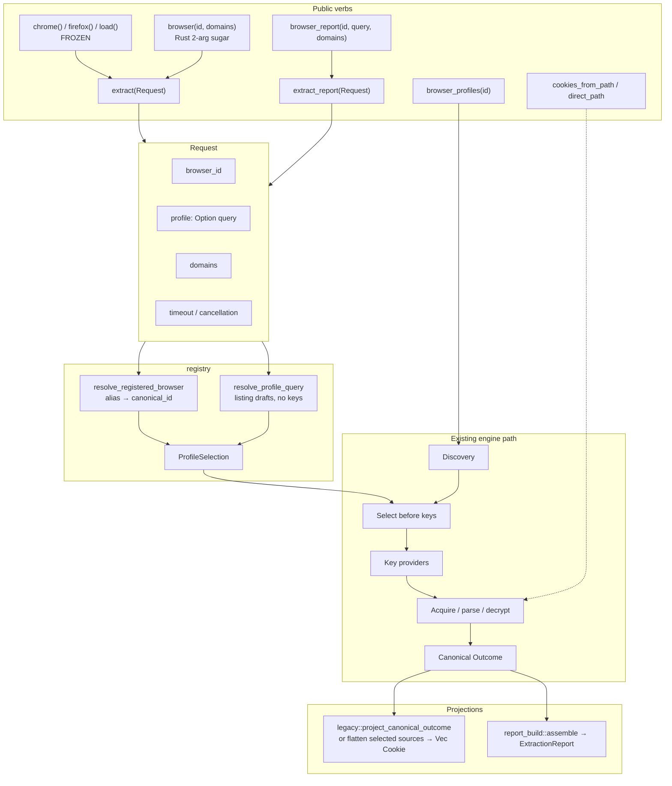
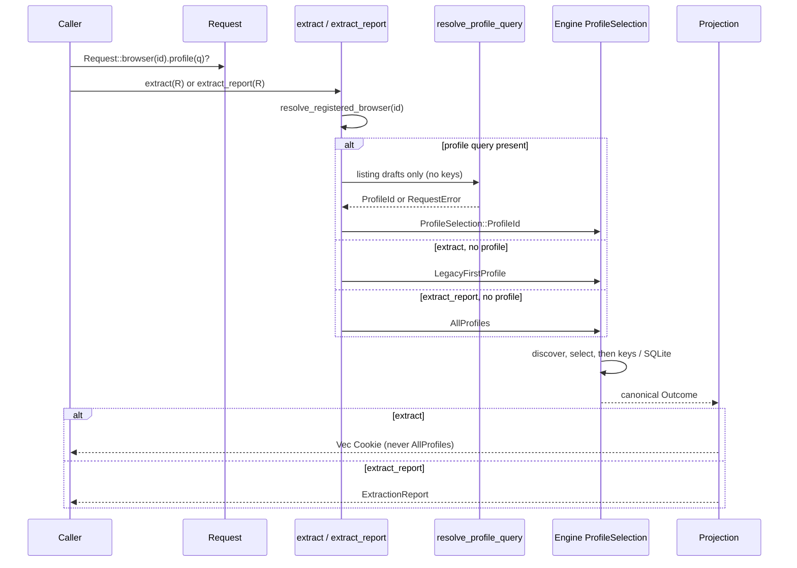
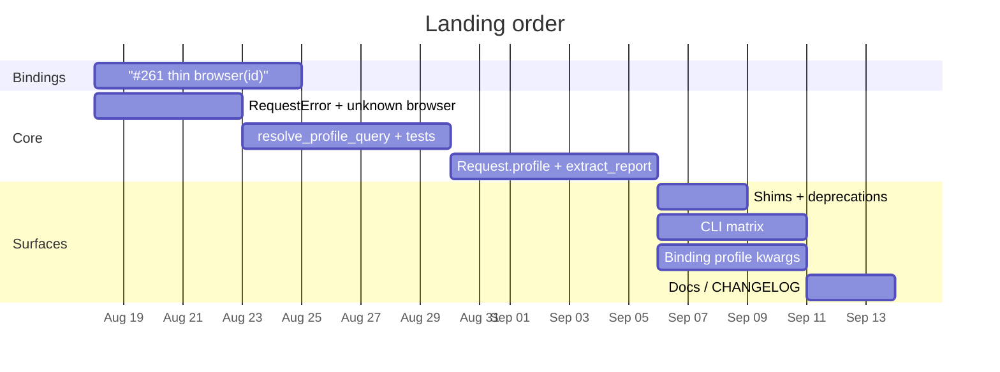

# Unified Public Extract API (Request + Profile Selection)

- **Author:** Grok (design)
- **Date:** 2026-08-18
- **Status:** Draft — **consumer-facing / job-layer recommended path superseded** by [consolidated-implementation-plan.md](consolidated-implementation-plan.md) rev 3+ (`read` / `ReadResult` / `jar` / `header` / `profiles` / `report` / `from_path`). [clean-get-api.md](clean-get-api.md) (`get` / `CookieResult`) is historical only. **Store-layer decisions in this file still hold:** one resolver, `ProfileSelection`, `RequestError` site, ADR 0003, two-arg Rust `browser()`, no all-profile flatten into `Vec<Cookie>`, no `Request.channel`. (#261 thin binding `browser(id)` remains out of scope for the consolidated three-PR program.)
- **Scope:** Store-oriented extract/report surface (`Request` + profile selection) across Rust, Python, Node, and CLI
- **Workspace:** `/Users/blackmyth/src/rookie-cookies`
- **Related ADRs:** [0001](../adr/0001-cookie-extraction-compatibility-and-report-contracts.md), [0002](../adr/0002-authoritative-browser-registry.md), [0003](../adr/0003-unified-profile-query.md) (amends 0001 selector/CLI query rules)
- **Related design:** [modularize-oversized-browser-modules.md](modularize-oversized-browser-modules.md) (structure-only; non-blocking)
- **Related issue:** GitHub **#261** (Python/Node have no `browser(id)`)

---

## Overview

`rookie-cookies` already has one internal model: a registry `canonical_id`, a `ProfileSelection` (`LegacyFirstProfile` / `ProfileId` / `AllProfiles`), a projection (flat `Vec<Cookie>` vs `ExtractionReport`), and an origin (registry discovery vs `direct_path`). The public surface does not match that model. `Request` (`rookie-rs/src/lib.rs`) is supposed to be “one operation as data,” but it has no profile field, and `extract` always forces `LegacyFirstProfile` via `browser::legacy::browser_cookies_with_runtime`. Profile selection is split across three disagreeing APIs: opaque-id-only `browser_report`, name/dir/path `chrome_profile` (report) and `firefox_profile` (flat cookies), plus a CLI `--profile` that is legal only with `--report`.

This design unifies that surface without inventing a fourth API family. One crate-private resolver maps a human query onto a unique opaque `profile_id`. One `Request` carries browser, optional profile query, domains, timeout, and cancellation. Two verbs project the same operation: `extract` → flat cookies (never `AllProfiles`); `extract_report` → `ExtractionReport` (absent profile = today’s `browser_report(id, None)` = `AllProfiles`). Compatibility named functions stay frozen. `#261` lands thin `browser(id)` first and does not invent profile selection.

---

## Background & Motivation

### Product positioning

`rookie-cookies` is a **multi-language library** (Rust, Python, Node, CLI) that extracts **cookies only**. It is not HackBrowserData (CLI forensics, nine data categories, no library API) and not browser_cookie3 (first-path cookiejar helper). Compatibility named functions (`chrome()`, `load()`) are frozen by ADR 0001 / 0002.

### The library’s real model (already implemented)

Before any key or SQLite open, the registry decides:

| Axis | Internal | Values |
| --- | --- | --- |
| Browser | registry `canonical_id` | `chrome`, `yandex`, … |
| Profile set | `ProfileSelection` in `rookie-rs/src/browser/registry.rs` | `LegacyFirstProfile` · `ProfileId(&str)` · `AllProfiles` |
| Presentation | projection | flat `Vec<Cookie>` · `ExtractionReport` · detailed/context |
| Source | origin | registry discovery · explicit path (`direct_path`) |

```348:360:rookie-rs/src/browser/registry.rs
pub(crate) enum ProfileSelection<'a> {
  AllProfiles,
  ProfileId(&'a str),
  LegacyFirstProfile,
}

impl<'a> ProfileSelection<'a> {
  fn from_profile_id(profile_id: Option<&'a str>) -> Self {
    match profile_id {
      Some(profile_id) => Self::ProfileId(profile_id),
      None => Self::AllProfiles,
    }
  }
}
```

Selection is applied before credential retrieval and source acquisition (ADR 0002). Named wrappers must not extract profiles they will discard.

`Request` today:

```241:247:rookie-rs/src/lib.rs
pub struct Request {
  browser_id: String,
  domains: Option<Vec<String>>,
  timeout: Option<std::time::Duration>,
  cancellation: Option<CancellationHandle>,
}
```

`extract(Request)` ignores profiles and always calls `browser::legacy::browser_cookies_with_runtime`, which is `LegacyFirstProfile`.

### Current public surface (the mess)

Three lists, three selectors, they disagree:

| Call | Key | Returns |
| --- | --- | --- |
| `chrome()` / Rust `browser("chrome")` / CLI `--browser chrome` | nothing | flat cookies, first legacy profile |
| `browser_profiles(id)` | — | `ProfileDescriptor`, default-first |
| `chrome_profiles()` | — | same type, last-used first |
| `firefox_profiles()` | — | `MozillaProfile { name, path, is_default }`, persistent-only (ADR 0002: report can see session-only profiles this list hides) |
| `browser_report(id, profile_id)` | **opaque id only** | report |
| `chrome_profile(s)` | id / name / dir / path | report |
| `firefox_profile(s)` | name / dir / path | **flat cookies**, deprecated toward a **report** (shape bug) |
| CLI `--profile` | opaque id, **requires `--report`** | report |
| `cookies_from_path` | file | flat cookies |

Python and Node have **no** `browser(id)` at all (#261). Named Python `chrome()` has no timeout/cancel; Node named functions do, via `extract(Request::browser("chrome"))`.

`load()` vs `load_report()` use different browser sets (historical vs full registry). That remains an explicit compatibility exception.

### Grid of holes (must fill, not invent a fourth family)

| Choose… | Flat cookies | Report | Detailed |
| --- | --- | --- | --- |
| First profile, named browser | `chrome()` | — | — |
| First profile, any registry id | Rust `browser(id)` only (#261) | — | — |
| One named profile, any browser | Firefox-only leftover | Chrome-only `chrome_profile` + generic opaque `browser_report` | — |
| Every profile of one browser | **forbidden** (ADR 0001) | `browser_report(id)` | — |
| Every registered browser | `load()` historical set | `load_report()` full registry | — |
| Explicit file | `cookies_from_path` | almost nothing | `*_detailed` |

The worst hole: **one named profile × flat cookies × any browser**. That is the hole this design fills.

### Evidence in tree

- Chrome already has the intended resolver algorithm, but only for Chrome, and only for a report: `select_chromium_profile` in `rookie-rs/src/browser/registry/chromium.rs` (opaque id, then reject lossy path, then unique name/dir/path; two `Default` directories fail).
- Firefox has a similar name/dir/path resolver (`mozilla::select_profile`) that does **not** accept opaque `profile_id`, and `firefox_profile` still opens `cookies.sqlite` only.
- `browser_report` treats a display path as an unknown profile id (`rookie-rs/tests/public_report_api.rs`).
- CLI `profile_requires_both_report_and_browser` (`cli/tests/generic_modes.rs`) pins `--browser ID --profile Q` as a usage error.
- `fault_kind` documents a known gap: unknown browser IDs are unstructured `bail!` and classify as `FaultKind::Engine` (`lib.rs` test `fault_kind_falls_back_to_engine_for_an_unstructured_bail_error`).

---

## Goals & Non-Goals

### Goals

1. One resolver, one `Request`, two projections (`extract` / `extract_report`).
2. Fill the grid: any registered browser × one named profile × flat cookies **and** report.
3. Widen `browser_report`’s existing `profile_id: Option<&str>` to the resolver **without** a signature change. This amends ADR 0001 §3/§9 via [ADR 0003](../adr/0003-unified-profile-query.md); it is not a silent reinterpretation of 0001.
4. Make CLI `--profile` legal with `--browser` (flat cookies) **and** with `--report` (ADR 0003).
5. Ship Python/Node `browser(id, …, profile=)` / `browser_report(id, profile=)` on top of #261.
6. Classify unknown/ambiguous/empty profile (and unknown browser on this path) as `FaultKind::Request`.
7. Keep `Cookie`, report DTO / `schema_version`, and `browser_registry.json` unchanged.

### Non-goals (frozen contracts)

- No change to `chrome()` / `firefox()` / `load()` signatures or first-profile / historical-set behavior (ADR 0001).
- No flattening all profiles behind `browser()` / `extract()` without a profile.
- No `Request.channel`. Two Defaults (Stable vs Beta) stay two `profile_id`s; ambiguous names fail.
- No Browser/Profile object graph.
- No per-engine `yandex_profile`.
- No report DTO / `schema_version` change unless a field is strictly required (prefer none; this design requires none).
- No `browser_registry.json` schema change.
- `Cookie` type unchanged.
- `firefox_profiles()` remaining persistent-only is an ADR 0002 compatibility fact; the new listing is `browser_profiles`.
- `load()` vs `load_report()` browser-set split stays an explicit compatibility exception.
- `direct_path` / `cookies_from_path` stay path-universe APIs and must not require the browser to be installed.
- No public `Engine` / `Browser` trait.
- No nine data categories.

`public-api/*.txt` **will** change when `Request` grows a method, `extract_report` is added, and `RequestError` is exported. That change is **additive**. Changing `browser(&str, Option<Vec<String>>)`’s arity is **not** additive and is rejected (Key Decision 3).

---

## Key Decisions

1. **One resolver, one request, two projections.** Profile identity is resolved once (`registry::resolve_profile_query`) into an opaque `profile_id`. `extract` and `extract_report` differ only in `ProfileSelection` default and in the projection. Rationale: the internal model already works this way; the mess is three public selectors on top of it.

2. **Absent profile means different things on the two verbs.** `extract` / `browser()` → `LegacyFirstProfile` (ADR 0001 first-profile). `extract_report` / `browser_report(id, None)` → `AllProfiles` (today’s `browser_report`, HackBrowserData `dump -b chrome`). `Request` cannot express `AllProfiles` for `extract`; flattening every profile into a bare cookie list remains forbidden.

3. **Rust `browser(id, domains)` stays two arguments.** Profile selection in Rust is `Request::profile`. Adding a third `Option<&str>` is a source-breaking public-api *change* (removed old item + added new), which this series is not allowed to be. Bindings get `profile=` because they have defaults / options bags.

4. **`browser_report`’s third parameter is widened, not wrapped.** Signature stays `(&str, Option<&str>, Option<Vec<String>>)` — `public_contract.rs`’s `BrowserReportFn` and the six `public-api` snapshots keep the same arity. The value is now a *query* (same keys as `Request::profile`; ADR 0003). **Opaque-id successes are unchanged** because `profile_id` is matched first. **Name / directory / non-lossy-path inputs flip from `Err` to `Ok`** (or to `AmbiguousProfile` / `LossyProfilePath`). That is a silent behavior change on the former error path, not a compatible no-op for every existing `Some(q)` call site. Migration: *if you treated a non-id `profile_id` as a guaranteed error, stop.* Do not describe this as “existing callers keep working” — only opaque-id callers do. `public_report_api.rs` must stop asserting that a real display path is not a key.

5. **`extract_report(Request)` with no profile is exactly today’s `browser_report(id, None)`.** Same `collect_report` / `assemble_with_runtime` path, same `no_sources` / `browser_not_detected` rules, same counters. The only behavioral widening is `Some(query)`.

6. **Resolver lives in `registry`, not `report_build`.** It reads listing drafts (`chromium_listing_*`, `gecko_profiles_with_runtime`, Safari/IE listing seams) — the same discovery `browser_profiles` uses — and never retrieves keys. ADR 0002: selection before credentials. `report_build` continues to assemble DTOs after a `ProfileId` extract.

7. **#261 lands thin, first, and does not invent profile.** Node #261 must use an options bag (`domains` / `timeoutMs` / `cancellation`) so this series can add `profile` without a 5-arg trap. Python #261 is `browser(id, domains=None)` keywords. This series is the follow-up.

8. **Unknown / ambiguous / empty profile and unknown browser on the `resolve_registered_browser` path are `RequestError` → `FaultKind::Request`.** Convert only in `resolve_registered_browser` / `resolve_registered_browser_for` (map or reconstruct after `browser_definition` fails). **Do not** change `browser_definition`’s `anyhow!("unknown browser id …")` at `registry.rs:725`: `chromium_key_credentials` (`registry/chromium.rs:1197`) and `chromium_based_with_browser_id` stay unstructured / `FaultKind::Engine`. `supported_browsers()` does **not** go through `resolve_registered_browser` and is not covered. Update `fault_kind` rustdoc so it no longer says only `DirectPathError` is `Request`. Bindings raise `RookieRequestError` / `InvalidArg` for extract/report/profiles unknown-browser; Python `chromium_based(..., browser_id=)` stays `RuntimeError`. Changelog the classification split.

9. **`chrome_profile` / `firefox_profile` become shims, not a third family.** `chrome_profiles()` stays documented last-used sugar over `browser_profiles("chrome")`. `firefox_profiles()` stays persistent-only `MozillaProfile` and is newly deprecated toward `browser_profiles("firefox")`. `firefox_profile`’s deprecation is retargeted at `extract(Request::browser("firefox").profile(q))`, **not** at a report.

10. **CLI `--profile` no longer requires `--report`.** `--browser ID --profile Q` is flat `extract`. `--report --browser ID --profile Q` is `extract_report`. `--profile` widens `--browser` to the full registry (so `yandex` + a profile is legal) but does **not** by itself reject Netscape.

11. **No `Request.channel`, no object graph, no per-engine `*_profile` verbs, no DTO/`schema_version`/`browser_registry.json` change.**

12. **ADR 0001 selector/CLI query rules are amended by ADR 0003, not silently reinterpreted.** The rest of 0001 (no all-profile flatten, `Cookie`, report DTO, `load()` set, first-profile named functions) stays.

---

## ADR 0001 amendment (ADR 0003)

ADR 0001 §3 says “Generic selectors accept only IDs returned by discovery. The legacy Firefox API retains name/directory/path matching.” ADR 0001 §9 says “`--profile PROFILE_ID` requires both `--report` and `--browser ID`.” This series changes both. Implementers must not refuse the widening as “0001 says IDs only”: [ADR 0003](../adr/0003-unified-profile-query.md) amends those two sentences only.

Amendment, in full:

1. Generic profile **queries** share one resolver (`profile_id`, display name, directory name, non-lossy path). Ambiguous names fail. Lossy display paths require the opaque id.
2. `browser_report`’s middle argument is that query (signature unchanged). Opaque-id successes stay as they are.
3. CLI `--profile` requires `--browser` only; it is legal with flat `--browser` output and with `--report`.

Unchanged from 0001: no flattening all profiles behind `browser()` / `extract()` / `chrome()`; `Cookie`; report DTO / `schema_version`; `load()` historical set; `firefox_profiles()` persistent-only; no `Request.channel`.

---

## Proposed Design

### Architecture



### Request as one operation

```rust
// rookie-rs/src/lib.rs — additive fields/methods only
#[derive(Debug, Clone, PartialEq, Eq)]
pub struct Request {
  browser_id: String,
  profile: Option<String>,          // NEW, private
  domains: Option<Vec<String>>,
  timeout: Option<std::time::Duration>,
  cancellation: Option<CancellationHandle>,
}

impl Request {
  pub fn browser(id: impl Into<String>) -> Self { /* profile: None, … */ }

  /// Selects one profile by opaque `profile_id`, display name, directory
  /// name, or a non-lossy full path. Resolved at extract time, not here.
  /// An empty string is `RequestError::EmptyProfileSelector`.
  pub fn profile(mut self, query: impl Into<String>) -> Self {
    self.profile = Some(query.into());
    self
  }

  pub fn domains(self, domains: Option<Vec<String>>) -> Self { /* unchanged */ }
  pub fn timeout(self, timeout: std::time::Duration) -> Self { /* unchanged */ }
  pub fn cancellation(self, handle: CancellationHandle) -> Self { /* unchanged */ }
}
```

There is no `clear_profile` and no public `AllProfiles` setter. Absence is “not called.” `profile("")` is stored and rejected at extract time (do not special-case empty in the builder; the resolver owns the rule).

`Request` remains `PartialEq` / `Clone` / `Debug`. Cookie values never appear on it.

### Verb semantics



| Call | Profile field | `ProfileSelection` | Result |
| --- | --- | --- | --- |
| `extract(Request::browser(id))` | absent | `LegacyFirstProfile` | `Vec<Cookie>` — **unchanged** |
| `extract(Request::browser(id).profile(q))` | query | `ProfileId(resolved)` | `Vec<Cookie>` from that profile only |
| `extract_report(Request::browser(id))` | absent | `AllProfiles` | **exactly** today’s `browser_report(id, None)` |
| `extract_report(Request::browser(id).profile(q))` | query | `ProfileId(resolved)` | today’s `browser_report` after opaque-id resolve; names now work |
| `browser(id, domains)` | n/a | `LegacyFirstProfile` | `extract(Request::browser(id).domains(domains))` |
| `browser_report(id, None, domains)` | n/a | `AllProfiles` | `extract_report(Request::browser(id).domains(domains))` |
| `browser_report(id, Some(q), domains)` | query | `ProfileId(resolved)` | `extract_report(Request::browser(id).profile(q).domains(domains))` |

`extract` **must not** accept `AllProfiles`. There is no public way to ask it to. Tests lock this: `extract(Request::browser(id))` still equals today’s first-profile result, never a concatenation of every profile.

### `extract` with a profile: flatten rules

`extract` without a profile keeps the current `legacy::browser_cookies_with_runtime` path (unsorted, `legacy_eligible` + persistent-source first profile). Do not reroute it through `extract_report`.

`extract` *with* a profile:

1. Resolve the query (listing, no keys).
2. Run the generic `ProfileId` engine path (same `collect_report(..., Some(id), true, ...)` that `extract_report` uses). Honor `Request` timeout / cancellation via `boundary_runtime`, exactly as `extract` does today.
3. Flatten **selected + succeeded** sources in report source order (persistent then session, existing precedence).
4. Cookie *values* use the same `Cookie` projection the report already emits. Intra-source order is the report’s deterministic sort. This is specified for the new path; the no-profile path stays unspecified.
5. If zero selected sources succeeded: `Err` (engine or not-installed), not `Ok([])`. A successful source with a domain filter that matches nothing is `Ok([])`.
6. Partial decryption (some rows skipped) still returns the cookies that were emitted. Flat extract cannot carry issues; callers who need `status` / `issues` use `extract_report`.

This is the first time a non-Firefox browser can yield flat cookies for a named secondary profile, and the first time Firefox’s shim uses the generic profile extract (persistent + selected session, including session-only profiles `firefox_profiles()` hides). See [Compatibility notes](#compatibility-notes-shims).

### `extract_report` with no profile = today’s `browser_report(id, None)`

Required equality (test this, do not hand-wave):

- Unknown browser → same `RequestError` (after PR 1) / same failure class.
- Known, not installed → `Ok` report, `status = no_sources`, one `browser_not_detected` info issue.
- Installed, every root failed enumeration → `Ok` report, `status = failed`, discovery issues.
- Installed, N profiles → same profile set, same source roles, same counters, same cookie grouping.
- Domain filter `None` vs `Some([])` vs `Some(["x"])` unchanged (ADR 0001: `None` unfiltered, empty filter matches nothing).
- `load_report` is **not** `extract_report`. `Request` is one browser.

`browser_report` becomes a one-line wrapper around `extract_report`. Timeout / cancellation become available on reports **only** through `extract_report(Request)`. The `browser_report` convenience keeps today’s implicit 30s `BoundaryRuntime::standard` (it does not grow new parameters).

---

## API / Interface Changes

### Exact Rust signatures

```rust
// ADDITIVE — Request
impl Request {
  pub fn profile(self, query: impl Into<String>) -> Self;
}

// ADDITIVE — new verb
pub fn extract_report(request: Request) -> Result<report::ExtractionReport>;

// UNCHANGED arity
pub fn extract(request: Request) -> Result<Vec<Cookie>>;
pub fn browser(id: &str, domains: Option<Vec<String>>) -> Result<Vec<Cookie>>;
pub fn browser_report(
  browser_id: &str,
  profile_id: Option<&str>,   // now a query; name kept for rustdoc continuity
  domains: Option<Vec<String>>,
) -> Result<report::ExtractionReport>;

// UNCHANGED signatures; implementations become wrappers
pub fn chrome_profile(profile: &str, domains: Option<Vec<String>>) -> Result<report::ExtractionReport>;
pub fn firefox_profile(profile: &str, domains: Option<Vec<String>>) -> Result<Vec<Cookie>>;
pub fn chrome_profiles() -> Result<Vec<report::ProfileDescriptor>>;
pub fn firefox_profiles() -> Result<Vec<MozillaProfile>>;
pub fn browser_profiles(browser_id: &str) -> Result<Vec<report::ProfileDescriptor>>;
```

Rejected (source-breaking, not additive):

```rust
// DO NOT
pub fn browser(id: &str, domains: Option<Vec<String>>, profile: Option<&str>) -> Result<Vec<Cookie>>;
```

Rust callers who want a profile write:

```rust
let cookies = rookie_cookies::extract(
  rookie_cookies::Request::browser("yandex")
    .profile("Default")
    .domains(Some(vec!["example.com".into()]))
    .timeout(std::time::Duration::from_secs(10)),
)?;
let report = rookie_cookies::extract_report(
  rookie_cookies::Request::browser("chrome").profile(&id),
)?;
```

### `browser_report` widening

```rust
pub fn browser_report(
  browser_id: &str,
  profile_id: Option<&str>,
  domains: Option<Vec<String>>,
) -> Result<report::ExtractionReport> {
  let mut request = Request::browser(browser_id).domains(domains);
  if let Some(query) = profile_id {
    request = request.profile(query);
  }
  extract_report(request)
}
```

| Input today | Today | After |
| --- | --- | --- |
| `None` | all profiles | **identical** |
| `Some(opaque_id)` that exists | that profile | identical (resolver hits `profile_id` first) |
| `Some(opaque_id)` unknown | `Err` “unknown … profile id” | `Err` `RequestError::UnknownProfile` |
| `Some("Default")` unique | `Err` unknown id | **`Ok` that profile** (widening) |
| `Some("Default")` two channels | `Err` unknown id | `Err` `RequestError::AmbiguousProfile` |
| `Some(non_lossy_path)` | `Err` unknown id | **`Ok` that profile** (widening) |
| `Some(lossy_display_path)` | `Err` unknown id | `Err` `RequestError::LossyProfilePath` |

Signature compatibility is real (`BrowserReportFn` stays valid; `public-api` arity is unchanged). Behavior is **not** merely additive: a caller who passed a display name or path and **depended on** today’s request error (validation, “is this an id?”, retry-with-id) will silently receive that profile’s cookies. Opaque-id successes are unchanged. Name / directory / non-lossy-path flip `Err` → `Ok` (or `AmbiguousProfile` / `LossyProfilePath`). Migration: *if you treated a non-id `profile_id` as a guaranteed error, stop.* Only opaque-id callers keep working.

### `RequestError` (new, crate-root, downcastable)

Place in a small module (`rookie-rs/src/request_error.rs`) re-exported from `lib.rs`, so `registry` can construct it without a `lib.rs` cycle.

```rust
/// Structured, downcastable cause for a caller-fixable extract/report request.
/// Carried inside the returned `anyhow::Error`. Human `Display` text is not stable.
#[non_exhaustive]
#[derive(Debug, Clone, PartialEq, Eq)]
pub enum RequestError {
  UnknownBrowser { browser_id: String },
  EmptyProfileSelector,
  UnknownProfile { browser_id: String, query: String },
  AmbiguousProfile {
    browser_id: String,
    query: String,
    /// Opaque ids only, in generic `browser_profiles` order. Never paths.
    profile_ids: Vec<String>,
  },
  LossyProfilePath { browser_id: String, query: String },
}

impl RequestError {
  pub fn code(&self) -> &'static str { /* see table */ }
  pub fn kind(&self) -> &'static str { "request" }
  pub fn browser_id(&self) -> Option<&str> { /* … */ }
  pub fn profile_query(&self) -> Option<&str> { /* … */ }
  pub fn profile_ids(&self) -> &[String] { /* AmbiguousProfile only */ }
}

impl std::fmt::Display for RequestError { /* diagnostic, not stable */ }
impl std::error::Error for RequestError {}
```

| Variant | `code()` |
| --- | --- |
| `UnknownBrowser` | `unknown_browser` |
| `EmptyProfileSelector` | `empty_profile_selector` |
| `UnknownProfile` | `unknown_profile` |
| `AmbiguousProfile` | `ambiguous_profile` |
| `LossyProfilePath` | `lossy_profile_path` |

`fault_kind` gains, **after** the existing `stop_reason` short-circuit and **beside** `DirectPathError`:

```rust
if error.downcast_ref::<RequestError>().is_some() {
  return FaultKind::Request;
}
```

**Conversion site (do not over-scope):**

- The `anyhow!("unknown browser id {browser_id:?}")` string is built in `browser_definition` at `registry.rs:725`. `resolve_registered_browser` (`registry.rs:186`) only forwards to `resolve_registered_browser_for`.
- Convert **only** in `resolve_registered_browser` / `resolve_registered_browser_for`: on a failed lookup, map that unknown-id error (or reconstruct the find) into `RequestError::UnknownBrowser`. Leave `browser_definition`’s `anyhow!` in place.
- That covers callers of `resolve_registered_browser`: `extract`, `extract_report`, `browser`, `browser_profiles`, `browser_report`.
- It does **not** cover `supported_browsers()` (lists the embedded table; never calls `resolve_registered_browser`).
- It does **not** cover `chromium_key_credentials` / `chromium_based_with_browser_id` (they call `browser_definition` directly). Those unknown ids stay unstructured `FaultKind::Engine`. Python `tests/python/test_rookie_cookies.py` `test_chromium_browser_ids_are_registry_identities_not_profile_selectors` stays `assertRaisesRegex(RuntimeError, ...)`.

Do **not** in this series rewrite every leftover legacy `bail!`. Scope is the unified request path plus the `resolve_registered_browser` map.

**`fault_kind` rustdoc** (today: “currently that means `DirectPathError` … unknown browser ID … Engine”) must be updated in PR 1 to:

> Only errors carrying a structured, downcastable cause classify as `FaultKind::Request`: `direct_path::DirectPathError` and `RequestError`. `RequestError` is produced for an unknown browser id on `resolve_registered_browser` and, once the resolver lands, for empty / unknown / ambiguous / lossy profile queries. Unstructured `bail!` on other surfaces — including `chromium_key_credentials` / `chromium_based_with_browser_id` and remaining named-browser paths — still classifies as `FaultKind::Engine`.

`lib.rs` test `fault_kind_falls_back_to_engine_for_an_unstructured_bail_error` is rewritten: unknown browser on `extract(Request::browser("definitely-not-…"))` is `FaultKind::Request`. Keep (or add) a test that `chromium_based_with_browser_id(Some("definitely-not-a-browser"), …)` / the equivalent remaining `browser_definition` path is still `FaultKind::Engine`. A later PR adds `Request` for unknown / ambiguous profile.

Display messages keep `common::diagnostic::REDACTED_PATH`. They may mention opaque profile ids (those are selection keys, not secrets). They must never include cookie values or key bytes.

### Binding shapes

#### Python (`rookie_cookies.pyi` + `src/report.rs` / new `browser` in `src/browsers.rs`)

`#261` (lands first):

```python
def browser(id: str, domains: Optional[List[str]] = None) -> CookieList:
    """Extract cookies from one registered browser's first legacy profile."""
    ...
```

This series (additive kwargs; `*` so they never become positionals):

```python
def browser(
    id: str,
    domains: Optional[List[str]] = None,
    *,
    profile: Optional[str] = None,
    timeout: Optional[float] = None,          # seconds, same unit as cookies_from_path
    cancellation: Optional[CancellationHandle] = None,
) -> CookieList: ...

def browser_report(
    browser_id: str,
    profile_id: Optional[str] = None,         # now a query; name unchanged
    domains: Optional[List[str]] = None,
) -> ExtractionReport: ...

def browser_profiles(browser_id: str) -> ProfileDescriptorList: ...  # unchanged
```

`chrome()` / `firefox()` stay `domains=None` only (frozen). Timeout/cancel for a named first profile is `browser("chrome", timeout=5)` after #261+#this, not a `chrome()` signature change.

Unknown/ambiguous profile and unknown browser on `browser` / `browser_profiles` / `browser_report` raise `RookieRequestError` (`ValueError`). Changelog must say those two report APIs move from `RookieEngineError`/`RuntimeError` to `RookieRequestError`/`ValueError` once PR 1 lands. **PR 1 updates `tests/python/test_report_api.py`** (`BrowserProfilesTest.test_unknown_browser_id_raises` and `BrowserReportTest.test_unknown_browser_id_raises`: `assertRaises(RuntimeError)` → `assertRaises(rookie_cookies.RookieRequestError)` and still accept `ValueError`). `chromium_based(..., browser_id="definitely-not-a-browser")` stays `RuntimeError` (`test_rookie_cookies.py`).

Export `browser` from `rookie_cookies/__init__.py` (`__all__` and the import list).

#### Node (`index.d.ts` + `bindings/node/src/lib.rs`)

`#261` **must** land this bag, not a clone of `chrome(domains, timeoutMs, cancellation)`. Committed `index.d.ts` is **`patch-loader.js` output** (`index.spec.mjs` asserts this). `cookiesFromPath` / `chromiumCookiesFromPath` only look like hand-written options-bag types because `canonicalDeclarationPatterns` in `bindings/node/scripts/patch-loader.js` rewrites napi’s lines. A new `browser` + `BrowserOptions` will not survive that pipeline unless the loader is updated (destructure list, `module.exports.browser`, `canonicalDeclarationPatterns`, and any `BrowserOptions` rewrite). Do **not** hand-edit `index.d.ts` without a loader change. Add `browser` to `EXPECTED_EXPORTS` in `index.spec.mjs`.

```ts
export interface BrowserOptions {
  domains?: string[] | null
  timeoutMs?: number | null
  cancellation?: CancellationHandle | null
}
export declare function browser(
  id: string,
  options?: BrowserOptions | null,
): Promise<CookieObject[]>
```

This series adds one field:

```ts
export interface BrowserOptions {
  domains?: string[] | null
  profile?: string | null
  timeoutMs?: number | null
  cancellation?: CancellationHandle | null
}
```

`browserReport` keeps its positional signature; `profileId` is widened to the query:

```ts
export declare function browserReport(
  browserId: string,
  profileId?: string | undefined | null,
  domains?: Array<string> | undefined | null,
): Promise<ExtractionReportObject>
```

Do not add a second Node `extract`/`Request` class. The options bag *is* the binding-side request.

Named functions (`chrome`, `firefox`, …) stay as they are (positional `timeoutMs` already shipped).

### Public sugar (aliases, not new verbs)

| Sugar | Definition |
| --- | --- |
| Rust `browser(id, domains)` | `extract(Request::browser(id).domains(domains))` |
| Python/Node `browser(id, …, profile=)` | `extract(Request::browser(id).profile(q)?)` |
| `browser_report(id, q, domains)` | `extract_report(Request::browser(id).profile(q)?)` |
| `browser_profiles(id)` | the one list (`ProfileDescriptor`) |
| `chrome_profiles()` | `browser_profiles("chrome")` with last-used sort (already implemented; keep) |
| `chrome_profile(q)` | `extract_report(Request::browser("chrome").profile(q))` |
| `firefox_profiles()` | **not** a type-compatible shim; stays `Vec<MozillaProfile>`, persistent-only, deprecated |
| `firefox_profile(q)` | `extract(Request::browser("firefox").profile(q))` |

### Deprecation notes

`chrome_profile` — add `#[deprecated]` (it is currently additive and not deprecated):

```rust
#[deprecated(
  since = "0.6.0",
  note = "use extract_report(Request::browser(\"chrome\").profile(q)) \
          or browser_report(\"chrome\", Some(q), domains)"
)]
```

`firefox_profile` — **replace** the current note that points at a report. Rust `browser` is frozen at two arguments (KD 3) and cannot take a profile; do not mention it.

```rust
// BEFORE (shape bug)
note = "use browser_report(\"firefox\", Some(profile_id), domains) with a profile ID from \
        browser_profiles(\"firefox\")"

// AFTER
#[deprecated(
  since = "0.6.0",
  note = "use extract(Request::browser(\"firefox\").profile(q)); \
          list with browser_profiles(\"firefox\")"
)]
```

Python/Node docs (not the Rust `#[deprecated]` note) may mention binding `browser("firefox", profile=q)`.

`firefox_profiles` — newly deprecated (signature and persistent-only filter **unchanged**):

```rust
#[deprecated(
  since = "0.6.0",
  note = "use browser_profiles(\"firefox\") for ProfileDescriptor \
          (includes session-only profiles this list hides)"
)]
```

`chrome_profiles` is **not** deprecated; it is documented last-used sugar.

Python/Node get matching docstring / `@deprecated` annotations. Earliest removal remains 0.7, same window as other 0.6 deprecations.

### Compatibility notes (shims)

`firefox_profile` implementation change is intentional:

| | Today | After |
| --- | --- | --- |
| Keys | name / dir / path (`mozilla::select_profile`) | unified resolver, **including opaque `profile_id`** |
| Sources | `cookies.sqlite` only via `firefox_based` | selected persistent + selected session (generic profile extract) |
| Session-only profiles | not listed, not selectable | selectable if `browser_profiles("firefox")` yields them |
| Errors | unstructured `bail!` | `RequestError` when the selector is the problem |
| Cookie order | unspecified (sqlite) | report sort within each source |

`chrome_profile` already returns a report and already uses the Chrome-only resolver. After this series it uses the **generic** listing (same profile *set* as `browser_profiles("chrome")`; last-used order does not affect uniqueness). Behavior for unique matches is unchanged.

---

## Profile resolver

### Where it lives and what it reads

```
rookie-rs/src/browser/registry.rs
  pub(crate) fn resolve_profile_query(
    browser_id: &str,
    query: &str,
    runtime: &BoundaryRuntime<'_>,
  ) -> Result<String /* opaque profile_id */>
```

Not public. Not in `report_build`. Not in `lib.rs`.

Steps:

1. `runtime.check()?`
2. `let browser = resolve_registered_browser(browser_id)?;` — aliases (`ie`, `360`, `opera-gx`, …) resolve to `canonical_id` before any listing. Unknown browser → `RequestError::UnknownBrowser`.
3. List profiles with the **same extract=false seams** `browser_profile_descriptors` uses (`report_build.rs` `collect_report(..., extract=false)` / `chromium_listing_with_runtime` / `gecko_profiles_with_runtime` / Safari/IE listing). **No `SystemKeyProvider`, no Keychain, no DPAPI, no SQLite acquire.**
4. Map each draft to a crate-private candidate:

```rust
struct ProfileMatchCandidate<'a> {
  profile_id: &'a str,
  display_name: &'a str,      // ChromiumProfile.display_name / EngineProfileDraft.name
  directory_name: &'a OsStr,  // ChromiumProfile.directory_name or path.file_name()
  path: &'a Path,
  path_lossy: bool,           // path.to_str().is_none()
}
```

`directory_name` is **not** on public `ProfileIdentity` and this design does not add it (no DTO change). The resolver reads drafts, not the public DTO.

5. Run the match algorithm. Return the unique `profile_id` string.

A failed listing (every detected root failed enumeration) is the same error `browser_profiles` already returns — not a profile-selector error.

Re-discovery: resolve lists once; the subsequent `ProfileId` extract discovers again and skips other profiles **before** keys. Same double-walk `chrome_profile_report` already does. Accept; do not cache listing across the process.

### Algorithm

Generalize `select_chromium_profile` (`registry/chromium.rs:1356`) to every engine. Do **not** pick the first of two `Default`s. Do **not** consult `Local State` last-used for matching (order is not identity).

```
resolve_profile_query(browser_id, query):
  if query is empty:                    # no trim
      return EmptyProfileSelector
  if exactly one candidate.profile_id == query:
      return that profile_id            # ids are unique; first exclusive
  if any candidate is path_lossy AND candidate.path.to_string_lossy() == query:
      return LossyProfilePath           # even if a name would also match
  matches = candidates where
      display_name == query
      OR directory_name.to_str() == Some(query)
      OR candidate.path == Path::new(query)
  match matches.len():
      1 => that profile_id
      0 => UnknownProfile
      n => AmbiguousProfile { profile_ids }
```

Rules:

- **No trim.** `"  "` is `UnknownProfile`, not empty. `""` is `EmptyProfileSelector`.
- **Case-sensitive** string compare, including on Windows (do not fold `Default` / `default`).
- **Path compare is std `Path` equality** (`candidate.path == Path::new(query)`), the same compare `select_chromium_profile` and `mozilla::select_profile` already use. On Windows `Path::eq` is component-wise, so `\` vs `/` already match; this is not a new fix. On Unix `\` is an ordinary filename character, so mixed separators are **different** identities — do not claim otherwise and do not invent a `path_components_eq` helper. Case stays sensitive.
- A 64-hex string that is **not** a known `profile_id` falls through to name/dir/path (a directory *could* be named a hex digest). Do not short-circuit “looks like an id.”
- Non-UTF-8 directory names only match via `profile_id`.
- Two installations both owning a `Default` directory → `AmbiguousProfile`. Never prefer Stable, never prefer last-used.
- Session-only Gecko profiles that `browser_profiles` yields **are** candidates. `firefox_profiles()` remaining persistent-only does not constrain the resolver.
- `is_default` is not a key.

### Test cases (required)

Implement as table-driven tests against injected `DiscoveryFs` / existing Chromium+Gecko fixtures. These are the acceptance tests for the resolver PR.

| # | Setup | Query | Result |
| --- | --- | --- | --- |
| 1 | Unique display name `"Personal"` | `"Personal"` | that `profile_id` |
| 2 | Unique directory `"Profile 1"` | `"Profile 1"` | that `profile_id` |
| 3 | Unique non-lossy full path | that path as stored (`Path ==`). On Windows only, the other separator also matches (std `Path` equality). On Unix, `\` vs `/` do **not** match | that `profile_id` |
| 4 | Two channels, both directory `Default`, distinct display names | `"Default"` | `AmbiguousProfile` (2 ids) |
| 5 | Same as 4 | unique display name of one | that one |
| 6 | Same as 4 | that profile’s opaque id | that one |
| 7 | Unix lossy path (`0xFF` byte), `to_string_lossy` queried | lossy display | `LossyProfilePath` |
| 8 | Same as 7 | opaque id | that one |
| 9 | Seeded profiles | `"nope"` | `UnknownProfile` |
| 10 | Any | `""` | `EmptyProfileSelector` |
| 11 | Any | `"  "` | `UnknownProfile` |
| 12 | Valid 64-hex that no profile has | `"0"*64` | `UnknownProfile` |
| 13 | Alias `"ie"` / `"360"` / `"opera-gx"` with one profile | unique name | that id under the **canonical** browser |
| 14 | `"not-a-browser"` | anything | `UnknownBrowser` (no listing) |
| 15 | One profile whose display_name equals its directory (`Default`/`Default`) | `"Default"` | unique (one candidate, not 2) |
| 16 | Profile A display `"Profile 1"`, profile B directory `"Profile 1"` | `"Profile 1"` | `AmbiguousProfile` |
| 17 | Gecko session-only profile with unique `Name=` | that name | that id (visible to `browser_profiles`) |
| 18 | Known browser, nothing installed | `"Default"` | `UnknownProfile` (not `no_sources`) |
| 19 | `browser_id = "firefox"` | a `browser_profiles` opaque id | that id (firefox_profile did not accept this) |

Also characterize: resolver does not call a key-provider test double (assert zero `SystemKeyProvider` hits).

### Interaction with `ProfileSelection::ProfileId`

After resolve, extract/report pass the opaque id into the existing `ProfileSelection::ProfileId` filter (`registry.rs:953`, `report_build.rs:1795`). Unknown-id checks already in those functions remain as belt-and-suspenders; they should be unreachable if resolve just returned the id, unless discovery races between list and extract (profile deleted). That race stays a request error (`UnknownProfile` / existing “unknown profile id”), not an empty success.

---

## CLI flag matrix

Today (`cli/src/args.rs:113-115`):

```rust
#[arg(long, requires_all = ["report", "browser"])]
pub profile: Option<String>,
```

After:

```rust
/// Select one profile by opaque id, display name, directory name, or
/// non-lossy path. Requires --browser. Legal with or without --report.
#[arg(long, requires = "browser")]
pub profile: Option<String>,
```

`--profile` still conflicts with `--list-browsers`, `--list-profiles`, `--load`, `--path`, `--key-path`, `--browser-id`, `--plaintext-only`.

Split “generic mode” (today `is_generic_mode` = list \| report) so Netscape is not accidentally banned on flat `--profile`:

| Predicate | Flags | Effect |
| --- | --- | --- |
| `is_structured_output_mode` | `--list-browsers` \| `--list-profiles` \| `--report` | reject Netscape; JSON DTO |
| `widens_browser_to_registry` | structured **or** `--profile` is `Some` | `--browser` accepts any registered id/alias |

`validate_modes` uses `widens_browser_to_registry` where it currently uses `is_generic_mode` for the registry allowlist. Netscape rejection uses `is_structured_output_mode` only.

| Invocation | Legal? | Browser universe | Selection | Output |
| --- | --- | --- | --- | --- |
| `--list-browsers` | yes | n/a | n/a | JSON descriptors |
| `--list-profiles --browser ID` | yes | full registry | n/a | JSON `ProfileDescriptor`s |
| `--report --browser ID` | yes | full registry | `AllProfiles` | JSON report |
| `--report --browser ID --profile Q` | yes | full registry | resolver | JSON report, one profile |
| `--report` | yes | `load_report` | n/a | JSON report |
| `--report --profile Q` | **no** | — | — | usage error (`--browser` required) |
| `--browser chrome` | yes | historical map | `LegacyFirstProfile` | cookies (json/netscape) |
| `--browser chrome --profile Default` | **yes (new)** | **full registry** | resolver | cookies |
| `--browser yandex` | no (unchanged) | — | — | usage error, point at `--report` |
| `--browser yandex --profile Default` | **yes (new)** | full registry | resolver | cookies |
| `--browser yandex --report` | yes | full registry | `AllProfiles` | JSON report |
| `--load --profile Q` | no | — | — | usage error |
| `--path FILE --profile Q` | no | — | — | usage error |
| `--browser chrome --profile Q --format netscape` | **yes** | registry | resolver | netscape |
| `--report --browser chrome --format netscape` | no | — | — | usage error |

`--browser ID --profile Q` implementation:

```rust
let cancellation = install_cancel_on_signal();
let mut request = rookie_cookies::Request::browser(&browser)
  .profile(profile)
  .domains(args.domains)
  .cancellation(cancellation);
let cookies = rookie_cookies::extract(request)?;
```

`--browser` here is the raw CLI string (alias allowed). Do **not** force `canonical_legacy_browser` / `BROWSERS_MAP` once `--profile` is present.

`--report --browser ID --profile Q` stays `extract_report` / `browser_report` (resolver now behind it), still without a cancellation hook (existing limitation; follow-on, not this series).

Update `cli/tests/generic_modes.rs`:

- Rewrite `profile_requires_both_report_and_browser` → `profile_requires_browser_but_not_report`.
- `--browser firefox --profile <id>` on the multi-profile fixture emits **flat** cookies for that profile only.
- `--browser firefox --profile rookie-b` (display name) works.
- Two-Default fixture: `--profile Default` exits non-zero, empty stdout.
- `--browser <registry-only> --profile Q` is not the “use `--report`” usage error.
- Netscape + `--profile` succeeds; Netscape + `--report` still fails.

---

## Interaction with #261



**Recommend: #261 lands first (thin), then this series. Do not make #261 invent profile.**

#261 scope (this design’s constraints on it):

| Surface | Land in #261 | Do **not** land in #261 |
| --- | --- | --- |
| Python `browser(id, domains=None)` | yes | `profile`, `timeout`, `cancellation` |
| Node `browser(id, options?)` with `{domains, timeoutMs, cancellation}` | yes — **options bag required**; update `patch-loader.js` + `EXPECTED_EXPORTS`; do not hand-edit `index.d.ts` | `profile` |
| Rust | already has `browser` / `extract` | profile |
| CLI | n/a | profile-without-report |

If #261 is already drafted as Node `browser(id, domains, timeoutMs, cancellation)` positionals, rebase to the options bag **before** merge. A positional #261 plus a later `profile` argument is the 5-arg trap this design exists to avoid. During 0.6.0-alpha this rebase is acceptable.

This series then adds `profile` (and, on Python, `timeout` / `cancellation` as keyword-only). That is source-compatible with a shipped thin #261.

`load()` / `load_report()` stay out of both #261 and this series.

---

## Data Model Changes

**None** to persisted or wire types.

- `Cookie` unchanged (eight fields, raw `same_site: i64`).
- `ExtractionReport` / `ProfileIdentity` / `schema_version: 1` unchanged. Do **not** add `directory_name` to `ProfileIdentity`.
- `browser_registry.json` unchanged.
- `MozillaProfile` unchanged.
- Python `dto` / `schema/report-dto.schema.json` unchanged.
- In-memory `Request` grows a private `Option<String>` field. That is not a serde DTO.

No migration.

---

## Alternatives Considered

### A. Third positional on Rust `browser(id, domains, profile)`

- **Pros:** Matches the conceptual sugar; one function in every language.
- **Cons:** Source-breaking (`public-api` shows a removed fn + an added fn). Rust has no default arguments; every `browser(id, None)` call site must grow a third `None`. `public_contract.rs` function-pointer pins break. User constraint: snapshot churn is additive only.
- **Decision:** Reject. Profile lives on `Request`. Bindings use kwargs / options.

### B. Keep `browser_report` opaque-id-only; add `extract_report` as the only named-query verb

- **Pros:** No widening; `public_report_api.rs` path-is-not-a-key test survives.
- **Cons:** Two report verbs with two key grammars — the mess this design is deleting. Callers and the CLI would have to choose the “right” report function.
- **Decision:** Reject. Widen the existing parameter (ADR 0003). One grammar. Honest about the `Err` → `Ok` flip for name/dir/path: see KD 4 / changelog migration one-liner.

### C. Public `Browser` / `Profile` object graph (`browser.profile("Default").cookies()`)

- **Pros:** Familiar OOP; HackBrowserData’s internal engine objects look like this.
- **Cons:** Explicit non-goal. Frozen named functions, no plugin trait, no object graph (ADR 0001 deferred “public Engine/Browser trait”). Lifetime/ownership across bindings is expensive.
- **Decision:** Reject.

### D. Per-engine `yandex_profile` / generalize `chrome_profile` by copy-paste

- **Pros:** Smallest local patch for one browser.
- **Cons:** N verbs, N resolvers, N deprecations. User non-goal.
- **Decision:** Reject.

### E. Resolver in `report_build` over `ProfileDescriptor`

- **Pros:** One type already public; directory name ≈ `Path::file_name` of `profile.path`.
- **Cons:** `path` on the DTO is a **display** string and may be lossy; matching on it reintroduces the lossy-path footgun. `directory_name` is not on the DTO (and we refuse to add it). `report_build` is the wrong layer for pre-key selection (ADR 0002).
- **Decision:** Reject. Registry listing drafts.

### F. `extract(Request)` with no profile becomes all-profiles labeled flatten

- **Pros:** Matches HackBrowserData `dump -b chrome` default.
- **Cons:** Forbidden by ADR 0001. Changes `chrome()`-equivalent cookie sets, duplicates, and order behind a frozen first-profile contract.
- **Decision:** Reject. All-profiles stays report-only.

---

## Security & Privacy Considerations

| Threat | Severity | Mitigation |
| --- | --- | --- |
| Ambiguous `Default` silently picks Stable vs Beta and returns the wrong account’s cookies | **High** | `AmbiguousProfile`; never first-match; last-used is not a tie-break |
| Resolver prompts Keychain / DPAPI / Secret Portal just to *list* | **High** (UX + ACL) | Listing seams only; test: zero key-provider calls |
| Error messages leak cookie values or absolute home paths | **Medium** | `REDACTED_PATH`; ids allowed; no row samples in `RequestError` |
| `--browser yandex --profile Default` newly decrypts a registry-only browser from the CLI without `--report` | **Low** (intended) | Same local-user trust model as `extract(Request::browser("yandex").profile(...))`; document |
| Lossy path round-trip selects the wrong directory | **Medium** | `LossyProfilePath`; require opaque id |
| Flat `extract(profile)` hides a partial decrypt | **Low** (existing named-API shape) | Document; `extract_report` is the honest verb |
| `RequestError.profile_ids` used as an oracle for installed profiles | **Info** | Same data `browser_profiles` already returns; local attacker already has the disk |

Auth: none. This is a local library. Data handling: resolver input is a caller string; it is not interpolated into SQL (existing parameterized queries stay as they are). Path compare is std `Path` equality, not a shell.

`cookies_from_path` remains a separate universe: a file on disk does not require `supported_browsers()` to contain that browser (HackBrowserData RFC-013 lesson: restore/path universe ≠ local table).

---

## Observability

No new telemetry backend. Use the existing `tracing` targets.

| Event | Level | Fields (no secrets) |
| --- | --- | --- |
| `resolve_registered_browser` ok | debug | `input_id`, `canonical_id` |
| `resolve_profile_query` ok | debug | `canonical_id`, `query_kind` (`profile_id` \| `display_name` \| `directory` \| `path`), `profile_id` |
| `resolve_profile_query` fail | info | `canonical_id`, `code`, `match_count` |
| `extract` vs `extract_report` | debug | `verb`, `selection` (`legacy_first` \| `profile_id` \| `all`) |
| Key provider | existing | unchanged; must not fire during resolve |

Metrics (if/when the crate grows them; not required to land the API):

- `profile_resolve_total{code=ok|unknown|ambiguous|empty|lossy|unknown_browser}`
- `extract_selection{kind=legacy_first|profile|all}`

Alerts: none at library layer. CLI non-zero + empty stdout on resolve failure is the existing contract (`report_with_an_unknown_profile_id_fails_without_machine_output`).

Human error text remains **not stable** (ADR 0001). Branch on `RequestError::code()` / `fault_kind` / exception type.

---

## Rollout Plan

This is 0.6.0-alpha. No feature flag. Additive API + one classification change + one CLI grammar widening + one `firefox_profile` source-set change.

1. **Prerequisite:** merge #261 (thin `browser(id)`).
2. Land PRs 1–7 below, each independently reviewable and green.
3. Update `rookie-rs/public-api/{linux,macos,windows}-{all,no-default}-features.txt` in the PR that first adds the symbols (PR 1 for `RequestError`, PR 3 for `Request::profile` + `extract_report`). `temporary-exceptions.json` stays empty.
4. Changelog under `[Unreleased]` / next 0.6.0-alpha: Added (`extract_report`, `Request::profile`, binding kwargs, CLI `--profile` without `--report`); Changed (`browser_report` query widening — **opaque-id successes unchanged; name/dir/non-lossy-path flip `Err` → `Ok` or `Ambiguous`/`Lossy`. Migration: if you treated a non-id `profile_id` as a guaranteed error, stop.** `fault_kind` for unknown browser on `resolve_registered_browser` only; `firefox_profile` sources); Deprecated (`chrome_profile`, `firefox_profiles`, retargeted `firefox_profile` note).
5. **Rollback:** revert the PR. No data migration. Callers that started passing names as `browser_report` keys would start getting `UnknownProfile` again.
6. Modularization of `registry.rs` / `report_build.rs` ([sibling design](modularize-oversized-browser-modules.md)) may land in parallel; the resolver should be added **after** or **in** the file that will own listing (`registry` listing cluster), not in a 4k dump if that split has already happened.

---

## Risks

| Risk | Severity | Mitigation |
| --- | --- | --- |
| `browser_report("chrome", Some(path))` starts succeeding; in-tree test `unknown_profile_ids_are_request_errors` fails | **Medium** | Update the test; document widening in CHANGELOG |
| `firefox_profile` begins emitting session cookies / accepting opaque ids | **Medium** | Changelog + shim section; e2e `tests/e2e_firefox.rs` / `firefox_profile` unit tests updated |
| Python `except RuntimeError` around `browser_report("nope")` stops matching | **Medium** | Changelog; `RookieRequestError` is a `ValueError`; engine failures still `RookieEngineError` |
| CLI snapshot / `generic_modes` pin `--profile` + `--browser` as illegal | **Medium** | Rewrite those tests in the CLI PR |
| Double discovery (list + extract) | **Low** | Same as `chrome_profile` today; no cache |
| #261 positional Node API ships first | **Medium** | This document constrains #261 to an options bag + `patch-loader.js`; rebase if needed |
| Resolver accidentally goes through extract=true | **High** | Unit test: key provider not invoked |

---

## Open Questions

1. **None that block implementation.** The ten “must specify” items in the request are decided above.
2. Follow-on, not this series: plumb `CancellationHandle` into CLI `--report` via `extract_report`.
3. Follow-on: expose `RequestError` fields on Python (`e.code`) instead of `Debug` text only. Bindings already stringify `{error:?}`; a typed attribute would be nicer but is not required to classify `RookieRequestError`.
4. Follow-on: `directory_name` on `ProfileIdentity` if callers keep asking. Refused here to keep the DTO frozen.

---

## `public-api/*.txt` expected additions

Additive lines (all six snapshots: `{linux,macos,windows}-{all-features,no-default-features}.txt`). Format is **cargo-public-api field-per-line**, matching `DirectPathError` in `rookie-rs/public-api/linux-all-features.txt` (tool 0.52.0 / rustdoc-types 0.57). Brace-syntax variant listings (`AmbiguousProfile { browser_id: ... }`) will fail `scripts/check-public-api.py`.

`mod request_error` is **private**. Only the `pub use` crate-root type is public (`rookie_cookies::RequestError`, not `rookie_cookies::request_error::RequestError`).

PR 1 adds `RequestError` (and its impls). PR 3 adds `Request::profile` and `extract_report`. Variant/field order below follows cargo-public-api (alphabetical).

```text
pub fn rookie_cookies::Request::profile(self, impl core::convert::Into<alloc::string::String>) -> Self
pub fn rookie_cookies::extract_report(rookie_cookies::Request) -> anyhow::Result<rookie_cookies::report::ExtractionReport>
#[non_exhaustive] pub enum rookie_cookies::RequestError
pub rookie_cookies::RequestError::AmbiguousProfile
pub rookie_cookies::RequestError::AmbiguousProfile::browser_id: alloc::string::String
pub rookie_cookies::RequestError::AmbiguousProfile::profile_ids: alloc::vec::Vec<alloc::string::String>
pub rookie_cookies::RequestError::AmbiguousProfile::query: alloc::string::String
pub rookie_cookies::RequestError::EmptyProfileSelector
pub rookie_cookies::RequestError::LossyProfilePath
pub rookie_cookies::RequestError::LossyProfilePath::browser_id: alloc::string::String
pub rookie_cookies::RequestError::LossyProfilePath::query: alloc::string::String
pub rookie_cookies::RequestError::UnknownBrowser
pub rookie_cookies::RequestError::UnknownBrowser::browser_id: alloc::string::String
pub rookie_cookies::RequestError::UnknownProfile
pub rookie_cookies::RequestError::UnknownProfile::browser_id: alloc::string::String
pub rookie_cookies::RequestError::UnknownProfile::query: alloc::string::String
impl rookie_cookies::RequestError
pub fn rookie_cookies::RequestError::browser_id(&self) -> core::option::Option<&str>
pub fn rookie_cookies::RequestError::code(&self) -> &'static str
pub fn rookie_cookies::RequestError::kind(&self) -> &'static str
pub fn rookie_cookies::RequestError::profile_ids(&self) -> &[alloc::string::String]
pub fn rookie_cookies::RequestError::profile_query(&self) -> core::option::Option<&str>
impl core::clone::Clone for rookie_cookies::RequestError
pub fn rookie_cookies::RequestError::clone(&self) -> rookie_cookies::RequestError
impl core::cmp::Eq for rookie_cookies::RequestError
impl core::cmp::PartialEq for rookie_cookies::RequestError
pub fn rookie_cookies::RequestError::eq(&self, &rookie_cookies::RequestError) -> bool
impl core::error::Error for rookie_cookies::RequestError
impl core::fmt::Debug for rookie_cookies::RequestError
pub fn rookie_cookies::RequestError::fmt(&self, &mut core::fmt::Formatter<'_>) -> core::fmt::Result
impl core::fmt::Display for rookie_cookies::RequestError
pub fn rookie_cookies::RequestError::fmt(&self, &mut core::fmt::Formatter<'_>) -> core::fmt::Result
impl core::marker::StructuralPartialEq for rookie_cookies::RequestError
impl core::marker::Freeze for rookie_cookies::RequestError
impl core::marker::Send for rookie_cookies::RequestError
impl core::marker::Sync for rookie_cookies::RequestError
impl core::marker::Unpin for rookie_cookies::RequestError
impl core::panic::unwind_safe::RefUnwindSafe for rookie_cookies::RequestError
impl core::panic::unwind_safe::UnwindSafe for rookie_cookies::RequestError
```

**Unchanged arity (must not appear as removed).** `browser` is two-argument in all six snapshots; adding a third argument is a removed+added item.

```text
pub fn rookie_cookies::browser(&str, core::option::Option<alloc::vec::Vec<alloc::string::String>>) -> anyhow::Result<alloc::vec::Vec<rookie_cookies::common::enums::Cookie>>
pub fn rookie_cookies::browser_report(&str, core::option::Option<&str>, core::option::Option<alloc::vec::Vec<alloc::string::String>>) -> anyhow::Result<rookie_cookies::report::ExtractionReport>
pub fn rookie_cookies::extract(rookie_cookies::Request) -> anyhow::Result<alloc::vec::Vec<rookie_cookies::common::enums::Cookie>>
pub fn rookie_cookies::chrome(...)
pub fn rookie_cookies::firefox(...)
pub fn rookie_cookies::load(...)
```

`Cookie` and every `report::*` type stay byte-identical.

---

## Lessons taken (and refused)

From HackBrowserData (`/Users/blackmyth/src/others/HackBrowserData`, RFC-013) and browser_cookie3:

**Steal**

- One type, two verbs: list (no keys) vs extract (keyed). Results that *can* carry profile identity do (`ExtractionReport`). Flat `Cookie` stays an 8-field compatibility projection.
- Installation ≠ profile. Chromium `UserDataDir` + shared master key; profiles are leaves. `Request.channel` is refused; two Defaults are two `profile_id`s.
- Default *generic* extract is **all profiles, labeled** → `extract_report` / `browser_report(id, None)`, not `extract`.
- One grammar; no per-engine `*_profile` verbs.
- Discover without injecting keys (`browser_profiles` / resolver never prompts Keychain).
- Path/restore universe ≠ local `supported_browsers()` table (`cookies_from_path` must not require the browser to be installed).
- Failures scoped: `RequestError` vs extraction issue on a report.

**Do not steal**

- CLI-only / no library API
- Profile identity = directory basename (`Default` collides)
- `-p` path-only selection as the only chooser
- Nine data categories
- Public Engine / `Browser` trait
- `load()` swallowing misses
- Flattening all profiles into a bare cookie list

---

## References

- [ADR 0001: Cookie extraction compatibility and report contracts](../adr/0001-cookie-extraction-compatibility-and-report-contracts.md)
- [ADR 0002: Authoritative browser registry](../adr/0002-authoritative-browser-registry.md)
- [ADR 0003: Unified profile query](../adr/0003-unified-profile-query.md) (amends 0001 §3 / §9)
- [Modularize oversized browser modules](modularize-oversized-browser-modules.md)
- `rookie-rs/src/lib.rs` — `Request`, `extract`, `browser`, `fault_kind`
- `rookie-rs/src/browser/registry.rs` — `ProfileSelection`, `resolve_registered_browser`, `select_engine_profiles`
- `rookie-rs/src/browser/registry/chromium.rs` — `select_chromium_profile`, `chrome_profiles_with_runtime`
- `rookie-rs/src/browser/mozilla.rs` — `select_profile`, `MozillaProfile`
- `rookie-rs/src/browser/report_build.rs` — `browser_extraction_report`, `chrome_profile_report`
- `rookie-rs/src/browser/legacy.rs` — `browser_cookies_with_runtime`
- `rookie-rs/tests/public_report_api.rs`, `rookie-rs/tests/public_contract.rs`
- `cli/src/args.rs`, `cli/src/main.rs`, `cli/tests/generic_modes.rs`
- `bindings/python/rookie_cookies/rookie_cookies.pyi`, `bindings/node/index.d.ts`
- HackBrowserData `rfcs/013-cli-redesign-cross-host.md`
- GitHub issue **#261**

---

## PR Plan

Each PR is independently reviewable and mergeable. Later PRs may assume earlier ones.

### PR 0 — `#261`: thin `browser(id)` in Python and Node

- **Title:** `feat: expose browser(id) in Python and Node (#261)`
- **Files:** `bindings/python/src/browsers.rs`, `bindings/python/src/lib.rs`, `bindings/python/rookie_cookies/__init__.py`, `bindings/python/rookie_cookies/rookie_cookies.pyi`, `tests/python/test_rookie_cookies.py`; `bindings/node/src/lib.rs`; **`bindings/node/scripts/patch-loader.js`** (destructure, `module.exports.browser`, `canonicalDeclarationPatterns` / `BrowserOptions` rewrite — committed `index.d.ts` must be loader output; **do not hand-edit `index.d.ts` without a loader change**); `bindings/node/index.d.ts` (regenerated); `bindings/node/__test__/index.spec.mjs` (**`EXPECTED_EXPORTS` must include `browser`**)
- **Depends on:** none (Rust `browser` / `extract` already exist)
- **Changes:** Python `browser(id, domains=None)` → `rookie_cookies::browser`. Node `browser(id, options?: {domains, timeoutMs, cancellation})` → `extract(Request::browser(id)…)`. **No `profile`.** Node **must** use the options bag (constraint from this design). Docs one-liners only.

### PR 1 — `RequestError` + classify unknown browser

- **Title:** `feat: add RequestError and classify unknown browser as FaultKind::Request`
- **Files:** new `rookie-rs/src/request_error.rs` (private module, `pub use` at crate root); `rookie-rs/src/lib.rs` (`fault_kind` + rustdoc, module + re-export, rewrite `fault_kind_falls_back_to_engine_for_an_unstructured_bail_error`; keep an Engine pin on `chromium_based_with_browser_id`); `rookie-rs/src/browser/registry.rs` (`resolve_registered_browser` / `resolve_registered_browser_for` only — **not** `browser_definition`); `rookie-rs/public-api/*.txt`; `rookie-rs/tests/public_contract.rs` / `public_report_api.rs`; **`tests/python/test_report_api.py`** (`test_unknown_browser_id_raises` on `browser_profiles` / `browser_report`: `RuntimeError` → `RookieRequestError`); optional Node status pin; CHANGELOG
- **Depends on:** none (can land in parallel with PR 0)
- **Changes:** Public `RequestError` enum. Unknown browser id on extract/report/profiles becomes downcastable `RequestError::UnknownBrowser` and Python `RookieRequestError` / Node `InvalidArg`. `chromium_based(..., browser_id=)` / `chromium_key_credentials` stay unstructured `Engine` / Python `RuntimeError`. No profile resolver yet. PR is not independently green without the Python test update.

### PR 2 — `registry::resolve_profile_query` + characterization tests

- **Title:** `feat: add cross-engine profile query resolver`
- **Files:** `rookie-rs/src/browser/registry.rs` (new fn + candidate mapping); small hooks in `registry/{chromium,gecko,safari,internet_explorer}.rs` only if listing drafts are not already reachable; tests next to `select_chromium_profile` (generalize / share the table); **no** `lib.rs` public change
- **Depends on:** PR 1 (`RequestError` variants)
- **Changes:** Implement the algorithm and the 19 test rows. Assert listing does not touch key providers. `chrome_profile` / `browser_report` still use their old selectors so this PR is behavior-neutral on the public surface.

### PR 3 — `Request::profile`, `extract_report`, widen `browser_report`, honor profile on `extract`

- **Title:** `feat: Request::profile, extract_report, and query-aware browser_report`
- **Files:** `rookie-rs/src/lib.rs`; `rookie-rs/src/browser/report_build.rs` (`browser_extraction_report_with_runtime` called from `extract_report`); `rookie-rs/src/browser/legacy.rs` only if flatten helpers belong there; `rookie-rs/public-api/*.txt`; `rookie-rs/tests/public_report_api.rs` (path-is-not-a-key test → path *is* a key; add extract/extract_report pairs); `rookie-rs/tests/public_contract.rs`; `rookie-rs/examples/report_surface.rs` optional
- **Depends on:** PR 2
- **Changes:** Add `Request.profile` field + method. `extract` without profile unchanged. `extract` with profile → resolve + `ProfileId` + flatten. `extract_report` as specified. `browser_report` becomes the wrapper. Update rustdoc on `Request` / `extract` / `browser_report`. This is the additive public-api PR for `Request::profile` and `extract_report`.

### PR 4 — Shim `chrome_profile` / `firefox_profile` and fix deprecations

- **Title:** `refactor: retarget chrome_profile and firefox_profile onto Request`
- **Files:** `rookie-rs/src/lib.rs` (wrapper bodies + `#[deprecated]` notes); `bindings/python/src/report.rs`, `bindings/python/src/browsers.rs`, `bindings/node/src/lib.rs` (docstrings); tests that pin `firefox_profile` keys/sources (`rookie-rs/src/browser/mozilla.rs` tests, e2e)
- **Depends on:** PR 3
- **Changes:** `chrome_profile(q)` = `extract_report(Request::browser("chrome").profile(q))`. `firefox_profile(q)` = `extract(Request::browser("firefox").profile(q))`. Deprecate `chrome_profile` and `firefox_profiles`; retarget `firefox_profile` away from `browser_report`. Document session-cookie / opaque-id widening for Firefox.

### PR 5 — CLI `--profile` without `--report`

- **Title:** `feat(cli): allow --profile with flat --browser output`
- **Files:** `cli/src/args.rs`, `cli/src/main.rs`, `cli/tests/generic_modes.rs`, help text
- **Depends on:** PR 3 (PR 4 optional)
- **Changes:** `requires = "browser"` only. Split structured-output vs registry-widening predicates. Wire `--browser --profile` through `Request::profile` + `extract`. Update the tests listed in the CLI matrix. Keep `--browser yandex` without `--profile` as the existing usage error.

### PR 6 — Python/Node `profile` (and Python timeout/cancel on `browser`)

- **Title:** `feat: profile selection on Python/Node browser() and widened browser_report`
- **Files:** `bindings/python/src/browsers.rs`, `bindings/python/src/report.rs`, `rookie_cookies.pyi`, `__init__.py` if needed; `bindings/node/src/lib.rs`; **`bindings/node/scripts/patch-loader.js`** (`BrowserOptions.profile` rewrite — regenerate `index.d.ts`, do not hand-edit); `bindings/node/index.d.ts`; `tests/python/test_report_api.py` (unknown *profile* query cases; unknown *browser* already fixed in PR 1); `bindings/node/__test__/report-child.mjs` (or new child); e2e `tests/e2e/report_surface_*.py/mjs` only if they assert path-is-not-a-key
- **Depends on:** PR 0 and PR 3
- **Changes:** Python keyword-only `profile` / `timeout` / `cancellation` on `browser()`. Node `BrowserOptions.profile`. Widen `browser_report` / `browserReport` query semantics (no signature change). Docs in docstrings.

### PR 7 — User docs and changelog polish

- **Title:** `docs: unified extract API (Request.profile, extract_report, CLI --profile)`
- **Files:** `docs/Rust.md`, `docs/Python.md`, `docs/JavaScript.md`, `bindings/python/README.md`, `bindings/node/README.md`, `CHANGELOG.md` (include the KD 4 migration one-liner), `docs/design/unified-extract-api.md` (this file), `docs/adr/0003-unified-profile-query.md` (already landed with this design if not earlier)
- **Depends on:** PRs 4–6
- **Changes:** Replace “`--profile` requires `--report`” and “`browser_report` takes only opaque ids.” Show the one-resolver examples. Record #261 → this series order. Point Python/Node `firefox_profile` docs at `browser("firefox", profile=q)`; the Rust deprecation note stays `extract` + `browser_profiles` only. No behavior.

---

*End of design. Implementation starts at PR 0 / PR 1; do not land profile selection inside #261.*
